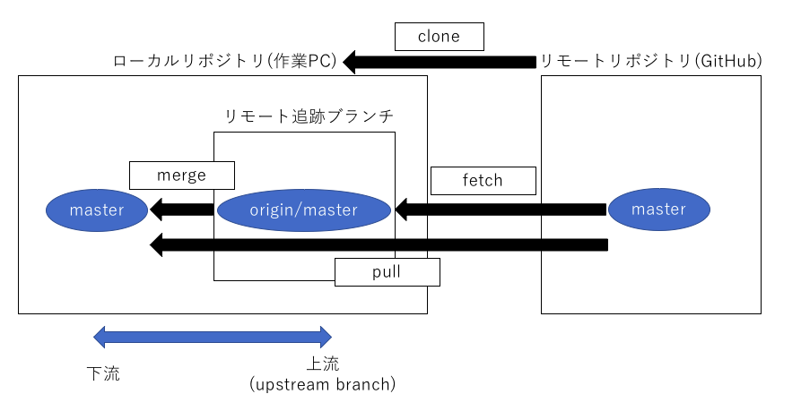

Gitの基本的な操作(リモートリポジトリ)
================================

## リモートリポジトリの基本

* `origin`

  * リモートリポジトリの場所の別名

  * URL(`git@github.com:[name]/[repository].git`)のこと


### ローカルリポジトリとリモートリポジトリを繋ぐ

* `origin/[ブランチ名]`

  * リモートリポジトリにあるブランチを追跡するためのブランチ

  * リモート追跡ブランチという

   > ただし、このブランチはローカルリポジトリにあることに注意する。

* `upstream branch`

  * リモート側として対応付いたブランチ

  * `origin/[ブランチ名]`のこと

  * ローカルでブランチを作成して、リモートに変更内容をpushする際には、  必ず`upstream branch`を指定しなければならない

   > `git push -u origin master`：`upstream branch`の指定。`-u`は`--set-upstream`の省略コマンド

**以下、ローカルリポジトリとリモートリポジトリの概略図**


### リモートリポジトリへの送信

* `git push`

  * **リモートリポジトリへ送信**  

  * 現在のブランチのローカルリポジトリの内容を、リモートリポジトリに送信する  

  ```bash
  git push -u origin [現在のブランチ名]
  ```

  * 初回push時に必要

  * ローカルリポジトリの現在の上流を、originリポジトリ(リモートリポジトリの場所)の[現在のブランチ名]に指定する  

  * 次回からは、`git push`のみでもpushは可能となる。

* `git remote add origin [git@github.com:"ユーザー名/リポジトリ名.git"]`  

  * **リモートリポジトリを登録**

  * 既に作成したローカルリポジトリを、リモートリポジトリとして登録する

  * ブラウザ上でリモートリポジトリを作成し、そこで得た`git@github.com:[ユーザー名]/[リポジトリ名].git`を入力する

**以下、ローカルリポジトリ・リモートリポジトリの変更の概略図**


### リモートリポジトリから取得

* `git pull`

   * **最新のリモートリポジトリブランチを取得**

   * 他のリポジトリで加えられた変更点を、自分のローカルリポジトリにマージする

   * １つの課題に対して他の開発者が携わっている為、こまめに行う

   > `git pull origin [取得するブランチ名]`：取得するブランチから、自分のローカルリポジトリにマージする。

* `git clone git@github.com:[ユーザー名]/[リポジトリ名].git`

  * **リモートリポジトリを取得**

  * リモートリポジトリを取得して、ローカルリポジトリに反映させる

  > clone直後は、masterブランチになっていることに注意する。

**以下、リモートリポジトリからの取得の概略図**




| 版     | 年/月/日   |
| ------ | ---------- |
| 初版   | 2018/06/26 |
| 第二版 | 2019/04/14 |
