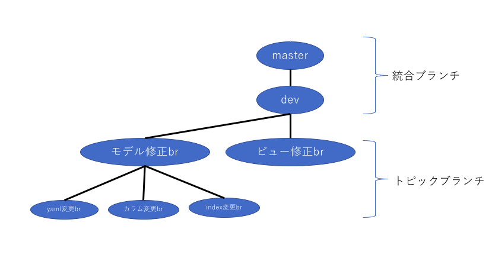

Gitの基本的な操作(ローカルリポジトリ)
================================

## gitのコマンド

* `git init`

  * **ローカルリポジトリの初期化と作成**

  * 実行後は`.git`ディレクトリが作成され、現在のディレクトリ以下を管理するファイルが作成される

* `git status`

  * **リポジトリの状態を確認**

  * 現在のコミット状況や変更ファイルの一覧などを確認・表示する

  * Gitのワークツリーやリポジトリに対して何らかの操作を行うと、表示が変化していく

* `git diff`

  * **変更差分を確認**

  * 現在のワークツリーとステージ領域の差分を確認する  

    * `git diff HEAD`：ワークツリーとHEAD(現在ブランチの最新コミット)との差分

    * `git diff --cached`：ステージ領域にある内容とHEADとの差分

* `git add [ファイル名]`

  * **ステージ領域へファイルを追加**

  * 編集したソースコードを、Gitリポジトリの管理対象とするため、ステージ領域と呼ばれる場所にファイルを登録する。

* `git commit`

  * **リポジトリの歴史を記録**

  * ステージ領域に登録されているファイルを、実際にローカルリポジトリに変更内容を登録する

    * `git commit -m "メッセージ内容"`：一行程度のコミットメッセージをつけてコミットする

    * `git commit`：vim(エディタ)が開き、詳細にコミットメッセージを記述できる。

 - `git log`  
   **コミットログを確認**  
   リポジトリにコミットされたログを確認できる。  
   →誰がいつコミットやマージをして、どのような差分が発生したのか、など

## ブランチの操作

ブランチは、別々の作業を並行して行うために利用する。それぞれのブランチでは全く別の作業を同時に行うことができる。

作業が終了したら、masterブランチにマージする。

* `統合ブランチ`

  * **リリース版が何度でも作成可能なようにしておく為のブランチ**

  * トピックブランチの分岐元として使用する為、安定したブランチとなっている。

  * クライアント側で表示されているものを扱う為、直接このブランチにpushすることは禁止されている。  

    * `master`ブランチ

      * Gitでデフォルトで作成されるブランチ。基本的には、このブランチを中心にして開発が進められる。

* `トピックブランチ`

  * **1つのテーマに集中して作業する為のブランチ**

  * 機能修正やバグ修正といった課題に対して、作業を行う為に作成するブランチ。

  * 課題ごとにトピックブランチが作成される為、課題の数だけトピックブランチが存在する。

  * 作業が完了したら、統合ブランチに取り込む。GitHubならば取り込む前に、プルリクという操作を行うことが多い。

* `git branch`

  * **ブランチを一覧表示**

  * ブランチ名の一覧を表示するとともに、現在のブランチを確認することができる

    * `git branch [新しいブランチ]`：現在いるブランチから派生して新しいブランチを作成

* `git checkout [ブランチ名]`

  * **ブランチの切り替え**

  * 操作対象とするブランチを切り替える。

    * `git checkokut -b [新しいブランチ名]`：新しいブランチを作成し、切り替える

    * `git checkout -d [特定のブランチ名]`：特定のブランチを削除する。

      * チームで作業している場合は、基本的にトピックブランチは削除するので、この操作は行わないことが多い。

* `git merge [トピックブランチ名]`

  * **ブランチをマージ**

  * トピックブランチで作業していた内容を、統合ブランチにマージする

    > 統合ブランチに切り替えてから行う  

**以下、ブランチの概略図**

| 版     | 年/月/日   |
| ------ | ---------- |
| 初版   | 2018/06/26 |
| 第二版 | 2019/04/14 |
