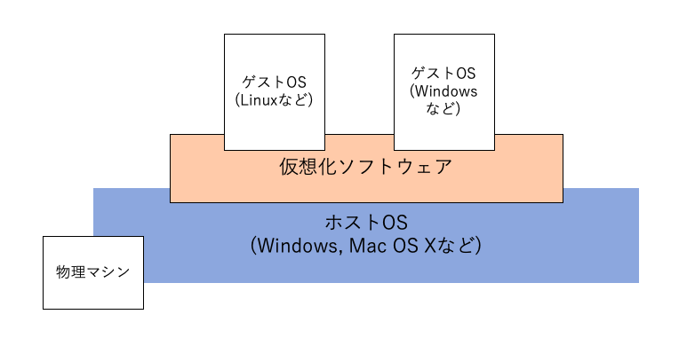

02 Linux環境を用意する
====================

## ディストリビューションとは

* 本来はLinuxとは「Linuxカーネル」のみを指す狭義の言葉

* このLinuxカーネルとはOSの中核となる部分で、コンピュータのハードウェア制御を行うソフトウェアのみを指すため、実際にユーザが使うツールやアプリケーションは含まれない

* これでは不便なので、Linuxカーネルに加えて基本的なコマンド群やアプリケーションを含めて、ユーザがそのまま利用できるようにパッケージングしたもの

  => 広義の「Linux」

  => この広義のLinuxが、「Linuxディストリビューション」と考える

* Linuxディストリビューションの主流は、Red Hat系とDebian系の2系統

|   系統   |           ディストリビューション          |
|:--------|:---------------------------------------|
|Red Hat系|Red Hat Enterprise Linux, CentOS, Fedora|
|Debian系 |Debian GNU/Linux, Ubuntu                |

* CentOSとは、商用Linuxとして広く使われているRed Hat Enterprise Linuxをベースとした、無償で利用できるLinuxディストリビューション

  * 個人の学習用から、大規模Webサービスのためのエンタープライズ用途まで、高いシェアを持っている

  * 利用者が多いため、インターネット上の情報も数多く存在する

## 仮想化ソフトウェアでのLinux環境

* 普段利用しているWindowsマシンなどに、ハードディスクを分割することで追加のOSとしてLinuxをインストールすることはできるが、ハードルが高い

* 仮想化ソフトウェアという、コンピュータ上に仮想的なコンピュータ(仮想マシン)を構築する

* `ホストOS`：仮想化ソフトウェアを動作させているOS

* `ゲストOS`：仮想化ソフトウェアによって実行する仮想的なOS

* 仮想化ソフトウェアでは、ゲストOSの再インストールや環境のコピーが容易

  => 謝って環境を壊してしまったため、再インストールする必要がある場面でも、簡単に対応できる

* 仮想化ソフトウェアとしては、Oracle社の提供している「Oracle VM VirtualBos」が有名

| 版 |  年/月/日 |
|----|----------|
|初版|2019/01/31|
