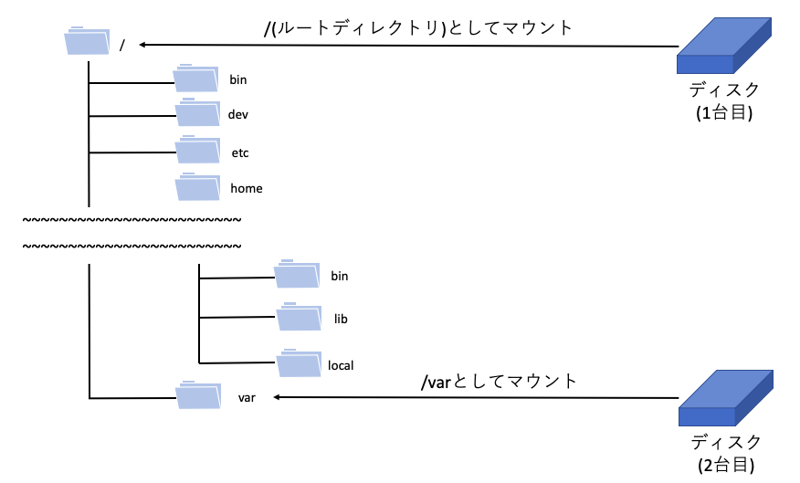

02 Linuxのディレクトリ構造
=======================

* 以下の図は、一般的なLinuxのディレクトリ構造


* `ルートディレクトリ`：一番上の`/`というディレクトリのこと

  * 全てのディレクトリは、その親を辿っていくと`ルートディレクトリ`にたどり着く

  * Linuxのディレクトリ構造は、**ルートディレクトリを頂点とした階層構造** となっている

  * このような構造をツリーと呼ぶので、ディレクトリ構成は「ディレクトリツリー」と呼ばれる


## パス

* 「ルートディレクトリの下のusrディレクトリの下のbinディレクトリの下のperlというファイル」

  => いちいち書き表すのは大変

* このような場合は、各ディレクトリを`/`(スラッシュ)で区切る

  => 「`/usr/bin/perl`」のように表記する

* `パス`：`/`(スラッシュ)のこと

  * あるファイルへの道筋とみなす

  * Windowsでは、`¥`が用いられるが、Linuxでは`/`を用いる


## Windowsとの違い

* ディレクトリについては、Windowsも同様の階層構造を持つが、Linuxと多少の違いがある

* 例えば、システム全体で2台の物理ディスクがある場合、

  * Windows：2つのディレクトリツリーができる

  * Linux：何台のディスクがあろうとも、**システム全体で1つのディレクトリツリーしか持たない**

    * 複数ディレクトリがある場合、Linuxではルートディレクトリ配下のどこかに、ディスクをディレクトリとしてくっつける手法を取る

      => この操作を、「マウント」と呼ぶ

      * 例)`/`に1台目のディスクがある状態で、`/var`に2台目の増設ディスクをマウントした

        => 物理ディスクは2つあるが、ディレクトリツリーは1つ




## 各ディレクトリの役割

* Linuxのディレクトリの構成は、FHS(Filesystem Hierarchy Standard)という標準化使用に基づいている

http://www.pathname.com/fhs/


### /bin

* 「一般ユーザ」および「管理者ユーザ」の両方が利用するコマンドの、実行ファイルを置くためのディレクトリ

* 実行ファイルはLinuxの様々な場所に配置されているが、`/bin`はその中でも **Linuxシステムの動作に最低限必要な、重要度の高いコマンド** を格納している


### /dev

* **デバイスファイル** を格納するディレクトリ

  * `デバイスファイル`：ディスクやキーボードなどのハードウェアをファイルとして扱えるように用意された、特殊なファイル


### /etc

* 設定ファイルを置くためのディレクトリ

* Linuxで動作する様々なアプリケーションの設定のためには、通常はテキスト形式の設定ファイル(コンフィグファイル)が使用される

* それらの設定ファイルは、通常この`/etc`配下に置かれる

* また、各種アプリケーションだけでなく、Linux自体の設定に関わるファイルもこのディレクトリにある

* そのため、Linuxを管理・運用する上で非常に重要なディレクトリ


### /home

* ユーザごとに割り当てられる、`ホームディレクトリ`が配置されるディレクトリ

  * `ホームディレクトリ`：Linuxのユーザごとにそれぞれ割り当てられる個人用ディレクトリのこと

    => ユーザ名がそのままディレクトリ名になっている

    => 例)ユーザ`xxx`のホームディレクトリは、`/home/xxx`となる

  * ユーザは、このホームディレクトリの中に、自由にファイルやディレクトリを作成して作業を行うことができる


### /sbin

* `/bin`と似ており、これも実行ファイルを置くためのディレクトリ

* ただし、こちらには「管理者ユーザ」向けのコマンドが置かれている

  => 例)システムをシャットダウンするための`shutdown`コマンド


### /tmp

* 一時的なファイル(テンポラリファイル)を置くためのディレクトリ

* アプリケーションの実行中に、作業途中の結果などを一時的にファイルとして保存する際には、このディレクトリの下に作成するのが一般的

* このディレクトリ内のファイルは定期的に削除する設定となっているディストリビューションもあるため、

  `/tmp`をファイルの永続的な保存先として利用してはいけない


### /usr

* 各種アプリケーションと、それに付随するファイルを置くためのディレクトリ

* 追加でアプリケーションをインストールした際に、実行ファイルやドキュメント、ライブラリなどがこのディレクトリの下に配置される

* `/usr`ディレクトリは、そのサブディレクトリとして、`bin`や`sbin`、`etc`などをもち、内部にルートディレクトリと配下と似た構造を持つ


### /var

* 変化する(variable)データを置くためのディレクトリ

* アプリケーションを利用する上で作成されたデータやログ、電子メールなどがこのディレクトリに格納される

* `/var`はたくさんのファイルが書き込まれ、容量も圧迫することが多いため、システム管理の上では注意が必要なディレクトリ


## カレントディレクトリと`pwd`

* Linuxを使うには、ここまで紹介してきたディレクトリを必要に応じてあちこちに移動しながら作業する事になる

* `カレントディレクトリ`：現在自分が位置しているディレクトリのこと

  * `ワーキングディレクトリ`とも呼ぶ

* Linuxにログイン直後は、`カレントディレクトリ`はユーザの`ホームディレクトリ`になっている

* `pwd`：カレントディレクトリを表示するコマンド

```bash
$ pwd
/home/xxx
```

* ログイン直後は、`xxx`ユーザの場合、`/home/xxx`がカレントディレクトリとなっている

* シェルでファイルを操作する場合は、カレントディレクトリが起点となる

  => 何でも作業をする前には、まず`pwd`コマンドを実行して、カレントディレクトリを確認する癖をつける


| 版 |  年/月/日 |
|----|----------|
|初版|2019/02/02|
