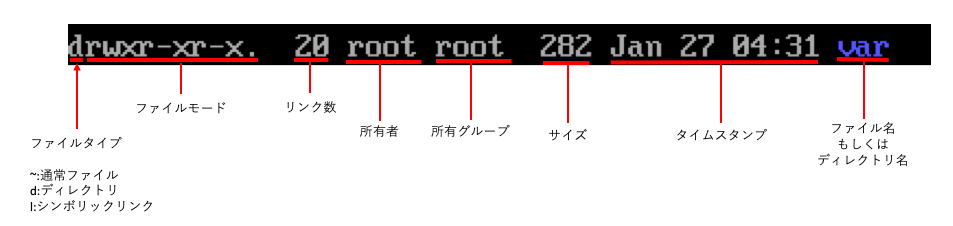

05 lsコマンド
============

* `ls`コマンド：ファイルやディレクトリを一覧表示するためのコマンド

  * 引数を指定しない場合は、カレントディレクトリのファイルとディレクトリを表示する

  * 引数としてディレクトリを指定すると、そのディレクトリの中に含まれるフィルやディレクトリを表示する

* 例)ディレクトリを引数にして`ls`コマンドを実行

```bash
$ ls /
bin  dev home lib64 mnt proc srv  tmp var
boot etc lib  media opt root sbin sys usr
```

* 例)ファイルを引数にして`ls`コマンドを実行

```bash
$ ls /bin/cp
/bin/cp
$ ls /bin/cp/nocommand
ls: /bin/cp/nocommand にアクセスできません: ディレクトリではありません
```

* 引数は複数指定することも可能

  => この場合、指定された全ての引数に対して処理を行う

```bash
$ ls / /usr
/:
bin  dev home lib64 mnt proc srv  tmp var
boot etc lib  media opt root sbin sys usr

/usr:
bin games   lib   libexec sbin  src
etc include lib64 local   share tmp
```

* なお、`ls`コマンドは、ファイルが1つもない場合は何も表示せずに終了する

```bash
$ ls
$
```


## `*`と`?`

* `ls`コマンドで複数のファイルを指定したいとき、いちいち全てのファイルを引数に並べることは大変

* `bash`では、ファイル名の一部をパターンで指定することにより、複数のファイル展開を指定する`パス名展開`という機能がある

  * `パス名展開`は、ワイルドカード展開やファイル名グロブと呼ばれ、アスタリスク`*`とクエスチョンマーク`?`の記号を利用する

|記号|   意味   |
|:--|:---------|
|`*`|任意の文字列|
|`?`|任意の1文字 |

* `*`は特によく使われる記号で、任意の文字列に一致する

  * 例)ファイル名が`ba`で始まるファイルを一覧で表示する

```bash
$ ls ba*
base 64 basename bash bashbug bashbug-64
```

* `*`は、特定の拡張子のファイルを一覧表示したい時にもよく使われる

  * 例)拡張子が`.html`のファイルを表示する例

```bash
$ ls *.html
about.html index.html info.html report.html top.html
```

* `?`は任意の1文字だけに対応する

  * 例)ファイル名が`ba`から始まり、全体の長さは4文字

```bash
$ ls ba??
bash
```

* `*`と`?`は、シェルの機能なので、他の全てのコマンドで利用することができる


## lsコマンドのオプション

* `ls`コマンドを含めて多くのコマンドは、**コマンドライン引数に`-`(ハイフン)で始まる追加の引数** を指定できる

  => `コマンドラインオプション`(あるいは単にオプション)と呼ぶ

* Linuxのコマンドはオプションを指定することで、デフォルトとは異なる動作をするように動きを変えることができる

* 例)`ls`コマンドでは、`-l`オプションを付けると、ファイル名だけでなくファイル属性などの詳細情報を同時に表示する

```bash
$ ls -l
```


* `-l`オプションで表示される各項目は、以下の通り



* `-a`；隠しファイルも含めた全てのファイルを表示する

```bash
$ ls -a
```


* `-F`：ファイル名の後ろにファイルの種類を表す記号を追加して表示する

```bash
$ ls -F
```


  * ただし`-F`オプションで表示されるものは以下の表の通り

|     種類       |記号|
|:--------------|:--|
|通常ファイル     |なし|
|ディレクトリ     |`/`|
|実行可能ファイル  |`*`|
|シンボリックリンク|`@`|


| 版 |  年/月/日 |
|----|----------|
|初版|2019/02/03|
