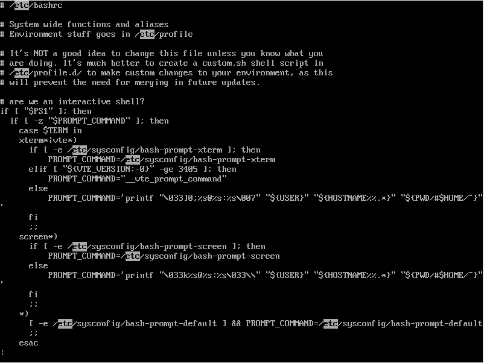

05 lessコマンド
==============

* `cat`コマンドは、単にファイルの内容をそのまま表示するだけ

  => 表示したいファイルの行数が多い場合には、1画面に収まらなくなる

* `less`コマンド：ファイルの内容をスクロールする

  * 引数に指定したファイルの内容を **一画面ごとに表示して、上下にスクロールする** ことができる

  * 例)`/etc/bashrc`の内容をスクロール表示する

```bash
$ less /etc/bashrc
```


* `less`コマンドでファイルの内容を表示中に、以下のようなキー操作で画面表示を制御できる

|         コマンド          |         内容          |
|:-------------------------|:---------------------|
|スペースキー、`f`、`Ctrl`+`v`|一画面下にスクロールする  |
|`b`、`Meta`+`v`            |一画面上にスクロールする |
|`j`、`Ctrl`+`n`、Enterキー  |1行下にスクロールする    |
|`k`、`Ctrl`+`p`            |1行上にスクロールする    |
|`q`                        |`less`コマンドを終了する|


## ファイル内の検索

* `less`コマンドでは、現在開いているファイルから文字列を検索することができる

  * ファイルを実行中に「`/`」を入力すると、画面の一番下の行が、検索文字列の入力欄に変わる


* この「`/`」の後ろに、検索したい文字列を入力してEnterキーを押すと、指定した文字列をファイルの中から検索することができる

```bash
# 省略
/etc
```

* 検索すると、見つかった文字列の場所まで自動的にスクロールする

  * 検索結果が複数ある場合には、`n`を押すたびに次の検索結果まで移動する

  * 1つ前の結果に戻るには、`N`を押す



| コマンド |        内容        |
|:-------|:-------------------|
|/<文字列>|下方向に向かって検索する|
|?<文字列>|上方向に向かって検索する|
|`n`     |次の検索結果に移動する  |
|`N`     |前の検索結果に移動する  |


| 版 |  年/月/日 |
|----|----------|
|初版|2019/02/03|
