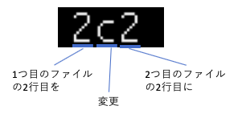

07 diffコマンド
==============

* `diff`コマンド：2つのファイルを差分を表示するコマンド

  ```bash
  diff [オプション]<比較元ファイル> <比較先ファイル>
  ```

  * このコマンドは、設定ファイルやプログラムのコードに対して、**編集前と編集後の変更内容を確認するためによく使われる**

  * 例)`.bashrc`とコピーした`.bashrc.org`の、`PS1`の値を編集した場合

  ```bash
  $ diff .bashrc.org .bashrc
  2c2
  < PS1='\$ '
  ---
  > PS1='[\u@\h] \w\$ '
  ```

  * 最初の「2c2」は、元ファイルからどの行をどのように変更したのかを示している

    * この部分は「変更コマンド」と呼ばれ、「<変更範囲1><変更種別><変更範囲2>」という形式

    * 変更種別は`a`、`c`、`d`の3種類がある

    * それぞれ、Addの`a`、Changeの`c`、Deleteの`d`として表されている

| 記号            | 内容                                                                     |
| --------------- | ------------------------------------------------------------------------ |
| <範囲1>a<範囲2> | 1つ目のファイルの範囲1の後に、2つ目のファイルの範囲2の内容が追加された   |
| <範囲1>c<範囲2> | 1つ目のファイルの範囲1の箇所が、2つ目のファイルの範囲2の内容に変更された |
| <範囲1>d<範囲2> | 1つ目のファイルの範囲1の箇所が削除された                                 |

    * つまり、「`.bashrc.org`ファイルの12行目が`.bashrc`ファイルの12行目に変更された」ということを意味している

  

  * `diff`コマンドの出力の2行目以降は、ファイルの実際の変更内容を表示している

  * 行の先頭にある`<`は、1つ目のファイルにだけある行を表す

  * `>`は2つ目のファイルにだけある行を表している

    * つまり、1つ目のファイルから2つ目のファイルへと変更する際に、`<`は削除された行、`>`は追加された行という意味になる

    ```bash
    # 削除された行
    < PS1='\$ '
    ---
    # 追加された行
    > PS1='[\u@\h] \w\$ '
    ```
