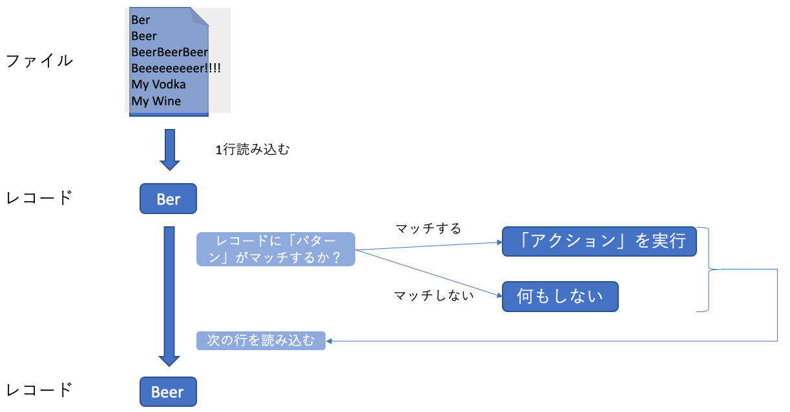

02 awkコマンド
=============

* `awk`コマンド：テキストの検索や抽出・加工などの編集操作を行うためのコマンド

  * 「オーク」と呼ばれる

  * `sed`のように、シェルから指定した編集操作をテキストに対して実行し、その編集結果を表示する

  * `awk`は`sed`に比べてずっと高機能なので、テキスト処理に特化したプログラミング言語であると見なされている


### awkコマンドの形式

```bash
awk <スクリプト> <対象ファイル>
```

* `awk`のスクリプトは、「パターン」と「アクション」の2つで構成されている

  * 「パターン」：アクションを実行するかどうかの条件を記述する

    * この条件は対象のテキストを1行読み込むごとに判定される

    * なお`awk`では、処理中に読み込んでいく1行の入力テキストを「レコード」と呼ぶ

  * 「アクション」：テキストの抽出や置換、削除などの実際のテキスト編集処理を記述する

    * パターンにマッチした場合にのみ、このアクションが実行される

    * パターンは省略することができ、その場合には全てのレコードに対してアクションが実行される

```bash
$ awk 'パターン { アクション }' ファイル
```



* 例)スペース区切りのファイル`score.txt`から、第2フィールドと第3フィールドのみを取り出して表示する

  => この例ではパターンを省略して全行にアクションを実行している

  ```bash
  $ awk '{print $2,$3}' drink2.txt


  Vodka
  Wine
  ```


### printとフィールド変数

* `awk`で最もよく使われる処理は、**特定のフィールドを抽出して表示するという列選択**

  * 例)`/usr/bin`ディレクトリを対象として実行した`ls -l`コマンドの出力結果を加工して、ファイルサイズとファイル名だけを表示する

  ```bash
  $ ls -l /usr/bin | awk '{print $5,$9}'
  55152 AssetCacheLocatorUtil
  53552 AssetCacheManagerUtil
  48112 AssetCacheTetheratorUtil
  18320 BuildStrings
  18288 CpMac
  18288 DeRez
  18320 GetFileInfo
  # 省略
  ```

* アクションを記述する`{}`内では、`print`というアクションを利用している

  * `print`：文字列を表示するためのアクション

    * `print`で表示している`$5`や`$9`などの記号は、`フィールド変数`と呼ばれる

  

  * 上の例のように`awk`は各レコードを自動的にフィールドに分割し、それぞれのフィールドを`$1`などのフィールド変数に代入する

  * また、レコード全体は`$0`に代入される

  * フィールド分割の際には、スペースもしくはタブが区切り文字と見なされる

    => スペースはいくつ連続していても構わないので、**各フィールド間のスペース数がまちまちの表示を加工するには便利**

* `print`する際、変数をカンマ区切りで並べると、それぞれの値がスペース区切りで表示される

  * なお、次のように`print`する際に変数をスペースで並べると、表示結果にはスペースが入らない

  ```bash
  $ ls -l /usr/bin | awk '{print $5 $9 }'
  55152AssetCacheLocatorUtil
  53552AssetCacheManagerUtil
  48112AssetCacheTetheratorUtil
  18320BuildStrings
  18288CpMac
  18288DeRez
  # 省略
  ```

* `NF`：レコードのフィールド数が代入されている変数

  * `$NF`を`print`するとレコードの最後のフィールドが表示される

  

  * `awk`ではアクション内で演算が行えるので、`NF`から1を引いた値(`$(NF-1)`)を表示させることもできる

  ```bash
  $ ls -l /usr/bin | awk '{print $(NF-1),$NF}'
  15:11 AssetCacheLocatorUtil
  15:10 AssetCacheManagerUtil
  15:10 AssetCacheTetheratorUtil
  ```


### パターンの指定

* `awk`では、正規表現のパターンを指定するには、`/`(スラッシュ)で囲んで記述する

  * 各フィールドに対して正規表現がマッチするかどうかを調べるには、`~`(チルダ)を使って次のように比較する

  

  * 第9フィールドが`/^cp/`(先頭がcpという文字列かどうか)というパターンを指定する

  ```bash
  $ ls -l /usr/bin | awk '$9 ~ /^cp/ {print $5,$9}'
  811 cpan2dist
  21859 cpan2dist5.18
  # 省略
  ```

* なお、正規表現を書く際には比較対象を省略することができる

  * この場合には、レコード全体が対象となる

  * 例)正規表現`/^l/`のみを指定すると、シンボリックリンクのみが表示される

  ```bash
  $ ls -l /usr/bin | awk '/^l/ {print $5,$9}'
  74 2to3-2.7
  82 appletviewer
  73 apt
  6 bzcmp
  ```


### アクションの省略

* アクションは、省略するとレコードを表示する。また、`print`アクションは引数に何も指定しないとレコードを表示する

  * つまり、`{print $0}`が実行される

  * つまり、以下の3行は同じ意味となる

  ```bash
  # アクションを省略
  awk '$9 ~ /^cp/'
  # アクションの引数を省略
  awk '$9 ~ /^cp/ {print}'
  # 省略していない
  awk '$9 ~ /^cp/ {print $0}'
  ```


### 実践例：CSVファイルからスコア集計

* 次のようなCSVファイルから、点数の平均値を計算する

  * 「出席番号,名前,点数」

  ```csv
  1,osumi,39
  2,miyake,74
  3,suzuki,59
  4,hasegawa,12
  5,ino,98
  6,tanaka,41
  ```

* `-F`オプション：`awk`でフィールドの区切り文字を指定する

  * このファイルはカンマ区切りのため、そのままではフィールド分割できない

  ```bash
  $ awk -F, '{print $1,$2,$3}' score.csv
  1 osumi 39
  2 miyake 74
  3 suzuki 59
  4 hasegawa 12
  5 ino 98
  6 tanaka 41
  ```

* 点数を取り出すには、`NF`を使う

  ```bash
  $ awk -F, '{print $NF}' score.csv
  39
  74
  59
  12
  98
  41
  ```

* 平均値を出すには、以下のコマンドを実行する

  * `END`パターン：`END`ブロック内のアクションは、全ての入力ファイルを処理し終えてから最後に実行する

  ```bash
  $ awk -F, '{sum += $NF} END{print "Average:",sum/NR}' score.csv
  Average: 53.8333
  ```


| 版 |  年/月/日 |
|----|----------|
|初版|2019/04/14|
