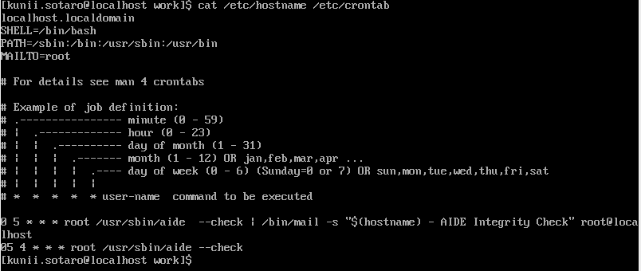
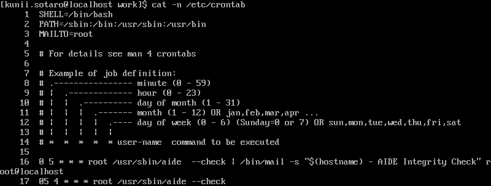

04 catコマンド
=============

* `cat`コマンド：ファイルの内容を表示する

```bash
cat [オプション] <ファイル名>
```

* 例)新規作成した空ファイルを表示

```bash
$ touch newfile
$ cat newfile
$                # 何も表示されない
```

* 例)`/etc/hostname`ファイルの内容を表示

  * ホスト名を設定するファイル

```bash
$ cat /etc/hostname
localhost.localadmin
```

* 例)`/etc/crontab`ファイルの内容

  * コマンドを自動実行するための設定ファイル

```bash
$ cat /etc/crontab
```


## ファイルを連結して表示する

* `cat`コマンドでは、一度に複数のファイルを指定することができる

  * この際には、ファイルごとに区切り記号は入れず、ファイルの内容が順番に表示される

```bash
$ cat /etc/hostname /etc/crontab
```



* `cat`コマンドで複数ファイルを指定すると、ファイルを連結して表示することができる


## 行番号を表示する

* `-n`オプション：行番号を付けて内容を表示する

  * プログラムのソースコードや、何かのリストを表示するときに役に立つ

```bash
$ cat -n /etc/crontab
```




## ファイルを指定しない場合

* `cat`コマンドで、引数にファイルを指定しない

```bash
$ cat
            # ここでカーソルが止まって動かなくなる
```

* 何か文字列を入力してEnterキーを押す

```bash
$ cat
Hello       # Helloと入力する
Hello       # Helloと表示された
            # 再び、カーソルが止まる
```

* `cat`コマンドは、引数にファイルを指定しない時には、キーボードからの入力を受け付ける

  * 終了するには、`Ctrl`+`d`を押す

```bash
$ cat
            # Ctrl+dを入力
$
```

* `cat`コマンドだけでなく、他にも多くのLinuxのコマンドは、入力ファイルを指定しないとキーボードからの入力を受け付ける


| 版 |  年/月/日 |
|----|----------|
|初版|2019/02/03|
