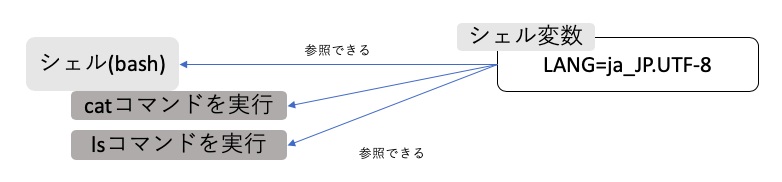

04 環境変数
==========

* `外部コマンド`：実行ファイルとしてファイルシステム上に存在するコマンド

* `組み込みコマンド`：シェル自体に内蔵しているコマンド

* `type`コマンド：あるコマンドが外部コマンドか組み込みコマンドかを判別する

  * 例)typeコマンドによる外部コマンドの判別

  ```bash
  $ type set
  set is a shell builtin
  $ type cp
  cp is /bin/cp
  ```

  * `外部コマンド`は、シェルの外側で実行される

    => 現在設定されているシェル変数の値を外部コマンドは参照することはできない

  

  * `環境変数`は、外部コマンドからも値を参照できるようになっている

    => シェル上だけでなく外部コマンドでも常に設定を反映しておきたい場合

  

  * ロケールを設定するシェル変数`LANG`は、特に指定しなくても自動的に環境変数として設定されている

    * 例)LANGを日本語設定としてcatコマンドを実行

    ```bash
    $ LANG=ja_JP.UTF-8
    $ cat --help
    # 省略
    ```

    * 例)LANGを英語設定としてcatコマンドを実行

    ```bash
    $ LANG=en_US.UTF-8
    $ cat --help
    # 省略
    ```

    * catコマンドは、`LANG`という環境変数の値をはじめに確認して、その内容によって表示する言語を変更している

    => 多くのコマンドが同じ動作をする


## printenvコマンド-環境変数の表示

* `printenv`コマンド：現在シェルに設定されている環境変数を表示する


## exportコマンド-環境変数の設定

* `export`コマンド：指定したシェル変数を環境変数にする

  * 例)`less`コマンドでの利用例

    * `LESS`と環境変数が用意されており、この変数に設定された値は自動的にオプション設定したものとみなされる

    * `--no-init`オプションを、`less`コマンドを実行するたびに常に自動付加したい

  ```bash
  $ LESS='--no-init'
  $ export LESS
  ```

  * 次のように、値の設定と環境変数としての宣言を1行にまとめて書くこともできる

  ```bash
  $ export LESS='--no-init'
  ```


| 版 |  年/月/日 |
|----|----------|
|初版|2019/02/14|
