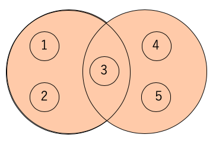
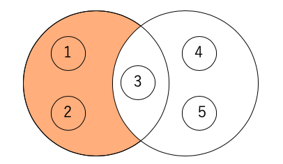
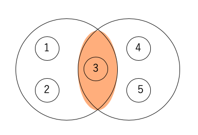

02 set(集合)を使う
================

* Pythonで使えるデータ型には、シーケンスの仲間が何種類かある

  => `シーケンス`：複数の要素を持つデータの種類

* 例として、

  * リスト

  * タプル

  * 文字列：複数の要素として持っている

* データの種類や性質によって、色々なタイプのデータを使い分けてプログラムを作る


## setとは

* シーケンスと似たデータ型

* リストのように複数の要素を保存できる

* リストとは異なり、「中の`要素が重複しない`」ように管理される

* つまり、ある`set`の中にすでに存在している値を登録しようとしても、新しい要素が追加されない

* インデックスを使って、要素を取り出すことができない


### setを使うメリット

* `set`は、「集合」を扱うためにPythonに追加された

* `set`を使うことで、重複しない要素のグループを手軽に管理できる

* 「和集合」：複数の`set`を足した`set`を作る

* 「差集合」：ある`set`に含まれる要素を、他の`set`から取り除く

* 「交わり」：共通する要素だけを抜き出す

* 「対象差」：ある`set`と他の`set`を合わせて、2つの`set`が共通して持つ要素だけを取り除く

  => これらの操作を「集合演算」と呼ぶ


## setを定義する

* `set`を定義するには、「波括弧`{~}`」を使用する

* 要素は「カンマ`,`」で区切る

```python
{要素, 要素, 要素}
```

* 例)

```python
dice = {1, 2, 3, 4, 5, 6}
coin = ("表", "裏")
```

* `set`には、数値や文字列などを要素として追加できる

* リストやディクショナリは、`変更できる`ため、要素として追加することができない

  => `set`に追加した時に異なる要素でも、その後書き換えることで同じ要素を持つようにできてしまう

* 2つ以上の`set`を使い演算子で計算を行うと、集合演算を簡単に実行できる

* `set`の集合演算では、数値の演算子ではなく

  * ビット演算

  * 論理演算

  で使う演算子が利用されている


## setの和集合を得る

* `|`演算子：`set`の和集合を得る

* 2つの`set`の和集合を取ると、各`set`の重複しない要素を全て含んだ集合を得ることができる



* 例)

```python
>>> prime = {2, 3, 5, 7, 13, 17}
>>> fib = {1, 1, 2, 3, 5, 8, 13}
>>> prime_fib = prime | fib
>>> prime_fib
{1, 2, 3, 5, 7, 8, 13, 17}
```


## setの差集合を得る

* `-`演算子：`set`の差集合を得る

* A、Bの2つの`set`の差集合を取ると、Aの要素から、Bに含まれる要素を取り除くことができる



```python
>>> dice = {1, 2, 3, 4, 5, 6}
>>> even = {2, 4, 6, 8, 10}
>>> odd_dice = dice - even
>>> odd_dice
{1, 3, 5}
```


## setの交わりを得る

* `&`演算子：`set`の交わりを得る

* 2つの`set`の交わりを取ると、両方の`set`に共通して含まれる要素だけを抜き出すことができる

* 「論理値(AND)」と同じ演算子が使われている



```python
>>> prefs = {"北海道", "青森", "秋田", "岩手"}
>>> capitals = {"札幌", "青森", "秋田", "盛岡"}
>>> pref_cap = prefs & capitals
>>> pref_cap
{'秋田', '青森'}
```


## setの対象差を得る

* `^`演算子：`set`の対象差を得る

* 2つの`set`の対象差を取ると、両方の`set`に共通して含まれている要素だけを取り除いた、要素の集合を得ることができる

* 論理演算の排他的論理和(XOR)のような操作


```python
prefs = {"北海道", "青森", "秋田", "岩手"}
capitals = {"札幌", "青森", "秋田", "盛岡"}
pref_cap2 = prefs ^ capitals
pref_cap2
```


## setとリスト

* `set`は、リストに似た性質を持っている

* お互い複数の要素を持つことができる

* 要素を追加したり削除したりするともできる

* 次のような点では、`set`はリストと同じように扱える

  * `set`にも長さがあり、`len()`で長さ(基数)を測れる

  * `set`を引数にして`max()`(最大値)、`min()`(最小値)、`sum()`(合計)などの関数を呼び出せる

  * `set`はfor文にシーケンスとして添えることができる

* `set()`：リストのようなシーケンスから`set`を作る、組み込み関数

* 例)文字列を要素に含んだリストを`set`に変換すると、このリストの中に何種類の文字列が含まれているか、簡単に知ることができる

  => `set`は重複を許さないように要素を管理するという性質を利用すると、一意な文字列だけが抜き出される

  => `set`の長さを測れば、何種類あるかわかる

```python
>>> codon = ['ATG', 'GGC', 'TCC', 'AAG', 'TTC', 'TGG', 'GAC', 'TCC']
>>> s_codon = set(codon)
>>> print(len(codon), len(s_codon))
8 7
```


## setと比較

* リストでは、`in`演算子を使って要素の検索ができた

* `set`でも、`3 in {3, 5, 7}`のように`in`演算子を使うことで要素を検索できる

* if文の中で、イコールと不等号を合わせた比較演算子`<=`を使うと、ある`set`が他の`set`の部分集合かどうかを調べることができる

  => 「`A ⊆ B`」を、Pythonでは「`A <= B`」と書くことができる

* `>=`を使うと、上位集合であるかどうかを調べることができる

* 例)要素の検索と`set`の比較

```python
>>> prime = {2, 3, 5, 7, 13, 17}
>>> fib = {1, 1, 2, 3, 5, 8, 13}
>>> prime_fib = prime & fib

>>> if 13 in prime_fib:
...   print("13は素数で、フィボナッチ数でもある")
...
13は素数で、フィボナッチ数でもある

>>> if {2, 3} <= prime_fib:
...   print("2, 3は素数で、フィボナッチ数でもある")
...
2, 3は素数で、フィボナッチ数でもある
```


| 版 |  年月日   |
|---|----------|
|初版|2019/01/12|
