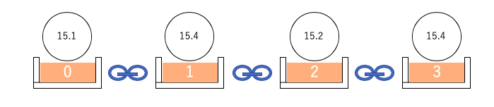

03 タプルを使う
=============

## タプルとは

* `タプル`は、リストにとてもよく似た性質を持っている

* タプルもリストのように

  * 複数の要素を持つことができる

  * インデックスを使って要素にアクセスできる

* 機能的にリストと異なっているのは、`要素の変更ができない`こと



* タプルを定義するには、「丸括弧`()`」を使って要素を「カンマ`,`」で区切る

```python
(要素, 要素, ...)
```

* 例)1月から7月までの英語の名前をタプルで定義する

```python
>>> month_name = ("January", "February", "March", "April", "May", "June", "July")
>>> month_name
('January', 'February', 'March', 'April', 'May', 'June', 'July')
```

* 「角括弧`[]`」を使ってインデックスを与えることで、タプルの要素を取り出す

```python
>>> month_name[1]
'February'
```

* タプルはリストと異なり、要素の変更ができない

  * インデックスを使って要素を代入して入れ替えようとすると、エラーになる

  * `del`文を使って要素を削除しようとしても、同様にエラーとなる

```python
>>> month_name[0] = "睦月"
Traceback (most recent call last):
  File "<stdin>", line 1, in <module>
TypeError: 'tuple' object does not support item assignment
```

* タプルは変更できないが、タプル同士を連結することはできる

  => リストと同様に、タプルとタプルを足して新しいタプルを作ることができる

```python
>>> month_name = month_name + ("Augest", "Septenmber", "October", "November", "December")
>>> month_name[11]
'December'
```

* リストと同様に、`len()`でタプルの長さを調べたり、`in`演算子でタプルの要素を検索したり、スライスを使うことができる

* 要素が1つだけのタプルを定義するには、`(10,)`のように記述する

  => `(10)`とすると、Pythonが括弧付きの数値と解釈してしまい、タプルにならない


## タプルの利点

* タプルを一言で言うと、「要素の変更ができないシーケンス」

  => 一度作ったら、変更も削除もできない

* これが役に立つ場面として、ディクショナリのキー、`set`の要素、にすることができる

* `set`では、リストを要素として登録できないが、タプルは変更ができないのでこの制約を受けなくて済む

  => 同じような理由で、リストをディクショナリのキーとして登録することはできない(リストは変更できるため)

  => 変更ができない`タプル`ならば、ディクショナリのキーとして登録できる

* 例)緯度、経度と、県庁所在地の対応をプログラムで扱う

  => リストはディクショナリのキーとしては登録できないので、タプルを使う

```python
>>> pref_capitals = {
...                 (43.06417, 141.34694):"北海道(札幌)",
...                 (40.82444, 140.74):"青森県(青森市)",
...                 (39.70361, 141.1525):"岩手県(盛岡市)"
...                 }
>>> pref_capitals
{(43.06417, 141.34694): '北海道(札幌)', (40.82444, 140.74): '青森県(青森市)', (39.70361, 141.1525): '岩手県(盛岡市)'}
```

* for文にディクショナリを添えると、ループでキーを1つずつ取り出すことができる

* 例)`loc`という変数に、緯度、経度をタプルで渡すと、県庁所在地を調べて表示する

```python
>>> loc = (39.70361, 141.1525)
>>> for key in pref_capitals:
...   if loc == key:
...     print(pref_capitals[key])
...     break
...
岩手県(盛岡市)
```

* 例)与えられた地点から最も近い県庁所在地を調べるプログラム

  * 2点間の距離は、緯度と経度の差を二乗して足し、ルートを取らず、二乗した値を比較する

  * 最寄りの地点を調べるには、全てのデータをとりだす必要がある

    => 地点データの登録されているディクショナリをfor文のシーケンスとして渡して、

       キーを1つずつ取り出しながら処理していけば、全ての地点について距離を比べられる

```python
>>> loc = (41.768793, 140.72881)                   # 調べたい地点の緯度、経度
>>> nearest_cap = ''                               # 最寄りの県庁所在地名を保存する変数
>>> nearest_dist = 10000                           # 最寄り地点までの距離を保存する変数

>>> for key in pref_capitals:
...   dist = (loc[0]-key[0])**2+(loc[1]-key[1])**2 # 緯度経度の差を二乗して距離を計算
...   if nearest_dist > dist:
...     nearest_dist = dist                        # より近い地点が見つかったので変数を入れ替え
...     nearest_cap = pref_capitals[key]
...

>>> print(nearest_cap)
青森県(青森市)
```

* ループブロック内では、地点の緯度・経度がタプルで入ったキーを受け取りながら処理が行われる

* ループから抜けると、`nearest_cap`と`nearest_dist`には最も近い地点の距離(の二乗)と名前が入っている


| 版 |  年月日   |
|---|----------|
|初版|2019/01/12|
