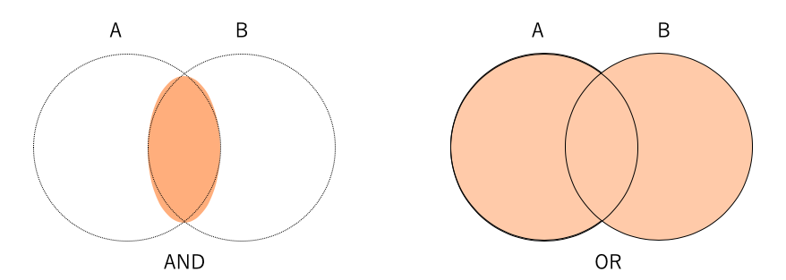

04 if文の応用
============

## 比較演算子

* if文には条件式を添える

* 条件が成り立つか、成り立たないかで、ブロックの実行を振り分ける

* ここでは、条件式に使われる比較演算子について、まとめる

* `比較演算子`：

  * if文で使われるものには、以下の表のような種類がある

  * 二つの値が等しいことを調べる比較演算子は、「`==`」のようにイコールを2つ重ねる

  * `in`という比較演算子は、文字列やリスト要素の検索のように、シーケンスの要素を調べる時に使う

  |演算子|   例   |ブロックを実行する条件            |
  |-----|--------|:-----------------------------|
  |`==` |`x == y`|xとyが等しい                    |
  |`!=` |`x != y`|xとyが異なる                    |
  | `>` |`x > y` |xの方がyより大きい               |
  | `<` |`x < y` |xよりyの方が大きい               |
  |`>=` |`x >= y`|xとyが等しいかxが大きい           |
  |`<=` |`x <= y`|xとyが等しいかyが大きい           |
  |`in` |`x in y`|xという要素がy(シーケンス)に存在する|


## 比較演算子とTrue, False

* 比較演算子を含む「`x == y`」のような部分は`条件式`と呼ばれている

* 条件式は、結果としてTrue、Falseと言う2種類の値を返す

  => この値のことを、`真偽値`と呼ぶ

* 条件式が成り立つ(True、真)か、成り立たない(False、偽)か、という結果が返ってくる

* if文は、条件式の結果がTrue(真)かFalse(偽)かによって、プログラムの実行を振り分けている

* 例)

```python
>>> 1+1 == 2
True
>>> 5**(4-4)+9 == 10
True
>>> 5 > 2
True
>>> 100 == 100.0
True
>>> "かなこ" != "かなこぉ！"
True
>>> [1, 2, 3] == [1, 2, 3]
True
```


## 比較に感する覚え書き

* Python3では、違うデータ型の比較を行うことができない

  => 数値と文字列を比較しようとすると、エラーとなる

* 文字列を数値と見立てて比較を行う場合は、以下のように記述する

  ```python
  >>> int("100") < 200
  True
  ```

* ただし、数字だけで構成された文字列で大小の比較を行うと、それらしい結果が返ってくることがある

  ```python
  >>> "100" < "200"
  True
  >>> "120" < "23"     # 数値の計算では、ありえない
  True
  >>> 120 < 23
  False
  ```

* 文字列を不等号で比較する時、Pythonが文字列を内部で文字コードに置き換えて比較している

  => 必ずしも期待した結果が返ってくる訳ではない


## 複雑な比較-論理演算

* if文で「〜以上〜未満」と言うような条件式を作るには、`論理演算子`を使うことで、複数の比較式を1つにまとめることができる



* 複数の条件を1つにまとめるには、`and`や`or`のような論理演算子を使う

* `and`：「AかつB」という条件式を作ることができる

* `or`：「AまたはB」という条件式を作ることができる

* 例)地球上から水平に打ち出した物体が、速度によってどのような振る舞いをするかを調べるプログラム

```python
>>> v = 30000
>>> if v < 28400:
...   print("地上に落下します")
...
>>> if v >= 28400 and v < 40300:
...   print("月とお友達です")
...
月とお友達です
>>> if v >= 40300 and v < 60100:
...   print("惑星の仲間り入りです")
...
>>> if v >= 60100:
...   print("アルファケンタウリを目指せ")
...
```


| 版 |  年月日   |
|---|----------|
|初版|2019/01/13|
