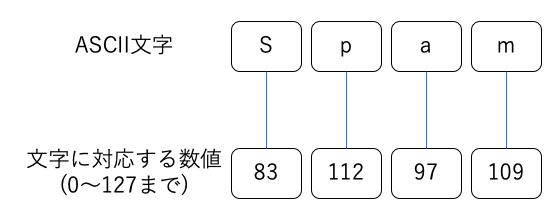

10 Pythonの文字列と日本語
=======================

* Pythonでは、`codecs`と呼ばれる仕組みを使って、日本語のマルチバイト文字列を複数エンコードに変換する

* ユニコード(UTF-8)を中心にして、色々なエンコードへの変換をサポートしている

* 文字列をファイルやネットワークなど外部から読み込んだり、出力する際には、エンコードの変換が必要になる

* Pythonで日本語のようなマルチバイト文字列を扱うときに気をつけること、ポイントとなるテクニックを解説する


## 文字コードに関する基礎知識

* コンピュータは、文字を数値に置き換えて記録する

  例)A(65)、a(97)

* Pythonでも、内部では文字を一つずつ数値に置き換えて保存している

  * 文字列は文字を数値に置き換えて、順番に並べて保存される

* `文字集合`：英字や数字のような文字を集めたもの

* `文字コード`：文字集合に対して数値を割り当てたもの

* `エンコード`：ASCIIのように、文字と数値をお互いに変換するためのルール


## ASCIIエンコード

* `ASCII`：数字やアルファベット、よく使われる記号などを集め、数値を割り当てたルール

  * 「American Standard Code for Information Interchange(情報交換のためのアメリカ標準コード)」

  * 空白や開業のような制御文字を含め、128種類の文字に対応する数字が決められている



* ASCIIに定められた文字集合(ASCII文字)は、「0」と「1」で表記される2進数7ビット(7桁)で表現できる数値(0から127)を使って全ての文字を表記できる

* 8ビットは`1バイト`と呼ばれる

  * `バイト`：コンピュータが数値を扱う時によく利用される単位

  * ASCIIのようなエンコードで文字列を表現すると、1文字が1バイトになる

* 文字列の文字数を数えるためには、文字列のバイト数を数えればよく、コンピュータにとって扱いやすいエンコード


## マルチバイト文字

* ASCIIのようなエンコードでは、8ビット(1バイト)を1文字としている

  => 256種類の文字しか扱うことができない

  => 日本語や韓国語、中国語などでは対応できない

* 1バイトを2つ組み合わせ、2バイトを1つの数値として扱うと、65536種類の文字を扱える

  => 文字の多い言語をコンピュータで扱うために、複数のバイトを組み合わせて文字を表現するエンコード

* `マルチバイト文字`：1文字を複数のバイトで表現するため、エンコードで表現された文字

  => `1バイト文字`：ASCIIなど


* 複数のバイトを使うことで、日本語のように文字数の多い言語を扱うことができる

* ただし、日本語では「どの数値をどの文字に割り当てるか」といるルール(エンコード)について、複数の種類がある

  => 多くの場合、UTF-8が使われる

#### 日本語の表記に利用される主なエンコード

|   エンコード名   |                                                                                                                                                              説明                                                                                                                                                             |
|--------|:-------------------------------------------------------------------------------------------------------------------------------------------------------------------------------------------------------------------------------------------------------------------------------------------------------------------------------|
|    シフトJIS    |2バイトで漢字やひらがなを含む広範囲の文字を表現するエンコード。第1バイトが特定の範囲にある数値の場合にのみ、次の1バイトと組み合わせたマルチバイト文字として扱われる。ASCIIと混在することができる。Windowsで利用されるmbcsやcp932というエンコードがある。これらは日本語に関してはシフトJISと同じと考えて問題ない                                                                |
|ISO-2022-JP(JIS)|日本のインターネットの前身となったJUNETで考案されたエンコード。文字列の中に、エスケープシーケンスと呼ばれる特別なコードが現れると、文字の種類を切り替えるという方針を使い、ASCIIとの混在を可能にしている。かつてはインターネットで標準的に使われるエンコード。現在でも、日本語のメールを送受信する際に利用されている。同じ手法を用いて他の言語の文字集合に割り当てたエンコードもある。|
|     EUC-JP     |UNIXやLinuxで標準的に利用されてきたエンコードで、ISO-2022-JPをベースに作られている。特定の範囲にある数値を、エスケープシーケンスに相当するコードとして利用する。同じ手法を用いて他の言語の文字集合に割り当てたエンコードもある。                                                                                                                                     |
|      UTF-8     |ユニコードをベースとしたエンコードで、現在では標準として利用されている。英字やひらがな、漢字、韓国語など広い範囲の文字を統一的に扱えるエンコード。ASCIIの文字は1バイト以上で表記する。それ以外の文字は、種類によって2バイト、3バイトやそれ以上のバイト数を組み合わせて1文字を表現する                                                                                            |


## Pythonとユニコード

* 1つの言語で利用するエンコードが複数あり、似たエンコードを使っても、言語が異なると違う文字が表示されるのは不便

  => 多国語に対応したプログラムを作ろうとすると、国ごとに別の処理をする必要があったり、文字化けを起こすようになる

* `ユニコード`：全ての国の言語で共通して利用できるエンコード

  * 主な言語で使われる文字(文字集合)を集め、1つ1つにユニコード番号と呼ばれる数値を割り当てて基準化したもの

  * UTF-8は、「ユニコードの文字集合をコンピュータで扱う時に利用されるエンコード方式」

* Python3では、全ての文字列がユニコードをベースとしている


## バイト(bytes)型

* Pythonでは、プログラムの外部に文字列を出力するとき、また外部から文字列を取り入れる時に、必ず何らかのエンコード変換が行われている

* Pythonでは、ひらがなや漢字はユニコードのデータとして保存されている

  => Pythonでは、内部で表示用のエンコードに関する情報を持っていて、その情報を見ながら変換を行う

  => デフォルトでは、UTF-8

* ユニコードからエンコード変換された文字は、Python3では`バイト(bytes)型`という特殊な文字列オブジェクトになる

  * 画像や音声のような文字列以外のバイナリデータを扱う時にも利用される

* 文字列型とバイト型の違いは、マルチバイト文字列の扱いにある

  * 文字列オブジェクトは、日本語のようなマルチバイト文字であっても、「1文字の長さが1」になる

  * バイト型の場合は、「1バイトの長さが1」となる

```python
>>> s = "アイウエオ"
>>> len(s)
5
>>> bs = s.encode("shift-jis")
>>> len(bs)
10
>>> print(bs)
b'\x83A\x83C\x83E\x83G\x83I'
>>> s[0]
'ア'
>>> bs[0]
131
```

* シフトJISでひらがな1文字を表示するには、2バイトが必要

  => `len()`関数でバイト型オブジェクトの長さを調べると、「アイウエオ」という文字列は10文字になっている

* バイト型のオブジェクトを表示すると、エスケープシーケンスが表示され、日本語の文字列が表示されない

* インデックスを指定して要素を表示しようとする場合

  * 文字列ではひらがなの最初の文字が表示される

  * バイト型のオブジェクトでは、バイト列の最初のデータが数値で表示される

* バイト型の文字列は、「b'...'」というリテラルでも定義できる

  * リテラルの中にASCII文字以外のマルチバイト文字列を書き込むことはできない

  * エスケープシーケンスを使えば、マルチバイト文字相当の文字列を埋め込むことができる


## 文字列をバイト型に変換する

* `encode()`：文字列メソッド

  * 文字列オブジェクトをバイト型に変換できる

  * 引数には、変換したいエンコードなどを指定する

```python
encode([エンコード名[, エラー処理の方法]])
```

* 引数のエンコード名には、Pythonで利用できるエンコードを文字列で指定する

* 変換時にエラーが起こった場合は、例外(エラー)を返して変換を停止する

```python
>>> u = s.encode("euc-jp", "strict")
>>> print(u)
b'\xa5\xa2\xa5\xa4\xa5\xa6\xa5\xa8\xa5\xaa'
```

* Pythonで利用できる日本語のエンコード

  * 英字で表記、区切りにハイフン`-`を使う

  * 英小文字と大文字は同じ

  * ハイフン`-`の代わりにアンダースコア`_`を使うこともできる

|   エンコード名   |    Pythonのエンコード名   |
|:---------------|:------------------------|
|シフトJIS        |shift-jis、shift_jis、sjis|
|ISO-2022-JP(JIS)|iso-2022-jp(jisは使えない) |
|UTF-8           |utf-8                    |

* エンコード変換時に、不正な文字列が入っているとエラーが発生する

* エラー処理の方法を引数に指定(オプション)と、エンコードを変換している時に起こったエラーに対する対処方法を指定できる

  => 変換しようとする文字列に、変換できない文字列が含まれている場合などに、どのような処理をするのかを指定した場合に利用する

#### 変換エラーへの対処を指定する文字列

|  文字列  |                                                  説明                                                  |
|:--------|:------------------------------------------------------------------------------------------------------|
|`strict` |エラーが起こった場合にエラー(例外)を発生して変換を停止する。オプションを指定しない場合のデフォルトの振る舞いとして利用される|
|`replace`|エンコード変換できない文字があると、「?」などの適切な文字列に置き換えて返す。エンコード時にエラーが起こっても変換を継続する |
|`ignore` |エンコード変換でエラーが起こった場合、そのまま変換を継続する。エラーで変換できなかった文字列は取り除かれる               |


## バイト型を文字列型に変換する

* `decode()`：バイト型の文字列を文字列型に変換する

  * エンコードの指定方法、エラーが起こった時の対処方法は、`encode()`と同じ文字列を使う

  * 文字列の入った変数や、文字列のリテラルなど文字列オブジェクトからドット`.`で区切って`decode()`メソッドを呼び出す

  * ドット`.`の前の文字列が変換の対象になるので、引数に文字列を指定する必要はない(引数はオプションで指定可能)

```python
decode([エンコード名[, エラー処理の方法]])
```

```python
>>> u = u.decode("shift-jis", "ignore")
>>> print(u)
･｢･､･ｦ･ｨ･ｪ
```


## スクリプトファイルのエンコード指定

* デフォルトのエンコードとして、UTF-8が指定されている

* スクリプトファイルでエンコードを指定するには、以下のように記述する

```python
# coding: エンコード名
```

```python
# coding=エンコード名
```

```python
# Emacsというエディタを使用している場合
# -*- coding: エンコード名 -*-
```

* スクリプトファイルのエンコード指定は、1行目または2行目に記述する

  => それ以外の行に例のようなコードがあっても、エンコード指定でなくコメントとして見なされる

* 1行目に`#! /usr/local/env python`と描く場合は、2行目にエンコードを指定する

* スクリプトファイルのエンコードには、必ずファイルを保存した時のエンコードを指定するようにする

  * 例)ファイルをUTF-8で保存した時

  ```python
  # coding: utf-8
  ```


## エンコードの判定

* Pythonでは、バイト型文字列をできるだけ文字列型に変換して使うようにする

* バイト型文字列がどのエンコードに相当するかを調べる

```python
def guess_encoding(s):
  """
  バイト型の文字列を引数として受け取り、
  エンコードを簡易に判定する
  """
  # 判定を行うエンコードをリストに保存
  encodings = ["ascii", "utf-8", "shift-jis", "euc-jp"]
  for enc in encodings:
    try:
      s.decode(enc)
    except UnicodeDecodeError
      continue
    else:
      return enc
  else:
    return ""
```


## エンコードと文字化け

* 日本語には、文字集合を数値に置き換えるエンコードが複数ある

  * データとしては同じに見えても、エンコードが違うとデータが別の文字に割り当てられる

  * 正しいエンコードがわからないと、全く別の文字列に変換される

    => `文字化け`

* コンピュータ上で保存されている文字を表す数値と、文字を表示しようとする側でエンコードが合っていないと、正しい文字が表示されない

  => 例)シェルやコマンドプロンプト上でPythonのようなプログラミング言語を使っている場合、文字を表示する端末のエンコードを正しく設定しないと文字化けが起こる

* Pythonが日本語を含む文字列を表示しようとしている時に、端末側に設定されているエンコードと同じエンコードのデータを送らないと、文字は正しく表示されない


* `print()`関数で日本語を含む文字列を表示しようとして文字化けが起こる場合は、端末のエンコードが正しく設定されているかどうかを確認する


## マルチバイト文字と文字の境界

* ASCIIのように1バイトが1文字に対応しないものも、マルチバイト文字列の特徴

  => 文字の区切りを判別するには、直前のバイトを調べたり、文字列の最初からエスケープシーケンスを調べたりするなど、特別な処理を実行する必要がある

* Pythonには、バイト型文字列の境界を判別する機能が組み込まれていない

  => 自分で文字の境界を判別する処理を作るなどする必要がある

| 版 |  年月日   |
|---|----------|
|初版|2019/01/26|
