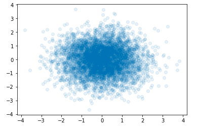
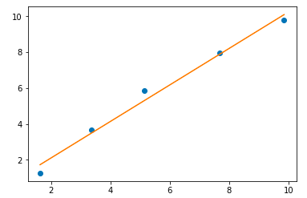
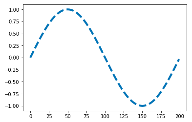

03 matplotlibを使う
==================

* matplotlibはいくつかのサブパッケージに分れているが、`piplot`を用いる


## plot()でグラフを描く

* `pyplot`はimport文のasを使って`plt`という名前でインポートするのが慣例になっている

  * グラフを描写したいときは、pyplotの持つ`plot()`という関数を使えば、大抵のことはできる

* 例)sinのグラフを描く

```python
%matplotlib inline
import numpy as np
import matplotlib.pyplot as plt

s = np.sin(np.pi*np.arange(0.0, 2.0, 0.01))
t = plt.plot(s)
```


* 2つのarrayを与えると、2次元の点になる

  * 3番目の引数にマーカーを指定し、`alpha`というキーワード引数で透明度を変えて、散布図を描く

```python
# 標準正規分布に従う乱数を生成
x = np.random.randn(5000)
y = np.random.randn(5000)
t =plt.plot(x, y, 'o', alpha=0.1)

# 手軽に描く方法
plt.scatter(x, y, alpha=0.1)
```



* `plt.plot()`を複数回呼ぶと、図を重ねることができる

  * 最小二乗法を使って与えられたデータの線形近似を行い、結果を描写する

  * データを点として描写してから、得られた傾き(m)と切片(c)を使って直線を描く

  => `linalg.lstsq()`で、mとcを求める

```python
x = np.array([1.628, 3.363, 5.145, 7.683, 9.855])
y = np.array([1.257, 3.672, 5.841, 7.951, 9.775])

a = np.array([x, np.ones(x.size)])
a = a.T
m, c = np.linalg.lstsq(a, y)[0]
t = plt.plot(x, y, 'o')
t = plt.plot(x, (m*x+c))
```




## plot()の描画をコントロールする

* `plot()`には、次のようなオプションの引数がある

  * 引数を使うことで、描画しようとする線をコントロールすることができる

* 表. `plot()`関数のオプション引数

| 引数                     | 解説                                                                               |
| :----------------------- | :--------------------------------------------------------------------------------- |
| `alpha`                  | 小数で透明度を指定する                                                             |
| `color`、`c`             | 文字列で色を指定する。redやblueのような文字列の他、rやbといった短縮形も指定できる  |
| `linestyle`、`ls`        | 文字列で線のスタイルを指定する。`-`や`ー`、`:`のような文字列を指定できる           |
| `linewidth`、`lw`        | 線の太さを指定する                                                                 |
| `marker`                 | `+`や`,`、`.`、`1`、`2`のような文字列でマーカーの種類を指定する                    |
| `markerfacecolor`、`mfc` | マーカー内部の色を文字列で指定する。`markeredgecolor`、`mec`で境界の色を指定できる |
| `markersize`、`ms`       | マーカーのサイズを指定する。`markeredgewidth`、`mew`で境界の太さを指定できる       |

* 例)線のスタイルを変更

```python
s = np.sin(np.pi*np.arange(0.0, 2.0, 0.01))
t = plt.plot(s, linestyle='--', linewidth=4)
```




## 文字を入れる

* pyplotには、グラフに文字を入れる関数がいくつか用意されている

* 表. pyplotの関数

| 関数名              | 解説                                                                                                                                                       |
| :------------------ | :--------------------------------------------------------------------------------------------------------------------------------------------------------- |
| `plt.xlabel(S)`     | X軸のラベルを文字列(S)で指定する。`plt.ylabel()`はY軸のラベルを指定する                                                                                    |
| `plt.title(S)`      | グラフのタイトルを文字列(S)で指定する                                                                                                                      |
| `plt.text(X, Y, S)` | X、Yの位置に文字列を埋め込む。文字列には「`$~$`」で囲んだTexの数式が使える                                                                                 |
| `plt.xticks(P, S)`  | X軸の目盛りラベルを指定する。Pは数値、Sは文字列のシーケンスで、それぞれ位置、ラベル文字列を指定する。`plt.yticks()`を使うと、Y軸の目盛りラベルを指定できる |

* グラフに文字列を埋め込む時、日本語を使うと正しく動かない

  * グラフの文字列は画像として埋め込まれるため、matplotlibに日本語フォントの情報を補ってやる必要がある

  * 次のようにしてフォントを指定すると、日本語のフォントを使って文字列を埋め込めるようになる

  ```python
  # Osakaというフォントを指定
  import matplotlib.pyplot as plt
  plt.rcParams['font.family'] = 'Osaka'
  ```

  * システムごとにインストールされているフォントのリストを取得する

  ```python
  import matplotlib.font_manager as fm
  fm.findSystemFonts()
  ```


| 版 |  年月日   |
|---|----------|
|初版|2019/02/09|
