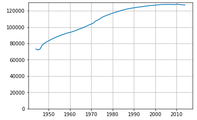
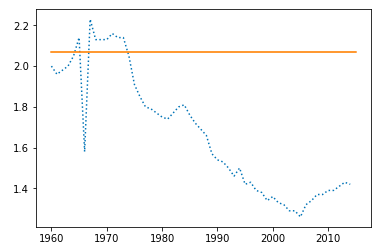
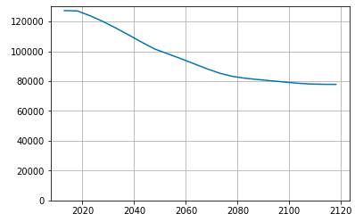

04 日本の人口を視覚化する
======================

## 人口のデータを読み込む

* 人口を5歳階級別(5歳ごとに分けた)に分けた、1944年から2014年までのデータを用いる

* 階級ごとの人口が横軸(列)、西暦が縦軸(行)になった2次元配列

* フォーマットはCSV

* 区切り文字列(delimiter)を指定して、NumPyのarrayとして読み込む

  * CSVファイルには1行目に見出しがあるので、「`skiprow=1`」という引数を渡して読み飛ばす

  * 各行の1行目には西暦があり、これを呼び飛ばすために`usecols`という引数に`range()`を使ったシーケンスを渡す

```python
import numpy as np
p_male = np.loadtxt('male_1944_2014.csv', delimiter=",", skiprows=1, usecols=range(1, 22))
p_female = np.loadtxt('female_1944_2014.csv', delimiter=",", skiprows=1, usecols=range(1, 22))
```

* 男女の合計データ、年ごとのデータも作っておく

  * NumPyを使うと、その種の処理が1行で書ける

  * 5歳階級別人口を年ごとの人口に直す処理では、arrayの`sum()`を使っている

  * `p_total`には5歳階級別の人口が収められている

  * `axis=1`という引数を渡すことで、行ごとのが合計(階級別の人口を合計した結果が計算できる)

```python
p_total = p_male+p_female           # 男女のは5歳階級別の人口を合計する
p_yearly = p_total.sum(axis=1)      # 年ごとの人口に直す
```

* X軸用のデータに1944年から2014年までのシーケンスを渡して、目盛りに西暦を表示している

  * また、グリッドを表示している

```python
%matplotlib inline
import matplotlib.pyplot as plt

t = plt.plot(range(1944, 2015), p_yearly)
plt.ylim((0, 130000))
plt.grid(True)
```



* 図. 出生率(合計特殊出生率)のグラフを描く

  * 置き換え水準：女性1人あたり2.07人子供が生まれれば人口を維持できる

```python
tfr = np.loadtxt('total_fertility_rate.csv', delimiter=",", skiprows=1)
t = plt.plot(range(1960, 2015), tfr, ls=":")
t = plt.plot([1960, 2015], [2.07, 2.07])
```




## 人口ピラミッドを描く

* 男女別、年齢別の人口データから、人口ピラミッドを描く

* まず、人口ピラミッドを描く関数を作る

  * 関数には、西暦や人口を保存してあるarrayを引数として渡すようにする

```python
from matplotlib import gridspec
def show_pgraph(year, arr1, arr2, arr3, ymin, ymax, ydim=1):
    # 人口ピラミッドを表示する
    # 表示する人口のインデックスを張る
    idx = int((year-ymin)/ydim)
    # 人口ピラミッドと人口グラフのグリッドを生成
    gs = gridspec.GridSpec(2, 2, height_ratios=(3, 2))
    # グラフの配置を決める
    ax = [plt.subplot(gs[0, 0]), plt.subplot(gs[0, 1]), plt.subplot(gs[1, :])]
    # 男性の人口ピラミッドを描く
    ax[0].barh(range(0, 101, 5), arr1[idx], height=3)
    ax[0].set(ylim=(0, 100), xlim=(0, 6000))
    ax[0].invert_xaxis()
    ax[0].yaxis.tick_right()
    # 女性の人口ピラミッドを描く
    ax[1].barh(range(0, 101, 5), arr2[idx], height=3)
    ax[1].tick_params(labelleft='off')
    ax[1].set(ylim=(0, 100), xlim=(0, 6000))
    # 人口グラフを描き西暦に線を引く
    ax[2].plot(range(ymin, ymax+1, ydim), arr3, ls=":")
    ax[2].plot([year, year], [0, 140000])
```

* 1950年の人口ピラミッド

```python
show_pgraph(1950, p_male, p_female, p_yearly, 1944, 2014)
```


## グラフをインタラクティブに描画する

* Jupiter Notebookの`Widget`(ウィジェット)という機能を使ってスライダーを表示する

```python
from ipywidgets import interact, IntSlider, fixed
t = interact(show_pgraph, year=IntSlider(min=1944, max=2014, step=5), arr1=fixed(p_male), arr2=fixed(p_female), arr3=fixed(p_yearly), ymin=fixed(1944), ymax=fixed(2014), ydim=fixed(1))
```

※Anaconda2なので再現せず


## 将来の人口を推計する

* 過去の出生率から、人口置き換え水準(2.07)に相当するデータと、政府の人口推計で高位推計として使われる値(1.6)に相当するデータを用意する

```python
lifechart = np.loadtxt('lifechart2014.csv', delimiter=",", usecols=[3])
rev_lifechart = np.ones(lifechart.size)-lifechart
rep_level = np.array([0.0041, 0.107, 0.19, 0.0697, 0.017, 0.0021, 0.0001])
high_rate = np.array([0.0036, 0.0514, 0.1593, 0.0927, 0.0187, 0.0023, 0.0001])
```

* 2014年から100年間の人口を推計する

  * 15歳から49歳の女性の人口と出生率を使って新生児数を計算する

  * 新生男児と女児はおおよそ100:105の比率で、女児の方が多くなる

  => この数値を使って、新生男児と女児のそれぞれの数を推定する

  * 直近の5歳ごとの人口arrayに死亡率をかけて、人口減について処理する

  * その後、新生児数と、人口減の処理をしたarrayの最後の要素を削ったものを連結して、次の5年間の人口arrayを作る

  => この処理を20回繰り返す

  => `recover_in`という変数には、出生率が人口置き換え水準に(突然)戻る年数を代入する(2025年で2.07に戻るとする)

```python
# 男女の人口データを推定するarrayを定義
fp_male = np.array(p_male[-2:])
fp_female = np.array(p_female[-2:])

# 人口置き換え水準に戻る期間(割る5)
recover_in = 5

for i in range(20):
  # 5年ごと100年間分繰り返す
  # 直近の5歳階級別で新しい人口を初期化
  new_fp_male = fp_male[-1]
  new_fp_female = fp_female[-1]
  # 出生率を設定
  if i > recover_in:
    f_rate =rep_level
  else:
    f_rate = high_rate
  # 15-49歳の女性人口に出生率をかけて新生児数を計算
  newborn = np.sum(new_fp_female[3:10]*f_rate)*5
  # 直近の5歳階級別人口のインデックスを右にずらし、新生児を左に連結
  new_fp_male = np.hstack(([newborn*0.5122], new_fp_male[:-1]))
  new_fp_female = np.hstack(([newborn*0.5122], new_fp_female[:-1]))
  # 各階級の人口に死亡率を適用
  new_fp_male *= rev_lifechart
  new_fp_female *= rev_lifechart
  # 新しい推定人口を追加
  fp_male = np.vstack((fp_male, new_fp_male))
  fp_female = np.vstack((fp_female, new_fp_female))

# 男女合算の5歳階級別人口、5年ごとの推定総人口のarrayを作る
fp_total = fp_male + fp_female
fp_sum = np.array([np.sum(x) for x in fp_total])
```

* グラフを表示する

```python
t = plt.plot(range(2013, 2120, 5), fp_sum)
t = plt.ylim([0, 130000])
plt.grid(True)
```



* 人口ピラミッドを描く

```python
t = interact(show_pgraph, year=IntSlider(min=2013, max= 2113, step=5), arr1=fixed(p_male), arr2=fixed(p_female), arr3=fixed(p_yearly), ymin=fixed(2013), ymax=fixed(2120), ydim=fixed(5))
```

※Anaconda2なので再現せず


| 版 |  年月日   |
|---|----------|
|初版|2019/02/09|
