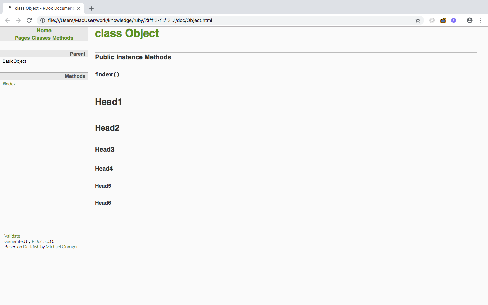

08 開発ツール
===========

## 目次

* [開発ツールとは](#0開発ツールとは)

* [test/unit](#1test/unit)

* []()


## 0.開発ツールとは

* Rubyのデバッガ、プロファイラ、自動テストなどのツールは、添付ライブラリの形で提供される

* 他のライブラリのようにソースに組み込んで利用するものもあれば

  * 利用したい時だけRubyのコマンドラインオプションに組み込んで呼び出すこともできる

  例：rubyプログラムのデバッグを行うdebugライブラリは、以下のコマンドで実行する

  ```ruby
  ruby -rdebug foo.rb
  ```


## 1.test/unit

* Ruby2.2.0以降では、RubyGemsからインストールして使うように変更

* Rubyプログラムのユニットテストを自動で行うためのライブラリ

  > ユニットテスト：メソッドなどの細かい単位でプログラムを実行し、正しく動作するかを確認する作業

* テスト対象のプログラムとは別に、テストケースと呼ばれるプログラムを作成し、その中で利用する


### 成功するテストの例

* テスト対象のプログラム(6-8.foo.rb)

```ruby
class Foo
  def foo
    return "foo"
  end

  def hello(name)
    return "Hello #{name}."
  end
end
```

* テストケースサンプル(6-8.test_foo.rb)

  * test/unitは、このテストケースの中で`require`する

  * 一般的に、テスト対象のプログラムと分離して作成するので、テストケースの中でテスト対象のプログラムを呼び出せるように`require`しておく

```ruby
require 'test/unit'
require '6-8.foo'

class TestFoo < Test::Unit::TestCase
  def setup
    @foo = Foo.new
  end

  def teardown
  end

  def test_foo
    assert_equal("foo", @foo.foo)
  end

  def test_hello
    assert_equal("Hello world.", @foo.hello("world"))
  end
end
```

#### 実行結果

`6-8.foo.rb`を`6-8.test_foo.rb`から`require`できるようにカレントディレクトリをロードするパスに加えて実行

```ruby
$ ruby -I . 6-8.test_foo.rb
Loaded suite 6-8.test_foo
Started
..
Finished in 0.000776 seconds.
----------------------------------------------------------------------------------------------
2 tests, 2 assertions, 0 failures, 0 errors, 0 pendings, 0 omissions, 0 notifications
100% passed
----------------------------------------------------------------------------------------------
2577.32 tests/s, 2577.32 assertions/s
```

### 失敗するテストの例

#### テスト対象のプログラム(6-8.foo.rb)

```ruby
class Foo
  def foo
    return "bar"
  end

  def hello_world(name)
    return "Hello #{name}."
  end
end
```

#### テストケースサンプル(6-8.test_foo.rb)

成功するテストの例と同様

#### 実行結果

* 1つ目の`test_foo`メソッドは、検証メソッドである`assert_equal`がfooメソッドで文字列の"foo"を返すことを期待しているのに対して、

  実際は"bar"が帰ってきたため、テスト結果が`F`(failure)

* 2つ目の`test_hello`メソッドは、元の`helllo`メソッドを`hello_world`メソッドに変更したため、テストケース内の`hello`メソッド呼び出し時に

  例外`NoMethodError`が発生するため、テスト結果が`E`(Error)

* このように、例外などでメソッドの実行が中断する場合、テスト結果はエラーとなる

```ruby
$ ruby -I . 6-8.test_foo.rb
Loaded suite 6-8.test_foo
Started
F
==============================================================================================
     10:   end
     11:
     12:   def test_foo
  => 13:     assert_equal("foo", @foo.foo)
     14:   end
     15:
     16:   def test_hello
6-8.test_foo.rb:13:in `test_foo'
<"foo"> expected but was
<"bar">
Failure: test_foo(TestFoo)
==============================================================================================
E
==============================================================================================
     14:   end
     15:
     16:   def test_hello
  => 17:     assert_equal("Hello world.", @foo.hello("world"))
     18:   end
     19: end
6-8.test_foo.rb:17:in `test_hello'
Error: test_hello(TestFoo): NoMethodError: undefined method `hello' for #<Foo:0x007f827f902de8>
==============================================================================================

Finished in 0.041241 seconds.
----------------------------------------------------------------------------------------------
2 tests, 1 assertions, 1 failures, 1 errors, 0 pendings, 0 omissions, 0 notifications
0% passed
----------------------------------------------------------------------------------------------
48.50 tests/s, 24.25 assertions/s
```

***

### test/unitの使い方

* test/unitを`require`すると、プログラム時にプログラム内の`Test::Unit::TestCase`と継承にあるクラスを実行する

* デフォルトの動作では、プログラム内の該当する全てのクラスのテストケースを実行するが、

  テスト実行時に、オプション`-t`(testcase)で明示的に実行するテストを指定することもできる

* テストメソッドを定義するには、テストケースの前に`test_`を付けて定義する

  →テストメソッド内では、検証メソッドを利用してテストコードを書くことができる

* `setup`：テストメソッドを実行する前に必ず呼び出される。各テストメソッドで共通で実行する初期化処理などを記述する

* `teardown`：テストメソッドを実行した後に必ず呼び出される。各テストメソッドで共通で実行する終了時処理などを記述する

### test/unitの検証メソッド

※検証メソッドの共通の引数である`message`は、失敗時に表示されるメッセージを定義できる

#### `assert`

booleanがtrueであれば、検証が成功する

```ruby
assert(boolean, message = nil)
```

#### `assert_equal`/`assert_not_equal`

* `assert_equal`：`expected == actual`の時に検証が成功する

* `assert_not_equal`：`expected != actual`の時に検証が成功する

※注意
* `expected`：期待する値

* `actual`：検証対象の値

```ruby
assert_equal(expected, actual, message = nil)
assert_not_equal(expected, actual, message = nil)
```

#### `assert_instance_of`

* 検証対象のobjectが`klass`クラスのインスタンスであるかどうかを検証する

* `object.class == klass`であれば検証が成功する

```ruby
assert_instance_of(klass, object, message = "")
```

#### `assert_nil`/`assert_not_nil`

* `assert_nil`：objectがnilであれば検証が成功する

* `assert_not_nil`：objectがnilでなければ検証が成功する

```ruby
assert_nil(object, message = "")
assert_not_nil(object, message = "")
```

#### `assert_kind_of`

検証対象のobjectがklassクラスと継承関係にあるか検証する

* 例)"abc"：String、Enumerable、Comparable、Object、Kernelのいずれかを指定すれば検証可能

  →`assert_instance_of`ではStringでのみ検証可能

```ruby
assert_kind_of(klass, object, message = "")
```

#### `assert_match`/`assert_not_match`

* patternに指定した正規表現が、stringにマッチするかどうかを検証

* `assert_match`：pattern =~ stringがtrueの時に検証が成功する

* `assert_not_match`：pattern !~ stringの時に検証が成功する

```ruby
assert_match(pattern, string, message = "")
assert_not_match(pattern, string, message = "")
```

#### `assert_raise`/`assert_nothing_raised`

* `assert_raise`：ブロック内の処理中に引数`expected_exception_klass`の例外を`raise`した時に検証が成功する

* `assert_nothing_raised`：例外が発生しなかった時に検証が成功する

```ruby
assert_raise(expected_exception_klass, message = "") { ... }
assert_nothing_raised(*args) { ... }
```

※記述例

```ruby
def test_assert_raise
  assert_raise(StandardError) {
    raise StandardError
  }
end
```

#### `flunk`

* 常に検証が失敗するテストケースを作ることができる

* 特定のテストケースの記述を後回しにする時など、目印代わりに使用

* 引数のmessageには失敗時にメッセージとして出力する任意の文字列を指定できる

```ruby
flunk(message = "Flunked")
```

#### `assert_throws`/`assert_nothing_thrown`

* `assert_throws`：`assert_raise`メソッドの`throw`版で、ブロック内の処理中に`expected_symbol`がthrowされた時に検証が成功

* `assert_nothing_thrown`：何もthrowされなかった時に検証が成功する

***

## 6-8-2.RDoc

* Rdoc(Ruby Document System)

* ソースコードからHTML形式のAPI仕様書を出力するコマンドツール

* ソースコードを解析して、クラス、モジュール、メソッドの定義やinclude、requireの関係を抽出したものを、直前のコメントと併合してHTMLに出力

### RDocの利用例

* コメントは「#」から始まる形式でも、`=begin〜=end`で囲んだ式でも利用できる

```ruby
# この行はRDocによって読み込まれます
def comment
end

=begin
この行はRDocに読み込まれます
=end
def begin_end_comment
end
```

### RDocのドキュメント生成

RDocを実行すると、カレントディレクトリ以下にあるファイルを探し、RDocのパーサーに対応したファイルの解析を行う

解析したファイルはHTMLに変換され、docディレクトリ以下に配置される

```ruby
rdoc
```


***

### マークアップ

コメントに特殊なマークアップを行うことで、出力されるドキュメントをマークアップすることができる

#### 見出し

* `=`の個数に応じて、見出し行`<h1>`〜`<h6>`に変換される

* `=`が7個以上の場合は、全て`<h6>`になる

```ruby
# = Head1
# == Head2
# === Head3
# ==== Head4
# ===== Head5
# ====== Head6
```



#### インライン

* URI形式(http://〜、ftp://〜)で始まる形式の文字列は、自動的にリンクになる

```ruby
# http://www.ruby-lang.org/
```

* 文字列をアスタリスク`*`で囲むと、ボールド体で装飾できる

* <b>word</b>でも使用できる

```ruby
# *word*
```

* 文字列をアンダースコア`_`で囲むと、イタリック体で装飾できる

* <em>word</em>でも使用できる

```ruby
# _word_
```

* 文字列をプラス`+`で囲むと、タイプライター体で装飾できる

* <tt>word</tt>でも使用できる

```ruby
# +word+
```


#### リスト

* 番号なしリスト：アスタリスク`*`またはマイナス`-`で文字列を開始すると、番号なしリストを作ることができる

  ```ruby
  # * リスト1
  # * リスト2
  # * リスト3

  # - リスト1
  # - リスト2
  # - リスト3
  ```

* 番号付きリスト：数字+ピリオド`.`で文字列を開始すると、番号付きリストを作ることができる

  ```ruby
  # 1. リスト1
  # 2. リスト2
  # 3. リスト3
  ```

* ラベル付きリスト：大カッコ`[]`で囲んだ文字列で開始すると、ラベル付きリストを作成することができる

  ```ruby
  # [list1] リスト1
  # [list2] リスト2
  # [list3] リスト3
  ```

  コロン`:`で区切っても、ラベル付きリストを作成できる。コロンの右の文字は左揃えになる

  ```ruby
  # list1:: リスト1
  # list2:: リスト2
  # list3:: リスト3
  ```


| 版 |  年/月/日 |
|---|----------|
|初版|2018/10/21|
