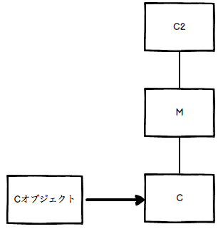
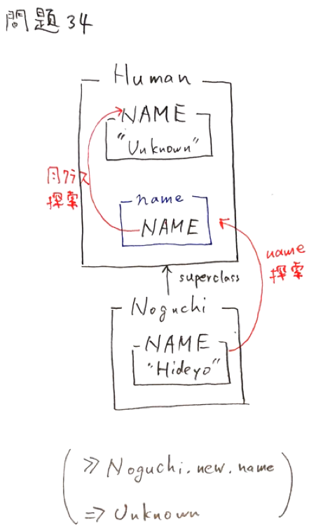

goldで間違えた問題
================

# レキシカルスコープ


## 次のプログラムは"Hello, world"と表示します。同じ結果になる選択肢はどれですか（複数選択）

```ruby
>> module M
>>  CONST = "Hello, world"
>>
>>  class C
>>    def awesome_method
>>      CONST
>>    end
>>  end
>> end
=> :awesome_method
>>
>> p M::C.new.awesome_method
"Hello, world"
=> "Hello, world"
```


### 選択肢1

定数の参照はレキシカルに行われます。

`M::C#awesome_method`のコンテキスト(`self`)に`CONST`がないため例外が発生します。

→`M::CONST`と、`M::C`のコンテキストが一致していれば可能

→ **クラス継承** と **継承関係** は関係ない!!!

→自分自身に一番近い定数を参照する

```ruby
>> module M
>>   CONST = "Hello, world"
>> end
=> "Hello, world"

>> class M::C
>>   def awesome_method
>>     CONST
>>   end
>> end
=> :awesome_method
>>
>> p M::C.new.awesome_method
NameError: uninitialized constant M::C::CONST

# クラス継承と、継承関係の調査
>> a = M::C.new
=> #<M::C:0x007fefa586fdc0>
>> a.class
=> M::C
>> a.class.class       # Mが親クラスと思うが、継承関係はない
=> Class
```


### 選択肢2

`class_eval`にブロックを渡した場合は、ブロック内のネストはモジュール`M`になります。

そのコンテキストから定数を探しますので`"Hello, world"`が表示されます。

```ruby
>> class C
>> end
=> nil
>>
?> module M
>>   CONST = "Hello, world"
>>
?>   C.class_eval do
?>     def awesome_method
>>       CONST
>>     end
>>   end
>> end
=> :awesome_method
>>
>> p C.new.awesome_method
"Hello, world"
=> "Hello, world"
```


### 選択肢3

`class_eval`に文字列を渡した場合のネストの状態はクラス`C`です。

`CONST`はクラス`C`にありますので`"Hello, world"`が表示されます。

> `class_eval`メソッドの引数に文字列`code`を渡すと、その文字列をクラス定義やモジュール定義の中のコードであるように実行します。
>
> 戻り値は、文字列のコードの戻り値です。

```ruby
>> class C
>>   CONST = "Hello, world"
>> end
=> "Hello, world"
>>
?> module M
>>   C.class_eval(<<-CODE)
    def awesome_method
      CONST
    end
  CODE
>> end
=> :awesome_method
>>
>> p C.new.awesome_method
"Hello, world"
=> "Hello, world"
```


### 選択肢4

`class_eval`にブロックを渡した場合は、ブロック内のネストはモジュール`M`になります。

そのコンテキストから定数を探しますがないため例外が発生します。

> `Module#class_eval`
>
> 文字列が与えられた場合には、定数とクラス変数のスコープは自身のモジュール定義式内と同じスコープになります。
>
> ブロックが与えられた場合には、定数とクラス変数のスコープはブロックの外側のスコープになります。

```ruby
>> class C
>>   CONST = "Hello, world"
>> end
=> "Hello, world"
>>
>> module M
>>   C.class_eval do
>>     def awesome_method
>>       CONST
>>     end
>>   end
>> end
=> :awesome_method
>>
>> p C.new.awesome_method
NameError: uninitialized constant M::CONST
```


## 以下のコードを実行するとどうなりますか

`C#initialize`が`S#initialize`をオーバーライドされているため、`@@val += 1`は実行されません。

> initializeメソッドは重複して定義するたびに、最後に定義されたinitializeメソッドが使用されます。

`class << C ~ end`の処理はクラスを定義した時点で、実行されます。

→返り値？？

> 後日、もう一度検索してみる
> 2018/10/27

```ruby
>> class S
>>   @@val = 0
>>   def initialize
>>     @@val += 1
>>   end
>> end
=> :initialize
>>
>> class C < S
>>   class << C
>>     @@val += 1
>>   end
>>
>>   def initialize           # 最後のinitializeが使用される
>>   end
>> end
=> :initialize
>>
>> C.new                   # initializeで実行されていない(オーバーライドされている)
=> #<C:0x007f826e078d00>
>> C.new                   # initializeで実行されていない(オーバーライドされている)
=> #<C:0x007f826e073328>
>> S.new
=> #<S:0x007f826e0719b0>
>> S.new
=> #<S:0x007f826e070038>
>>
>> p C.class_variable_get(:@@val)
3
=> 3
```


## 以下のコードを実行するとどうなりますか

```ruby
>> class S
>>   @@val = 0
>>   def initialize
>>     @@val += 1
>>   end
>> end
=> :initialize

>> class C < S
>>   class << C
>>     @@val += 1
>>   end
>> end
=> 1

>> C.new
=> #<C:0x007fac7d09bfb0>
>> C.new
=> #<C:0x007fac7d09a610>
>> S.new
=> #<S:0x007fac7d098cc0>
>> S.new
=> #<S:0x007fac7c1472d0>

>> p C.class_variable_get(:@@val)
5
=> 5
```

`@@val`に`1`加算しているタイミングは以下です。

* Cクラスの特異クラスを定義

* C.newの呼び出し

* S.newの呼び出し


## 次のコードを実行するとどうなりますか

`include`はモジュールのメソッドをインスタンスメソッドとして追加します。

メソッド探索順は`self`(クラス)の後に追加されます。

複数回`include`された場合は、後に宣言された方からメソッド探索されます。

.png)

```ruby
>> module M1
>> end
=> nil
>>
>> module M2
>> end
=> nil
>>
>> class C
>>   include M1
>>   include M2
>> end
=> C
>>
>> p C.ancestors
[C, M2, M1, Object, Kernel, BasicObject]
=> [C, M2, M1, Object, Kernel, BasicObject]
```


## 以下のコードを実行するとどうなりますか

```ruby
>> module Mod
>>   def foo
>>     puts "Mod"
>>   end
>> end
=> :foo
>> class Cls1
>>   include Mod
>>   def foo
>>     puts "Cls1"
>>     super
>>   end
>> end
=> :foo
>> class Cls2 < Cls1
>>   def foo
>>     puts "Cls2"
>>     super
>>   end
>> end
=> :foo

>> Cls2.new.foo
Cls2
Cls1
Mod
=> nil
```


### 解説

メソッドは、

* 自分のクラス->includeしているモジュール->スーパークラス->スーパークラスのincludeしているモジュール

の順に検索される

Cls2クラスのオブジェクトで`foo`を呼び出すと、Cl2クラスの`foo`が実行され、Cls2を画面に出力したあと、

`super`でCls1クラスの`foo`を呼び出します。

Cls1クラスの`foo`の中でCls1を画面に出力した後、`super`でModモジュールの`foo`を呼び出し、Modを画面に出力します

したがって、Cls2、Cls1、Modの順番で出力されます


## 次のコードを実行するとどうなりますか

```ruby
>> module M
>>   def foo
>>     super
>>     puts "M#foo"
>>   end
>> end
=> :foo

>> class C2
>>   def foo
>>     puts "C2#foo"
>>   end
>> end
=> :foo

>> class C < C2
>>   def foo
>>     super
>>     puts "C#foo"
>>   end
>>   include M
>> end
=> C

>> C.new.foo
C2#foo
M#foo
C#foo
=> nil
```

`include`はモジュールのメソッドをインスタンスメソッドとして追加します。

メソッド探索順は`self`の後に追加されます。


`include`はモジュールのメソッドをインスタンスメソッドとして追加します。

メソッド探索順は`self`の後に追加されます。

→`C2` -> `M` -> `C` の順番


> 後に`include`した方が、先に`include`したものを覆う感覚
>
> `include`は、覆う感覚





## 次のプログラムを実行するとどうなりますか

```ruby
>> module M1
>>   class C1
>>     CONST = "001"
>>   end
>>
>>   class C2 < C1
>>     CONST = "010"
>>
>>     module M2
>>       CONST = "011"
>>
>>       class Ca
>>         CONST = "100"
>>       end
>>
>>       class Cb < Ca
>>         p CONST
>>       end
>>     end
>>   end
>> end
"011"
=> "011"
```


### 解説

Rubyは定数の参照はレキシカルに決定されます。

名前空間ではなく、プログラム上の定義された場所と使われている場所の静的な位置づけが重要です。

例えば、次のプログラムでは期待した結果が得られません。`CONST`がモジュールMのスコープにあるためです。

```ruby
>> module M
>>   CONST = "Hello, world"
>> end
=> "Hello, world"
>>
>> class M::C
>>   def awesome_method
>>     CONST
>>   end
>> end
=> :awesome_method
>>
>> p M::C.new.awesome_method
NameError: uninitialized constant M::C::CONST
```

一方で同じレキシカルスコープにある場合は例外は発生しません。

```ruby
>> module M
>>   CONST = "Hello, world"
>>
>>   class C
>>     def awesome_method
>>       CONST
>>     end
>>   end
>> end
=> :awesome_method
>>
>> p M::C.new.awesome_method
"Hello, world"
=> "Hello, world"
```

また、使われている定数の場所がネストされている場合は内側から順に定数の探索が始まります。

レキシカルスコープに定数がない場合は、スーパークラスの探索を行います。

クラス`Cb`から最も物理的に近いのは`M2::CONST`であるため答えは`"011"`になります。

スーパークラスの探索はこの場合には行われません。


## 以下のコードを実行するとどうなりますか

`initialize`の可視性は`private`に設定されています。

`initialize`の可視性を`public`に設定したとしても、必ずprivateになります。

> newメソッドの処理の内部でインスタンスの初期化のために使うメソッド
>
> インスタンスの外部からは呼び出すことができない

```ruby
>> class C
>> private
>>   def initialize
>>   end
>> end
=> :initialize
>>
>> p C.new.public_methods.include? :initialize
false
=> false
```


## 次のコードを実行するとどうなりますか。

`Class#name`はクラス名を文字列で返します。

`Human#name`クラスは`Class#name`をオーバーライドしているので、`const_get`が呼ばれます。

`const_get`は、`self`に定義された定数を探索します。自クラスに定義がない場合は、メソッドと同様に探索を行います。

問題コードの5行目時点のインスタンスは`Fukuzawa`クラスです。

よって、`Human#name`は`Fukuzawa`クラスの`Yukichi`を返します。

```ruby
>> class Human
>>   NAME = "Unknown"
>>
>>   def self.name
>>     const_get(:NAME)
>>   end
>> end
=> :name
>>
>> class Fukuzawa < Human
>>   NAME = "Yukichi"
>> end
=> "Yukichi"
>>
>> puts Fukuzawa.name
Yukichi
=> nil
```


## 次のコードを実行するとどうなりますか

`method_missing`は、継承チェーンを辿った末にメソッドが見つからなかった場合に、呼び出されます。

`method_missing`も継承チェーンを辿ります。

よって、`B#method_missing`が出力されます。

> 現在のクラス・モジュールで`method_missing`があれば実行
>
> そうしないと、動的にメソッドを定義するときに不都合になる

```Ruby
>> module M
>>   def method_missing(id, *args)
>>     puts "M#method_missing"
>>   end
>> end
=> :method_missing
>> class A
>>   include M
>>   def method_missing(id, *args)
>>     puts "A#method_missing"
>>   end
>> end
=> :method_missing
>> class B < A
>>   def method_missing(id, *args)
>>     puts "B#method_missing"
>>   end
>> end
=> :method_missing
>>
>> obj = B.new
=> #<B:0x007f876f01e188>
>> obj.dummy_method
B#method_missing
=> nil
```


## 次のプログラムを実行するとどうなりますか

```ruby
>> module A
>>   B = 42
>>
?>   def f
>>     21
>>   end
>> end
=> :f
>> # module_evalは、class_evalと同様
>> A.module_eval(<<-CODE)
  def self.f
    p B
  end
CODE
=> :f
>>
>> B = 15
=> 15
>>
>> A.f
42
=> 42
```


### 解説

`module_eval`に文字列を引数とした場合は、レシーバーのスコープで評価されます。

問題のプログラムを次のようにするとネストの状態を調べることができます。

```ruby
>> A.module_eval(<<-CODE)
  p Module.nesting
CODE
[A]
=> [A]
```

定数は静的に探索が行われますので、`A::B`の`42`が答えになります。


## 次のプログラムを実行するとどうなりますか

`::`演算子が先頭にあるとトップレベルから定数の探索を行います。

モジュール`M`にあるクラス`C`はトップレベルにあるものを指します。

`greet`メソッドにある`CONST`はクラス`C`にはありませんが、スーパークラスにあるか探索を行います。

クラス`Base`を継承していますので、`"Hello, world"`が表示されます。

```ruby
>> class Base
>>   CONST = "Hello, world"
>> end
=> "Hello, world"
>>
>> class C < Base
>> end
=> nil
>>
>> module P
>>   CONST = "Good, night"
>> end
=> "Good, night"
>>
>> class Base
>>   prepend P
>> end
=> Base
>>
>> module M
>>   class C
>>     CONST = "Good, evening"
>>   end
>> end
=> "Good, evening"
>>
>> module M
>>   class ::C       # モジュールMでネストされているが、トップレベルのクラスCを指している
>>     def greet
>>       CONST
>>     end
>>   end
>> end
=> :greet
>>
>> p C.new.greet
"Hello, world"
=> "Hello, world"
```


## 以下のコードを実行するとどうなりますか

`@@val`に`1`加算しているタイミングは以下です。

* `C`クラスの特異クラスを定義

* `C.new`の呼び出し

* `S.new`の呼び出し

```ruby
>> class S
>>   @@val = 0
>>   def initialize
>>     @@val += 1
>>   end
>> end
=> :initialize
>>
>> class C < S
>>   class << C
>>     @@val += 1
>>   end
>> end
=> 1
>>
>> C.new
=> #<C:0x007fc7c98e4b88>
>> C.new
=> #<C:0x007fc7c98def58>
>> S.new
=> #<S:0x007fc7c98dd5e0>
>> S.new
=> #<S:0x007fc7c98d7c08>
>>
>> p C.class_variable_get(:@@val)
5
=> 5
```


## 以下のコードを実行するとどうなりますか

```ruby
>> class S
>>   @@val = 0
>>   def initialize
>>     @@val += 1
>>   end
>> end
=> :initialize

>> class C < S
>>   class << C
>>     @@val += 1
>>   end
>> end
=> 1

>> C.new
=> #<C:0x007ffa358d4050>
>> C.new
=> #<C:0x007ffa358ce628>
>> S.new
=> #<S:0x007ffa358cccb0>
>> S.new
=> #<S:0x007ffa358c7300>

>> p C.class_variable_get(:@@val)
5
=> 5
```


### 解説

`@@val`に`1`加算しているタイミングは以下です。

* Cクラスの特異クラスを定義

* `C.new`の呼び出し

* `S.new`の呼び出し

```ruby
class S
  @@val = 0
  def initialize  # 初期化による加算
    @@val += 1
  end
end

class C < S
  class << C      # クラスCにおける、クラスメソッドの定義(`C.new`もクラスメソッドの呼び出し)
    @@val += 1    # クラスCのクラスメソッドを呼び出すと、加算される
  end
end

C.new
C.new
S.new
S.new

p C.class_variable_get(:@@val)
```


## 次のプログラムを実行するとどうなりますか

```ruby
>> class Object
>>   CONST = "1"                 # 最初の定義(CONST = "1")
>>   def const_succ
>>     CONST.succ!
>>   end
>> end
=> :const_succ

>> class Child1
>>   const_succ                  # 1回目(CONST = "2")
>>   class << self
>>     const_succ                # 2回目(CONST = "3")
>>   end
>> end
=> "3"

>> class Child2
>>   const_succ                  # 3回目(CONST = "4")
>>   def initialize
>>     const_succ                # 4回目(CONST = "5")
>>   end
>> end
=> :initialize

>> Child1.new
=> #<Child1:0x007fc59f06e570>
>> Child2.new
=> #<Child2:0x007fc59f06c4f0>

>> p Object::CONST
"5"
=> "5"
```


### 解説

クラスObjectにメソッドを定義すると特異クラスでもそのメソッドを利用することが出来ます。

問題のプログラムを順に実行すると、答えは"5"になります。


> 補足　`Object#const_succ`について

> 内部で`String#succ!`を実行しています。このメソッドはレシーバーの文字列を次の文字列へ進めます。

> この問題ですと、`"1"`→`"2"`・・・と`1`ずつ繰り上がります。

> また、定数に対して行っていますが破壊的メソッドの呼び出しですので再代入にはならず警告は表示されません。

```ruby
class Object
  CONST = "1"
  def const_succ
    CONST.succ!
  end
end

class Child1
  const_succ # "2"になる
  class << self
    const_succ # "3"になる
  end
end

class Child2
  const_succ # "4になる"
  def initialize
    const_succ
  end
end

Child1.new # "4"のまま・・・継承していないので、初期化はされない
Child2.new # "5"になる

p Object::CONST
"5"
=> "5"
```


## 次のコードを実行するとどうなりますか

`super`はスーパークラスと同名のメソッドが呼ばれます。

引数ありのメソッドで`super`を呼び出すと、引数ありのメソッドが呼ばれますが、そのメソッドが存在しない場合は、`ArgumentError`が発生します。

引数ありのメソッドで引数なしのスーパークラスを呼び出すには、`super()`と明示的に呼び出す必要があります。

> 正解しているけど、念のため
>
> 2018/10/28

```ruby
>> class S
>>   def initialize
>>     puts "S#initialize"
>>   end
>> end
=> :initialize
>>
?> class C < S
>>   def initialize(*args)
>>     super()
>>     puts "C#initialize"
>>   end
>> end
=> :initialize
>>
?> C.new(1,2,3,4,5)
S#initialize
C#initialize
=> #<C:0x007f92790acab8>
```


## 次のプログラムを実行するとどうなりますか

Rubyは定数の参照はレキシカルに決定されますが、この問題ではレキシカルスコープに定数はありません。

レキシカルスコープに定数がない場合は、スーパークラスの探索を行います。

この問題では、クラス`C2`のスコープで定数を参照しています。

クラス`C2`のスーパークラスはクラス`Cd`ですので`"100"`が正解になります。

> 正解しているけど念のため
>
> 2018/10/28

```ruby
>> class Ca
>>   CONST = "001"
>> end
=> "001"
>>
?> class Cb
>>   CONST = "010"
>> end
=> "010"
>>
?> class Cc
>>   CONST = "011"
>> end
=> "011"
>>
?> class Cd
>>   CONST = "100"
>> end
=> "100"
>>
?> module M1
>>   class C0 < Ca
>>     class C1 < Cc
>>       class C2 < Cd
>>         p CONST
>>
?>         class C2 < Cb
>>         end
>>       end
>>     end
>>   end
>> end
"100"
=> nil
```


## 次のプログラムを実行するとどうなりますか

`module_eval`にブロックを渡した場合のネストは次の通りです。

```ruby
A.module_eval do
  p Module.nesting # []と表示され、ネストされた状態になく、トップレベルにいることがわかる
end
```
トップレベルで定数を定義した場合は`Object`の定数になります。

```ruby
B = "Hello, world"
p Object.const_get(:B) # "Hello, world"と表示される
```
問題にあるメソッド`A.f`はトップレベルにある定数を探索するため答えは`15`になります。

> `Module#module_eval`
>
> 文字列が与えられた場合には、定数とクラス変数のスコープは自身のモジュール定義式内と同じスコープになります。
>
> ブロックが与えられた場合には、定数とクラス変数のスコープはブロックの外側のスコープになります。

```ruby
>> module A
>>   B = 42
>>
>>   def f
>>     21
>>   end
>> end
=> :f
>>
>> A.module_eval do
>>   def self.f
>>     p B
>>   end
>> end
=> :f
>>
>> B = 15
=> 15
>>
>> A.f
15
=> 15
```


## 次のコードを実行するとどうなりますか

`method_missing`は、継承チェーンを辿った末にメソッドが見つからなかった場合に、呼び出されます。

`method_missing`も継承チェーンを辿ります。

問題で、`B.dummy_method`と呼び出しています。

これは、Classクラスのインスタンスメソッドが呼ばれます。

よって、`Class#method_missing`が出力されます。

> ClassクラスのオブジェクトがBクラス
>
> `dummy_method`は、Bから見ればクラスメソッドだが、Classから見ればBのインスタンスメソッド
>
> Bのインスタンスメソッドが見つからない場合は、Classのインスタンスメソッドを呼び出す

```ruby
>> class Class
>>   def method_missing(id, *args)
>>     puts "Class#method_missing"
>>   end
>> end
=> :method_missing
>> class A
>>   def method_missing(id, *args)
>>     puts "A#method_missing"
>>   end
>> end
=> :method_missing
>> class B < A
>>   def method_missing(id, *args)
>>     puts "B#method_missing"
>>   end
>> end
=> :method_missing
>>
>> B.dummy_method
Class#method_missing
=> nil
```


## 次のコードを実行するとどうなりますか。

定数はインスタンスではなくクラスに存在します。

定数の探索順位は`クラス内 -> スーパークラス -> クラス探索`順に行われます。

よって、`Human#name`のクラス内定数である`NAME = "Unknown"`が返されます。

```ruby
>> class Human
>>   NAME = "Unknown"
>>
>>   def name
>>     NAME
>>   end
>> end
=> :name
>>
>> class Noguchi < Human
>>   NAME = "Hideyo"
>> end
=> "Hideyo"
>>
>> puts Noguchi.new.name
Unknown
=> nil
```




## 次のコードを実行するとどうなりますか

`Array#sort`は比較に`<=>`を使用しています。

自作クラスの場合はオブジェクトIDが比較対象となります。

`Fixnum#<=>(other)`は以下の結果を返します。

* `self`が`other`より大きい場合は、`1`を返します。

* `self`が`other`と等しい場合は、`0`を返します。

* `self`が`other`より小さい場合は、`-1`を返します。

問題のコードでは、`sort`は非破壊的メソッドです。

よって`puts`時点ではソートが行われずに配列へ挿入した順番に表示されます。

> `puts`
>
> 引数のオブジェクトを文字列に変換し、改行を加えて標準出力に出力。
>
> `to_s`メソッドで文字列に変換される。

※組み込みクラスのクラスメソッドのモンキーパッチをここでは行なっている

```ruby
>> class Company
>>   attr_reader :id
>>   attr_accessor :name
>>   def initialize id, name
>>     @id = id
>>     @name = name
>>   end
>>   def to_s
>>     "#{id}:#{name}"
>>   end
>>   def <=> other
>>     self.id <=> other.id
>>   end
>> end
=> :<=>
>>
>> companies = []
=> []
>> companies << Company.new(2, 'Liberyfish')
=> [#<Company:0x007fe8691249a0 @id=2, @name="Liberyfish">]
>> companies << Company.new(3, 'Freefish')
=> [#<Company:0x007fe8691249a0 @id=2, @name="Liberyfish">, #<Company:0x007fe8681834d8 @id=3, @name="Freefish">]
>> companies << Company.new(1, 'Freedomfish')
=> [#<Company:0x007fe8691249a0 @id=2, @name="Liberyfish">, #<Company:0x007fe8681834d8 @id=3, @name="Freefish">, #<Company:0x007fe86911d998 @id=1, @name="Freedomfish">]
>>
>> companies.sort
=> [#<Company:0x007fe86911d998 @id=1, @name="Freedomfish">, #<Company:0x007fe8691249a0 @id=2, @name="Liberyfish">, #<Company:0x007fe8681834d8 @id=3, @name="Freefish">]
>>
>> companies.each do |e|
>>   puts e
>> end
2:Liberyfish
3:Freefish
1:Freedomfish
=> [#<Company:0x007fe8691249a0 @id=2, @name="Liberyfish">, #<Company:0x007fe8681834d8 @id=3, @name="Freefish">, #<Company:0x007fe86911d998 @id=1, @name="Freedomfish">]
```


## 次のコードを実行するとどうなりますか

```ruby
>> class Company
>>   attr_reader :id
>>   attr_accessor :name
>>   def initialize id, name
>>     @id = id
>>     @name = name
>>   end
>>   def to_s
>>     "#{id}:#{name}"
>>   end
>>   def <=> other
>>     other.id <=> self.id
>>   end
>> end
=> :<=>

>> companies = []
=> []
>> companies << Company.new(2, 'Liberyfish')
=> [#<Company:0x007fc0c888c3a0 @id=2, @name="Liberyfish">]
>> companies << Company.new(3, 'Freefish')
=> [#<Company:0x007fc0c888c3a0 @id=2, @name="Liberyfish">, #<Company:0x007fc0c8136f10 @id=3, @name="Freefish">]
>> companies << Company.new(1, 'Freedomfish')
=> [#<Company:0x007fc0c888c3a0 @id=2, @name="Liberyfish">, #<Company:0x007fc0c8136f10 @id=3, @name="Freefish">, #<Company:0x007fc0c812d3e8 @id=1, @name="Freedomfish">]

>> companies.sort!
=> [#<Company:0x007fc0c8136f10 @id=3, @name="Freefish">, #<Company:0x007fc0c888c3a0 @id=2, @name="Liberyfish">, #<Company:0x007fc0c812d3e8 @id=1, @name="Freedomfish">]

>> companies.each do |e|
>>   puts e
>> end
3:Freefish
2:Liberyfish
1:Freedomfish
=> [#<Company:0x007fc0c8136f10 @id=3, @name="Freefish">, #<Company:0x007fc0c888c3a0 @id=2, @name="Liberyfish">, #<Company:0x007fc0c812d3e8 @id=1, @name="Freedomfish">]
```


### 解説

`Array#sort`は比較に`<=>`を使用しています。

自作クラスの場合はオブジェクトIDが比較対象となります。

別のソート条件を用いるには<=>をオーバーライドします。

`Fixnum#<=>(other)`は以下の結果を返します。

  * `self`が`other`より大きい場合は、`1`を返します。
  * `self`が`other`と等しい場合は、`0`を返します。
  * `self`が`other`より小さい場合は、`-1`を返します。

問題のコードでは、`sort!`は破壊的メソッドです。

よって`puts`時点ではソートが行われて表示されます。


## 次のコードの実行結果が`falsetrue`になるように`XXXX`,`YYYY`に適切なコードを選択せよ

```ruby
class Company
  XXXX
  attr_reader :id
  attr_accessor :name
  def initialize id, name
    @id = id
    @name = name
  end
  def to_s
    "#{id}:#{name}"
  end
  YYYY
end

c1 = Company.new(3, 'Liberyfish')
c2 = Company.new(2, 'Freefish')
c3 = Company.new(1, 'Freedomfish')

print c1.between?(c2, c3)
print c2.between?(c3, c1)
```

```ruby
# 解答
class Company
  include Comparable
  attr_reader :id
  attr_accessor :name
  def initialize id, name
    @id = id
    @name = name
  end
  def to_s
    "#{id}:#{name}"
  end
  def <=> other
    self.id <=> other.id
  end
end

c1 = Company.new(3, 'Liberyfish')
c2 = Company.new(2, 'Freefish')
c3 = Company.new(1, 'Freedomfish')

print c1.between?(c2, c3)
print c2.between?(c3, c1)
```


### 解説

`between?`で値を比較するためには、Comparableを`include`する必要があります。

Comparableは比較に`<=>`を使用しています。

自作クラスの場合はオブジェクトIDが比較対象となります。

通常は、`Comparable#<=>`をオーバーライドします。

`Fixnum#<=>(other)`は以下の結果を返します。

* `self`が`other`より大きい場合は、`1`を返します。

* `self`が`other`と等しい場合は、`0`を返します。

* `self`が`other`より小さい場合は、`-1`を返します。

`extend`はモジュールのインスタンスメソッドを特異メソッドとして追加します。

インスタンス変数からメソッドを参照することができなくなるので、エラーになります。

Sortableモジュールは存在しません。


## 次のプログラムを実行するとどうなりますか

```ruby
>> module K
>>   CONST = "Good, night"
>>   class P
>>   end
>> end
=> nil
>>
?> module K::P::M
>>   class C
>>     CONST = "Good, evening"
>>   end
>> end
=> "Good, evening"
>>
?> module M
>>   class C
>>     CONST = "Hello, world"
>>   end
>> end
=> "Hello, world"
>>
?> class K::P
>>   class M::C
>>     p CONST
>>   end
>> end
"Good, evening"
=> "Good, evening"
```

> 正解していたが、念のため
>
> 2018/10/28


### 解説

クラス`K::P`にあるクラス`M::C`はトップレベルにあるものとは異なります。

ネスト状態が同じものがあれば、そのレキシカルスコープから定数の探索を行います。

この問題では定数`CONST`が参照しているのは`K::P::M::C`で、そのレキシカルスコープにある定数を探索しますので`"Good, evening"`と表示されます。

```ruby
module K
  class P
    p Module.nesting # [K::P, K]と表示されます
  end
end

module K::P::M
  class C
    p Module.nesting # [K::P::M::C, K::P::M]と表示されます
  end
end

module M
  class C
    p Module.nesting # [M::C, M]と表示されます
  end
end

class K::P
  class M::C
    p Module.nesting # [K::P::M::C, K::P]と表示されます
  end
end
```


## 次のコードを実行するとどうなりますか

```ruby
>> class S
>>   def initialize
>>     puts "S#initialize"
>>   end
>> end
=> :initialize
>>
>> class C < S
>>   def initialize(*args)
>>     super
>>     puts "C#initialize"
>>   end
>> end
=> :initialize
>>
>> C.new(1,2,3,4,5)
ArgumentError: wrong number of arguments (given 5, expected 0)
```


### 解説

問題のコードは`ArgumentError: wrong number of arguments (5 for 0)`が発生します。

`super`と呼び出した場合は、現在のメソッドと同じ引数が引き継がれます。

引数を渡さずにオーバーライドしたメソッドを呼び出す際は`super()`とします。

問題のコードは次のように修正します。

### 修正後

```ruby
class S
  def initialize
    puts "S#initialize"
  end
end

class C < S
  def initialize(*args)
    super() # 引数なしを明示的に指定する
    puts "C#initialize"
  end
end
```


## 次のプログラムと同じく特異クラスを取得する選択肢を選んでください。

```ruby
>> class C
>>   def self._singleton
>>     class << C
>>       self
>>     end
>>   end
>> end
=> :_singleton
>>
>> p C._singleton
#<Class:C>
=> #<Class:C>
```

```ruby
# 選択肢1
>> class C
>>   def self._singleton
>>     class << C
>>       val = self
>>     end
>>     val
>>   end
>> end
=> :_singleton
>>
?> p C._singleton
NameError: undefined local variable or method 'val' for C:Class
```

```ruby
# 選択肢2
>> class C
>> end
=> nil
>>
>> def C._singleton
>>   self
>> end
=> :_singleton
>>
>> p C._singleton
C
=> C
```

```ruby
# 選択肢3
>> class C
>> end
=> nil
>>
>> class << C
>>   def _singleton
>>     self
>>   end
>> end
=> :_singleton
>>
>> p C._singleton
C
=> C
```

```ruby
# 選択肢4
>> class C
>> end
=> nil
>> p C.singleton_class
#<Class:C>
=> #<Class:C>
```


### 解説

`Object.singleton_class`を利用すると特異クラスを取得することが出来ます。

特異クラスで`self`を参照するとレシーバのオブジェクトがとれます。この選択肢では、クラス`C`が取得できます。

また、特異クラス定義では新しくスコープが作られますので次のプログラムでは例外が発生します。

```ruby
>> class C
>>   def self._singleton
>>     class << C
>>       val = self # 特異クラスのみ有効なローカル変数
>>     end
>>     val
>>   end
>> end
=> :_singleton
>>
>> p C._singleton
NameError: undefined local variable or method 'val' for C:Class
```


## 次のプログラムを実行するとどうなりますか

```ruby
>> class Base
>>   def name
>>     p 'Base#name'
>>   end
>> end
=> :name
>>
>> module Scope
>>   class Base
>>     def name
>>       p 'Scope::Base#name'
>>     end
>>   end
>>
>>   class Inherited < Base
>>     def name
>>       p 'Scope::Inherited#name'
>>       super
>>     end
>>   end
>> end
=> :name
>>
>> inherited = Scope::Inherited.new
=> #<Scope::Inherited:0x007fc6239b08c0>
>> inherited.name
"Scope::Inherited#name"
"Scope::Base#name"
=> "Scope::Base#name"
```

> 正解だが、一応載せる
>
> 2018/10/28


### 解説

クラス`Inherited`の親クラス`Base`がどのように決定されるかがこの問題のポイントです。

クラスはRubyでは定数です。定数の探索はレキシカルスコープを利用します。

親クラス`Base`の探索はモジュール`Scope`から始まります。

レキシカルスコープにクラス（定数）`Base`が見つかったので、

クラス`Inherited`の親クラス`Base`は`Scope::Base`となります。

```ruby
class Base
  def name
    p 'Base#name'
  end
end

module Scope
  class Base
    def name
      p 'Scope::Base#name'
    end
  end

  class Inherited < Base # クラスScope::Baseとして解釈される
    def name
      p 'Scope::Inherited#name'
      super
    end
  end
end
```

もし、クラス`Base`がクラス`Inherited`より前に定義されていないのであれば動作が変わります。

継承を定義した時点で`Scope::Base`をRubyは見つけることができないので、親クラス`Base`はトップレベルにあるクラスを参照します。

```ruby
class Base
  def name
    p 'Base#name'
  end
end

module Scope
  class Inherited < Base # トップレベルにあるクラスBaseとして解釈される
    def name
      p 'Scope::Inherited#name'
      super
    end
  end

  class Base
    def name
      p 'Scope::Base#name'
    end
  end
end

inherited = Scope::Inherited.new
inherited.name

# 結果は次の通り
# "Scope::Inherited#name"
# "Base#name"
```


## 次のコードを実行するとどうなりますか

> 一応正解したが、念のため
>
> 2018/11/02

```ruby
>> class C
>>   @val = 3
>>   attr_accessor :val
>>   class << self
>>     @val = 10
>>   end
>>   def initialize
>>     @val *= 2 if val
>>   end
>> end
=> :initialize

>> c = C.new
=> #<C:0x007fc2e593b1d8>
>> c.val += 10
NoMethodError: undefined method '+' for nil:NilClass
>> p c.val
nil
=> nil
```


### 解説

問題のコードは、13行目で`c.val`が`nil`になり、実行エラーになります。

2行目の`@val`はクラスインスタンス変数といい、特異メソッドからアクセスすることができます。

3行目の`@val`は特異クラスのクラスインスタンス変数です。

この値にアクセスするためには以下のようにアクセスします。

```ruby
class << C
  p @val
end
```

13行目の`c.val`は`attr_accessor`よりアクセスされます。

`initialize`メソッドで初期化が行われていないため、`nil`が返されます。

以下のコードは問題コードに行番号をつけています。

```ruby
1: class C
2:   @val = 3
3:   attr_accessor :val
4:   class << self
5:     @val = 10
6:   end
7:   def initialize
8:     @val *= 2 if val
9:   end
10: end
11:
12: c = C.new
13: c.val += 10
14:
15: p c.val
```


## 次のコードを実行するとどうなりますか

`include`は`Module`のインスタンスメソッドをMix-inするメソッドです。

`C.methods`は`C`の特異メソッドを表示します。

よって、`C#class_m`はインスタンスメソッドです、`C.methods`では表示されません。

```ruby
>> module M
>>   def class_m
>>     "class_m"
>>   end
>> end
=> :class_m
>>
>> class C
>>   include M
>> end
=> C

>> p C.methods.include? :class_m
false
=> false

# オブジェクトを生成した場合は、存在する
>> obj = C.new
=> #<C:0x007f91a7936cd8>
>> p obj.methods.include? :class_m
true
=> true
```


## 次のコードを実行するとどうなりますか

```ruby
>> module M
>>   def class_m
>>     "class_m"
>>   end
>> end
=> :class_m

>> class C
>>   extend M
>> end
=> C

>> p C.methods.include? :class_m
true
=> true
```

`extend`は引数に指定したモジュールのメソッドを特異メソッドとして追加します。

問題の`C.methods...`は特異メソッドの一覧を取得します。


## 次のコードを実行するとどうなりますか

```ruby
>> module M
>>   def self.class_m
>>     "M.class_m"
>>   end
>> end
=> :class_m

>> class C
>>   include M
>> end
=> C

>> p C.methods.include? :class_m
false
=> false
```


### 解説

問題コードの注意すべき点は以下の通りです。

* `include`はModuleの **インスタンスメソッド** をMix-inするメソッドです。

* `def self.class_m`と宣言すると、特異クラスのメソッドになります。

* `C.methods`はCの特異メソッドを表示します。

よって、Cには`class_m`が追加されません。

```ruby
#
# includeをextendに変更
#
>> module M
>>   def self.class_m
>>     "M.class_m"
>>   end
>> end
=> :class_m

>> class C
>>   extend M
>> end
=> C

>> p C.methods.include? :class_m
false
=> false

#
# `self`を削除
#
>> module M
>>   def class_m
>>     "M.class_m"
>>   end
>> end
=> :class_m

>> class C
>>   extend M
>> end
=> C

>> p C.methods.include? :class_m
true
=> true
```


## 以下のコードを実行するとどうなりますか

`initialize`は`private`などでアクセス修飾子をつけたとしても、`private`から変わることはありません。

```ruby
>> class C
>> public
>>   def initialize
>>   end
>> end
=> :initialize

>> p C.new.private_methods.include? :initialize
true
=> true
```


## 以下の実行結果になるように、`__X__`に記述する適切なコードを全て選びなさい(複数選択)

```ruby
class Example
  def hoge
    self.piyo
  end
  __X__
  def piyo
    puts "piyo"
  end
end

Example.new.hoge

# 実行結果
piyo
```

1. `private`

1. `protected`

1. `public`

1. 何も記述しない


### 解説

`self.piyo`と`piyo`メソッドに`self`のレシーバをつけているので、`piyo`メソッドが`private`メソッドだとエラーになる

それ以外の`protected`、`public`、何も記述しない場合は`self.piyo`で呼び出すことができる


## 次のコードを実行するとどうなりますか

```ruby
>> module M1
>> end
=> nil

>> module M2
>> end
=> nil

>> class C
>>   include M1, M2
>> end
=> C

>> p C.ancestors
[C, M1, M2, Object, Kernel, BasicObject]
=> [C, M1, M2, Object, Kernel, BasicObject]
```


### 解説

`include`はモジュールのメソッドをインスタンスメソッドとして追加します。

メソッド探索順は`self`の後に追加されます。

複数モジュールを指定した場合は、 **左側が先にメソッド探索** されます。


## 以下のコードを実行するとどうなりますか

```ruby
>> module M1
>> end
=> nil

>> module M2
>> end
=> nil

>> class Cls1
>>   include M1
>> end
=> Cls1

>> class Cls2 < Cls1
>>   p self.ancestors
>>   include M2
>> end
[Cls2, Cls1, M1, Object, Kernel, BasicObject]
=> Cls2
```


### 解説

`ancestors`は、クラス、モジュールの優先順で配列に格納して返す

Cls2クラスの`include M2`は`ancestors`実行後のため、`ancestors`の対象外です


## 次のプログラムを実行するとどうなりますか

`refer_const`はモジュールMにありますが、`CONST`はレキシカルに決定されるためモジュールMのスコープを探索します。

この問題では`CONST`が見つからないため例外が発生します。

```ruby
>> module M
>>   def refer_const
>>     CONST
>>   end
>> end
=> :refer_const

>> module E
>>   CONST = '010'
>> end
=> "010"

>> class D
>>   CONST = "001"
>> end
=> "001"

>> class C < D
>>   include E
>>   include M
>>   CONST = '100'
>> end
TypeError: superclass mismatch for class C

>> c = C.new
=> #<C:0x007ff8a10efaa0>
>> p c.refer_const
NoMethodError: undefined method 'refer_const' for #<C:0x007ff8a10efaa0>
```

> なぜTypeErrorになるのかが分からない
>
> 2018/11/03


## 次のプログラムを実行するとどうなりますか

```ruby
>> module M
>>   def refer_const
>>     CONST
>>   end
>> end
=> :refer_const

>> module E
>>   CONST = '010'
>> end
=> "010"

>> class D
>>   CONST = "001"
>> end
=> "001"

>> class C < D
>>   include E
>>   include M
>>   CONST = '100'
>> end
=> "100"

>> c = C.new
=> #<C:0x007f9c1704f7f8>
>> p c.refer_const
NameError: uninitialized constant M::CONST
```


### 解説

`refer_const`はモジュールMにありますが、`CONST`はレキシカルに決定されるためモジュールMのスコープを探索します。

この問題では`CONST`が見つからないため例外が発生します。


## 次のプログラムは"Hello, world"と表示します。同じ結果になる選択肢はどれですか（複数選択）

```ruby
>> module M
>>   CONST = "Hello, world"
>>   def self.say
>>     CONST
>>   end
>> end
=> :say

>> p M::say
"Hello, world"
=> "Hello, world"
```

1. 選択肢1

定数の定義はメモリ上にあるテーブルに管理されます。

モジュールMを別々に書いたとしてもテーブルを参照して値を取得できます。

```ruby
>> module M
>>   CONST = "Hello, world"
>> end
=> "Hello, world"

>> module M
>>   def self.say
>>     CONST
>>   end
>> end
=> :say

>> p M::say
"Hello, world"
=> "Hello, world"
```

2. 選択肢2

`instance_eval`の引数に文字列を指定するとネストの状態はモジュールMの特異クラスになります。

`CONST`はモジュールMにのみありますので、例外が発生します。

```ruby
>> module M
>>   CONST = "Hello, world"
>> end
=> "Hello, world"

>> M.instance_eval(<<-CODE)
  def say
    CONST
  end
CODE
=> :say

>> p M::say
NameError: uninitialized constant #<Class:M>::CONST
```

3. 選択肢3

特異クラス定義のコンテキストでは、ネストの状態はモジュールMの特異クラスになります。

`CONST`はモジュールMにのみありますので、例外が発生します。

```ruby
>> module M
>>   CONST = "Hello, world"
>> end
=> "Hello, world"

>> class << M
>>   def say
>>     CONST
>>   end
>> end
=> :say

>> p M::say
NameError: uninitialized constant #<Class:M>::CONST
```

4. 選択肢4

`module_eval`の引数に文字列を指定するとネストの状態はモジュールMになります。

`CONST`はモジュールMにありますので値を取得できます。

```ruby
>> module M
>>   CONST = "Hello, world"
>> end
=> "Hello, world"

>> M.module_eval(<<-CODE)
  def self.say
    CONST
  end
CODE
=> :say

>> p M::say
"Hello, world"
=> "Hello, world"
```


## 次のプログラムを実行するとどうなりますか

```ruby
>> class C
>>   CONST = "Hello, world"
>> end
=> "Hello, world"

>> $c = C.new
=> #<C:0x007fa39b80c758>

>> class D
>>   class << $c
>>     def say
>>       CONST
>>     end
>>   end
>> end
=> :say

>> p $c.say
"Hello, world"
=> "Hello, world"
```

レキシカルスコープには定数はありません。その場合はスーパークラスを探索します。

特異クラスの継承関係にクラスCがありますので定数を見つけることができます。

参考：特異クラスの継承関係

```ruby
[#<Class:#<C:0x007fa4741607e0>>, C, Object, Kernel, BasicObject]
```


## 次のプログラムを実行するとどうなりますか

```ruby
>> module SuperMod
>> end
=> nil

>> module SuperMod::BaseMod
>>   p Module.nesting
>> end
[SuperMod::BaseMod]
=> [SuperMod::BaseMod]
```


### 解説

`Module.nesting`はネストの状態を表示します。

次のプログラムを実行すると、`[SuperMod]`と表示されます。

```ruby
>> module SuperMod
>>   p Module.nesting
>> end
[SuperMod]
=> [SuperMod]
```

モジュールがネストされた場合は、ネストの状態をすべて表示します。

`SuperMod::BaseMod`のようにプログラムを書くと、モジュールSuperModの内側にモジュールBaseModがあることを表現することが出来ます。

インデントして別々に書いた場合に比べて、プレフィックスがある場合は内側にあるモジュールしかネストの状態は表示されません。

```ruby
>> module SuperMod
>>   p Module.nesting
>> end
[SuperMod]
=> [SuperMod]

>> module SuperMod
>>   module BaseMod
>>     p Module.nesting
>>   end
>> end
[SuperMod::BaseMod, SuperMod]
=> [SuperMod::BaseMod, SuperMod]

>> module SuperMod::BaseMod
>>   p Module.nesting
>> end
[SuperMod::BaseMod]
=> [SuperMod::BaseMod]
```

* 定数はネストした構造を持つことがある（これは実行時に値から参照できる構造）

* 一方でプログラム中の定数の参照は、構文的な構造に依存するもので、実行時の構造は関係がない(レキシカルスコープ)

* SuperModの中に書いたBaseModは、それぞれのモジュール式を遡って行って、SuperMod::BaseMod、SuperModを出力

* 一方で、SuperMod::BaseModという名前のモジュール式の中に書いたものは、モジュール式を遡ることができず、SuperMod::BaseModが出力


## 次のプログラムを実行するとどうなりますか

```ruby
>> module SuperMod
>>   module BaseMod
>>     p Module.nesting
>>   end
>> end
[SuperMod::BaseMod, SuperMod]
=> [SuperMod::BaseMod, SuperMod]
```


### 解説

`Module.nesting`はネストの状態を表示します。

次のプログラムを実行すると、`[SuperMod]`と表示されます。

```ruby
>> module SuperMod
>>   p Module.nesting
>> end
[SuperMod]
=> [SuperMod]
```

モジュールがネストされた場合は、ネストの状態をすべて表示します。

ネストされたモジュールはプレフィックスに外側にあるモジュールが付与されます。

また、ネスト状態はすべて表示されますがネストが内側から順に表示されます。

```ruby
module SuperMod
  p Module.nesting #=> [SuperMod]

  module BaseMod
    p Module.nesting #=> [SuperMod::BaseMod, SuperMod]

    module BaseBaseMod
      p Module.nesting #=> [SuperMod::BaseMod::BaseBaseMod, SuperMod::BaseMod, SuperMod]
    end
  end
end
```


## 次のコードで指定した行を書き換えた時，同じ結果になるものを選べ（複数選択）

```ruby
class C
  def v=(other) # ここから
    @v = other
  end
  def v
    @v
  end           # ここまで
end

c = C.new
c.v = 100
p c.v
```

* 解答

```ruby
# 1
attr_reader :v
attr_writer :v

# 2
attr_accessor :v
```

* `attr_reader`はインスタンス変数を返すメソッド`(def v\ end)`を作成します。

* `attr_writer`はインスタンス変数を変更するメソッド`(def v=\ end)`を作成します。

* `attr_accessor`はインスタンス変数を返すメソッドと変更するメソッドを作成します。


## 次のプログラムを実行するとどうなりますか

```ruby
>> m = Module.new
=> #<Module:0x007f96b40472f0>

>> CONST = "Constant in Toplevel"
=> "Constant in Toplevel"
>>
>> _proc = Proc.new do
>>   CONST = "Constant in Proc"
>> end
=> #<Proc:0x007f96b38b0ac8@(irb):5>

>> m.instance_eval(<<-EOS)
  CONST = "Constant in Module instance"

  def const
    CONST
  end
EOS
=> :const

>> m.module_eval(&_proc)
(irb):6: warning: already initialized constant CONST
(irb):3: warning: previous definition of CONST was here
=> "Constant in Proc"

>> p m.const
"Constant in Module instance"
=> "Constant in Module instance"
```


### 解説

メソッド`const`は特異クラスで定義されていますので、実行することができます。

その中で参照している定数`CONST`はレキシカルに決定されますので、`"Constant in Module instance"`が表示されます。


`instance_eval`はブロックを渡す場合と、文字列を引数とする場合でネストの状態が異なります。

ブロックを渡した場合はネストは変わりませんが、文字列を引数とした場合は期待するネストの状態になります。

ネストが変わらない状態で定数の代入を行うと、再代入になり警告が表示される場合があります。

例えば、次のプログラムでは`module_eval`に文字列を引数とするとモジュールを再オープン、または定義したネストと同じです。

```ruby
>> module M
>>   p Module.nesting
>> end
[M]
=> [M]

>> M.module_eval(<<-EVAL)
  p Module.nesting
EVAL
[M]
=> [M]

>> M.instance_eval do
>>   p Module.nesting
>> end
[]
=> []

>> module M
>>   p Module.nesting
>> end
[M]
=> [M]
```


## 次のプログラムを実行するとどうなりますか

```ruby
>> mod = Module.new
=> #<Module:0x007ff489046ca0>

>> mod.module_eval do
>>   EVAL_CONST = 100
>> end
=> 100

>> puts "EVAL_CONST is defined? #{mod.const_defined?(:EVAL_CONST, false)}"
EVAL_CONST is defined? false
=> nil
>> puts "EVAL_CONST is defined? #{Object.const_defined?(:EVAL_CONST, false)}"
EVAL_CONST is defined? true
=> nil
```

定数のスコープはレキシカルに決定されます。

ブロックはネストの状態を変更しないので、`module_eval`のブロックで定義した定数は

この問題ではトップレベルで定義したことになります。

また、文字列を引数とした場合はネストの状態を変更します。ネストの状態が変更されるので、

この問題ではモジュールの中でプログラムを書いたことと同じことになります。


## 次のプログラムを実行するとどうなりますか

```ruby
>> mod = Module.new
=> #<Module:0x007fc676047bf0>

>> mod.module_eval do
>>   EVAL_CONST = 100
>> end
=> 100

>> puts "EVAL_CONST is defined? #{mod.const_defined?(:EVAL_CONST)}"
EVAL_CONST is defined? true
=> nil
>> puts "EVAL_CONST is defined? #{Object.const_defined?(:EVAL_CONST)}"
EVAL_CONST is defined? true
=> nil
```


### 解説

定数のスコープはレキシカルに決定されます。

**ブロックはネストの状態を変更しない** ので、`module_eval`のブロックで定義した定数はこの問題ではトップレベルで定義したことになります。

定数`EVAL_CONST`はトップレベルで定義していることになりますので、Objectクラスに定数あることが確認することが出来ます。

また、Moduleクラスのインスタンスには直接、定数は定義されていませんが継承関係を探索して参照することが出来ます。

`const_defined?`メソッドは第2引数に継承関係を探索するか指定出来るため、この問題では探索を行うかによって結果が変わります。

```ruby
>> mod = Module.new
=> #<Module:0x007f7f0504b600>

>> mod.module_eval do
>>   EVAL_CONST = 100
>> end
=> 100

>> puts Object.const_defined? :EVAL_CONST
true
=> nil

>> puts mod.const_defined? :EVAL_CONST
true
=> nil

# 第2引数にfalseを指定すると継承関係まで探索しない
>> puts mod.const_defined? :EVAL_CONST, false
false
=> nil
```

この問題では指定してない（デフォルト値`true`）ため探索を行い、定数をどちらも見つけることが出来ます。


## 次のプログラムを実行するとどうなりますか

```ruby
>> m = Module.new
=> #<Module:0x007fb8b5846f50>

>> CONST = "Constant in Toplevel"
=> "Constant in Toplevel"

>> _proc = Proc.new do
>>   CONST = "Constant in Proc"
>> end
=> #<Proc:0x007fb8b48b0a28@(irb):5>

>> m.module_eval(<<-EOS)
  CONST = "Constant in Module instance"

  def const
    CONST
  end
EOS
=> :const

>> m.module_eval(&_proc)
(irb):6: warning: already initialized constant CONST
(irb):3: warning: previous definition of CONST was here
=> "Constant in Proc"

>> p m.const
NoMethodError: undefined method 'const' for #<Module:0x007fb8b5846f50>
```

メソッド`const`は特異クラスで定義されていないので、例外が発生します。

`const`メソッドを実行したい場合は次のように`module_function`または`instance_eval`を使う必要があります。

```ruby
>> m.module_eval(<<-EOS)  # module_eval のまま
  CONST = "Constant in Module instance"

  def const
    CONST
  end

  module_function :const  # module_function にシンボルでメソッドを指定する
EOS
(eval):1: warning: already initialized constant #<Module:0x007fb8b5846f50>::CONST
(eval):1: warning: previous definition of CONST was here
=> #<Module:0x007fb8b5846f50>
```

```ruby
>> m.instance_eval(<<-EOS)  # instance_eval で特異クラスにメソッドを定義する
  CONST = "Constant in Module instance"

  def const
    CONST
  end
EOS
=> :const
```


## 次のプログラムを実行するとどうなりますか

> 正解していたが、念のため
>
> 2018/11/10

```ruby
>> class C
>>   @@val = 10
>> end
=> 10

>> module B
>>   @@val = 30
>> end
=> 30

>> module M
>>   include B
>>   @@val = 20
>>
>>   class << C
>>     p @@val
>>   end
>> end
20
=> 20
```


### 解説

クラス変数はクラスに所属するあらゆるもので情報を共有する為にあり、

特異クラス定義の中でクラス変数を定義してもレキシカルに決定されます。

次のプログラムではクラス変数は共有されます。

```ruby
>> class C
>>   class << self
>>     @@val = 10
>>   end
>> end
=> 10

>> p C.class_variable_get(:@@val)
10
=> 10
```

この問題ではクラスCの特異クラス定義をモジュールMで行っています。

**クラス変数はレキシカルに決定** されますので答えは`20`です。


# alias


## 期待した出力結果になるようにXXXXに適切なコードを選べ

```ruby
class String
  XXXX
end

p "12345".hoge
```

```ruby
# 実行結果
54321
```

1. `alias :hoge, :reverse`

2. `alias :reverse, :hoge`

3. `alias hoge reverse`

4. `alias reverse hoge`


### 解説

`alias`式はメソッドやグローバル変数に別名を付けることができます。

定義は以下のようにします。

```ruby
alias new_method old_method
alias :new_method :old_method
alias $new_global_val $old_global_val
```

メソッド内でメソッドに別名をつける必要がある場合は、`Module#alias_method`を使います。

```ruby
alias_method "new_method", "old_method"
alias_method :new_method, :old_method
```


## 期待した出力結果になるようにXXXXに適切なコードを選べ

```ruby
class String
  XXXX
end

p "12345".hoge
```

```ruby
# 実行結果
54321

# 解答
alias_method :hoge, :reverse
```

`alias_method`は既に存在するメソッドの別名を付けます。

宣言は`alias 新メソッド名 旧メソッド名`形式で行います。


よく似たメソッドに`alias`があります。異なる点は下記です。

`alias`のメソッド名は識別子かSymbolを受け取ります。

`alias_method`のメソッド名はStringかSymbolを受け取ります。


## 期待した出力結果になるように`XXXX`に適切なコードを選べ

```ruby
class String
  XXXX
end

p "12345".hoge

#
# 実行結果
#
54321
```

1. `alias :hoge, :reverse`

1. `alias :reverse, :hoge`

1. `alias hoge reverse`

1. `alias reverse hoge`


### 解説

`alias`式はメソッドやグローバル変数に別名を付けることができます。

定義は以下のようにします。

```ruby
alias new_method old_method
alias :new_method :old_method
alias $new_global_val $old_global_val
```

メソッド内でメソッドに別名をつける必要がある場合は、`Module#alias_method`を使います。

```ruby
alias_method "new_method", "old_method"
alias_method :new_method, :old_method
```

```ruby
>> class String
>>   alias hoge reverse
>> end
=> nil
>> p "12345".hoge
"54321"
=> "54321"
```


# アクセサ


## 次のプログラムと同じ結果になる選択肢を選んでください

この問題ではアクセサを`attr_reader`で作成していますが、`alias`で`original_name`として別名をつけています。

新しく定義した`name`メソッドを実行すると、`Mr. Andrew`と表示されます。

```ruby
>> class Human
>>   attr_reader :name
>>
>>   alias original_name name
>>
>>   def name
>>     "Mr. " + original_name
>>   end
>>
>>   def initialize(name)
>>     @name = name
>>   end
>> end
=> :initialize

>> human = Human.new("Andrew")
=> #<Human:0x007f95588e40c8 @name="Andrew">
>> puts human.name
Mr. Andrew
=> nil
```

#### 選択肢1

`alias`と同じくメソッドの別名をつけます。オーバーライドして元のアクセサを呼び出すことができますので、問題と同じ結果になります

```ruby
>> class Human
>>   attr_reader :name
>>
>>   alias_method :original_name, :name
>>
>>   def name
>>     "Mr. " + original_name
>>   end
>>
>>   def initialize(name)
>>     @name = name
>>   end
>> end
=> :initialize

>> human = Human.new("Andrew")
=> #<Human:0x007fa7228176c8 @name="Andrew">
>> puts human.name
Mr. Andrew
=> nil
```

#### 選択肢2

`name`メソッドの中で`super`で親クラスの同名のメソッドを呼び出そうとしていますが、

親クラスのObjectにはそのようなメソッドはありませんので同じ結果になりません。

```ruby
>> class Human
>>   attr_reader :name
>>
>>   def name
>>     "Mr. " + super
>>   end
>>
>>   def initialize(name)
>>     @name = name
>>   end
>> end
=> :initialize

>> human = Human.new("Andrew")
=> #<Human:0x007fd32a0a7670 @name="Andrew">
>> puts human.name
NoMethodError: super: no superclass method 'name' for #<Human:0x007fd32a0a7670 @name="Andrew">
```

* 選択肢3

イニシャライザで初期化したインスタンス変数を`name`メソッドで参照していますので、問題と同じ結果になります。

```ruby
>> class Human
>>   attr_reader :name
>>
>>   def name
>>     "Mr. " + @name
>>   end
>>
>>   def initialize(name)
>>     @name = name
>>   end
>> end
=> :initialize

>> human = Human.new("Andrew")
=> #<Human:0x007feb948cbbf8 @name="Andrew">
>> puts human.name
Mr. Andrew
=> nil
```

* 選択肢4

`name`メソッドの中で同名のメソッドを呼び出していますので、再帰呼出し

終了せず、例外が発生しますので問題と同じ結果にはなりません。

```ruby
>> class Human
>>   attr_reader :name
>>
>>   def name
>>     "Mr. " + name
>>   end
>>
>>   def initialize(name)
>>     @name = name
>>   end
>> end
=> :initialize

>> human = Human.new("Andrew")
=> #<Human:0x007fd656213250 @name="Andrew">
>> puts human.name
SystemStackError: stack level too deep
```


# Enumerator


## 次のプログラムは`Enumerator::Lazy`を使っています。先頭から5つの値を取り出すにはどのメソッドが必要ですか

値を取り出すには、

* `Enumerator::Lazy#force`

* `Enumerator::Lazy#first`

を呼び出す必要があります。

問題文には「先頭から5つ」とあるので、`first(5)`として取り出します。

また、`Enumerator::Lazy#force`で問題文の通りにするには`Enumerator::Lazy#take`も利用します。

`Enumerator::Lazy#take`は`Enumerable#take`と違い`Enumerator::Lazy`のインスタンスを戻り値にします。

そのインスタンスから`Enumerator::Lazy#force`で実際の値を取り出します。

```ruby
(1..100).each.lazy.chunk(&:even?)
```


### リファレンスより

* `Enumerable#chunk`：要素を前から順にブロックで評価し、その結果によって 要素をチャンクに分けた(グループ化した)要素を持つ Enumerator を返します。

* `Enumerator::Lazy#chunk`：Enumerable#chunk_while と同じですが、Enumerator ではなく Enumerator::Lazy を返します。

```ruby
# Enumerable#chunk
>> [3, 1, 4, 1, 5, 9, 2, 6, 5, 3, 5].chunk {|n|
>>   n.even?
>> }.each {|even, ary|
>>   p [even, ary]
>> }
[false, [3, 1]]
[true, [4]]
[false, [1, 5, 9]]
[true, [2, 6]]
[false, [5, 3, 5]]
=> nil

# Enumerator::Lazy#chunk
>> 1.step.lazy.chunk{ |n| n % 3 == 0 }
=> #<Enumerator::Lazy: #<Enumerator: #<Enumerator::Generator:0x007fc2f1071348>:each>>
```

* `Enumerator::Lazy#force`：全ての要素を含む配列を返します。Lazy から実際に値を取り出すのに使います。

* `Enumerator::Lazy#first`：Enumerable オブジェクトの最初の要素、もしくは最初の n 要素を返します。

```ruby
# Enumerator::Lazy#first
>> 1.step.lazy.first
=> 1

# Enumerator::Lazy#force
>> 1.step.lazy.take(5).force
=> [1, 2, 3, 4, 5]
```

* `Enumerable#take`：Enumerable オブジェクトの先頭から n 要素を配列として返します。

* `Enumerator::Lazy#take`：Enumerable#take と同じですが、配列ではなくEnumerator::Lazy を返します。

```ruby
# Enumerable#take
>> a = [1, 2, 3, 4, 5, 0]
=> [1, 2, 3, 4, 5, 0]
>> a.take(3)
=> [1, 2, 3]

# Enumerator::Lazy#take
>> 1.step.lazy.take(5)
=> #<Enumerator::Lazy: #<Enumerator::Lazy: #<Enumerator: 1:step>>:take(5)>
>> 1.step.lazy.take(5).force
=> [1, 2, 3, 4, 5]
```


### 解答

```ruby
# 解答1
>> (1..100).each.lazy.chunk(&:even?).take(5)
=> #<Enumerator::Lazy: #<Enumerator::Lazy: #<Enumerator: #<Enumerator::Generator:0x007fe94b841a20>:each>>:take(5)>

# 解答2
>> (1..100).each.lazy.chunk(&:even?).take(5).force
=> [[false, [1]], [true, [2]], [false, [3]], [true, [4]], [false, [5]]]

# 解答3
>> (1..100).each.lazy.chunk(&:even?).first(5)
=> [[false, [1]], [true, [2]], [false, [3]], [true, [4]], [false, [5]]]

# 解答4
>> (1..100).each.lazy.chunk(&:even?).first(5).force
NoMethodError: undefined method 'force' for #<Array:0x007fe94d058a50>
```


## 次のプログラムの実行結果を得るために`__(1)__`に適切なメソッドをすべて選んでください。

```ruby
module Enumerable
  def with_prefix(prefix)
    return to_enum(__(1)__, prefix) { size } unless block_given?

    each do |char|
      yield "#{prefix} #{char}"
    end
  end
end

[1,2,3,4,5].with_prefix("Awesome").reverse_each {|char|
  puts char
}

# 実行結果
Awesome 5
Awesome 4
Awesome 3
Awesome 2
Awesome 1
```

```ruby
# 選択肢1
:with_prefix

# 選択肢2
:reverse_each

# 選択肢3
__method__

# 選択肢4
:each
```


### 解説

ブロックを渡さない場合は、Enumeratorオブジェクトを作成してメソッドをチェーン出来るようにします。

Enumeratorオブジェクトを作成するためには、`to_enum`または、`enum_for`を呼びます。

これらの引数にメソッド名をシンボルで指定することでチェーンした先でブロックを渡されたときにどのメソッドを評価すればよいかが分かります。

この問題では、`with_prefix`を再び評価する必要がありますので、`__method__`または:with_prefixを引数に指定します。`__method__`はメソッドの中で呼び出すと、そのメソッド名になります。

```ruby
>> def awesome_method
>>   __method__
>> end
=> :awesome_method

>> p awesome_method
:awesome_method
=> :awesome_method # :awesome_methodとシンボルでメソッド名が分かります
```


### 文法

* `Enumerator#each`：生成時のパラメータに従ってブロックを繰り返します。

  →`each do |f| ~ end`のインスタンスメソッド

* `to_enum`・`enum_for`：レシーバのオブジェクトと列挙用のメソッドを元にしてEnumeratorオブジェクトを作成します。

  →Enumeratorクラスの`new`メソッドを使って、`Enumerator.new(obj, method, arg)`とするのと同じです。

  →引数`method`には、メソッドの名前をシンボルか文字列で渡します。`method`を指定しないと`each`メソッドが使われます。

  ```ruby
  >> enum = "hello".enum_for(:each_byte)
  => #<Enumerator: "hello":each_byte>
  >> p enum.collect {|byte| byte.to_s(16) }
  ["68", "65", "6c", "6c", "6f"]
  => ["68", "65", "6c", "6c", "6f"]
  ```


  ## 次のプログラムと同じ実行結果が得られる実装を選択肢から選んでください。

  ```ruby
  >> class Array
  >>   def succ_each(step = 1)
  >>     return enum_for(:succ_each, step) unless block_given?
  >>
  >>     each do |int|
  >>       yield int + step
  >>     end
  >>   end
  >> end
  => :succ_each
  >>
  >> p [98, 99, 100].succ_each(2).map {|succ_chr| succ_chr.chr}
  ["d", "e", "f"]
  => ["d", "e", "f"]
  >>
  >> [101, 102, 103].succ_each(5) do |succ_chr|
  >>   p succ_chr.chr
  >> end
  "j"
  "k"
  "l"
  => [101, 102, 103]
  ```


  ```ruby
  # 選択肢1
  >> class Array
  >>   def succ_each(step = 1)
  >>     return each(:succ_each) unless block_given?
  >>
  >>     each do |int|
  >>       yield int + step
  >>     end
  >>   end
  >> end
  => :succ_each
  >>
  >> p [98, 99, 100].succ_each(2).map {|succ_chr| succ_chr.chr}     # to_enumを使用していないので、エラー
  ArgumentError: wrong number of arguments (given 1, expected 0)
  >>
  >> [101, 102, 103].succ_each(5) do |succ_chr|
  >>   p succ_chr.chr
  >> end
  "j"
  "k"
  "l"
  => [101, 102, 103]
  ```

  ```ruby
  # 選択肢2
  >> class Array
  >>   def succ_each(step = 1)
  >>     return to_enum(:succ_each) unless block_given?
  >>
  >>     each do |int|
  >>       yield int + step
  >>     end
  >>   end
  >> end
  => :succ_each
  >>
  >> p [98, 99, 100].succ_each(2).map {|succ_chr| succ_chr.chr}
  ["c", "d", "e"]
  => ["c", "d", "e"]
  >>
  >> [101, 102, 103].succ_each(5) do |succ_chr|
  >>   p succ_chr.chr
  >> end
  "j"
  "k"
  "l"
  => [101, 102, 103]
  ```

  ```ruby
  # 3
  >> class Array
  >>   def succ_each(step = 1)
  >>     return to_enum(:succ_each, step) unless block_given?
  >>
  >>     each do |int|
  >>       yield int + step
  >>     end
  >>   end
  >> end
  => :succ_each
  >>
  >> p [98, 99, 100].succ_each(2).map {|succ_chr| succ_chr.chr}
  ["d", "e", "f"]
  => ["d", "e", "f"]
  >>
  >> [101, 102, 103].succ_each(5) do |succ_chr|
  >>   p succ_chr.chr
  >> end
  "j"
  "k"
  "l"
  => [101, 102, 103]
  ```

  ```ruby
  # 4
  >> class Array
  >>   def succ_each(step = 1)
  >>     unless block_given?
  >>       Enumerator.new do |yielder|
  >>         each do |int|
  >>           yielder << int + step
  >>         end
  >>       end
  >>     else
  >>       each do |int|
  >>         yield int + step
  >>       end
  >>     end
  >>   end
  >> end
  => :succ_each
  ```


  ### 解説

  ブロックを渡す場合と、チェーンを行う場合の両方を考慮する必要があります。

  チェーンを行う場合はEnumeratorオブジェクトを作成する必要があります。

  →作成に必要なメソッド：`enum_for`・`to_enum`


  問題では、`enum_for`を使っていますので選択肢のうち`to_enum`を使っている選択肢が答えのひとつです。

  ただし、`to_enum`は引数にメソッド名と、そのメソッドに必要な引数を指定する必要があります。

  問題では`succ_each`メソッドに引数2を渡していますので、Enumeratorオブジェクトを作成するときに必要になります。

  また、Enumeratorオブジェクトは`new`メソッドで作成することが出来ます。この問題ですと少し冗長ではありますが、全体的には次のとおりです。

  ```ruby
  class Array
    def succ_each(step = 1)
      unless block_given? # ブロックが無い場合は、オブジェクトを作成
        Enumerator.new do |yielder|
          each do |int|
            yielder << int + step
          end
        end
      else # ブロックがある場合の実装
        each do |int|
          yield int + step
        end
      end
    end
  end
  ```


  これも答えのひとつで、この問題では`to_enum(:succ_each, step)`とEnumeratorオブジェクトを作成する選択肢が答えになります。

  なお、チェーンした先で渡されたブロックを評価するためには`Enumerator::Yielder`のオブジェクトを利用します。

  オブジェクトに対して、`<<`を実行することでブロック内で評価した結果を受け取ることが出来ます。


  ## 次のプログラムの`__(1)__`に適切な内容を選択して実行すると、[97, 112, 112, 108, 101]と表示されます。期待した結果を得られるように正しい選択肢を選んでください

  ```ruby
  enum_char = Enumerator.new do |yielder|
    "apple".each_char do |chr|
      __(1)__
    end
  end

  array = enum_char.map do |chr|
    chr.ord
  end

  p array
  ```

  1. `yielder.call chr`

  2. `yielder(chr)`

  3. `yielder << chr`

  4. `yielder.inject chr`


  ### 解説

  `map`メソッドのブロックはEnumeratorオブジェクトをレシーバーとした場合にEnumerator::Yielderオブジェクトとなります。

  この問題のプログラム上では変数`yielder`を指します。

  Enumerator::Yielderを評価するには、`<<`を呼び出します。

  選択肢にある他のメソッドは実装されていません。

  ```ruby
  >> enum_char = Enumerator.new do |yielder|
  >>   "apple".each_char do |chr|
  >>     yielder << chr
  >>   end
  >> end
  => #<Enumerator: #<Enumerator::Generator:0x007fc1bf8dd168>:each>

  >> array = enum_char.map do |chr|
  >>   chr.ord
  >> end
  => [97, 112, 112, 108, 101]

  >> p array
  [97, 112, 112, 108, 101]
  => [97, 112, 112, 108, 101]
  ```


  ## 次のコードを実行するとどうなりますか

  > 一応正解したが、念のため
  >
  > 2018/11/02

  `lazy`は`Enumerator::Lazy`クラスを返します。

  `Enumerator::Lazy`クラスは`map`や`select`メソッドに遅延評価を提供します。


  `take(3)`が実行されると`1`から`3`まで`map`に渡されたものと判断され、`inject`に渡されます。

  よって、答えは`12`になります。

  この時、`4`から`10`までの評価は発生しません。

  ```ruby
  >> p (1..10).lazy.map{|num|
  >>   num * 2
  >> }.take(3).inject(0, &:+)
  12
  => 12
  ```


  ## 以下の実行結果になるように、`__X__`に記述する適切なコードを全て選びなさい

  ```ruby
  p __X__

  # 実行結果
  [1, 4, 9]
  ```

  1. `[1, 2, 3].map{ |x| x ** 2 }`

  1. `[1, 2, 3].collect{ |x| x ** 2 }`

  1. `[1, 2, 3].inject{ |x, y| x + y ** 2 }`

  1. `[1, 2, 3].inject([]){ |x, y| x << y ** 2 }`


  ### 解説

  * `map`・`collect`：対象の配列の各要素をブロック内で評価した結果を配列で返す

  * `inject`：2番目のブロック内の引数に配列の各要素が、1番目のブロック内の引数にブロック内での評価結果が渡される。

  * 最初の要素を評価する時、`inject`の引数を省略した場合、ブロック引数はそれぞれ

    →「配列の1番目の要素、配列の2番目の要素」

  * `inject`の引数を与えた場合はブロック引数はそれぞれ

    →「`inject`に与えた引数、配列の1番目の要素」

  ```ruby
  #
  # 選択肢1
  #
  >> p [1, 2, 3].map{ |x| x ** 2 }
  [1, 4, 9]
  => [1, 4, 9]

  #
  # 選択肢2
  #
  >> p [1, 2, 3].collect{ |x| x ** 2 }
  [1, 4, 9]
  => [1, 4, 9]

  #
  # 選択肢3
  #
  >> p [1, 2, 3].inject{ |x, y| x + y ** 2 }
  14
  => 14

  #
  # 選択肢4
  #
  >> p [1, 2, 3].inject([]){ |x, y| x << y ** 2 }
  [1, 4, 9]
  => [1, 4, 9]
  ```


# ブロック

## 次のコードを実行するとどうなりますか

```ruby
>> def m1(*)
>>   str = yield if block_given?
>>   p "m1 #{str}"
>> end
=> :m1
>>
?> def m2(*)
>>   str = yield if block_given?
>>   p "m2 #{str}"
>> end
=> :m2
>>
?> m1 m2 do
?>   "hello"
>> end
"m2 "
"m1 hello"
=> "m1 hello"
```


### 解説

問題のコードで使用されているメソッド類は以下の通りです。

  * `Kernel#block_given?`はブロックが渡された場合は、真になります。

  * `yield`はブロックの内容を評価します。

  * `{ }`は`do end`よりも結合度が高い為、実行結果に差が出ます。

問題のコードは以下のように解釈されます。

* `m1`の引数と解釈されるため、`m2`の戻り値は`m2`が表示されます。

* `m1`へ`do .. end`のブロックが渡されます。よって、`m1 hello`が表示されます。

```ruby
m1(m2) do
  "hello"
end

# 実行結果
# "m2 "
# "m1 hello"
```

問題のコードを`do ... end`で置き換えた場合は以下の実行結果になります。

> こちらの方だと思って解答してしまった
>
> 2018/10/26

```ruby
m1 m2 {  # m1 (m2 { .. } ) と解釈される
  "hello"
}

# 実行結果
# m2 hello
# m1
```


## 次のコードを実行するとどうなりますか

`lambda`を`call`する際の引数は省略できません。

`lambda`に似た機能に`Proc`があります。

似ていますが、異なる部分もあります。

次の表が`lambda`と`Proc`の違いになります。

|        特徴        |           Proc           |      lambda     |
|:------------------|:-------------------------|:----------------|
|      引数の数      |            曖昧           |       厳密       |
|     引数の渡し方    |       Proc.new { \       |      x, y\      |
|return, brake, next|    call以降が実行されない   |call以降も実行される|


```ruby
>> local = 0
=> 0

>> p1 = lambda { |arg1, arg2|
>>   arg1, arg2 = arg1.to_i, arg2.to_i
>>   local += [arg1, arg2].max
>> }
=> #<Proc:0x007ffdf1084840@(irb):3 (lambda)>

>> p1.call("1", "2")
=> 2
>> p1.call("7", "5")
=> 9
>> p1.call("9")      # こちらは実行されない
ArgumentError: wrong number of arguments (given 1, expected 2)

>> p local
9
=> 9
```


## 次のコードを実行するとどうなりますか

問題のコードで使用されているメソッド類は以下の通りです。

* `Kernel#block_given?`はブロックが渡された場合は、真になります。

* `yield`はブロックの内容を評価します。

* `{ }`は`do end`よりも結合度が高い為、実行結果に差が出ます。

問題のコードは以下のように解釈されます。

1. `m2`へブロックが渡され、`m2 hello`が表示されます。

1. `m1`へは引数が渡され、ブロックは渡されません。よって、`m1`が表示されます。

```ruby
m1 (m2 {
      "hello"
    }
)

# 実行結果
# "m2 hello"
# "m1 "
```

問題のコードを`do end`で置き換えた場合は以下の実行結果になります。

```ruby
m1 m2 do  # m1(m2) do と解釈されます。
  "hello"
end

# 実行結果
# "m2 "
# "m1 hello"
```


```ruby
>> def m1(*)
>>   str = yield if block_given?
>>   p "m1 #{str}"
>> end
=> :m1
>>
?> def m2(*)
>>   str = yield if block_given?
>>   p "m2 #{str}"
>> end
=> :m2
>>
?> m1 m2 {
?>   "hello"
>> }
"m2 hello"
"m1 "
=> "m1 "
```


## 以下のコードの中で文法として正しいものを全て選びなさい

1. `1.upto 5 do |x| puts x end`

1. `1.upto(5) do |x| puts x end`

1. `1.upto 5 { |x| puts x }`

1. `1.upto(5) { |x| puts x }`


### 解説

ブロック引数を`{...}`で囲む場合は、引数の`()`を省略することができない

`do...end`で囲む場合は、引数の`()`を省略することができる

> 誤植かもしれないので、パス
>
> 2018/11/07

```ruby
#
# 選択肢1
#
>> 1.upto 5 do |x| puts x end
1
2
3
4
5
=> 1

#
# 選択肢2
#
>> 1.upto(5) do |x| puts x end
1
2
3
4
5
=> 1

#
# 選択肢3
#
>> 1.upto 5 { |x| puts x }
1
2
3
4
5
=> 1

#
# 選択肢4
#
>> 1.upto(5) { |x| puts x }
1
2
3
4
5
=> 1
```


## 次のプログラムの実行結果を得るために`__(1)__`に適切なメソッドをすべて選んでください。

```ruby
class Array
  def succ_each(step = 1)
    return __(1)__(__method__, step) unless block_given?

    each do |int|
      yield int + step
    end
  end
end

[97, 98, 99].succ_each.map {|int|
  p int.chr
}

# 実行結果
"b"
"c"
"d"
```

```ruby
# 選択肢1
enum

# 選択肢2
enum_chr

# 選択肢3
to_enum

# 選択肢4
enum_for
```


### 解説

ブロックを渡さない場合は、Enumeratorオブジェクトを作成してメソッドをチェーン出来るようにします。

また、ブロックを渡す場合は`yield`で評価してブロックを評価します。

内部イテレータを実装する場合は次のような構造になることが多いです。

レシーバーの配列の要素に対して、`step`だけ数値を進めるようなイテレータを作ります。

簡単化の為、整数値しかない配列だけを想定します。

```ruby
class Array
  def succ_each(step = 1)
    # Enumeratorオブジェクトを作成して、メソッドチェーンできるようにします。
    # ブロックの有無は、block_given?メソッドで判定します。
    return to_enum(:succ_each, step) unless block_given?

    # ブロックを渡された場合の実装です。
    # ブロックはyieldで評価します。
    each do |int|
      yield int + step
    end
  end
end
```

`to_enum`または、`enum_for`でEnumeratorオブジェクトを作成しますが、引数に実行対象のメソッド名をシンボルで指定します。

先程のサンプルコードでは`to_enum(:succ_each, step)`と書いていますが、これは`to_enum(__method__, step)`と書くのと同じです

`__method__`は実行中のメソッドをシンボルで返します。


## 次のコードを実行するとどうなりますか

```ruby
>> local = 0
=> 0

>> p1 = Proc.new { |arg1, arg2|
>>   arg1, arg2 = arg1.to_i, arg2.to_i
>>   local += [arg1, arg2].max
>> }
=> #<Proc:0x007fe1b6883638@(irb):3>

>> p1.call("1", "2")
=> 2
>> p1.call("7", "5")
=> 9
>> p1.call("9")
=> 18

>> p local
18
=> 18
```


### 解説

`Proc`は`call`の際に引数の数を省略することができます。

その際、不足の引数へは`nil`が代入されます。

`Proc`に似た機能に`lambda`があります。

似ていますが、異なる部分もあります。

次の表が`Proc`と`lambda`の違いになります。

|    特徴   |    Proc    |lambda|
|----------|------------|------|
|  引数の数  |     曖昧    |  厳密 |
|引数の渡し方|Proc.new { \| x, y\|

`return`, `brake`, `next`	`call`以降が実行されない	call以降も実行される

そのほか、`lambda`はアロー演算子で定義することができます。


## 以下の実行結果になるように、`__X__`に記述する適切なコードを選びなさい

```ruby
hi = __X__
hi.call("World")

# 実行結果
"Hello, World."
```

1. `->{ |x| puts "Hello, #{x}." }`

1. `->{(x) puts "Hello, #{x}." }`

1. `->(x){ puts "Hello, #{x}." }`

1. `\(x) -> { puts "Hello, #{x}." }`


### 解説

Ruby1.9から新たに追加された記法となります

```ruby
>> hi = ->(x){ puts "Hello, #{x}." }
=> #<Proc:0x007fe4e7825ab8@(irb):1 (lambda)>
>> hi.call("World")
Hello, World.
=> nil
```


## 以下の実行結果になるように、`__X__`に記述する適切なコードを全て選びなさい

> 正解したが、念のため
>
> 2018/11/07

```ruby
__X__

tag(:p) { "Hello, World." }

# 実行結果
<p>Hello, World.</p>
```

* 選択肢1

  ```ruby
  def tag(name)
    puts "<#{name}>#{yield}</#{name}>"
  end
  ```

* 選択肢2

  ```ruby
  def tag(name)
    puts "<#{name}>#{yield.call}</#{name}>"
  end
  ```

* 選択肢3

  ```ruby
  def tag(name, &block)
    puts "<#{name}>#{block}</#{name}>"
  end
  ```

* 選択肢4

  ```ruby
  def tag(name, &block)
    puts "<#{name}>#{block.call}</#{name}>"
  end
  ```


### 解説

ブロック付きメソッドから呼び出し元ブロックを事項するには、

* `yield`を使う

* 引数に`&`をつけた変数を定義し、ブロックにProcオブジェクトとして取得してから、`Proc#call`を呼び出す

```ruby
#
# 選択肢1
#
>> def tag(name)
>>   puts "<#{name}>#{yield}</#{name}>"
>> end
=> :tag
>> tag(:p) { "Hello, World." }
<p>Hello, World.</p>
=> nil

#
# 選択肢2
#
>> def tag(name)
>>   puts "<#{name}>#{yield.call}</#{name}>"
>> end
=> :tag
>> tag(:p) { "Hello, World." }
NoMethodError: undefined method 'call' for "Hello, World.":String

#
# 選択肢3
#
>>   def tag(name, &block)
>>     puts "<#{name}>#{block}</#{name}>"
>>   end
=> :tag
>> tag(:p) { "Hello, World." }
<p>#<Proc:0x007ff2e406a5c0@(irb):4></p>
=> nil

#
# 選択肢4
#
>> def tag(name, &block)
>>   puts "<#{name}>#{block.call}</#{name}>"
>> end
=> :tag
>> tag(:p) { "Hello, World." }
<p>Hello, World.</p>
=> nil
```


## 次のプログラムを実行するとどうなりますか

```ruby
>> val = 100
=> 100

>> def method(val)
>>   yield(15 + val)       # 15 + 100 = 115
>> end
=> :method

>> _proc = Proc.new{|arg| val + arg }   # 115 + 100 = 215
=> #<Proc:0x007fce069018d0@(irb):7>

>> p method(val, &_proc)       # トップレベルのvalを指定
215
=> 215
```

ブロックにあるローカル変数`val`はトップレベルにあるものと同じです。

`100 + (15 + 100)`を計算して、この問題の答えは215です。


## 次のコードを実行するとどうなりますか

> 正解だったが、念のため
>
> 2018/11/03

```ruby
>> def foo(n)
>>   n ** n
>> end
=> :foo

>> foo = Proc.new { |n|
>>   n * 3
>> }
=> #<Proc:0x007fb69283b6e8@(irb):5>

>> puts foo[2] * 2
12
=> nil
```

メソッドと変数の探索順位は変数が先です。

Procは`call`または`[]`で呼び出すことができます。

問題では、`foo[2]`と宣言されているため、探索順の早いProcオブジェクトが呼び出されます。

もし、`foo 2`と宣言された場合は、メソッドが選択されます。


## 実行してもエラーにならないコードを選べ

引数名に`&`を付与することでブロック引数になります。

ブロック引数は他の引数より後に記述します。

1. 選択肢1

```ruby
>> def bar(&block)
>>   block.yield
>> end
=> :bar

>> bar do
>>   puts "hello, world"
>> end
hello, world
=> nil
```

2. 選択肢2

```ruby
>> def bar(&block)
>>   block.call
>> end
=> :bar

>> bar do
>>   puts "hello, world"
>> end
hello, world
=> nil
```

3. 選択肢3

```ruby
>> def bar(&block, n)
>>   block.call
>> end
SyntaxError:

>> bar(5) {
>>   puts "hello, world"
>> }
NoMethodError:
```

4. 選択肢4

```ruby
>> def bar(n, &block)
>>   block.call
>> end
=> :bar

>> bar(5) {
>>   puts "hello, world"
>> }
hello, world
=> nil
```


# Refinement

## 次のコードを実行するとどうなりますか

`Refinement`は有効化したスコープのみに影響を与えることが出来ます。

この問題ではクラスオープンした際に`using`で`Refinement`を有効化していますが、

スコープ外は無効になります。

よって、`puts C.new.m1`とした結果は`400`になります。

```ruby
>> class C
>>   def m1
>>     400
>>   end
>> end
=> :m1
>>
>> module M
>>   refine C do
>>     def m1
>>       100
>>     end
>>   end
>> end
=> #<refinement:C@M>
>>
>> class C       # クラスの再オープン時に、refinentを定義している
>>   using M
>> end
=> C
>>
>> puts C.new.m1
400
=> nil
```


## 次のコードを実行するとどうなりますか

同じメソッドに対して`Refinement`で再定義を2つのモジュールで行っています。

もし、`using`を2行書いたとしても **1つのメソッドで有効になる再定義は1つだけ** です。

最後に書いた`using`から優先されます。

この問題では`using R2`が最後に有効化された`Refinement`です。

有効になる再定義は1つだけですので、モジュール`R2`にある`super`はクラス`C`にある`m1`を呼び出します。

よって、`super + 100`は`100 + 100`となり`200`が表示されるのが正解です。

```ruby
class C
  def m1(value)
    100 + value
  end
end

module R1
  refine C do
    def m1
      super 50
    end
  end
end

module R2
  refine C do
    def m1
      super 100
    end
  end
end

using R1
using R2

puts C.new.m1
=> 200
```

一方で、`using R1`に書いた内容はすべて無効になったかというとそういうわけではありません。

次のサンプルコードだとモジュール`R2`に`m2`が定義されていなくても呼び出すことが出来ます。

```ruby
class C
  def m1(value)
    100 + value
  end

  def m2(value)
    value + ", world"
  end
end

module R1
  refine C do
    def m1
      super 50
    end

    def m2
      super "Hello"
    end
  end
end

module R2
  refine C do
    def m1
      super 100
    end
  end
end

using R1
using R2

puts C.new.m1
puts C.new.m2
=> 200
=> Hello, world
```


## 次のコードを実行するとどうなりますか

```ruby
class C
  def self.m1
    200
  end
end

module R
  refine C.singleton_class do
    def m1
      100
    end
  end
end

using R

puts C.m1
=> 100
```


### 解説

`Module#refine`は無名のモジュールを作成します。ブロック内の`self`は無名モジュールになります。

```ruby
>> class C
>> end
=> nil

>> module M
>>   refine C do
>>     self # 無名モジュールを指します
>>   end
>> end
=> #<refinement:C@M>
```

Refinementでクラスメソッドを再定義する場合は次のように`singleton_class`を使います。

ブロックの中で`self.m1`としないのがポイントです。

```ruby
class C
  def self.m1
    'C.m1'
  end
end

module M
  refine C.singleton_class do
    def m1
      'C.m1 in M'
    end
  end
end

using M

puts C.m1
=> C.m1 in M
```


## 次のプログラムを実行するとどうなりますか

```ruby
class C
end

module M
  refine C do
    def m1(value)
      super value - 100
    end
  end
end

class C
  def m1(value)
    value - 100
  end
end

using M

class K < C
  def m1(value)
    super value - 100
  end
end

puts K.new.m1 400
=> 100
```


### 解説

`super`を実行した場合にもRefinementが影響します。

```ruby
class C
end

module M
  refine C do
    def m1(value)
      p "define m1 using Refinement"
      super value - 100 # 300 - 100
    end
  end
end

class C
  def m1(value)
    p "define m1 in C"
    value - 100 # 200 - 100
  end
end

using M # ここからRefinementが有効になる

class K < C
  def m1(value)
    p "define m1 in K"
    super value - 100 # 400 - 100
    # Refinementが有効なのでsuperはモジュールMにあるm1を参照する
  end
end

puts K.new.m1 400
```

プログラムを実行するとコメントは次の順に表示されます。

1. "define m1 in K"

1. "define m1 using Refinement"

1. "define m1 in C"

`super`を実行したクラスの親クラスにRefinemnetがあれば同名のメソッドを探索して実行します。

さらに、Refinementのなかで`super`を実行するとRefinementの対象クラスのメソッドを探索します。


## 次のコードを実行するとどうなりますか

`using`はメソッドの中で呼び出すことは出来ません。呼び出した場合は`RuntimeError`が発生します。

```ruby
>> class C
>> end
=> nil
>>
>> module M
>>   refine C do
>>     def m1
>>       100
>>     end
>>   end
>> end
=> #<refinement:C@M>
>>
>> class C
>>   def m1
>>     400
>>   end
>>
>>   def self.using_m
>>     using M
>>   end
>> end
=> :using_m
>>
>> C.using_m
RuntimeError: Module#using is not permitted in methods
>>
>> puts C.new.m1
400
=> nil
```


## 次のコードを実行するとどうなりますか

```ruby
class C
  def m1
    200
  end
end

module R
  refine C do
    def m1
      300
    end
  end
end

using R

class C
  def m1
    100
  end
end

puts C.new.m1
=> 300
```

Refinementで再定義したメソッドの探索ですが、prependより優先して探索が行われます。

例えば、クラスCはクラスBを継承しているとすると次のような順に探索を行います。

Refinement -> prependしたモジュール -> クラスC -> includeしたモジュール -> クラスCの親（クラスB）

問題では`using`の後にクラスオープンしてメソッドを再定義していますが、Refinementにある`300`が表示されます。

> 探索についてもう一度復習！
>
> 2018/11/03


# 可長変引数

## 以下のコードを実行すると何が表示されますか

> 正解したけど、念のため
>
> 2018/11/07

```ruby
>> x, *y = *[0, 1, 2]
=> [0, 1, 2]
>> p x, y
0
[1, 2]
=> [0, [1, 2]]
```


### 解説

多重代入の問題

右辺の「`*`」は無視して良い

左辺の`x`には、配列の最初の要素が格納される

`y`には「`*`」がついているので、残りの要素が配列として代入される


## 次のコードを実行するとどうなりますか

キーワード引数へHashオブジェクトを渡すことができます。

Hashの中身を渡す必要があるので、変数の前に`**`を付加します。

> `*`は、Arrayオブジェクトとして渡される

```ruby
>> def foo(arg1:100, arg2:200)
>>   puts arg1
>>   puts arg2
>> end
=> :foo
>>
>> option = {arg2: 900}
=> {:arg2=>900}
>>
>> foo arg1: 200, *option
SyntaxError: (irb):8: syntax error, unexpected *
```


## 次のコードを実行するとどうなりますか

```ruby
>> def foo(arg1:100, arg2:200)
>>   puts arg1
>>   puts arg2
>> end
=> :foo

>> option = {arg2: 900}
=> {:arg2=>900}

>> foo arg1: 200, *option
SyntaxError: (irb):8: syntax error, unexpected *
```

キーワード引数へHashオブジェクトを渡すことができます。

Hashの中身を渡す必要があるので、変数の前に`**`を付加します。

```ruby
>> def foo(arg1:100, arg2:200)
>>   puts arg1
>>   puts arg2
>> end
=> :foo

>> option = {arg2: 900}
=> {:arg2=>900}

>> foo arg1: 200, **option    # 変数の前のオペランドを`**`に変更
200
900
=> nil
```


## 次のコードを実行するとどうなりますか

```ruby
>> def foo(arg1:100, arg2:200)
>>   puts arg1
>>   puts arg2
>> end
=> :foo

>> option = {arg2: 900}
=> {:arg2=>900}

>> foo arg1: 200, *option
SyntaxError: (irb):8: syntax error, unexpected *
```

キーワード引数へHashオブジェクトを渡すことができます。

Hashの中身を渡す必要があるので、変数の前に`**`を付加します。

```ruby
>> def foo(arg1:100, arg2:200)
>>   puts arg1
>>   puts arg2
>> end
=> :foo

>> option = {arg2: 900}
=> {:arg2=>900}

>> foo arg1: 200, **option    # 変数の前のオペランドを`**`に変更
200
900
=> nil
```


## 以下のコードを実行するとどうなりますか

```ruby
>> def hoge(*args, &block)
>>   block.call(*args)
>> end
=> :hoge

>> hoge(1,2,3,4) do |*args|
>>   p args.length > 0 ? "hello" : args
>> end
"hello"
=> "hello"
```


### 解説

問題のソースコード

```ruby
1: def hoge(*args, &block)
2:   block.call(*args)
3: end
4:
5: hoge(1,2,3,4) do |*args|
6:   p args.length > 0 ? "hello" : args
7: end
```

1行目で引数の値を配列として受け取り、ブロックに配列を渡しています。

2行目で`*`を付けて引数を渡しているので、配列が展開されます`(1, 2, 3, 4)`。

5行目でブロック変数を渡していますが、`*args`と宣言されているので、`[1, 2, 3, 4]`が渡されます。

6行目で`args.length > 0`の結果は真となり、`hello`が出力されます。


## 以下の実行結果になるように、`__X__`に記述する適切なコードを選びなさい

```ruby
def hoge(*args)
  p __X__
end
hoge [1, 2, 3]

# 実行結果
[1, 2, 3]
```

1. `args`

1. `*args`

1. `&args`

1. `$args`


### 解説

「`*`」の付いたメソッド引数は、可長変引数となる

`hoge`の引数`args`は配列として扱われる

`hoge`に配列`[1, 2, 3]`を渡すと、`args[0]`に渡される

したがって、実行結果を`[1, 2, 3]`にするには、

* `args[0]`

* `*args`

にする

```ruby
>> def hoge(*args)
>>   p *args
>> end
=> :hoge
>> hoge [1, 2, 3]
[1, 2, 3]
=> [1, 2, 3]
```


## 以下の実行結果になるように、`__X__`に記述する適切なコードを選びなさい

> 正解しているが、念のため
>
> 2018/11/07

```ruby
def hoge __X__
  puts "#{x}, #{y}, #{params[:z]}"
end

hoge x: 1, z: 3

# 実行結果
1, 2, 3
```

1. `(x:, y: 2, params: *)`

1. `(x:, y: 2, *params)`

1. `(x:, y: 2, **params)`

1. `(x:, y: 2, params: **)`


### 解説

キーワード引数の中で任意の値を受け取れるようにしたい場合は、`**params`のように引数の前に`**`を繋げることで、

明示的に定義したキーワード以外の引数をHashオブジェクトで受け取ることができる

```ruby
>> def hoge (x:, y: 2, **params)
>>   puts "#{x}, #{y}, #{params[:z]}"
>> end
=> :hoge

>> hoge x: 1, z: 3
1, 2, 3
=> nil
```


### 参考

```ruby
# 配列展開なし
>> hoge(1,2,3,4) do |*args|
?> p args
>> end
[1, 2, 3, 4]
=> [1, 2, 3, 4]

# 配列展開あり
>> hoge(1,2,3,4) do |*args|
?> p *args
>> end
1
2
3
4
=> [1, 2, 3, 4]
```


# 例外処理

## 次のコードを実行するとどうなりますか

`String#+`は`String`クラスのオブジェクトを期待します。

引数に`Symbol`クラスを渡しているため`TypeError`が発生します。

> `else`ブロックは例外が発生しない場合に評価されます。
>
> 優先順位は、「エラー名指定のrescue」>「エラー名指定なしのrescue」

```ruby
>> begin
>>   print "liberty" + :fish
>> rescue TypeError
>>   print "TypeError."
>> rescue
>>   print "Error."
>> else
>>   print "Else."
>> end
TypeError.=> nil

# 検証
>> begin
>>   print "liberty" + :fish
>> rescue
>>   print "Error."
>> else
>>   print "Else."
>> end
Error.=> nil
```


## 次のコードを実行するとどうなりますか

```ruby
>> begin
>>   print "liberty" + :fish.to_s
>> rescue TypeError
>>   print "TypeError."
>> rescue
>>   print "Error."
>> else
>>   print "Else."
>> ensure
>>   print "Ensure."
>> end
libertyfishElse.Ensure.=> nil
```


### 解説

* `:fish`はSymbolクラスのオブジェクトです。

  `Symbol#to_s`でStringオブジェクトが返されます。

* `String#+`の引数はStringクラスを期待します。

  Stringクラス以外のオブジェクトが渡された場合は、`TypeError`を発生させます。

* エラーを受け取るためには`rescue`で、例外を受け取った際の処理を記述します。

* エラーが発生しなかった場合の処理を行うには`else`を用います。

* エラー発生有無に関わらず、必ず実行される、後処理を行うには`ensure`を用います。

> `print`は、改行をせずに出力する！！


## 次のコードを実行するとどうなりますか

引数なしで`raise`を呼び出すと、`RuntimeError`例外が発生します。

```ruby
>> begin
>>   raise
>> rescue => e
>>   puts e.class
>> end
RuntimeError
=> nil
```


## 次のコードを実行するとどうなりますか

`raise`の例外クラスを省略した場合は、`RuntimeError`を発生させます。

`rescue`の例外クラスを省略した場合は、`StandardError`を捕捉します。

`RuntimeError`は`StanderdError`のサブクラスです。

```ruby
>> begin
>>   raise "Err!"
>> rescue => e
>>   puts e.class
>> end
RuntimeError
=> nil
```


## 以下のコードを実行するとどうなりますか

> 正解したけど、念のため
>
> 2018/11/07

```ruby
>> class Err1 < StandardError; end
=> nil
>> class Err2 < Err1; end
=> nil

>> begin
>>   raise Err2
>> rescue => e
>>   puts "StandardError"
>> rescue Err2 => ex
>>   puts ex.class
>> end
StandardError
=> nil
```


### 解説

begin節の`raise`で発生する例外オブジェクトのクラスはErr2

2個目のrescue節ではErr2、もしくはErr2を継承した例外オブジェクトを対象とするように書かれているが、

1個目のrescue節でStandardErrorから派生する全ての例外を対象とするため、

2個目のrescue節では処理されず、1個目のrescue節で処理される


# 型が異なるもの同士の計算

## 次のコードを実行するとどうなりますか

`1i`は複素数(Complex)のオブジェクトを表します。

Complex同士の演算はComplexを返します。

```ruby
>> val = 1i * 1i
=> (-1+0i)
>> puts val.class
Complex
=> nil
```


## 次のコードを実行するとどうなりますか

> 正解したが、念のため
>
> 2018/11/03

```ruby
>> val = 1 + 1/2r
=> (3/2)
>> puts val.class
Rational
=> nil
```


### 解説

`1/2r`はRationalのインスタンスが作成されます。

FixnumとRationalの演算はRationalになります。

(Ruby 2.4からFixnumとBignumが統合されIntegerになりました)

その他のクラス演算を以下にまとめます。

|         演算         |戻り値クラス|
|---------------------|-----------|
|FixnumとRationalの演算 | Rational |
| FloatとRationalの演算 |   Float  |
| FixnumとComplexの演算 |  Complex |
|  FloatとComplexの演算 |  Complex |
|     Date同士の減算    |  Rational |
|     Time同士の減算    |   Float   |
|   DateTime同士の減算  |  Rational |


## `__X__`に記述すると、以下の実行結果にならないコードを全て選びなさい

> 正解したけど、念のため
>
> 2018/11/07

```ruby
puts __X__

#
# 実行結果
#
0.8
```

1. `4 / 5`

1. `4.0 / 5`

1. `4/5r`

1. `4 / 5.0`


### 解説

整数(Integer)同士の演算は整数となり、小数点以下は丸められる

選択肢1の結果は`0`

選択肢3の`4/5r`はRationalクラスのオブジェクトを生成し、`(4/5r).to_f`とすれば`0.8`となるが、

そのままでは`(4/5)`と出力される


## 次のコードを実行するとどうなりますか。

```ruby
>> v1 = 1 / 2 == 0
=> true
>> v2 = !!v1 or raise RuntimeError
=> true
>> puts v2 and false
true
=> nil
```


### 解説

```ruby
1: v1 = 1 / 2 == 0
2: v2 = !!v1 or raise RuntimeError
3: puts v2 and false
```

#### 1行目

Fixnumクラス同士の除算はFixnumクラスになります。

よって、`0 == 0`が評価され、`v1`はtrueになります。

```ruby
>> 1 / 2      # Fixnumクラス(trueになる)
=> 0
>> 1.0 / 2.0  # Floatクラス(falseになる)
=> 0.5
```

#### 2行目

`or`は左辺が真であればその結果を返します。この時、右辺は評価されません。

左辺が偽であれば、右辺を評価しその結果を返します。

また、`or`は評価する優先順位が低い演算子です。

よって、優先順位が低いので`v2`には`!!v1`の結果のtrueが入ります。

次に、`!!v1 or raise RuntimeError`が評価され、左辺が真であるため、左辺のみ評価されます。

```ruby
>> v1 = 1 / 2 == 0
=> true
>> !v1
=> false
>> !!v1
=> true
```


#### 3行目

`and`は左辺が真であれば、右辺の結果を返します。左辺が偽であれば、左辺の結果を返します。

また、`and`は評価する優先順位が低い演算子です。

よって、優先順位が低いので`puts v2`が評価されます。


演算子の優先順位を適切にするためには、括弧で式を区切ります。


## 次のコードを実行するとどうなりますか

```ruby
>> class Integer
>>   def +(other)
>>     self.-(other)
>>   end
>> end
=> :+

>> p 1 + 1
0
=> 0
```

数値はFixnumクラスのオブジェクトです。FixnumクラスはIntegerクラスのサブクラスです。

問題では、Integerクラスへ`+`メソッドをオープンクラスし、オーバーロードているように取れます。

しかし、`+`メソッドはFixnumクラスで定義されています。

よって、元の`Fixnum#+`が呼ばれます。

```ruby
>> p 1.class.ancestors
[Integer, Numeric, Comparable, Object, Kernel, BasicObject]
=> [Integer, Numeric, Comparable, Object, Kernel, BasicObject]
>> p Numeric.method_defined?(:+)
false
=> false
>> p Integer.method_defined?(:+)
true
=> true
>> p Fixnum.method_defined?(:+)
(irb):-7: warning: constant ::Fixnum is deprecated
true
=> true
```


## 次のコードを実行するとどうなりますか

```ruby
require 'date'

d = Date.today - Date.new(2015,10,1)
p d.class
=> Rational
```

Dateクラス同士の減算はRationalになります。

その他、似たクラスの演算を以下にまとめます。

|        演算       | 戻り値クラス |
|------------------|------------|
|  `Date`同士の減算  | `Rational` |
|  `Time`同士の減算  |   `Float`  |
|`DateTime`同士の減算| `Rational` |


# Fiber

## 次のプログラムで実行した期待値を得られるように、`__(1)__`と`__(2)__`のメソッドの組み合わせを選んでください。

```ruby
fiber = Fiber.new do
  __(1)__ 'Hi, there!'
end

p __(2)__

# 期待値

"Hi, there!"
```

選択肢

```ruby
# 1
__(1)__ ruby Fiber.yield
__(2)__ ruby fiber.resume

# 2
__(1)__ ruby Fiber.resume
__(2)__ ruby fiber.yield

# 3
__(1)__ ruby fiber.resume
__(2)__ ruby Fiber.yield

# 4
__(1)__ ruby fiber.yield
__(2)__ ruby Fiber.resume
```

> 正解していたが、年のため
>
> 2018/10/28


### 解説

`Fiber`は軽量スレッドを提供します。

`Fiber#resume`を実行すると、以下の2通りの方法が考えられる

* `Fiber.yield`が最後に実行された行から再開

* `Fiber.new`に指定したブロックの最初の評価を行います。

サンプルプログラムを実行して、処理の内容を見てみましょう

```ruby
f = Fiber.new do |name|
  Fiber.yield "Hi, #{name}"
end

p f.resume('Matz') # 'Hi, Matz'と表示されます。
```


1. `f.resume('Matz')`を実行する。

1. `Fiber.new`のブロックを評価し、引数`name`には`'Matz'`をセットする。

1. 変数を展開して、`'Hi, Matz'`を`Fiber.yield`の引数にセットする。

1. `Fiber.yield('Hi, Matz')`を実行すると、`f.resume('Matz')`の戻り値が`'Hi, Matz'`になる。

1. `Fiber.yield('Hi, Matz')`の実行終了を待たずに、プログラムが終了する。

問題のプログラムの期待値を得る組み合わせは次のとおりです。

```ruby
>> fiber = Fiber.new do
>>   Fiber.yield 'Hi, there!'
>> end
=> #<Fiber:0x007febba840168>
>>
>> p fiber.resume
"Hi, there!"
=> "Hi, there!"
```


## 次のプログラムを実行すると何が表示されますか

```ruby
>> f = Fiber.new do |total|
>>   Fiber.yield total + 10
>> end
=> #<Fiber:0x007fb67d80d280>

>> p f.resume(100) + f.resume(5)
115
=> 115
```


### 解説

Fiberは軽量スレッドを提供します。

Fiber#resumeを実行するとFiber.yieldが最後に実行された行から再開するか、Fiber.newに指定したブロックの最初の評価を行います。

サンプルプログラムを実行して、処理の内容を見てみましょう。

```ruby
>> f = Fiber.new do |name|
>>   Fiber.yield "Hi, #{name}"
>> end
=> #<Fiber:0x007fa095806910>

>> p f.resume('Matz')
"Hi, Matz"
=> "Hi, Matz"
```

1. `f.resume('Matz')`を実行する。

1. `Fiber.new`のブロックを評価し、引数`name`には'Matz'をセットする。

1. 変数を展開して、'Hi, Matz'を`Fiber.yield`の引数にセットする。

1. `Fiber.yield('Hi, Matz')`を実行すると、`f.resume('Matz')`の戻り値が'Hi, Matz'になる。

1. `Fiber.yield('Hi, Matz')`の実行終了を待たずに、プログラムが終了する。

問題では、`Fiber#resume`を２回実行していますが処理の順序は同じです。

```ruby
>> f = Fiber.new do |total|
>>   Fiber.yield total + 10
>> end
=> #<Fiber:0x007f869a80d220>

>> p f.resume(100) + f.resume(5)
115
=> 115
```

1. `f.resume(100)`を実行する。

1. `Fiber.new`のブロックを評価し、引数`total`には`100`をセットする。

1. `100 + 10`を計算して`110`を`Fiber.yield`の引数にセットする。

1. `Fiber.yield(110)`を実行すると、`f.resume(100)`の戻り値が`110`になる。

1. `f.resume(5)`を実行する。

1. `Fiber.yield(110)`から処理を再開し、戻り値が`5`になる。

1. ブロックの最終行になったので、`f.resume(5)`の戻り値が`5`になる。

1. `110 + 5`を評価して、`115`が画面に表示される。


この問題のプログラムを実行すると、`115`が表示されます。

> よくわからない
>
> 2018/11/03


# ライブラリ

## 次の2つのプログラムを実行するとどうなりますか

```ruby
# lib.rbの内容
module Lib
  $num += 1
end

# program.rbの内容
$num = 0
1..10.times do |n|
  load './lib.rb'
end
puts $num
```

> 正解しているけど、年のため
>
> 2018/10/28


### 解説

`load`はRubyプログラムをロードします。


### `require`と`load`の違い

* `require`は同じファイルは1度のみロードする、`load`は無条件にロードする。

* `require`は`.rb`や`.so`を自動補完する、`load`は補完は行わない。

* `require`はライブラリのロード、`load`は設定ファイルの読み込みに用いる。


## 次の2つのプログラムを実行するとどうなりますか

* `lib.rb`の内容

```ruby
module Lib
  $num += 1
end
```

* `program.rb`の内容

```ruby
$num = 0
1..10.times do |n|
  require './lib.rb'
end
puts $num
```


### 解説

`require`はRubyライブラリをロードします。

`require`と`load`の違い

  * `require`は同じファイルは1度のみロードする、`load`は無条件にロードする。

  * `require`は`.rb`や`.so`を自動補完する、`load`は補完は行わない。

  * r`equire`はライブラリのロード、`load`は設定ファイルの読み込みに用いる。

```ruby
# requireの場合
$num = 0
1..10.times do |n|
  require './lib.rb'
end
puts $num
=> 1

# loadの場合
$num = 0
1..10.times do |n|
  load './lib.rb'
end
puts $num
=> 10
```


## Kernelモジュールで定義されているメソッドを選んでください。

```ruby
# 選択肢1
Kernel#String

# 選択肢2
Kernel#Array

# 選択肢3
Kernel#Date

# 選択肢4
Kernel#Hash
```


### 解説

`Kernel#Array`、`Kernel#Hash`、`Kernel#String`はKernelのモジュール関数として定義されています。

`Kernel#Date`はありません。

これらのメソッドは次のように使います。

```ruby
p Array("Awesome Array") #=> ["Awesome Array"]
p Hash(awesome_key: :value) #=> {:awesome_key=>:value}
p String('0123456789') #=> "0123456789"
```


## Kernelモジュールのメソッドについて、正しい記述を選びなさい(2つ選択)

> 正解しているけど、念のため
>
> 2018/11/09

1. `load`は同じファイルを複数回ロードしない

1. `require`は拡張子なしでファイルをロードできる

1. `freeze`を実行すると、そのクラスはインスタンス化できなくなる

1. `dup`は特異メソッドなどの情報をコピーしない


### 解説

* `load`は、指定したファイルを複数回ロードする

* `freeze`は、指定したオブジェクトを変更不可にする


# 外部ライブラリ

## 次のプログラムの期待値を得られるように正しいメソッドを選んでください。

```ruby
require 'yaml'

yaml = <<YAML
  sum: 510,
  orders:
    - 260
    - 250
YAML

object = YAML.__(1)__

p object


# 期待値（Hashオブジェクト）

{"sum"=>510, "orders"=>[260, 250]}
```

> 正解しているけど、一応載せる
>
> 2018/10/28


### 解説

文字列のYAMLデータをHashオブジェクトにしています。

`YAML.load`は引数を１つ取り、YAMLデータをRubyオブジェクトにします。

引数は文字列でも良いですし、IOオブジェクトでも良いです。

`read`、`new`、`open`はYAMLモジュールにないメソッドです。

文字列からRubyオブジェクトにするサンプル

```ruby
require 'yaml'

yaml = <<YAML
sum: 510,
orders:
- 260
- 250
YAML

loaded_yaml = YAML.load yaml

p loaded_yaml
```

*  IOオブジェクトからRubyオブジェクトにするサンプル

```ruby
require 'yaml'

loaded_yaml = YAML.load DATA

p loaded_yaml

__END__
- japan
- america
- france
```

`__END__`より後続行はDATAを利用することで読み出すことが出来ます。


## 次のプログラムの期待値を得られるように正しいメソッドを選んでください。

```ruby
require 'json'

json = <<JSON
{
  "price":100,
  "order_code":200,
  "order_date":"2018/09/20",
  "tax":0.8
}
JSON

hash = __(1)__
p hash

#
# 期待値
#
{"price"=>100, "order_code"=>200, "order_date"=>"2018/09/20", "tax"=>0.8}
```

1. `JSON.load json`

1. `JSON.save json`

1. `JSON.parse json`

1. `JSON.read json`


### 解説

JSON形式の文字列をHashオブジェクトにするメソッドを選ぶ必要があります。

`JSON.load`または、`JSON.parse`は引数にJSON形式の文字列を指定するとHashオブジェクトに変換します。

```ruby
require 'json'

json = <<JSON
{
  "price":100,
  "order_code":200,
  "order_date":"2018/09/20",
  "tax":0.8
}
JSON

using_parse = JSON.parse json
p using_parse
=> {"price"=>100, "order_code"=>200, "order_date"=>"2018/09/20", "tax"=>0.8}

using_load = JSON.load json
p using_load
=> {"price"=>100, "order_code"=>200, "order_date"=>"2018/09/20", "tax"=>0.8}
```


## 以下のコードを実行したらどうなりますか。テストされるファイル`foo.rb`は存在していると仮定します。

```ruby
require 'test/unit'
require 'foo'
class TC_Foo < Test::Unit::TestCase
  def foo_test
    # テストコード
  end
end
```

1. `foo_test`が規約に沿っていないので実行されない

1. `test/unit`の記述が誤りのため、例外が発生する

1. `Test::Unit::TestCase`の記述が誤りのため、例外が発生する

1. テストが実行される


### 解説

`Test::Unit`のテストメソッド名は、`test_`で始める


## `socket`ライブラリにあるクラスを全て選びなさい

1. BasicServer

1. UDPSocket

1. UDPServer

1. BasicSocket

1. TCPSocket


### 解説

`socket`ライブラリに、

* BasicServerクラス

* UDPServerクラス

は存在しない


## 以下の実行結果になるように、`__X__`に記述する適切なコードを選びなさい

```ruby
require "date"

date = Date.new(2000, 10, 10)
puts date __X__ 1

# 実行結果
2000-11-10
```

1. `+`

1. `-`

1. `<<`

1. `>>`


### 解説

* `date + 1`：`date`の1日後の日付を返す

* `date - 1`：1日前の日付を返す

* `date << 1`：一ヶ月前の日付を返す

* `date >> 1`：一ヶ月後の日付を返す


## 以下の記述で適切なものを全て選びなさい

1. StringIOは、IOと同じインターフェースを持つ

1. FloatオブジェクトとRationalオブジェクトの演算結果は、Floatオブジェクトとなる

1. rdocにおいて、`*`は番号付きリストを作成する

1. Threadクラスの`start`、`fork`、`run`は、いずれも新しいスレッドを実行する

1. DateTimeオブジェクトに`1`加算すると、翌日のデータとなる


### 解説

* rdocの「`*`」は、番号なしリストを作る

* Threadクラスには`run`は存在しない


## 以下のコードはHTTPデダウンロードしたデータを表示するコードです。`__X__`に記述する適切なコードを選びなさい

```ruby
require 'open-uri'

__X__ ("http://docs.ruby-lang.org/ja/2.1.0/doc/index.html") do |f|
  print f.read
end
```

1. `open`

1. `OpenURI.open`

1. `open_uri`

1. `OpenURI.get`


### 解説

`open_uri`はKernelモジュールの`open`を再定義し、HTTPで指定したファイルを取得する


# freeze

## 次のコードを実行するとどうなりますか

```ruby
>> CONST_LIST_A = ['001', '002', '003']
=> ["001", "002", "003"]
>> begin
>>   CONST_LIST_A.map{|id| id << 'hoge'}
>> rescue
>> end
=> ["001hoge", "002hoge", "003hoge"]
>>
>> CONST_LIST_B = ['001', '002', '003'].freeze
=> ["001", "002", "003"]
>> begin
>>   CONST_LIST_B.map{|id| id << 'hoge'}
>> rescue
>> end
=> ["001hoge", "002hoge", "003hoge"]
>>
>> CONST_LIST_C = ['001', '002', '003'].freeze
=> ["001", "002", "003"]
>> begin
>>   CONST_LIST_C.map!{|id| id << 'hoge'}      # 元の配列は変わらない
>> rescue
>> end
=> nil
>>
>> CONST_LIST_D = ['001', '002', '003'].freeze
=> ["001", "002", "003"]
>> begin
>>   CONST_LIST_D.push('add')
>> rescue
>> end
=> nil
>>
>> p CONST_LIST_A
["001hoge", "002hoge", "003hoge"]
=> ["001hoge", "002hoge", "003hoge"]
>> p CONST_LIST_B
["001hoge", "002hoge", "003hoge"]
=> ["001hoge", "002hoge", "003hoge"]
>> p CONST_LIST_C
["001", "002", "003"]
=> ["001", "002", "003"]
>> p CONST_LIST_D
["001", "002", "003"]
=> ["001", "002", "003"]
```


### 解説

#### 定数

変数は1文字目を大文字にすると定数になります。定数には次の特徴があります。

1. 代入を行うと警告が発生しますが、値は変更されます。

1. 中身を直接変更した場合は値が変わります。ただし、警告は発生しません。

特徴1の例

```ruby
CONST = ["001", "002", "003"]
CONST = ["A", "B", "C"]
p CONST

# <実行結果>
# warning: already initialized constant CONST
# ["A", "B", "C"]
```

特徴2の例

```ruby
CONST = ["001", "002", "003"]
CONST[0] = "A"
p CONST

# <実行結果>
# ["A", "002", "003"]
```

### `freeze`

`freeze`はオブジェクトを凍結します。凍結されたオブジェクトは次の特徴があります。

1. 破壊的な操作ができません。

1. オブジェクトの代入ができます。

1. 自作クラスのインスタンス変数を`freeze`しない限り、変更できます。

特徴1の実行結果

```ruby
hoge = "hoge".freeze
hoge.upcase!
p hoge

# <実行結果>
# RuntimeError: can't modify frozen String
```

特徴2の実行結果

```ruby
hoge = "hoge".freeze
hoge = "foo".freeze
p hoge

# <実行結果>
# foo
```

特徴3の実行結果

```ruby
class Fish
  attr_accessor :name
  def initialize(name)
    @name = name
  end
end

liberty = Fish.new("liberty")
liberty.name.upcase!
p liberty

# <実行結果>
# LIBERTY
```


### 文法

* `map`：要素の数だけ繰り返しブロックを実行し、ブロックの戻り値を集めた配列を作成して返します

* `map!`：要素の数だけ繰り返しブロックを実行し、各要素をブロックの戻り値と入れ替えます

  書き換えられる値は`map`メソッドで指定した変数のみであり、元の配列の値自体は変更されません。

```ruby
# mapメソッド
>> numbers = ["68", "65", "6C", "6C", "6F"]
=> ["68", "65", "6C", "6C", "6F"]
>> p numbers.map {|item| item.to_i(16) }
[104, 101, 108, 108, 111]
=> [104, 101, 108, 108, 111]

# map!メソッド
>> numbers = [104, 101, 108, 108, 111]
=> [104, 101, 108, 108, 111]
>> numbers.map! {|item| item.to_s(16) }
=> ["68", "65", "6c", "6c", "6f"]
>> p numbers
["68", "65", "6c", "6c", "6f"]
=> ["68", "65", "6c", "6c", "6f"]
```


## 次のプログラムを実行するとどうなりますか

```ruby
>> characters = ["a", "b", "c"]
=> ["a", "b", "c"]

>> characters.each do |chr|
>>   chr.freeze
>> end
=> ["a", "b", "c"]

>> upcased = characters.map do |chr|
>>   chr.upcase
>> end
=> ["A", "B", "C"]

>> p upcased
["A", "B", "C"]
=> ["A", "B", "C"]
```


### 解説

`freeze`はオブジェクトの破壊的な変更を禁止します

```ruby
>> char = "a"
=> "a"
>> char.freeze
=> "a"
>> p char.upcase!
RuntimeError: cannot modify frozen String
```

問題では配列の各要素を破壊的な変更を禁止しています。

さらにその要素を`upcase`で大文字に変換していますが、破壊的な変更ではないため例外は発生しません。

`["A", "B", "C"]`がこの問題の答えです。


# オプション

## Rubyで使用可能なオプションではないものを選択しなさい(複数)。

> かなり覚える量が多いので、一回ストップ
>
> 2018/11/02

1. `-t`：存在しない

2. `-l`：行末の自動処理を行います。各行の最後に`String#chop!`を実行。

3. `-p`：`-n`と同じだが`$_`を出力

4. `-f`：存在しない


## Rubyの`-l`オプションの説明として正しいものを全て選びなさい

1. 引数で指定したディレクトリを`$LOAD_PATH`変数に追加する

1. 引数で指定したファイルを読み込む

1. 引数で指定したディレクトリを環境変数`LUBYLIB`に追加する

1. 引数で指定したディレクトリは`require`や`load`メソッドが呼ばれた時に検索される


### 解説

`-l`は、ファイルをロードするパスを指定するオプション

指定したディレクトリは`$LOAD_PATH`変数(`$:`)に追加される

環境変数の`RUBYLIB`に指定したパスも同様に`$LOAD_PATH`変数にパスを追加するが、`-l`オプションで指定したパスが

直接`LUBYLIB`に追加されることはない

2の引数で指定したファイルを読み込むのは、`-r`オプション


# 正規表現

## 次のコードを実行するとどうなりますか

```ruby
>> p "Matz is my tEacher".scan(/[is|my]/).length
4
=> 4
```

問題で使用されている正規表現の説明は下記の通りです。

  * `String#scan`はマッチした部分文字列を配列で返します。

  * 正規表現の`[]`は囲まれた`*`文字`*`1つ1つにマッチします。

  * `|`は正規表現ではORのメタ文字です。

  * 今回は、`|`が`[]`に囲まれているため、これもマッチ対象になります。

問題のコードで`scan(/[is|my]/)`が返す配列は`["i", "s", "m", "y"]`になります。

```ruby
>> p "Matz is my tEacher".scan(/[is|my]/)
["i", "s", "m", "y"]
=> ["i", "s", "m", "y"]
```


## 次のコードを実行するとどうなりますか

```ruby
>> p "Matz is my tEacher"[/[a-z][A-Z].*/]
"tEacher"
=> "tEacher"
```

スラッシュ(/)で囲まれた文字列は正規表現と扱われます。

問題では、文字列からString#[]で正規表現を用いて部分文字列を抜き取ります。

問題の正規表現`/[a-z][A-Z].*/`を分解すると以下の意味になります。

  * `[a-z]`：1文字目が小文字英字

  * `[A-Z]`：2文字目が大文字英字

  * `.*`：任意の1文字が0回以上繰り返す

以上に該当する部分文字列が表示されます。


## 以下のコードについて適切な記述はどれですか

```ruby
%r|(http://www(\.)(.*)/)| =~ "http://www.abc.com/"
```

1. `$0`の値は、nilである

1. `$1`の値は、`http://www`である

1. `$2`の値は、`.abc`である

1. `$3`の値は、`abc.com`である


### 解説

`$0`はスクリプトのファイル名

`$1`、`$2`...はそれぞれグループ化された正規表現にマッチした文字列になる

```ruby
>> %r|(http://www(\.)(.*)/)| =~ "http://www.abc.com/"
=> 0

#
# 選択肢1
#
>> $0
=> "irb"

#
# 選択肢2
#
>> $1
=> "http://www.abc.com/"

#
# 選択肢3
#
>> $2
=> "."

#
# 選択肢4
#
>> $3
=> "abc.com"
```


# 分類分けしにくいやつ

## 次のコードを実行するとどうなりますか

問題の`self`は`Object`クラスのインスタンスになります。

`Object`クラスには`*`メソッドが定義されていないためエラーになります。

```ruby
>> p [1,2,3,4].map(&self.method(:*))
NameError: undefined method `*' for class `#<Class:#<Object:0x007fc6a60da4c0>>'

# 検証
>> Object.instance_methods.grep(/ * /)
=> []
```


## 次のコードを実行するとどうなりますか

```ruby
while not DATA.eof?
  print DATA.read 1
end

__END__
1
2
3
4

# 実行結果
1
2
3
4
```


### 解説

`__END__`以降をファイルとして扱います。

このファイルにアクセスするためには、FileクラスのオブジェクトのDATAを用います。

`File#read(length = nil, outbuf = "")`は`length`を指定すると、そのバイト数分文字列を読み込みます。

省略した場合は、ファイルの終端まで全て読み込みます。


## 次のコードを実行するとどうなりますか。

```ruby
>> 10.times{|d| print d < 2...d > 5 ? "O" : "X" }
OOOOOOOXXX=> 10
```


### 解説

`Integer#times`は`0`から`self -1`までの数値を順番にブロックに渡すメソッドです。

`d < 2...d > 5`の部分は条件式に範囲式を記述しています。

この式は、フリップフロップ回路のように一時的に真偽を保持するような挙動をとります。

> わからないので、パス
>
> 2018/11/10


## 以下の実行結果になるように、`__X__`と`__Y__`に記述する適切なコードを選びなさい

```ruby
a, b = __X__ do
  for x in 1..10
    for y in 1..10
      __Y__ if x + y == 10
    end
  end
end

puts a, b

# 実行結果
1
9
```

* 選択肢1

  ```ruby
  __X__: loop
  __Y__: break
  ```

* 選択肢2

  ```ruby
  __X__: catch
  __Y__: throw [x, y]
  ```

* 選択肢3

  ```ruby
  __X__: catch
  __Y__: break [x, y]
  ```

* 選択肢4

  ```ruby
  __X__: catch :exit
  __Y__: throw :exit, [x, y]
  ```


### 解説

`throw`メソッドを呼ぶと、第1引数で指定した`tag`のあるcatchブロックの終わりまでジャンプします。

この時、`throw`メソッドの第2引数に渡した値が`catch`メソッドの戻り値になる

```ruby
>> a, b = catch :exit do
>>   for x in 1..10
>>     for y in 1..10
>>       throw :exit, [x, y]if x + y == 10
>>     end
>>   end
>> end
=> [1, 9]

>> puts a, b
1
9
=> nil
```


| 版 | 年/月/日  |
|---|----------|
|初版|2018/11/10|
