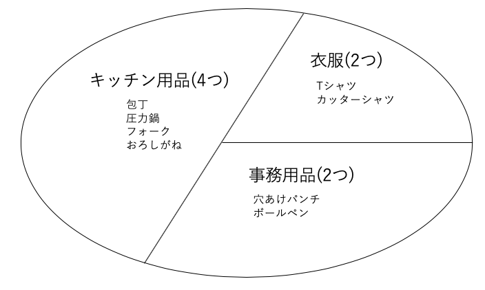

3-2 テーブルをグループに切り分ける
=============================

## 学習のポイント

* `GROUP BY`句は、テーブルをケーキのようにカット(切り分け)する

  * `集約関数`と`GROUP BY`句を使うことで、テーブルを「商品分類ごと」と「登録日ごと」などのように切り分けて集約できる

* `集約キー`に`NULL`が含まれる場合は、集計結果にも「`不明`」行(空行)として現れる

* `集約関数`と`GROUP BY`句を使う時には、次の4つに注意する

  1. `SELECT`句に書けるものが限定される

  1. `GROUP BY`句には`SELECT`句でつけた`列`の別名は使えない

  1. `GROUP BY`句は集約結果をソートしない

  1. `WHERE`句に`集約関数`を書くことはできない


## GROUP BY句

* これまでの`集約関数`は、テーブル全体を集約範囲とした

* `GROUP BY`句では、テーブルをいくつかのグループに切り分けて集約する

  -> 「商品分類ごと」や「登録日」ごとに集約する

  -> 「〜ごと」や「〜別」、「〜単位」という表現

```sql
SELECT <列名1>, <列名2>, <列名3>, ...
  FROM <テーブル名>
GROUP BY <列名1>, <列名2>, <列名3>, ...;
```

* 例)商品分類ごとの行数(=商品数)を数える

```sql
SELECT shohin_bunri, COUNT(*)
  FROM Shohin
GROUP BY shohin_bunri;
```

```sql
shohin_bunri | count
--------------+-------
キッチン用品 |     4
衣服         |     2
事務用品     |     2

```

* `GROUP BY`句を使っていない場合は、テーブル全体を１つのグループとして見なしていた

* `GROUP BY`句を使うことで、複数のグループに分けることができた

 -> テーブルを「カット」するイメージ



* `GROUP BY`句は、ケーキを切り分けるようにテーブルをカットしてグループ分けする

  -> `GROUP BY`句に指定する列のことを、`集約キー`や`グループ化列`と呼ぶ

  -> 複数の列をカンマ区切りで指定することができる


* `GROUP BY`句は、必ず`FROM`句の後ろ(`WHERE`句がある場合はさらにその後ろ)に置く必要がある


## 集約キーにNULLが含まれていた場合

* 仕入単価(shiire_tanka列)をキーとしてテーブルをカットする

```sql
SELECT shiire_tanka, COUNT(*)
  FROM Shohin
GROUP BY shiire_tanka;
```

```sql
shiire_tanka | count
--------------+-------
             |     2
         320 |     1
         500 |     1
        2800 |     2
        5000 |     1
         790 |     1
```

* 集約キーに`NULL`が含まれる場合、それらは一括して「`NULL`」という1つのグループに分類される


## WHERE句を使った場合のGROUP BYの動作

* `GROUP BY`句で`WHERE`句を用いる場合は、以下のような構文となる

```sql
SELECT <列名1>, <列名2>, <列名3>, ...
FROM <テーブル名>
WHERE
GROUP BY <列名1>, <列名2>, <列名3>,...;
```

* `WHERE`句で指定した条件で先にレコードが絞り込まれてから、集約が行われる

```sql
SELECT shiire_tanka, COUNT(*)
FROM Shohin
WHERE shohin_bunri = '衣服'
GROUP BY shiire_tanka;
```

```sql
shiire_tanka | count
--------------+-------
         500 |     1
        2800 |     1
```

* `GROUP BY`・`WHERE`句を併用するときの、`SELECT`文の実行順序

  `FROM` -> `WHERE` -> `GROUP BY` -> `SELECT`


## 集約関数とGROUP BY句にまつわるよくある間違い

### 1.SELECT句に余計な列を書いてしまう

* `COUNT`のような集約関数を使った場合、`SELECT`句に書くことができる要素が非常に限定される

* 集約関数を使うときは、以下の3つしか`SELECT`句に書くことができない

  1. `定数`：123、'テスト'などの数値や文字列などのSQL文の中に直に書く固定値のこと

  1. `集約関数`

  1. `GROUP BYで指定した列名(集約キー)`

* 間違いの例

  * 集約キー以外の列名を`SELECT`句に書いてしまう

  ```sql
  SELECT shohin_mei, shiire_tanka, COUNT(*)
  FROM Shohin
  GROUP BY shiire_tanka;
  ```

  ```sql
  ERROR:  column "shohin.shohin_mei" must appear in the GROUP BY clause or be used in an aggregate function
  LINE 1: SELECT shohin_mei, shiire_tanka, COUNT(*)
  ```

  * shohin_meiという列名は、GROUP BY句にはないので、これをSELECT句に書くことはできない

    -> 何らかのキーでグループ化した場合は、結果に出てくる1行あたりの単位もそのグループになっている

    -> 例)仕入単価でグループ化すれば、1行につき1つの仕入単価が現れるが、集約キーと商品名が一対一に対応しない


### GROUP BY句に列の別名を書いてしまう

* `SELECT`句に含めた項目には、「`AS`」というキーワードを使うことで、表示用の列名をつけることができる

* `GROUP BY`句でこの別名を使うと、`SELECT`文はエラーとなる

```sql
SELECT shohin_bunri AS ab, COUNT(*)
FROM Shohin
GROUP BY ab;
```

* PostgreSQLでは、結果が表示されるが、

  * DBMS内部でSQL文が実行される順序において、`SELECT`句が`GROUP BY`句よりも後に実行される

  * `GROUP BY`句の時点では、`SELECT`文でつけた別名を、DBMSはまだ知らない


### GROPU BY句は結果の順序をソートする？

* `GROUP BY`句を使って結果を選択したとき、表示される結果は`ランダム`な順番で表示される


### WHERE句に集約関数を書いてしまう

* 例)商品分類(shohin_bunri列)でグルーピングして行数を数えるとき、この数えた行数がちょうど2行のグループだけ選択する

```sql
SELECT shohin_bunri, COUNT(*)
FROM Shohin
WHERE COUNT(*) = 2
GROUP BY shohin_bunri;

-- この文はエラーとなる
```

* `COUNT`などの集約関数を書くことのできる場所は、`SELECT`句と`HAVING`句と`ORDER BY`句

  -> 「2行のグループだけ選択する」のような、グループに対する条件を指定するには、`HAVING`句を用いる


### DISTINCT句とGROUP BY句

* `DISTINCT`句と`GROUP BY`句は、その後に続く列について重複を排除する

```sql
--- DISTINCT句
SELECT DISTINCT shohin_bunri
FROM Shohin;

--- GROPU BY 句
SELECT shohin_bunri
FROM Shohin
GROUP BY shohin_bunri;
```

```sql
shohin_bunri
--------------
キッチン用品
衣服
事務用品
```

* `DISTINCT`：選択結果から重複を除外したい場合に使用

* `GROUP BY`：集約した結果を求めたい場合に使用


| 版 |   年月日  |
|----|----------|
|初版|2018/12/07|
