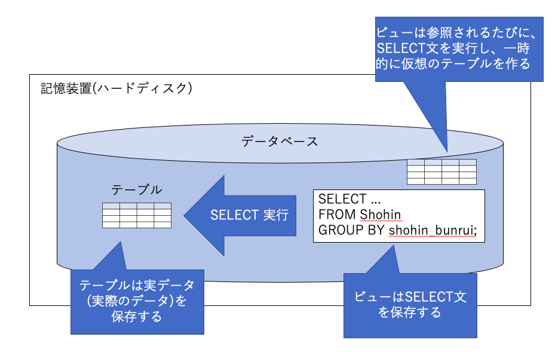

5-1 ビュー
=========

## 学習のポイント

* SQLの観点から見ると、ビューは「テーブルと同じもの」

  => 両者の違いは、テーブルの中には「実際のデータ」が保存され、ビューの中には「SELECT文」が保存されている

  => ビュー自体はデータを持たない

* ビューを使うと、必要なデータが複数のテーブルにまたがる場合などの複雑な集約を楽に行うことができる

* よく使うSELECT文をビューにしておくことで、使い回すことができる

* ビューを作るには、`CREATE VIEW`文を使い回す

* ビューには、「ORDER BY句は使えない」、「ビューに対する更新は不可能ではないが制限がある」という2つの制限事項がある

* ビューを削除するには、`DROP VIEW`文を使う


## ビューとテーブル

* `ビュー`：一言でいうと、「SQLの観点から見ると"テーブルと同じもの"」

  * SQL文の中で、`テーブル`なのか`ビュー`なのかを意識する必要はほとんど無い

  * SELECT文を組みあ立てる場合には、テーブルとビューの違いを気にしなくて良い

    => 更新の時だけは、違いを意識する必要がある


### `ビュー`と`テーブル`の違いは、「実際のデータを保存しているか否か」


#### テーブル

  * テーブルを作り、`INSERT`文でデータを格納すると、データベースに保存できる

  * このデータベースのデータが実際に保存されるのは、コンピュータ内の「記憶装置(ハードディスク)」

  * SELECT文でデータを検索しようとするときは、実際にはこの記憶装置からデータを引っ張り出している


#### ビュー

* データを記憶装置に保存しない

  => どこにもデータを保存していない

* 保存しているのは、「SELECT文」そのもの

* ビューからデータを取り出そうとするときに、ビューは内部的にそのSELECT文を実行し、一時的に仮想のテーブルを作る




### ビューのメリット

1. データを保存しないため、記憶装置の容量を節約できる

1. 頻繁に使うSELECT文を、ビューに保存しておくことで、使い回しがきく

  => 集計や条件が複雑で本体のSELECT文が大きくなればなるほど、ビューによる効率化の恩恵は大きなものとなる

  * ビューが含むデータは、元のテーブルと連動して自動的に最新の状態に更新される

    => 「ビューを参照する」という意味は、「そのSELECT文を実行する」という意味


## ビューの作り方

* ビューを作成するには、`CREATE VIEW`文を使う

```sql
CREATE VIEW ビュー名 (<ビューの列名1>, <ビューの列名2>, ...)
AS
<SELECT文>
```

* `AS`キーワードの後には、SELECT文を記述する

* SELECT文の列とビューの列は並び順で一致し、

  * SELECT文の最初の列：ビューの1番目の列

  * SELECT文の2番目の列：ビューの2番目の列

  となる

* ビューの列名は、ビュー名の後ろのリストで定義する


### 実際にビューを作ってみる

* ShohinSum(商品合計)という名前のビューを1つデータベース内に作る

```sql
CREATE VIEW ShohinSum (shohin_bunrui, cnt_shohin)
AS
SELECT shohin_bunrui, COUNT(*)
  FROM Shohin
GROUP BY shohin_bunrui;
```

* `AS`キーワードは、省略するとエラーになるので、記述する


### ビューを使う

* テーブルと同じく、SELECT文のFROM句に書くことができる

```sql
SELECT shohin_bunrui, cnt_shohin
  FROM ShohinSum;                /* FROM句にテーブルの代わりにビューを指定する */
```

```sql
shohin_bunrui | cnt_shohin
---------------+------------
キッチン用品  |          4
衣服          |          2
事務用品      |          2
```

* ShohinSumビューは、ビュー定義の本体(SELECT文)より、商品分類(shohin_bunrui)ごとに商品数(cnt_shohin)を集計した結果を保存している

* 一度ビューを作っておけば、後は簡単なSELECT文によって、いつでも集計結果を得られるようになっている

* Shohinテーブルのデータが更新されたら、自動的にビューも更新される

  => SELECT文を保存しているため

  => どんなSELECT文も、WHERE、GROUP BY、HAVINGも、「SELECT `*`」のように前列も、指定することが可能


### ビューに対する検索

* ビューをFROM句に指定した時の検索は、

  1. 最初に、ビューに定義されたSELECT文が実行され、

  1. その結果に対して、ビューをFROM句に指定したSELECT文が実行される

* ビューに対する検索では、常に2つ以上のSELECT文が実行される

  => ビューを元にさらにビューを作る(「多段ビュー」)を作ることも可能なため


* 例)ShohinSumビューからさらにShohinSumJimビューを作る

```sql
CREATE VIEW ShohinSumJim (shohin_bunrui, cnt_shohin)
AS
SELECT shohin_bunrui, cnt_shohin
  FROM ShohinSum
 WHERE shohin_bunrui = '事務用品';
```

```sql
/* ビューが作成されていることの確認 */
SELECT shohin_bunrui, cnt_shohin
  FROM ShohinSumJim;
```

```sql
shohin_bunrui | cnt_shohin
---------------+------------
事務用品      |          2
```

* 構文上は認められているが、ビューの上にビューを重ねるとパフォーマンスの低下を招くため、極力避ける


## ビューの制限事項① ビュー定義でのORDER BY句は使えない

* ビュー定義には、どんなSELECT文も使うことができるが、`ORDER BY`句だけは使えない

```sql
/* このようなビュー定義は不可 */
CREATE VIEW ShohinSum (shohin_bunrui, cnt_shohin)
AS
SELECT shohin_bunrui, COUNT(*)
FROM Shohin
GROUP BY shohin_bunrui
ORDER BY shohin_bunrui;   /* ビューの定義にORDER BY句を使用してはいけない */
```

* 理由：

  テーブルと同様、ビューについても「`行には順序が無い`」と定められているため


### ビューの制限事項② ビューに対する更新

* SELECTではビューをテーブルと全く同様に扱うことが可能であった

  => INSERT、DELETE、UPDATEについては、異なる

* ビューに対する更新は、

  「ビュー定義のSELECT文において、いくつかの条件を満たしている場合、ビューに対する更新が可能」

  1. SELECT句にDISTINCTが含まれていない

  1. FROM句に含まれるテーブルが1つだけである

    => テーブルの結合では、複数のテーブルをFROM句に書くことができる

    => それ以外は、集約に関するもの

  1. GROUP BY句を使用していない

  1. HAVING句を使用していない


### INSERTの場合

* 以下のSQL文はエラーを発生させる

  例)ShohinSumビューに対して、INSERTを行う

```sql
INSERT INTO ShohinSum VALUES ('電化製品', 5);
```  

* ShohinSumビューはGROUP BY句を使って元のテーブルを集約しているので、元のテーブルに合わせないといけない

  => GROUP BYされた部分はわかるが、それ以外のshohin_idなどのカラムの値がわからない


### ビューを更新できるケース

* 集約なしのビューならば、更新することができる

```sql
CREATE VIEW ShohinJim (shohin_id, shohin_mei, shohin_bunrui, hanbai_tanka, shiire_tanka, torokubi)
AS
SELECT *
  FROM Shohin
 WHERE shohin_bunrui = '事務用品';
```

* この事務用品の商品だけをフィルタして抜き出したShohinJimビューに対して、以下のINSERT文を実行することはできる

```sql
INSERT INTO ShohinJim VALUES ('0009', '印鑑', '事務用品', 95, 10, '2009-11-30');
```

※PostgreSQLでは、ビューの初期設定が読み取り専用のため、以下のようにビューの更新を許可する必要のあるバージョンが存在する

```sql
CREATE OR REPLACE RULE insert_rule
AS ON INSERT
TO ShohinJim DO INSTEAD
INSERT INTO Shohin VALUES (
            new.shohin_id,
            new.shohin_mei,
            new.shohin_bunrui,
            new.hanbai_tanka,
            new.shiire_tanka,
            new.torokubi);
```

* 行を追加できたかどうか、SELECT文で確認する

```sql
shop=# SELECT * FROM ShohinJim;
shohin_id |  shohin_mei  | shohin_bunrui | hanbai_tanka | shiire_tanka |  torokubi  
-----------+--------------+---------------+--------------+--------------+------------
0002      | 穴あけパンチ | 事務用品      |          500 |          320 | 2009-09-11
0008      | ボールペン   | 事務用品      |          100 |              | 2009-11-11
0009      | 印鑑         | 事務用品      |           95 |           10 | 2009-11-30
```

* 元のテーブルを、確認する

```sql
shop=# SELECT * FROM Shohin;
 shohin_id |   shohin_mei   | shohin_bunrui | hanbai_tanka | shiire_tanka |  torokubi  
-----------+----------------+---------------+--------------+--------------+------------
 0001      | Tシャツ        | 衣服          |         1000 |          500 | 2009-09-20
 0002      | 穴あけパンチ   | 事務用品      |          500 |          320 | 2009-09-11
 0003      | カッターシャツ | 衣服          |         4000 |         2800 |
 0004      | 包丁           | キッチン用品  |         3000 |         2800 | 2009-09-20
 0005      | 圧力鍋         | キッチン用品  |         6800 |         5000 | 2009-01-15
 0006      | フォーク       | キッチン用品  |          500 |              | 2009-09-20
 0007      | おろしがね     | キッチン用品  |          880 |          790 | 2008-04-28
 0008      | ボールペン     | 事務用品      |          100 |              | 2009-11-11
 0009      | 印鑑           | 事務用品      |           95 |           10 | 2009-11-30     /* 追加された行 */
```

* UPDATE文や、DELETE文も、通常のテーブルを扱うときと同じ構文で実行可能

  => ただし、元となるテーブルについている様々な制約(主キーやNOT NULLなど)も受ける事になる


## ビューを削除する

* ビューを削除するには、`DROP VIEW`文を使う

```sql
DROP VIEW ビュー名 (<ビューの列名1>, <ビューの列名2>, ...)
```

* 例)ShohinSumビューを削除するならば、以下のように記述する

```sql
DROP VIEW ShohinSum;
```

* PostgreSQLでは、多段ビューの作成元となっているビューを削除する場合に、それに依存するビューが存在するとエラーが生じる

  => 以下のように記述することで、依存するビューごと削除する`CASCADE`オプションをつけて実行する

```sql
DROP VIEW ShohinSum CASCADE;
```


| 版 |   年月日  |
|----|----------|
|初版|2018/12/24|
