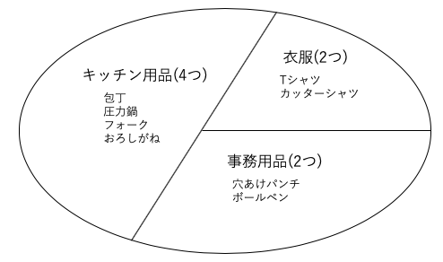

5-3 相関サブクエリ
================

## 学習のポイント

* 相関サブクエリは、小分けにしたグループ内での比較をするときに使う

* GROUP BY句と同じく、相関サブクエリも集合の「カット」という機能を持っている

* 相関サブクエリの結合条件は、サブクエリの中に書かないとエラーになる


## 普通のサブクエリと相関サブクエリの違い

* 「販売単価(hanbai_tanka)が、全体の平均の販売単価より高い商品」を選び出す・・・`サブクエリ`を使用する

* 「商品分類(shohin_bunrui)ごとに平均販売単価より高い商品」を選び出す・・・どうするか？


### 商品分類ごとに平均販売単価

* 分類が「キッチン用品」の商品群をサンプルに扱う

```sql
shohin_bunrui | shohin_mei | hanbai_tanka
---------------+------------+--------------
キッチン用品  | 包丁       |         3000
キッチン用品  | 圧力鍋     |         6800
キッチン用品  | フォーク   |          500
キッチン用品  | おろしがね |          880
```

  => これらの4商品の平均価格は

    ```
    (3000+6800+500+800)/4 = 2795(円)
    ```

  => このグループ内の平均価格より高い商品は、包丁と圧力鍋の2つ(これらが選択対象)

* 同じことを他のグループに対して繰り返す

  * 「衣服」の場合

    ```sql
    shohin_bunrui |   shohin_mei   | hanbai_tanka
    ---------------+----------------+--------------
    衣服          | Tシャツ        |         1000
    衣服          | カッターシャツ |         4000
    ```

    ```
    (1000+4000)/2 = 2500(円)
    ```

    => カッターシャツが選択対象

  * 「事務用品」の場合

    ```sql
    shohin_bunrui |  shohin_mei  | hanbai_tanka
   ---------------+--------------+--------------
    事務用品      | 穴あけパンチ |          500
    事務用品      | ボールペン   |          100
    ```

    ```
    (500+100)/2 = 300(円)
    ```

    => 穴あけパンチが選択対象

* 商品全体ではなく、グループごとに「小分けに」した上で、そのグループ内の平均金額と各商品の販売単価を比較する

  * 商品分類別に平均価格を求めること自体は、以下のSQL文で実行できる

  ```sql
  SELECT AVG(hanbai_tanka)
    FROM Shohin
  GROUP BY shohin_bunrui;
  ```

  * このSELECT文をそのままサブクエリとして書くと、サブクエリが3行返すので、エラーとなる

  ```sql
  /* エラーになる */
  SELECT shohin_id, shohin_mei, hanbai_tanka
  FROM Shohin
  WHERE hanbai_tanka > (SELECT AVG(hanbai_tanka)
                          FROM Shohin
                          GROUP BY shohin_bunrui);
  ```


### 相関サブクエリを使った解決方法

* 先ほどのSELECT文に1行追加することで、求める結果を得られる正しいSELECT文に変身させることができる

```sql
SELECT shohin_id, shohin_mei, hanbai_tanka
FROM Shohin AS S1
WHERE hanbai_tanka > (SELECT AVG(hanbai_tanka)
                        FROM Shohin AS S2
                       WHERE S1.shohin_bunrui = S2.shohin_bunrui  /* 追加した行 */
                        GROUP BY shohin_bunrui);
```

```sql
shohin_id |   shohin_mei   | hanbai_tanka
-----------+----------------+--------------
0002      | 穴あけパンチ   |          500
0003      | カッターシャツ |         4000
0004      | 包丁           |         3000
0005      | 圧力鍋         |         6800
```

* これにより、「事務用品」、「衣服」、「キッチン用品」の3つの分類について、各グループの平均販売単価より高く売られている商品が選択可能

* ポイント：「サブクエリ内に追加したWHERE句の条件」

  => 「各商品の販売単価と平均単価の比較を、**同じ商品分類の中** で行う」

* `S1`、`S2`というテーブルの別名は、比較対象となるテーブルが同じShohinテーブルだったので、区別するために必要

  * 相関サブクエリでは、このようなテーブルの別名を列名の前に`<テーブル名>.<列名>`の形式で記述する必要がある

* 相関サブクエリは、テーブル全体ではなく、テーブルの一部のレコード集合に限定した比較をしたい場合に使う

  => 「バインドする」や「制限する」という言い方をする(「商品分類で縛って」平均単価との比較を行う)


## 相関サブクエリも、結局は集合のカットをしている

* 相関サブクエリは、GROUP BY句と同じく、集合の「カット」という機能を持っている

* 以下の図は、GROUP BY句と相関サブクエリの概要図

  * GROUP BY：テーブルというレコードの集合を、商品分類を基準に切り分けた

    

  * 相関サブクエリ：それぞれの商品分類の中で平均販売単価が計算され、それが商品テーブルの各レコードと比較される

    => 相関サブクエリは実質的に1行しか返していない

    

* 相関サブクエリが実行される時のDBMS内部の動作イメージは、以下の通りとなる


  => 商品分類が変わると、比較する平均単価も変わる。このようにして各商品の販売単価と平均単価が比較される


## 結合条件は必ずサブクエリの中に書く

* 「縛る」ための結合条件を、サブクエリの内側ではなく、外側に書いてしまう

  => エラーが発生する

```sql
SELECT shohin_id, shohin_mei, hanbai_tanka
FROM Shohin AS S1
WHERE S1.shohin_bunrui = S2.shohin_bunrui    /* 「縛る」条件をサブクエリの外側に移した */
AND hanbai_tanka > (SELECT AVG(hanbai_tanka)
                      FROM Shohin AS S2
                    GROUP BY shohin_bunrui);
```

* このSQLの場合、

  * 相関名のスコープ：「テーブルの別名」の「有効範囲」

  * このスコープは、サブクエリ内部でつけられた場合、そのサブクエリ内でしか使うことができない

  => 「内から外は見えるが、外から内は見えない」

* SQLは内側のサブクエリから外側へ向かって実行される

  => サブクエリが実行され終わった時には、実行結果だけが残って、抽出元となったテーブル`S2`は消えて無くなる

  => サブクエリの外側が実行されるタイミングでは、もう`S2`は存在し無くなっていて、「そんな名前のテーブルはありません」というエラーが生じる


| 版 |   年月日  |
|----|----------|
|初版|2018/12/26|
