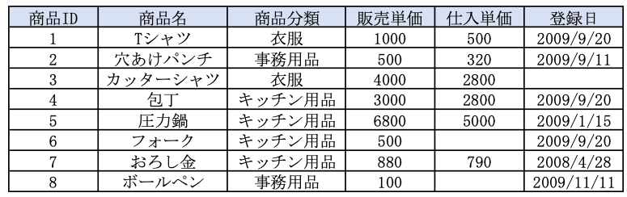

1-4 テーブルの作成
================

## 学習のポイント

* テーブルは`CREATE TABLE`文で作成する

* テーブルや列の名前に使って良い文字は決まっている

* 列には、`データ型`(整数型、文字列型、日付型など)を指定する

* テーブルには、`制約`(主キー制約、`NOT NULL`制約など)を設定できる


## 作成するテーブルの内容




## データベースの作成(CREATE DATABASE文)

* テーブルを作成するには、テーブルを格納するためのデータベースを作成する

* RDBMS上にデータベースを作成するには、`CREATE DATEABASE文`というSQL文を実行する

```sql
CREATE DATABASE <データベース名>;
```

* 例

```sql
CREATE DATABASE shop;
```

※データベース名、テーブルや列などの名前は半角文字で書く


## テーブルの作成(CREATE TABLE文)

* `CREATE TABLE文`：データベースの中にテーブルをその中に作成する

```sql
CREATE TABLE <テーブル名>
(<列名1> <データ型> <この列の制約>,
<列名2> <データ型> <この列の制約>,
<列名3> <データ型> <この列の制約>,
<列名4> <データ型> <この列の制約>,

<このテーブルの制約1>, <このテーブルの制約2>, ...)
```

* `<列名1>`、`<列名2>`、...という列を持つ

* `<テーブル名>`という名前のテーブルを作っている

* 列に対する「データ型」の指定は必須

  * 必要に応じて、列に「制約」を設定する

  * 列の定義ごとに制約を設定できる

  * 最後にまとめて記述することもできる

* 例

```sql
CREATE TABLE Shohin
(shohin_id     CHAR(4)       NOT NULL,
 shohin_mei    VARCHAR(100)  NOT NULL,
 shohin_bunri  VARCHAR(32)   NOT NULL,
 hanbai_tanka  INTEGER       ,
 shiire_tanka  INTEGER       ,
 torokubi      DATE          ,
 PRIMARY KEY (shohin_id));
```


## 命名ルール

* データベースやテーブル、列といった名前に使える文字は

  * 半角文字のアルファベット

  * 数字

  * アンダーバー`_`

  に限られる

* 名前の最初には、

  * 必ず **半角のアルファベットを使う**

* 1つのデータベースの中に同じ名前のテーブルを2つ以上作ることは不可能

* 1つのテーブル内に同じ名前の列を2つ以上作ることは不可能


## データ型の指定

* `Shohin`テーブルが持つ列を、`CREATE TABLE Shohin()`のカッコ`()`の中に記述する

* 列の右隣には、その列の`データ型`を宣言する

  ->全ての列に必ず指定する

* データ型はデータの種類を表し、データ型に反するデータを入れることはできない

* 最も基本的なデータ型は、次の4つ

  * `INTEGER型`：整数を入れる列に指定するデータ型(数値型)

    ->小数は入れられない

  * `CHAR型`：文字列を入れる列に指定するデータ型(文字列型)

    * `CHAR(10)`、`CHAR(200)`のように、列の中に入れることのできる文字列の長さ(最大長)を`カッコ()`で指定

    * 最大長を超える長さの文字列は、入らない

    * `固定長文字列`という形式で文字列が格納される

      ->列に入れる文字列が最大長に満たない場合、文字列が最大長になるまで空きを半角スペースで埋める(`abc_____`のようになる)

    * テーブルに格納した文字列については、大文字・小文字が区別される

  * `VARCHAR型`：文字列を入れる列に指定するデータ型(文字列型)

    * 列の中に入れることのできる文字列の長さ(最大長)を`カッコ()`で指定する

    * `可変長文字列`という形式で文字列が格納される

      ->文字列が最大長に満たなくても、半角スペースで埋めたりしない(`abc`のようになる)

    * 格納した文字列については、大文字・小文字が区別される

  * `DATE型`：日付(年月日)を入れる列に指定するデータ型(日付型)


## 制約の設定

* `制約`：データ型の他に、列に入れるデータに制限や条件を追加する機能

* 制約には、以下の例がある

  * `NOT NULL制約`：無記入でなく、必ずデータが入っていなければならない項目

  * `主キー制約`：１つの行を特定できる`キー`(特定のデータを指定する時に使う列の組み合わせ)によって取り出す

    ->特定のデータ(行)を取り出すことが可能

    ->重複した値が入っていると、特定の商品のデータのみを取り出すことができない(1つの行を特定できない)


| 版 |   年月日  |
|----|----------|
|初版|2018/11/25|
