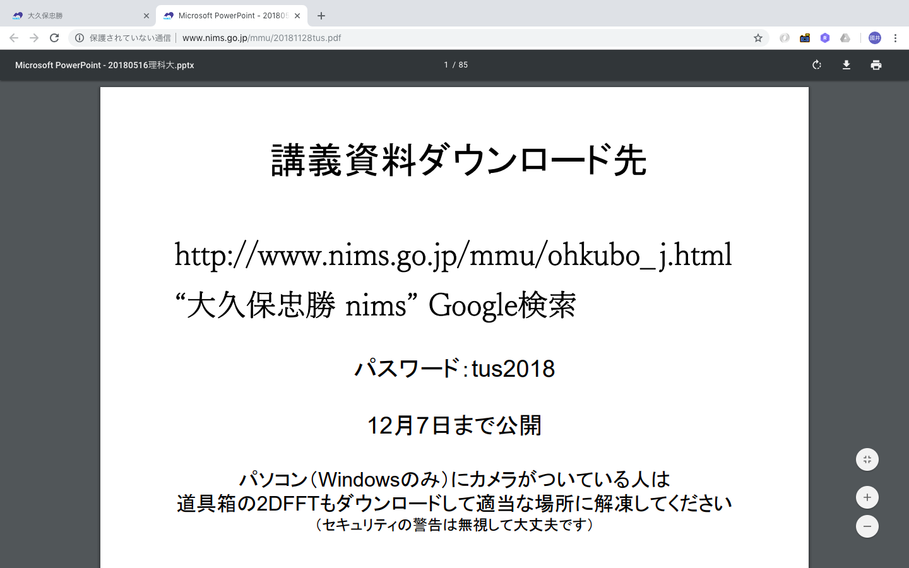

2-1 SELECT文の基本
=================

## 学習のポイント

* テーブルからデータを選択するには、`SELECT文`を用いる

* 列には`表示用の別名`をつけることができる

* `SELECT`句には、`定数`や`式`を書くことができる

* `DISTINCT`キーワードを指定すると、行の重複を省くことができる

* SQL文の中にメモ書きとして、「コメント」をつけることができる

* `WHERE`句により、検索条件に合う行をテーブルから選択することができる


## 列を出力する

* `SELECT`文：テーブルからデータを取り出す時に使う

  -> 「テーブルにあるデータから必要なものだけを選択(SELECT)する」

  * `問い合わせ(クエリ)`：SELECT文で必要なデータを検索し、取り出すこと

* `SELECT`文は、以下の構文を用いる

```sql
SELECT <列名>, ...
FROM <テーブル名>;
```

* `SELECT`文には、

  * `SELECT`句：テーブルから出力したい列の名前

  * `FROM`句：データを取り出すテーブルの名前

  を指定する

* `SELECT`句では、複数の列を出力する時には`カンマ(,)`で区切って書き並べる

  -> 結果の列は`SELECT`句と同じ順番で並ぶ

* 例)`shohin_id`、`shohin_mei`、`shiire_tanka`列を出力

```sql
SELECT shohin_id, shohin_mei, shiire_tanka
FROM Shohin;
```

```sql
shohin_id| shohin_mei |shiire_tanka
---------+------------+------------
0001     |Tシャツ      |         500
0002     |穴あけパンチ  |         320
0003     |カッターシャツ|        2800
0004     |包丁         |        2800
0005     |圧力鍋       |        5000
0006     |フォーク      |
0007     |おろしがね    |         790
0008     |ボールペン    |
```


## 全ての列を出力する

* 全ての列を出力するには、全ての列を意味する`アスタリスク(*)`を使うことができる

* アスタリスクを使うと、結果の列の並び順を指定することはできない

  -> `CREATE TABLE`文で定義した時の順番で列が並ぶ

```sql
SELECT *
FROM <テーブル名>;
```

* 例)Shohinテーブルの全ての列を出力

```sql
SELECT *
FROM Shohin;
```

```sql
shohin_id| shohin_mei|shohin_bunri |hanbai_tanka|shiire_tanka|torokubi
---------+-----------+-------------+------------+------------+----------
0001     |Tシャツ     |衣服          |        1000|         500|2009-09-20
0002     |穴あけパンチ |事務用品       |        500|          320|2009-09-11
0003     |カッターシャツ|衣服         |        4000|         2800|
0004     |包丁        |キッチン用品   |        3000|         2800|2009-09-20
0005     |圧力鍋      |キッチン用品   |        6800|         5000|2009-01-15
0006     |フォーク     |キッチン用品   |        500|             |2009-09-20
0007     |おろしがね   |キッチン用品   |        880|          790|2008-04-28
0008     |ボールペン   |事務用品      |         100|             |2009-11-11
```


## 列に別名をつける

* `AS`キーワード：列に別名をつける

```sql
SELECT shohin_id    AS id,
       shohin_mei   AS namae,
       shiire_tanka AS tanka
  FROM Shohin;
```

```sql
 id |    namae   |tanka
----+------------+-----
0001|Tシャツ      |  500
0002|穴あけパンチ  |  320
0003|カッターシャツ|  2800
0004|包丁        |  2800
0005|圧力鍋       |  5000
0006|フォーク     |
0007|おろしがね   |   790
0008|ボールペン   |
```

* 別名には、日本語を使うことができる

  -> 別名を`ダブルクオーテーション("")`で囲む

```sql
商品ID|    商品名    |仕入単価
------+------------+-------
0001  |Tシャツ      |    500
0002  |穴あけパンチ  |    320
0003  |カッターシャツ|    2800
0004  |包丁         |   2800
0005  |圧力鍋       |    5000
0006  |フォーク     |
0007  |おろしがね    |    790
0008  |ボールペン    |
```


## 定数の出力

* `SELECT`句には、列名だけでなく`定数`を書くことができる

* `文字列定数`と`日付定数`は、`シングルクオーテーション('')`で囲む

* 例)

  * 1列目に'商品'という文字列の定数(`文字列定数`)

  * 2列目に38という数値の定数(`数値定数`)

  * 3列目に'2009-02-24'とう日付の定数(`日付定数`)

  を`SELECT`句に記述して、shohin_id列とshohin_mei列を一緒に出力する

```sql
SELECT '商品' AS mojiretsu, 38 AS kazu, '2009-02-24' AS hizuke,
       shohin_id, shohin_mei
  FROM Shohin;
```

```sql
mojiretsu|kazu|  hizuke  |shohin_id| shohin_mei
---------+----+----------+---------+------------
商品      |38  |2009-02-24|0001     |Tシャツ
商品      |38  |2009-02-24|0002     |穴あけパンチ
商品      |38  |2009-02-24|0003     |カッターシャツ
商品      |38  |2009-02-24|0004     |包丁
商品      |38  |2009-02-24|0005     |圧力鍋
商品      |38  |2009-02-24|0006     |フォーク
商品      |38  |2009-02-24|0007     |おろしがね
商品      |38  |2009-02-24|0008     |ボールペン
```


## 結果から重複行を省く

* Shohinテーブルにどんな商品分類があるのかを知るには、重複を省いて結果を出力することがベスト

* `DISTINCT`；重複行を省いて結果を得たい時に用いる


```sql
SELECT DISTINCT shohin_bunri
  FROM Shohin;
```

```sql
shohin_bunri
------------
衣服
事務用品
キッチン用品
```

* `DISTINCT`を使った時も、`NULL`も1種類のデータとして扱われる

  -> 複数行に`NULL`があった場合には、1つの`NULL`にまとめられる

* 例

  NULLが登録されているshiire_tanka列に対して、DISTINCTをつけた文

```sql
SELECT DISTINCT shiire_tanka
  FROM Shohin;
```

```sql
shiire_tanka
------------
500
320
2800
5000
        /* NULLも消えずに残る */
790
```

* `DISTINCT`は、複数の列の前にも置くことができる

  -> 複数の列を組み合わせてもなお、重複する行が1列にまとめられる

```sql
SELECT DISTINCT shohin_bunri, torokubi
  FROM Shohin;
```

```sql
衣服|2009-09-20
事務用品|2009-09-11
衣服|
キッチン用品|2009-09-20
キッチン用品|2009-01-15
キッチン用品|2008-04-28
事務用品|2009-11-11
```

* `DISTINCT`キーワードは先頭の列名にしか書けない

  ->`torokubi, DISTINCT shohin_bunri`などは不可能


## WHERE句による行の選択

* `WHERE`句：`SELECT`文で、選択したい行の条件を指定する

  * 「ある列の値がこの文字列と等しい」、「ある列の値がこの数値以上」などの条件を指定することができる

  * それらを含む`SELECT`文を実行すると、その条件に合う行だけが選択される

```sql
SELECT <列名>, ...
FROM <テーブル名>
WHERE <条件式>;
```

* 例

  Shohinテーブルから「商品分類(shohin_bunri)が'衣服'」の行を選択

```sql
SELECT shohin_mei, shohin_bunri
FROM Shohin
WHERE shohin_bunri = '衣服';
```

```sql
 shohin_mei |shohin_bunri
------------+------------
Tシャツ      |衣服
カッターシャツ|衣服
```

* `WHERE`句にある「`shohin_bunri = '衣服'`」が検索条件を表す式(`条件式`)

* 「`=`」は両辺が等しいかどうかを比較する記号

* 選択された行から`SELECT`句で指定されている`shohin_mei`列と`shohin_bunri`列を出力

  1. `WHERE`句で指定した条件に合う行を選択

  1. その後、`SELECT`句で指定された列を出力する

  という流れ




### 特定の列のみを出力する場合

```sql
SELECT shohin_mei
FROM Shohin
WHERE shohin_bunri = '衣服';
```

```sql
 shohin_mei
------------
Tシャツ
カッターシャツ
```

* SQL句では、句の記述順が決まっているので、勝手に変えることができない

  * `WHERE`句は、必ず`FROM`句の直後に書く


## コメントの書き方

### コメントの種類

* 1行コメント：

  * `--`の後に記述する

  * 1行の中でしか書くことができない

  * 例)

  ```sql
  -- このSELECT文は、結果から重複を無くします
  SELECT DISTINCT shohin_id, shiire_tanka
  FROM Shohin;
  ```

* 複数行コメント：

  * `/*`と`*/`で囲った中に記述する

  * 複数行にわたって書くことができる

  * 例)

  ```sql
  /* このSELECT文は、
    結果から重複をなくします。 */
  SELECT DISTINCT shohin_id, shiire_tanka
  FROM Shohin;
  ```


### SQL文の途中に差し込むコメント

* 1行コメント

  ```sql
  SELECT DISTINCT shohin_id, shiire_tanka
  -- このSELECT文は、結果から重複を無くします。
  FROM Shohin;
  ```


* 複数行コメント

  ```sql
  SELECT DISTINCT shohin_id, shiire_tanka
  /* このSELECT文は、
    結果から重複を無くします。 */
  FROM Shohin;
  ```

* これらの`SELECT`文の動作は、コメントのない場合と全く変わらない

* コメントは、`SELECT`文に限らず、どのSQL文にもつけることができる


| 版 |   年月日  |
|----|----------|
|初版|2018/11/30|
