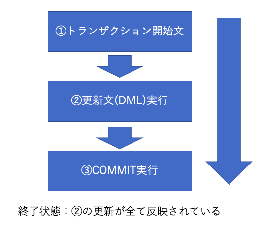
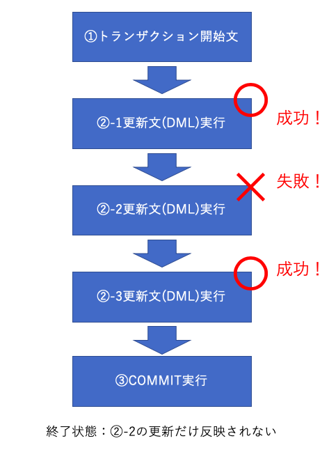

4-4 トランザクション
=================

## 学習のポイント

* `トランザクション`とは、セット(ひとまとまり)で実行されるべき1つ以上の更新処理の集まりのこと

* `トランザクション`を使用すれば、データベースにおけるデータ更新の確定や取り消しなどを管理することができる

* `トランザクション`の処理を終わらせるコマンドとして、`COMMIT`(処理の確定)、`ROLLBACK`(処理の取り消し)の2つがある

* DBMSの`トランザクション`には、

  * 原始性(Atomicity)

  * 一貫性(Consistency)

  * 独立性(Isolation)

  * 永続性(Durability)

  という4つの守らなけらばならない約束事がある

  => これらの4つの頭文字を取って、`ACID特性`と呼ぶ


## トランザクションとは何か

* データベースに対する1つ以上の更新をまとめて呼ぶ時の名称

  * 更新や作成は、一般的に1回の操作で終わることはなく、複数の操作をまとめて連続的に行うことが多い

* 例)カッターシャツの販売単価を1000円下げて、Tシャツの販売単価を1000円上げる

```sql
/* カッターシャツの販売単価を1000円下げる */
UPDATE Shohin
   SET hanbai_tanka = hanbai_tanka - 1000
 WHERE shohin_mei = 'カッターシャツ';

/* Tシャツの販売単価を1000円上げる */
UPDATE Shohin
   SET hanbai_tanka = hanbai_tanka + 1000
 WHERE shohin_mei = 'Tシャツ';
```

* これらの処理は、必ずセットで行う

* このように、「ワンセットで行われるべき更新の集合」は、必ず「トランザクション」としてひとまとめに扱う必要がある

* 1つのトランザクションに「どの程度の数の更新処理を含むか」あるいは「どんな処理を含むか」という点についての固定的な基準はDBMS側にない

  => ユーザーの要求に従って決められる


## トランザクションを作るには

* DBMS内でトランザクションを作るには、次の構文でSQL文を書く

```sql
トランザクション開始文;

  DML文1;
  DML文2;
  DML文3;
  /* 省略 */

トランザクション終了文(COMMIT または ROLLBACK);
```

* 「トランザクション開始文」と「トランザクション終了文」で更新を行うDML文(`INSERT`/`UPDATE`/`DELETE`文)を囲む

* 注意点として、DBMSごとに「トランザクション開始文」が異なる

```sql
/* PostgreSQL */
BEGIN TRANSACTION;

  -- カッターシャツの販売単価を1000円値引き
  UPDATE Shohin
     SET hanbai_tanka = hanbai_tanka - 1000
   WHERE shohin_mei = 'カッターシャツ';

   -- Tシャツの販売単価を1000円値上げ
   UPDATE Shohin
      SET hanbai_tanka = hanbai_tanka + 1000
    WHERE shohin_mei = 'Tシャツ';

COMMIT;
```

```sql
/* MySQL */
START TRANSACTION;

  -- カッターシャツの販売単価を1000円値引き
  UPDATE Shohin
     SET hanbai_tanka = hanbai_tanka - 1000
   WHERE shohin_mei = 'カッターシャツ';

   -- Tシャツの販売単価を1000円値上げ
   UPDATE Shohin
      SET hanbai_tanka = hanbai_tanka + 1000
    WHERE shohin_mei = 'Tシャツ';

COMMIT;
```

* トランザクションが暗黙に開始されるため、「トランザクション開始文」が省略されているDBMSもある

* トランザクションの終わりは、ユーザが明示的に区切る必要がある


### COMMIT 処理の確定

* `COMMIT`：トランザクションに含まれていた処理による変更を全て反映して、トランザクションを終了するコマンド

  => ファイルでいうところの、「上書き保存」

  * 一度`コミット`したら、トランザクションの開始前の状態に戻すことができない

    => コミットする前に、本当に変更を確定して良いか確認する

  * もし間違えた変更を含むトランザクションを確定した場合、またテーブルを作り直す必要がある

    => 特に、`DELETE`文の`COMMIT`には細心の注意を持ってやる




### ROLLBACK 処理の取り消し

* `ROLLBACK`：トランザクションに含まれていた処理による変更を全て破棄して、トランザクションを終了するコマンド

  => ファイルでいうところの、「保存せずに終了」

  * ロールバックしたら、データベースの状態はトランザクションを開始する前の状態に戻る

    => 一般的に、コミットと異なりロールバックが大きなデータ損失に繋がることはない


* 例)

```sql
/* PostgreSQL */
BEGIN TRANSACTION;

-- カッターシャツの販売単価を1000円値引き
UPDATE Shohin
   SET hanbai_tanka = hanbai_tanka - 1000
 WHERE shohin_mei = 'カッターシャツ';

 -- Tシャツの販売単価を1000円値上げ
 UPDATE Shohin
    SET hanbai_tanka = hanbai_tanka + 1000
  WHERE shohin_mei = 'Tシャツ';

ROLLBACK;
```

* 上の例は、実行してもデータに一切変更が生じない

  => 最終行の「`ROLLBACK`」によって、処理が全てキャンセルされるため


## ACID特性

* DBMSのトランザクションには、守るべき4つの大事な約束事が標準規格によって取り決められている

  => 頭文字を取って、「`ACID特性`」と呼ばれている

* これらの約束は、どんなDBMSも守らねばならない一般的なルール


### 原子性(Atomicity)

* トランザクションが終わったとき、そこに含まれていた更新処理は、全て実行されるか、または全て実行されない状態で終わることを保証する

* 「オール・オア・ナッシング」とも呼ばれる

* 例)カッターシャツの値引きは行われたが、Tシャツの値上げは行われていない状態でトランザクションは終了しない

  * この場合のトランザクションの終了状態は、

    1. 2つとも実行される(`COMMIT`)

    1. 2つとも実行されない(`ROLLBACK`)

    の二者択一

* 原子性が重要であるかは、トランザクションが中途半端な終わり方をすることがあり得る場合を考えるとわかる

  => ユーザが2つの`UPDATE`文を1つのトランザクションとして定義したのに、DBMSが気分によってその片方しか実行されないと、業務に支障をきたす


### 一貫性(Consistency)

* トランザクションに含まれる処理は、データベースにあらかじめ設定された規約(主キーやNOT NULL制約)を満たすという性質

* 例)NOT NULL制約の付加された例をNULLに更新したり、主キー制約違反のレコードを挿入するようなSQL文はエラーになり、実行できない

  => これらのSQLを、「ロールバックされた」という

  => そのようなSQLは、一文単位で実行が取り消され、実行されなかったのと同じことになる

* 「一貫性」は、「整合性」とも呼ぶ




### 独立性(Isolation)

* トランザクション同士が互いに干渉を受け入れないことを保証する性質

* この性質によって、トランザクション同士が入れ子になることはない

* あるトランザクションによる変更は、トランザクション終了時までには、別のトランザクションから隠蔽される

  => あるトランザクションがテーブルにレコードを追加していったとしても、

    コミットされるまでは、他のトランザクションからはその新規に追加されたレコードは「見えない」状態にある


### 永続性(Durability)

* トランザクションが(コミットにせよロールバックにせよ)終了したら、その時点でのデータの状態が保存されることを保証する性質

* たとえシステム障害が発生してデータが失われたとしても、データベースは何らかの手段でこれを復旧させる手段を持たないといけない

* 永続性がないと、無事にトランアクションをコミットして終了させても、システムに障害が発生してデータが全部消えて最初から処理を全部やり直す必要がある

* 永続性を保証する方法は、主にトランザクションの実行記録などをディスクなどに保存(このような実行記録を「ログ」と呼ぶ)しておき、

  障害が起きた際には、このログを使って障害前の状態に復旧する


| 版 |   年月日  |
|----|----------|
|初版|2018/12/21|
