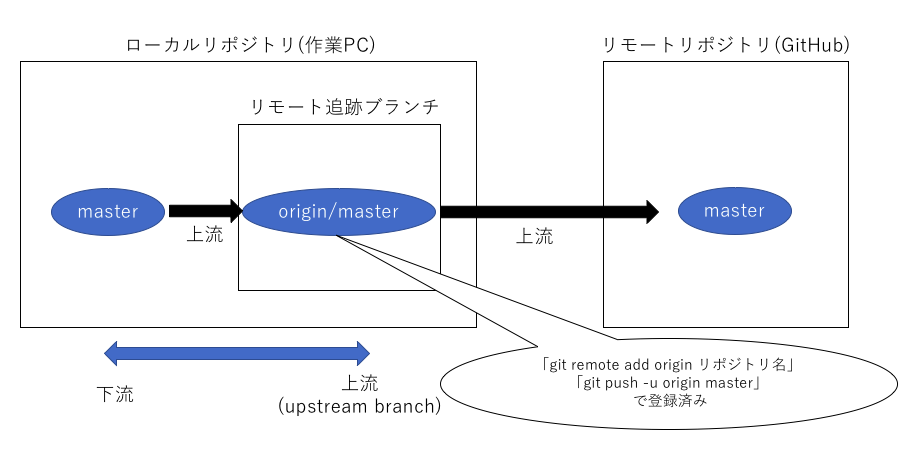
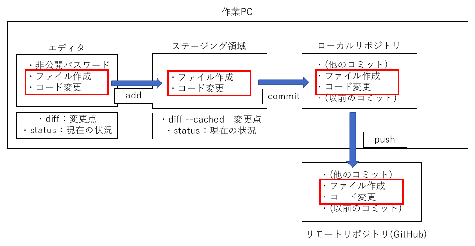

## Gitの仕組み
  - **リポジトリ**  
    ファイルやディレクトリの状態を記録する場所

  - **ステージング領域**  
    編集内容を次回のコミットに含めるようにgitに指示した際に、  
    これらの内容を保持する領域のこと。編集内容とリポジトリとの間にある緩衝地帯  
    →ステージング領域にないファイルは、コミットを実行しても、  
    新しいバージョンとして登録されない  

  - **ローカルリポジトリ**  
    開発者が作業用PCに配置するためのリポジトリ  
    作業用PC上で編集作業を行い、ファイルの修正履歴を管理する  
    →同じ情報を持ったリポジトリを、開発者ごとに持つことができる  
    例)Git、CVS、Subversionなど

  - **リモートリポジトリ**  
    サーバー上に配置して、複数人で共有管理するためのリポジトリ  
    サーバー上で編集・修正履歴を管理する  
    →ローカルリポジトリから情報をもらう必要がある  
     例)GitHub、BitBucketなど

  - **リモート追跡ブランチ**  
    ローカルリポジトリにある、リモートブランチと結びついているブランチ  
    直接コミットすることは不可能だが、ローカルでのコミットを  
    `git push`でリモートに送る際に、Gitがpush先の  
    リモートリポジトリとブランチを判断する。

## GitHubの仕組み
  - **分散型のバージョン管理**  
    各ユーザーがリモートリポジトリから最新のコードをローカルリポジトリに複製する  
    →各ユーザーが最新のコードに対して編集をすることができる

  - **リモートリポジトリに接続できていなくても開発可能**  
    リモートリポジトリからローカルリポジトリに複製しているため、ローカルリポジトリのみでの編集が可能  
    →ただし、接続できるまでは何個もコミットを作ってはならない(コンフリクトの原因)

  - **リポジトリが削除されても、ソースコードが残る**  
    リモートリポジトリが削除された場合は、ローカルリポジトリをリモートリポジトリに登録すればよく、
    ローカルリポジトリが削除された場合は、リモートリポジトリからcloneすれば最新のソースコードの共有が可能  
    →集中型のバージョン管理だと、一度リポジトリを削除すると二度と最新のソースコードを入手することが不可能

## Gitの基本的な操作
### ローカルリポジトリでの操作
#### gitのコマンド
  - `git init`  
    **ローカルリポジトリの初期化と作成**  
    実行後は.gitディレクトリが作成され、現在のディレクトリ以下を管理するファイルが作成される

  - `git status`  
    **リポジトリの状態を確認**  
    現在のコミット状況や変更ファイルの一覧などを確認・表示する  
    Gitのワークツリーやリポジトリに対して何らかの操作を行うと、表示が変化してゆく

  - `git diff`  
    **変更差分を確認**  
    現在のワークツリーとステージ領域の差分を確認する  
    → `git diff HEAD`：ワークツリーとHEAD(現在ブランチの最新コミット)との差分  
    → `git diff --cached`：ステージ領域にある内容とHEADとの差分

  - `git add [ファイル名]`  
    **ステージ領域へファイルを追加**  
    編集したソースコードを、Gitリポジトリの管理対象とするため、ステージ領域と呼ばれる場所にファイルを登録する。

  - `git commit`  
    **リポジトリの歴史を記録**  
    ステージ領域に登録されているファイルを、実際にローカルリポジトリに変更内容を登録する。  
    → `git commit -m "メッセージ内容"`：一行程度のコミットメッセージをつけてコミットする  
    → `git commit`：vim(エディタ)が開き、詳細にコミットメッセージを記述できる。

 - `git log`  
   **コミットログを確認**  
   リポジトリにコミットされたログを確認できる。  
   →誰がいつコミットやマージをして、どのような差分が発生したのか、など

#### ブランチの操作
  ブランチは、別々の作業を並行して行うために利用する。それぞれのブランチでは全く別の作業を同時に行うことができる。
  作業が終了したら、masterブランチにマージする。

  - `統合ブランチ`  
    **リリース版が何度でも作成可能なようにしておく為のブランチ**  
    トピックブランチの分岐元として使用する為、安定したブランチとなっている。  
    クライアント側で表示されているものを扱う為、直接このブランチにpushすることは禁止されている。  
    →`master`ブランチ  
      Gitでデフォルトで作成されるブランチ。基本的には、このブランチを中心にして開発が進められる。

  - `トピックブランチ`  
    **1つのテーマに集中して作業する為のブランチ**  
    機能修正やバグ修正といった課題に対して、作業を行う為に作成するブランチ。  
    課題ごとにトピックブランチが作成される為、課題の数だけトピックブランチが存在する。  
    作業が完了したら、統合ブランチに取り込む。GitHubならば取り込む前に、プルリクという操作を行うことが多い。

  - `git branch`  
    **ブランチを一覧表示**  
    ブランチ名の一覧を表示するとともに、現在のブランチを確認することができる。  
    →`git branch [新しいブランチ]`：現在いるブランチから派生して新しいブランチを作成

  - `git checkout [ブランチ名]`  
    **ブランチの切り替え**  
    操作対象とするブランチを切り替える。  
    → `git checkokut -b [新しいブランチ名]`：新しいブランチを作成し、切り替える  
    → `git checkout -d [特定のブランチ名]`：特定のブランチを削除する。チームで作業している場合は、  
                                         基本的にトピックブランチは削除するので、この操作は行わないことが多い。

  - `git merge [トピックブランチ名]`  
    **ブランチをマージ**  
    トピックブランチで作業していた内容を、統合ブランチにマージする  
    →統合ブランチに切り替えてから行う  

  **以下、ブランチの概略図**
  

### リモートリポジトリでの操作
#### リモートリポジトリの基本
 - `origin`  
   リモートリポジトリの場所の別名。URL(`git@github.com:[name]/[repository].git`)のこと

#### ローカルリポジトリとリモートリポジトリを繋ぐ
 - `origin/[ブランチ名]`  
   リモートリポジトリにあるブランチを追跡するためのブランチ。リモート追跡ブランチという  
   ただし、このブランチはローカルリポジトリにあることに注意する。

 - `upstream branch`  
   リモート側として対応付いたブランチ。`origin/[ブランチ名]`のこと。
   ローカルでブランチを作成して、リモートに変更内容をpushする際には、  
   必ず`upstream branch`を指定しなければならない  
   →`git push -u origin master`：`upstream branch`の指定。`-u`は`--set-upstream`の省略コマンド

  **以下、ローカルリポジトリとリモートリポジトリの概略図**
  

#### リモートリポジトリへの送信
  - `git push`  
    **リモートリポジトリへ送信**  
    現在のブランチのローカルリポジトリの内容を、リモートリポジトリに送信する  

    → `git push -u origin [現在のブランチ名]`：
    初回push時に必要。ローカルリポジトリの現在の上流を、  
    originリポジトリ(リモートリポジトリの場所)の[現在のブランチ名]に指定する  
    次回からは、`git push`のみでもpushは可能となる。

- `git remote add origin [git@github.com:"ユーザー名/リポジトリ名.git"]`  
  **リモートリポジトリを登録**  
  既に作成したローカルリポジトリを、リモートリポジトリとして登録する  
  →ブラウザ上でリモートリポジトリを作成し、そこで得た`git@github.com:[ユーザー名]/[リポジトリ名].git`を入力する

  **以下、ローカルリポジトリ・リモートリポジトリの変更の概略図**
  

#### リモートリポジトリから取得
 - `git pull`  
   **最新のリモートリポジトリブランチを取得**  
   他のリポジトリで加えられた変更点を、自分のローカルリポジトリにマージする。
   １つの課題に対して他の開発者が携わっている為、こまめに行う。  
   → `git pull origin [取得するブランチ名]`：取得するブランチから、自分のローカルリポジトリにマージする。

 - `git clone git@github.com:[ユーザー名]/[リポジトリ名].git`  
   **リモートリポジトリを取得**  
   リモートリポジトリを取得して、ローカルリポジトリに反映させる  
   →clone直後は、masterブランチになっていることに注意する。

   **以下、リモートリポジトリからの取得の概略図**
   

  |作成日時|更新|
  |:--|:--:|
  |2018年6月26日|初版|
