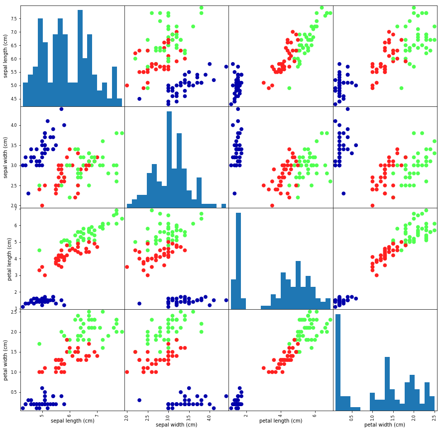

07 最初のアプリケーション：アイリスのクラス分類
=======================================

* 例)アマチュア園芸家が、見つけたアイリスの花の種別を分類したいとする

    * 彼女は、集めたアイリスについて、花弁の「長さ」、「幅」、ガクの「長さ」と「幅」を㎝単位で測定した

    * 彼女は、専門の植物学者が、`setosa`、`versicolor`、`virginica`に分類したアイリスの測定結果も持っているとする

    => これらの種類に関しては、アイリスの分類は間違いないものとする

    * さらに、この園芸家が発見するアイリスはこの3種類のうち1つだと仮定する

* ここでの目標は、「新しく見つけたアイリスの種類を予測するために、種類がわかっているアイリスの測定値を用いて機械学習モデル」を構築すること

* 種類がわかっているアイリスの結果があるので、`教師あり学習`問題となる

* この問題では、複数の選択肢(アイリスの種類)の中から1つを選ぶことになる

    => この問題は、`クラス分類`問題の一例となる

    * 出力(アイリスの種類)は、`クラス`と呼ばれる

     => 3クラス分類問題

* 1つのデータポイント(1つのアイリス)に対して望まれる出力は、「その花の種類」

=> `ラベル`：特定のデータポイントの属する種類


## 1. データを読む

* 機械学習や統計では、`iris`データセットが古くから使われている

* `scikit-learn`の`datasets`モジュールに含まれていて、`load_iris`関数で読み込むことができる


```python
from sklearn.datasets import load_iris
iris_dataset = load_iris()
```

* `load_iris`が返す**irisオブジェクト**は、ディクショナリに似た`Bunch`クラスのオブジェクトで、「キー」と「値」を持つ


```python
print("Keys of iris_dataset: \n{}".format(iris_dataset.keys()))
```

    Keys of iris_dataset:
    dict_keys(['data', 'target', 'target_names', 'DESCR', 'feature_names', 'filename'])


* 「キー」の`DESCR`の値は、データセットの簡単な説明


```python
print(iris_dataset['DESCR'][:193] + "\n...")
```

    .. _iris_dataset:

    Iris plants dataset
    --------------------

    **Data Set Characteristics:**

        :Number of Instances: 150 (50 in each of three classes)
        :Number of Attributes: 4 numeric, pre
    ...


* 「キー」`target_names`に対応する値は、文字列の配列で、予測しようとしている花の種類が格納されている


```python
print("Target names: {}".format(iris_dataset['target_names']))
```

    Target names: ['setosa' 'versicolor' 'virginica']


* 「キー」`feature_names`に対応する値は、文字列のリストで、それぞれの特徴量の説明が格納されている


```python
print("Feature names: \n{}".format(iris_dataset['feature_names']))
```

    Feature names:
    ['sepal length (cm)', 'sepal width (cm)', 'petal length (cm)', 'petal width (cm)']


* データ本体は、`target`と`data`フィールドに格納されている

* `data`：ガクの長さ、ガクの幅、花弁の長さ、花弁の幅が「NumPy配列」として格納されている


```python
print("Type of data: {}".format(type(iris_dataset['data'])))
```

    Type of data: <class 'numpy.ndarray'>


* 配列`data`の行は個々の花に対応し、列は個々の花に対して行われた4つの測定に対応する


```python
print("Shape of data: {}".format(iris_dataset['data'].shape))
```

    Shape of data: (150, 4)


* 配列には、150の花の測定結果が格納されている

* 機械学習では、個々のアイテムを`サンプル`、その特性を`特徴量`と呼ぶ

* `data`配列の`shape`では、「サンプルの個数×特徴量の数」

    => `scikit-learn`で慣例として用いられている表現で、常にこの形になっている


```python
# 最初の5つのサンプル
print("First five colums of data:\n{}".format(iris_dataset['data'][:5]))
```

    First five colums of data:
    [[5.1 3.5 1.4 0.2]
     [4.9 3.  1.4 0.2]
     [4.7 3.2 1.3 0.2]
     [4.6 3.1 1.5 0.2]
     [5.  3.6 1.4 0.2]]


* このデータから、

    * 最初の5つの花の花弁の幅が全て`0.2 cm`

    * 5つの中では最初の花が最も長い`5.1 cm`のガクを持っている

* 配列`target`には、測定された個々の花の種類が、NumPy配列として格納されている


```python
print("Type of target: {}".format(type(iris_dataset['target'])))
```

    Type of target: <class 'numpy.ndarray'>


* `target`は1次元の配列で、個々の花に1つのエントリが対応する


```python
print("Shape of target: {}".format(iris_dataset['target'].shape))
```

    Shape of target: (150,)


* 種類は`0`から`2`までの整数としてエンコードされている


```python
print("Target: \n{}".format(iris_dataset['target']))
```

    Target:
    [0 0 0 0 0 0 0 0 0 0 0 0 0 0 0 0 0 0 0 0 0 0 0 0 0 0 0 0 0 0 0 0 0 0 0 0 0
     0 0 0 0 0 0 0 0 0 0 0 0 0 1 1 1 1 1 1 1 1 1 1 1 1 1 1 1 1 1 1 1 1 1 1 1 1
     1 1 1 1 1 1 1 1 1 1 1 1 1 1 1 1 1 1 1 1 1 1 1 1 1 1 2 2 2 2 2 2 2 2 2 2 2
     2 2 2 2 2 2 2 2 2 2 2 2 2 2 2 2 2 2 2 2 2 2 2 2 2 2 2 2 2 2 2 2 2 2 2 2 2
     2 2]


* これらの数値の意味は、配列`list_dataset['target_name']`で与えられる

    * `0`：setosa

    * `1`：versicolor

    * `2`：virginica

    を意味する

## 2. 成功度合いの測定：訓練データとテストデータ

* ここでは、新たに計測したデータを適用する前に、そのモデルが実際に機能するのか(予測を信じても良いのか)を知っておく必要がある

* モデルを構築するのに使ったデータを、モデルの評価に使うことはできない

    * これは、モデルが単純に訓練データをまるまる覚えてしまい、訓練データに含まれているどのデータポイントに対しても常に正確にラベルを予測できるため

    * このように、「覚えている」だけでは、モデルがうまく`汎化`できている(新たなデータに対してもうまく機能する)ことの指標にならない

* モデルの性能を評価するには、ラベルを持つ新しいデータ(これまでに見せていないデータ)を使う必要がある

    => これを実現するには、集めたラベル付きデータ(ここでは150のアイリスの測定結果)を**2つに分ける**

    * `訓練データ`：機械学習モデルの構築に用いるデータ(`訓練セット`とも呼ぶ)

    * `テストデータ`：モデルがどの程度うまく機能するかを評価するデータ(`テストセット`、`ホールドアウトセット`とも呼ぶ)

* scikit-learnには、データセットを並び替えて、分割する`train_test_split`という関数が用意されている

    * `データ`と`ラベル`の75%を取り出して`訓練セット`にし、残り25%を`テストセット`にする

    => 訓練セットとテストセットに割り当てるデータの量には厳密な決まりはないが、目安としては25%程度を割り当てるのが普通

* scikit-learnでは、データを大文字の`X`で、ラベルを小文字の`y`で表すのが一般的

    * 数学での標準的な数式の書き方$y = f(x)$から来ている

    * ここでは、`x`が関数で`y`が出力

    * 2次元配列(行列)であるデータには大文字`X`を、1次元配列(ベクトル)であるラベルには`y`を用いる


```python
# train_test_split関数を呼び出した結果を、この命名規則に従った変数に代入する
from sklearn.model_selection import train_test_split
X_train, X_test, y_train, y_test = train_test_split(
                                                                                        iris_dataset['data'],
                                                                                        iris_dataset['target'],
                                                                                        random_state=0)
```

* `train_test_split`関数は、分割を行う前に擬似乱数を用いてデータセットをシャッフルする

    * データポイントは、ラベルでソートされているので、単純に最後の25%をテストセットにすると、全てのデータポイントがラベル2になってしまう

    * 3クラスのうち1つしか含まれていないようなデータセットでは、モデルの汎化が上手くいっているか判断できない

    => 先にデータをシャッフルし、テストデータに全てのクラスが含まれるようにする

* 同じ関数を何度か呼び出した際に、確実に同じ結果が得られるように、`ramdom_state`パラメータを用いて擬似乱数生成器に同じシードを渡している

    * これにより出力が決定的になり、常に同じ結果が得られるようになる

* 関数`train_test_split`の出力は、`X_train`、`X_test`、`y_train`、`y_test`となる

    => これらは全てNumPy配列で、`X_train`にはデータセットの75%の行が、`X_test`には残りの25%の行が含まれている


```python
print("X_train shape: {}".format(X_train.shape))
print("y_train shape: {}".format(y_train.shape))
```

    X_train shape: (112, 4)
    y_train shape: (112,)


```python
print("X_test shape: {}".format(X_test.shape))
print("y_test shape: {}".format(y_test.shape))
```

    X_test shape: (38, 4)
    y_test shape: (38,)


## 3. 最初にすべきこと：データをよく観察する

* 機械学習モデルを構築する前に、データは検査した方が良い

    => 機械学習を用いなくても簡単に解ける問題かもしれないし、データに必要な情報が含まれていないかもしれないため

* データを検索することで、データ内の異常値やおかしな点を見つけることができる

    例)実際の世界では、データが不整合だったり、測定がおかしかったりすることは珍しくない

* データを検索する最良の方法は、`可視化`である

    * 方法の1つとして、`散布図`がある

    * x軸にある特徴量を、y軸にもう一つの特徴量を取り、データポイントごとにドットをプロットするもの

    * 3つを超える特徴量を持つデータセットをプロットすることは難しいが、`ペアプロット`によって対処できる

        * 全ての組み合わせ可能な特徴量の組み合わせをプロットするもの

        * 特徴量の数が少ない場合(ここでは4つ)にはこの方法は上手くいく

        * 全ての特徴量の相関を同時に見ることができない

        * この方法で可視化してもデータの興味深い側面を見ることができない

* 以下の図に、訓練セットの特徴量の`ペアプロット`を表示する

* データポイントの色は、アイリスの種類を表す

* このグラフを作成するには、NumPy配列をpandasのDataFrameに変換する

    * pandasは、`scatter_matrix`と呼ばれるペアプロットを作成する関数を持つ

    * グラフマトリックスの対角部分には、個々の特徴量のヒストグラムが描画される


```python
# X_trainのデータからDataFrameを作る
# iris_dataset.feature_namesの文字列を使ってカラムに名前を付ける
%matplotlib inline
import pandas as pd
import mglearn
iris_dataframe = pd.DataFrame(X_train, columns=iris_dataset.feature_names)

# データフレームからscatter matrixを作成し、y_trainに従って色を付ける
grr = pd.plotting.scatter_matrix(iris_dataframe,
                                          c=y_train,
                                          figsize=(15, 15),
                                          marker='o',
                                          hist_kwds={'bins': 20},
                                          s=60,
                                          alpha=8,
                                          cmap=mglearn.cm3)
```





* 上の図より、3つのクラスは花弁とガクの測定結果で比較的よく分離していることがわかる

* これは、上手く分離できるように機械学習モデルを訓練することができる可能性が高いことを意味する

## 4. 最初のモデル：k-最近傍法

* `k-最近傍法`：新しいデータポイントに対して予測する際に、新しい点に最も近い点を訓練セットから探し、新しい点に最も近かった点のラベルを、新しいデータポイントに与えるアルゴリズム

    * このモデルを構築するには、単に訓練セットを格納するだけで良い

    * `k`の意味は、新しい点に最も近い1点だけを用いるのではなく、訓練セット中の、固定されたk個の近傍点(3つとか5つとか)を用いることができることを意味する

    * 予測には、これらの近傍点の多数を占めるクラスを採用する

    * ただし、ここでは1つの近傍点しか使わない               

* 全てのscikit-learnの機械学習モデルは、`Estimator`と総称される個別のクラスに実装されている

    * `k-最近傍法`クラス分類アルゴリズムは、`neighbors`モジュールの`KNeighborsClassifier`クラスに実装されている

    * モデルを作る前に、クラスのインスタンスを生成してオブジェクトを作らなければならない

    * `KNeighborsClassifier`の最も重要なパラメータは近傍点の数だが、ここでは1とする


```python
from sklearn.neighbors import KNeighborsClassifier
knn = KNeighborsClassifier(n_neighbors=1)
```

* `knn`オブジェクトは、

    * 訓練データからモデルを構築する際に用いられるアルゴリズム

    * 新しいデータポイントに対して予測するためのアルゴリズム

    をカプセル化している

* さらに、訓練データからアルゴリズムが抽出した情報も保持する

* `KNeighborsClassifier`の場合には、単純に訓練データそのものを保持している

* 訓練セットからモデルを構築するには、`knn`オブジェクトの`fit`メソッドを呼び出す

    * 訓練データを含むNumPy配列`X_train`と、それに対応する訓練ラベルを含むNumPy配列`y_train`を引数に取る


```python
knn.fit(X_train, y_train)
```


    KNeighborsClassifier(algorithm='auto', leaf_size=30, metric='minkowski',
               metric_params=None, n_jobs=None, n_neighbors=1, p=2,
               weights='uniform')


* この`fit`メソッドは、`knn`オブジェクトそのものを返す(同時に`knn`を書き換える)ので、出力にこのクラス分類オブジェクトの文字列表現が表示されている

    * この文字列表現から、モデルを構築する際に用いられたパラメータがわかる

    * ほとんどのパラメータはデフォルト(`n_neighbors=1`のみは与えたもの)

* scikit-learnのモデルの多くには多数のパラメータがあるが、そのほとんどは速度の最適化のためや、稀にしか使わないもの

## 5. 予測を行う

* このモデルを使って、ラベルがわかっていない新しいデータに対して予測を行う

* 例)野生のアイリスを見つけたとする

    * ガクの長さ：5 cm

    * ガクの幅：2.9 cm

    * 花弁の長さ：1 cm

    * 花弁の幅：0.2 cm

    であったとき、アイリスの品種は何か？

* このデータをNumPy配列に格納し、その形を計算してみる

=> サンプルの個数(1)と特徴量数(4)となっている


```python
X_new = np.array([[5, 2.9, 1, 0.2]])
print("X_new.shape: {}".format(X_new.shape))
```

    X_new.shape: (1, 4)


* ここで、1つの花の測定結果を2次元のNumPy配列にしている

* これは、scikit-learnが常に入力が2次元NumPy配列であることを前提としているため

* 予測を行うには、`knn`オブジェクトの`predict`メソッドを呼ぶ


```python
prediction = knn.predict(X_new)
print("Prediction: {}".format(prediction))
print("Predicted target name: {}".format(iris_dataset['target_names'][prediction]))
```

    Prediction: [0]
    Predicted target name: ['setosa']


* モデルでは、新しいアイリスを`クラス0`(setosa)であると判断した

* しかし、このモデルを信じて良いかどうかどうしたらわかるか？

## 6. モデルの評価

* ここで、先ほど作っておいたテストセットを用いる

    * テストセットはモデルを作る際には使っていない

    * テストセットに含まれているアイリスに関しては、あらかじめ正しい品種がわかっている

* 従って、テストデータのそれぞれのアイリスに対して予測を行い、ラベル(既知の品種名)と比較することができる

* モデルがどのくらい上手く機能しているかを、`精度`を計算して測定することができる

    * `精度`は、正しく品種を予測できたアイリスの割合である


```python
y_pred = knn.predict(X_test)
print("Test set predictions: \n {}".format(y_pred))
```

    Test set predictions:
     [2 1 0 2 0 2 0 1 1 1 2 1 1 1 1 0 1 1 0 0 2 1 0 0 2 0 0 1 1 0 2 1 0 2 2 1 0
     2]


```python
print("Test set score: {:.2f}".format(np.mean(y_pred == y_test)))
```

    Test set score: 0.97


* `knn`オブジェクトの`score`メソッドを用いても、テストセットに対する精度を計算してくれる


```python
print("Test set score: {:.2f}".format(knn.score(X_test, y_test)))
```

    Test set score: 0.97


* このモデルでは、テストセットに対する精度は`0.97`、つまり97%の精度でテストセットに含まれるアイリスに対して正確な予測ができた

    * 幾つかの数学的仮定を置くと、新しいアイリスの97%に対して正確に予測できることを意味する

## 8. まとめと今後の展望

* まず、機械学習とその応用に関して簡単に紹介し、教師あり学習と教師なし学習の違いについて述べ、本書で用いるツールの概要を紹介した

* 次に、特定の花がアイリスのどの品種に属するかを、花の物理的な計測値に基づいて予測するタスクを定式化した

* 専門家によって正しく品種がラベル付けされた計測データセットを用いて、モデルを作るので、教師あり学習となる

* setona、versicolor、virginicaの3品種の可能性があるので、3クラス分類問題である

* クラス分類問題では、分類結果となる品種は`クラス`と呼ばれ、個々のアイリスの品種は`ラベル`と呼ばれる

* `irisデータセット`には2つのNumPy配列が含まれる

* 一方にはデータが入っており、scikit-learnでは`X`で表される

* もう一方は、望まれる出力が入っており、`y`で表す

* 配列`X`は特徴量の2次元配列で、行にデータポイントが対応し、列に特徴量が対応する

* 配列`y`は1次元の配列で、各サンプルに対して`0`から`2`までの整数値でクラスラベルが格納されている

* データセットを、モデル構築に用いる`訓練セット`と、評価に用いる`テストセット`に分割した

* テストセットは、新たなこれまでに見たことのないデータに対しても機能するよう上手く汎化できているかを評価するために用いる

* 今回は、`k-最近傍法クラス分類アルゴリズム`を選んだ

* これは、新しいデータポイントのラベルを、それと最も近い訓練データによって予測するアルゴリズム

* このクラスは、`KNeighborsClassifier`クラスに実装されている

* このクラスにはモデルを構築するアルゴリズムと、モデルを用いて予測を行うアルゴリズムが含まれている

* このクラスのインスタンスを生成し、パラメータを設定する

* 次に、訓練データ(`X_train`)と訓練ラベル(`y_train`)を引数として、`fit`メソッドを呼び出す

* `score`メソッドをテストセットとテストラベルセットに対して呼びだしたところ、約97%の精度が得られた

* これは、テストセットの97%に対して正しかったということを意味する

* これによって、このモデルが新しいデータ(新しい花に対する測定値)に対して適用した場合、その結果が97%程度正しいだろうということがわかる

* 次に、訓練と評価を行うために必要な最小の`手順`を示す


```python
X_train, X_test, y_train, y_test = train_test_split(
                                                                                        iris_dataset['data'],
                                                                                        iris_dataset['target'],
                                                                                        random_state=0)

knn = KNeighborsClassifier(n_neighbors=1)
knn.fit(X_train, y_train)

print("Test set score: {:.2f}".format(knn.score(X_test, y_test)))
```

    Test set score: 0.97


* このコード片には、scikit-learnの機械学習アルゴリズムを適用する際の要点が含まれている

* `fit`、`predict`、`score`メソッドは、scikit-learnの教師あり学習モデルに共通するインターフェースである

|  版  |   年/月/日   |
|-----|-----------------|
|初版|2019/02/24|
