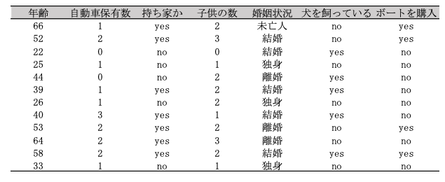

02 汎化、過剰適合、適合不足
======================

* `教師あり学習`では、

    * 訓練データに基づいてモデルを構築し、
    
    * それを用いて、使った訓練セットと同じ性質を持つ、新しい未見のデータに対して正確な予測ができるようにしたい

* モデルが未見のデータに対して正確な予測ができるようにしたい

* モデルが未見のデータに対して正確に予測ができるなら、訓練セットを用いてテストセットに対して`汎化`できていると言う

    * 可能な限り正確に汎化できるモデルを構築したい

* 通常、訓練セットに対して正確な予想ができるようにモデルを構築する
    
    * 訓練セットとテストセットが共通した性質を持つなら、そのように作られたモデルはテストセットに対しても正確であることが期待できる
    
    * しかし、非常に複雑なモデルを作ることを許してしまうと、訓練データに対してはいくらでも正確な予測を行うようにできてしまう
    

* ここで、この点を強調するために作った例を見てみる

* 新米のデータサイエンティストが、

    * これまでにボートを購入した顧客
    
    * ボートの購入には興味がないことがわかっている顧客
    
    のデータから、**ある顧客がボートを購入しようとしている**とする
    
* 目的は、

    * 実際にボートを購入しそうな顧客にだけプロモーションメールを送り
    
    * 購入しそうもない顧客には余計なメールを送りつけないこと
    
* 以下の表に示すような顧客の記録があるとする

* 新米データサイエンティストは、「45歳より年上で、子供の数が3人より少ないか、もしくは離婚していない顧客はボートを買いたがる」

    * このルールは、実際この表にあるデータに関しては正確である
    
    * ただし、このデータに対する予測が我々の持つ興味とは異なる
    
    * 我々が知りたいのは、**新しい顧客**がボートを買うかどうか
    
    * 新しい顧客に対してうまく判断できるルールが欲しいのであって、訓練セットに対して100%正確であっても意味がない
    
* あるアルゴリズムが新しいデータに対してうまく適用できるかどうかを知るには、テストセットを評価するしかない

    * しかし、直感的には単純なモデルの方が新しいデータに対してよく汎化できる
    
    * もし、「50歳を超える年齢の顧客がボートを買う」というルールで、全ての顧客の行動を説明できるのならば、
    
        * 年齢以外に子供や結婚状況のことまで含まれているようなルールよりも信頼できる
    
    * したがって、我々は常に最も単純なモデルを求める

* 持っている情報の量に対して過度に複雑なモデルを作ってしまうことを、`過剰適合`と言う

    * これは、訓練セットの個々の特徴にモデルを適合しすぎると発生する
    
    * 訓練セットに対してはうまく機能するが、新しいデータに対しては汎化できないモデルになってしまう
    
* 単純すぎるモデル(例：家を持っている人はボートを買う)などの単純すぎるモデルを作ってしまうことを、`適合不足`と呼ぶ

    * これは、データの様々な側面やデータの変異を捉えることができない
    
    * このようなモデルでは、訓練セットに対してすらうまく機能しない

* モデルが複雑になることを許せば許すほど、訓練データに対する予測精度は向上する

* しかし、モデルが複雑になりすぎると、訓練セットの個々のデータポイントに重きを置きすぎるようになり、新しいデータに対してうまく汎化できなくなる

* このどこかに、最良の汎化性能を示すスイートスポットがある

    * これが、我々の求めるモデルとなる
    
* 以下の表に、`過剰適合`と`適合不足`のトレードオフを示す

## 1. モデルの複雑さとデータセットの大きさ

* モデルの複雑さは、訓練データセットが持つ入力のバリエーションに密接に結びついていることを理解する

    * データセットに含まれるデータポイントがバリエーションに富んでいれば、`過剰適合`を起こすことなく、より複雑なモデルを利用できる

    * 通常は、データポイントが増えればデータのバリエーションも増えるので、データセットが大きくなれば、より複雑なモデルが利用できる事になる
    
    * しかし、同じデータポイントを複製したり、似たようなデータを集めるのではダメ
    
* ボート販売の例に立ち返ってみると、10000人分の顧客データを追加しても、

    「45歳より年上で、3人より少ない子供を持っている、もしくは離婚していない顧客はボートを買いたがる」
    
    と言うルールが適用できるのならば、このルールが良いルールであると信じやすい

* `教師あり学習タスク`においては、より多くのデータを用い、適度に複雑なモデルを用いると、驚くほど上手くいくことがある

* 今回は固定サイズのデータセットを扱うが、実問題においては、取得するデータの量を決められる場合もあり、

    モデルを捻り回すよりもデータ量を増やした方が良い場合も多い

| 版     | 年/月/日   |
| ------ | ---------- |
| 第二版 | 2019/05/05 |
