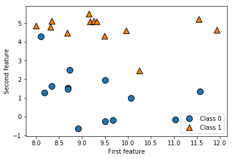
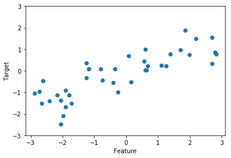

* これから、最も一般的な機械学習アルゴリズムについて、どのようにデータから学習し、どのように予測を行うのかを見ていく

* モデルの複雑さという概念が、個々のモデルで果たす役割について述べ、個々のアルゴリズムが、モデルを構築する方法の概要を示す

* さらに、それぞれのアルゴリズムの長所と短所、適しているデータの種類について述べる

    * 重要なパラメータとオプションについても説明する

    * 多くのアルゴリズムは、クラス分類と回帰のバリエーションがあるので両方とも説明する

## 1. サンプルデータセット

* これから様々なアルゴリズムを紹介するために、いくつかのデータセットを使う

    * そのうちの幾つかは、小さくて合成したもの(でっち上げたもの)で、アルゴリズムの特定の側面を強調するように設計されている

    * この他に、大きい、実世界から取ってきたデータセットも用いる

* 合成した2クラス分類データセットの例として、`forge`データセットを見る

    * このデータセットでは、2つの特徴量を持つ

    * 下のコードでは、このデータセットのデータポイントを散布図にプロットする

    * 第1特徴量をx軸に、第2特徴量をy軸にプロットしている

    * 散布図では、1つの点が1つのデータポイントを表す

    * 点の色と形はクラスを表している


```python
%matplotlib inline
import matplotlib.pyplot as plt
import mglearn

# データセットの生成
X, y = mglearn.datasets.make_forge()

# データセットをプロット
mglearn.discrete_scatter(X[:, 0], X[:, 1], y)
plt.legend(["Class 0", "Class 1"], loc=4)
plt.xlabel("First feature")
plt.ylabel("Second feature")
print("X.shape: {}".format(X.shape))
```

    /Users/MacUser/anaconda2/envs/tf140/lib/python3.6/site-packages/sklearn/utils/deprecation.py:77: DeprecationWarning: Function make_blobs is deprecated; Please import make_blobs directly from scikit-learn
      warnings.warn(msg, category=DeprecationWarning)


    X.shape: (26, 2)





* `X.shape`からわかるように、このデータセットは、2つの特徴量を持つ26のデータポイントで構成されている

* `回帰アルゴリズム`を紹介する際には、合成した`waveデータセット`を用いる

    * この`waveデータセット`は、1つの特徴量と、モデルの対象となる連続値のターゲット変数(もしくは**反応**)を持つ

    * 特徴量をx軸に、回帰のターゲット(出力)をy軸に取っている


```python
X, y = mglearn.datasets.make_wave(n_samples=40)
plt.plot(X, y, 'o')
plt.ylim(-3, 3)
plt.xlabel("Feature")
plt.ylabel("Target")
```


    Text(0, 0.5, 'Target')





* このように非常に単純な、低次元のデータセットを使うのは、可視化が容易だからである

    * 印刷物には2次元なので、2つ以上の特徴量は表示しにくい

    * ただし、少ない特徴量を持つデータセット(`低次元データセット`)に対する直感が、多数の特徴量を持つデータセット(`高次元データセット`)に対しても

        通用するとは限らない

* これらの小さい合成データセットを補うために、scikit-learnに含まれている2つの実問題から取ったデータセットを用いる

    * そのうち1つは、ウィスコンシン乳癌データセット(**cancer**と呼ぶ)である

    * これは、乳癌の腫瘍を計測したもので、それぞれの腫瘍に、

        * 害のない腫瘍を意味する：`良性`

        * 癌性の腫瘍を意味する：`悪性`

      のラベルが付けられている

     * ここでのタスクは、組織の測定結果から腫瘍が悪性かどうかを予測するように学習すること

     * このデータは、scikit-learnの`load_breast_cancer`関数でロードすることができる


```python
from sklearn.datasets import load_breast_cancer
cancer = load_breast_cancer()
print("cancer.keys(): \n{}".format(cancer.keys()))
```

    cancer.keys():
    dict_keys(['data', 'target', 'target_names', 'DESCR', 'feature_names', 'filename'])


> scikit-learnに含まれるデータセットは、多くの場合`Bunch`というクラスのオブジェクトに格納されている
>
> このオブジェクトには、実際のデータセットの他にデータセットに関する様々な情報が格納されている
>
> `Bunch`オブジェクトは、ディクショナリのように振舞うが、値を取り出す際に、`bunch.key`のように`.`(ドット)でアクセスできる

* このデータセットは、30の特徴量を持つ569のデータポイントで構成されている


```python
print("Shape of cancer data: {}".format(cancer.data.shape))
```

    Shape of cancer data: (569, 30)


* 569のデータポイントのうち、212が悪性で357が良性である


```python
import numpy as np

print("Sample counts per class:\n{}".format(
                                                                            {n: v for n, v in zip(cancer.target_names,
                                                                             np.bincount(cancer.target))
                                                                            })
)
```

    Sample counts per class:
    {'malignant': 212, 'benign': 357}


* 個々の特徴量の意味を示す記述は、`feature_names`属性に格納されている


```python
print("Feature names:{}".format(cancer.feature_names))
```

    Feature names:['mean radius' 'mean texture' 'mean perimeter' 'mean area'
     'mean smoothness' 'mean compactness' 'mean concavity'
     'mean concave points' 'mean symmetry' 'mean fractal dimension'
     'radius error' 'texture error' 'perimeter error' 'area error'
     'smoothness error' 'compactness error' 'concavity error'
     'concave points error' 'symmetry error' 'fractal dimension error'
     'worst radius' 'worst texture' 'worst perimeter' 'worst area'
     'worst smoothness' 'worst compactness' 'worst concavity'
     'worst concave points' 'worst symmetry' 'worst fractal dimension']


* ここで、`cancer.DESCR`をよく見るとより詳しい情報が得られる


```python
print(cancer.DESCR)
```

    .. _breast_cancer_dataset:

    Breast cancer wisconsin (diagnostic) dataset
    --------------------------------------------

    **Data Set Characteristics:**

        :Number of Instances: 569

        :Number of Attributes: 30 numeric, predictive attributes and the class

        :Attribute Information:
            - radius (mean of distances from center to points on the perimeter)
            - texture (standard deviation of gray-scale values)
            - perimeter
            - area
            - smoothness (local variation in radius lengths)
            - compactness (perimeter^2 / area - 1.0)
            - concavity (severity of concave portions of the contour)
            - concave points (number of concave portions of the contour)
            - symmetry
            - fractal dimension ("coastline approximation" - 1)

            The mean, standard error, and "worst" or largest (mean of the three
            largest values) of these features were computed for each image,
            resulting in 30 features.  For instance, field 3 is Mean Radius, field
            13 is Radius SE, field 23 is Worst Radius.

            - class:
                    - WDBC-Malignant
                    - WDBC-Benign

        :Summary Statistics:

        ===================================== ====== ======
                                               Min    Max
        ===================================== ====== ======
        radius (mean):                        6.981  28.11
        texture (mean):                       9.71   39.28
        perimeter (mean):                     43.79  188.5
        area (mean):                          143.5  2501.0
        smoothness (mean):                    0.053  0.163
        compactness (mean):                   0.019  0.345
        concavity (mean):                     0.0    0.427
        concave points (mean):                0.0    0.201
        symmetry (mean):                      0.106  0.304
        fractal dimension (mean):             0.05   0.097
        radius (standard error):              0.112  2.873
        texture (standard error):             0.36   4.885
        perimeter (standard error):           0.757  21.98
        area (standard error):                6.802  542.2
        smoothness (standard error):          0.002  0.031
        compactness (standard error):         0.002  0.135
        concavity (standard error):           0.0    0.396
        concave points (standard error):      0.0    0.053
        symmetry (standard error):            0.008  0.079
        fractal dimension (standard error):   0.001  0.03
        radius (worst):                       7.93   36.04
        texture (worst):                      12.02  49.54
        perimeter (worst):                    50.41  251.2
        area (worst):                         185.2  4254.0
        smoothness (worst):                   0.071  0.223
        compactness (worst):                  0.027  1.058
        concavity (worst):                    0.0    1.252
        concave points (worst):               0.0    0.291
        symmetry (worst):                     0.156  0.664
        fractal dimension (worst):            0.055  0.208
        ===================================== ====== ======

        :Missing Attribute Values: None

        :Class Distribution: 212 - Malignant, 357 - Benign

        :Creator:  Dr. William H. Wolberg, W. Nick Street, Olvi L. Mangasarian

        :Donor: Nick Street

        :Date: November, 1995

    This is a copy of UCI ML Breast Cancer Wisconsin (Diagnostic) datasets.
    https://goo.gl/U2Uwz2

    Features are computed from a digitized image of a fine needle
    aspirate (FNA) of a breast mass.  They describe
    characteristics of the cell nuclei present in the image.

    Separating plane described above was obtained using
    Multisurface Method-Tree (MSM-T) [K. P. Bennett, "Decision Tree
    Construction Via Linear Programming." Proceedings of the 4th
    Midwest Artificial Intelligence and Cognitive Science Society,
    pp. 97-101, 1992], a classification method which uses linear
    programming to construct a decision tree.  Relevant features
    were selected using an exhaustive search in the space of 1-4
    features and 1-3 separating planes.

    The actual linear program used to obtain the separating plane
    in the 3-dimensional space is that described in:
    [K. P. Bennett and O. L. Mangasarian: "Robust Linear
    Programming Discrimination of Two Linearly Inseparable Sets",
    Optimization Methods and Software 1, 1992, 23-34].

    This database is also available through the UW CS ftp server:

    ftp ftp.cs.wisc.edu
    cd math-prog/cpo-dataset/machine-learn/WDBC/

    .. topic:: References

       - W.N. Street, W.H. Wolberg and O.L. Mangasarian. Nuclear feature extraction
         for breast tumor diagnosis. IS&T/SPIE 1993 International Symposium on
         Electronic Imaging: Science and Technology, volume 1905, pages 861-870,
         San Jose, CA, 1993.
       - O.L. Mangasarian, W.N. Street and W.H. Wolberg. Breast cancer diagnosis and
         prognosis via linear programming. Operations Research, 43(4), pages 570-577,
         July-August 1995.
       - W.H. Wolberg, W.N. Street, and O.L. Mangasarian. Machine learning techniques
         to diagnose breast cancer from fine-needle aspirates. Cancer Letters 77 (1994)
         163-171.


* 実世界の回帰データセットとして、`boston_housing`データセットを用いる

    * このデータセットを用いるタスクは、1970年代のボストン近郊の住宅地の中央値を、

        * 犯罪率

        * チャールズ川からの距離

        * 高速道路への利便性

      から予測するもの

   * このデータセットには、13の特徴量を持つ506のデータポイントが含まれる


```python
from sklearn.datasets import load_boston
boston = load_boston()
print("Data shape: {}".format(boston.data.shape))
```

    Data shape: (506, 13)


* ここで、`boston.DESCR`属性を読めばデータセットの詳細がわかる


```python
print(boston.DESCR)
```

    .. _boston_dataset:

    Boston house prices dataset
    ---------------------------

    **Data Set Characteristics:**  

        :Number of Instances: 506

        :Number of Attributes: 13 numeric/categorical predictive. Median Value (attribute 14) is usually the target.

        :Attribute Information (in order):
            - CRIM     per capita crime rate by town
            - ZN       proportion of residential land zoned for lots over 25,000 sq.ft.
            - INDUS    proportion of non-retail business acres per town
            - CHAS     Charles River dummy variable (= 1 if tract bounds river; 0 otherwise)
            - NOX      nitric oxides concentration (parts per 10 million)
            - RM       average number of rooms per dwelling
            - AGE      proportion of owner-occupied units built prior to 1940
            - DIS      weighted distances to five Boston employment centres
            - RAD      index of accessibility to radial highways
            - TAX      full-value property-tax rate per $10,000
            - PTRATIO  pupil-teacher ratio by town
            - B        1000(Bk - 0.63)^2 where Bk is the proportion of blacks by town
            - LSTAT    % lower status of the population
            - MEDV     Median value of owner-occupied homes in $1000's

        :Missing Attribute Values: None

        :Creator: Harrison, D. and Rubinfeld, D.L.

    This is a copy of UCI ML housing dataset.
    https://archive.ics.uci.edu/ml/machine-learning-databases/housing/


    This dataset was taken from the StatLib library which is maintained at Carnegie Mellon University.

    The Boston house-price data of Harrison, D. and Rubinfeld, D.L. 'Hedonic
    prices and the demand for clean air', J. Environ. Economics & Management,
    vol.5, 81-102, 1978.   Used in Belsley, Kuh & Welsch, 'Regression diagnostics
    ...', Wiley, 1980.   N.B. Various transformations are used in the table on
    pages 244-261 of the latter.

    The Boston house-price data has been used in many machine learning papers that address regression
    problems.   

    .. topic:: References

       - Belsley, Kuh & Welsch, 'Regression diagnostics: Identifying Influential Data and Sources of Collinearity', Wiley, 1980. 244-261.
       - Quinlan,R. (1993). Combining Instance-Based and Model-Based Learning. In Proceedings on the Tenth International Conference of Machine Learning, 236-243, University of Massachusetts, Amherst. Morgan Kaufmann.


* ここでは、このデータセットを拡張し、13の測定結果だけを特徴量とするのではなく、**特徴量間の積**(`交互作用`と呼ぶ)も見ることにする

    * つまり、犯罪率と高速道路への利便性を特徴量として見るだけでなく、それらの積も特徴量として考える

    * このように導出された特徴量を含めることを、`特徴量エンジニアリング`と呼ぶ

    * この導出されたデータセットは、`load_extended_boston`関数でロードすることができる


```python
X, y = mglearn.datasets.load_extended_boston()
print("X.shape: {}".format(X.shape))
```

    X.shape: (506, 104)


* 104の特徴量とは、元の13の特徴量に、13の特徴量から2つの特徴量を選ぶ重複ありの組み合わせを足したもの

    * 13 + 12 + 11 + ... + 1 = 91、となる

|  版  |   年/月/日   |
|-----|-----------------|
|初版|2019/02/25|
|第二版|2019/05/05|
