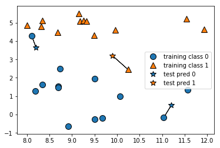
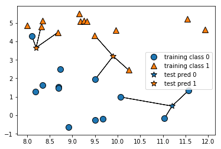
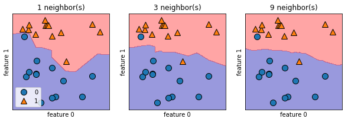
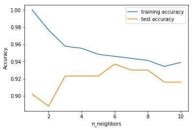
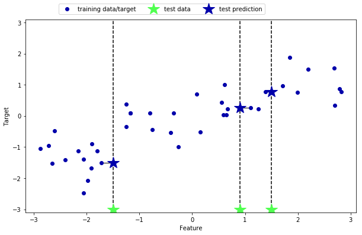
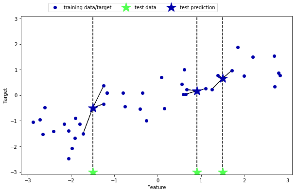
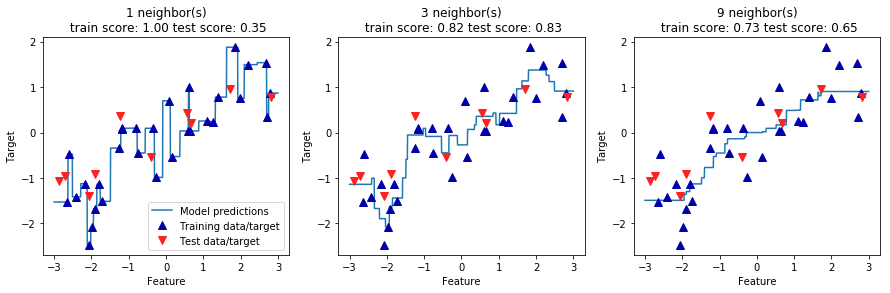

```python
%matplotlib inline
import matplotlib.pyplot as plt
import mglearn
from sklearn.datasets import load_breast_cancer
import numpy as np
from sklearn.datasets import load_boston
```

02 k-最近傍法
===========

* `k-最近傍法`(`k-NN`)アルゴリズム：最も単純なアルゴリズムであると言われる

    * モデルの構築は、訓練データセットを格納するだけ

    * 新しいデータポイントに対する予測を行う際には、訓練データセットの中から一番近い点(最近傍点)を見つける

### 1. k-最近傍法によるクラス分類

* 一番単純な場合には、`k-NN`アルゴリズムは、1つの最近傍点、つまり訓練データに含まれる点の中で予測したいデータポイントに最も近いものだけを見る

* 予測には、この点に対する出力をそのまま以下の図に、`forge`データセットに対するクラス分類の例を示す


```python
mglearn.plots.plot_knn_classification(n_neighbors=1)
```

    /Users/MacUser/anaconda2/envs/tf140/lib/python3.6/site-packages/sklearn/utils/deprecation.py:77: DeprecationWarning: Function make_blobs is deprecated; Please import make_blobs directly from scikit-learn
      warnings.warn(msg, category=DeprecationWarning)





* ここでは、星印で示される3つの新しいデータポイントを加えている

    * それぞれに対して訓練データのうちで最も近いものに印を付けた

    * 1-最近傍法アルゴリズムでの予測では、近傍点のラベルが予測されたラベルになる(星印の色で表されている)

* 近傍点は1つとは限らず、任意個の、つまりk個の近傍点を考慮することができる

    * これがk-最近傍法の名前の由来

    * 1つ以上の近傍点を考慮に入れる場合には、`投票`でラベルを決める

    * つまり、個々のテストする点に対して、近傍点のうち、いくつかがクラス０に属し、いくつかがクラス1に属するのかを数える

    * そして、最も多く現れたクラスをその点に与える

    * 言い換えれば、k-最近傍点の多数派のクラスを採用する

* 以下の図では、3つの近傍点を用いている


```python
mglearn.plots.plot_knn_classification(n_neighbors=3)
```

    /Users/MacUser/anaconda2/envs/tf140/lib/python3.6/site-packages/sklearn/utils/deprecation.py:77: DeprecationWarning: Function make_blobs is deprecated; Please import make_blobs directly from scikit-learn
      warnings.warn(msg, category=DeprecationWarning)





* ここでも、予測された結果は星印の色で示されている

    * 左上の新しいデータポイントに対する予測は、1つの最近傍点だけを使った場合と異なっている

    * ここで示しているのは2クラス分類問題だが、この方法は任意のクラス数に対しても適用できる

    * クラスがたくさんあるときには、それぞれのクラスに対して近傍点がいくつあるかを数えて、最も多いクラスを予測値とすればよい


* scikit-learnを用いて`k-最近傍法`アルゴリズムが適用できるかを見る

    * データを訓練セットとテストセットに分割し、汎化性能を評価できるようにする


```python
from sklearn.model_selection import train_test_split
X, y = mglearn.datasets.make_forge()

X_train, X_test, y_train, y_test = train_test_split(X, y, random_state=0)
```

    /Users/MacUser/anaconda2/envs/tf140/lib/python3.6/site-packages/sklearn/utils/deprecation.py:77: DeprecationWarning: Function make_blobs is deprecated; Please import make_blobs directly from scikit-learn
      warnings.warn(msg, category=DeprecationWarning)


* 次に、クラスをインポートして、インスタンスを生成する

    * この際に、近傍点の数などのパラメータを渡すことができる

    * ここでは3にしている


```python
from sklearn.neighbors import KNeighborsClassifier
clf = KNeighborsClassifier(n_neighbors=3)
```

* 次に、訓練セットを用いてクラス分類器を訓練する

    * `KNeighborsClassifier`の場合には、データセットを保存するだけ

    * 保存したデータセットを用いて、予測の際に近傍点を計算する


```python
clf.fit(X_train, y_train)
```


    KNeighborsClassifier(algorithm='auto', leaf_size=30, metric='minkowski',
               metric_params=None, n_jobs=None, n_neighbors=3, p=2,
               weights='uniform')


* テストデータに対して予測を行う際には、`predict`メソッドを呼び出す

* テストセットのそれぞれのデータポイントに対して、訓練セットの中から最近傍点を計算し、最も多いクラスを見つけ出す


```python
print("Test set predictions: {}".format(clf.predict(X_test)))
```

    Test set predictions: [1 0 1 0 1 0 0]


* モデルの汎化性能を評価するためには、`score`メソッドをテストデータとテストラベルで呼び出せば良い


```python
print("Test set accuracy: {:.2f}".format(clf.score(X_test, y_test)))
```

    Test set accuracy: 0.86


* およそ86%の精度であった

    * つまり、このモデルはテストデータセットのサンプルのうち86%に対して正しくクラスを予測した

## 2. KNeighborsClassifierの解析

* 2次元のデータセットについては、xy平面の全ての点について、予測結果を表示することができる

* 平面を、そこに点があったとしたら分類されていたであろうクラスにしたがって色付けする

    * こうすると、アルゴリズムがクラス0に割り当てる場合と、クラス1に割り当てる場合の`決定境界`が見える

    * 次のコードは、`k`が1、3、9の場合の決定境界を描画する


```python
fig, axes = plt.subplots(1, 3, figsize=(10, 3))

for n_neighbors, ax in zip([1, 3, 9], axes):
    # fitメソッドは自分自身を返すので、1行で
    # インスタンスを生成してfitすることができる
    clf = KNeighborsClassifier(n_neighbors=n_neighbors).fit(X, y)
    mglearn.plots.plot_2d_separator(clf, X, fill=True, eps=0.5, ax=ax, alpha=.4)
    mglearn.discrete_scatter(X[:, 0], X[:, 1], y, ax=ax)
    ax.set_title("{} neighbor(s)".format(n_neighbors))
    ax.set_xlabel("feature 0")
    ax.set_ylabel("feature 1")
axes[0].legend(loc=3)
```


    <matplotlib.legend.Legend at 0x119753208>





* 左の図からわkるように、1つの最近傍点のみを用いると、決定境界は、訓練データに近くなる

*　より多くの最近傍点を考慮すると、決定境界はよりなめらかになる

    * なめらかな境界は、単純なモデルに対応する

    * つまり、最近傍点が少ない場合は複雑度の高いモデル(右側)に対応する

    * 最近傍点が多い場合は、複雑度の低いモデル(左側)に対応する

* 極端なケースとして、近傍点の数を訓練データセットの全てのデータポイントの数にする

    * 全てのテストデータポイントは、全く同じ近傍点(全ての訓練データポイント)を持つことになるので、

    * 全ての予測結果は同じ、すなわち訓練セットの中で最も多いクラスになる

* ここで議論したモデルの複雑さと汎化性能の関係が確認できるか調べてみる

    * これには、実世界の`cancer`データセットを用いる

    * まずデータセットを訓練セットとテストセットに分割する

    * 訓練セットに対する性能とテストセットに対する性能を近傍点の数に対して評価する

    * 結果を、以下の図に示す


```python
from sklearn.datasets import load_breast_cancer

cancer = load_breast_cancer()
X_train, X_test, y_train, y_test = train_test_split(
                                                                                        cancer.data,
                                                                                        cancer.target,
                                                                                        stratify=cancer.target,
                                                                                        random_state=66)

training_accuracy = []
test_accuracy = []

# n_neighborsを1から10まで試す
neighbors_settings = range(1, 11)

for n_neighbors in neighbors_settings:
    # モデルを構築
    clf = KNeighborsClassifier(n_neighbors=n_neighbors)
    clf.fit(X_train, y_train)
    #  訓練セット精度を記録
    training_accuracy.append(clf.score(X_train, y_train))
    # 汎化精度を記録
    test_accuracy.append(clf.score(X_test, y_test))

plt.plot(neighbors_settings, training_accuracy, label="training accuracy")
plt.plot(neighbors_settings, test_accuracy, label="test accuracy")
plt.ylabel("Accuracy")
plt.xlabel("n_neighbors")
plt.legend()
```


    <matplotlib.legend.Legend at 0x10a70b8d0>





* このグラフでは、y軸に訓練セットおよびテストセットに対する精度を、x軸に考慮する最近傍点の数をプロットしている

* 実世界のデータなので、なかなかなめらかにはならないのだが、過剰適合と適合不足の特徴は読み取れる

    (少ない最近傍点だけを考慮する方が複雑なモデルに当たる)

* 1つの最近傍点のみを考慮する場合には、訓練セットに対する予測は完璧である

* より多くの最近傍点を考慮すると、モデルはシンプルになり、訓練精度は低下する

* 一方、1つの最近傍点のみを考慮する場合のテストセットに対する精度は、より多くの最近傍点を考慮する場合よりも低い

    * これは、1つの最近傍点ではモデルが複雑すぎるためである

* 一方、10の最近傍点を考慮すると、モデルはシンプルになりすぎ、性能はさらに低下する

* 最良の性能は6のあたりにある

    * ただし、このグラフのスケールに注意しておく必要がある

    * 最悪の場合でも88%の精度はあり、場合によってはこれで十分である

## 3. k-近傍回帰

* `k-最近傍法`には、`回帰`を行う変種がある

    * ここでも、1最近傍点を用いるものから見ていく

    * 今回は、`wave`データセットを用いる

    * 3つのテストデータポイントを緑色の星印としてx軸上に書いた

    * 1最近傍点を用いる予測では、最近傍点の値をそのまま使う

    * 青い星印が予測点となる


```python
mglearn.plots.plot_knn_regression(n_neighbors=1)
```





* クラス分類の場合と同様に、より多くの最近傍点を用いることもできる

    * 複数の最近傍点を用いる場合には、最近傍点の平均値を用いる


```python
mglearn.plots.plot_knn_regression(n_neighbors=3)
```





* `回帰`のための`k-最近傍点`アルゴリズムでは、scikit-learnの`KNeighborsClassifier`クラスに実装されている

    * `KNeighborsClassifier`と同様に利用できる


```python
from sklearn.neighbors import KNeighborsRegressor

X, y = mglearn.datasets.make_wave(n_samples=40)

# waveデータセットを訓練セットとテストセットに分割
X_train, X_test, y_train, y_test = train_test_split(X, y, random_state=0)

# 3つの最近傍点を考慮するように設定してモデルのインスタンスを生成
reg = KNeighborsRegressor(n_neighbors=3)

# 訓練データと訓練ターゲットを用いてモデルを学習させる
reg.fit(X_train, y_train)
```


    KNeighborsRegressor(algorithm='auto', leaf_size=30, metric='minkowski',
              metric_params=None, n_jobs=None, n_neighbors=3, p=2,
              weights='uniform')


* これをすることにより、テストセットに対して予測を行うことができる


```python
print("Test set predictions:\n{}".format(reg.predict(X_test)))
```

    Test set predictions:
    [-0.05396539  0.35686046  1.13671923 -1.89415682 -1.13881398 -1.63113382
      0.35686046  0.91241374 -0.44680446 -1.13881398]


* `score`メソッドを用いてモデルを評価することもできる

    * このメソッドに対しての回帰予測器は、$R^2$スコアを返す

    * $R^2$スコアは`決定係数`とも呼ばれ、回帰モデルの予測の正確さを測る指標となる

    * 0から1までの値をとり、1は完全な予測に対応し、0は訓練セットのレスポンス値(`y_train`)の平均を返すだけのものに対応する


```python
print("Test set R^2: {:.2f}".format(reg.score(X_test, y_test)))
```

    Test set R^2: 0.83


* ここではスコアは0.83となっている

    * これは比較的良いモデルであることを意味している

## 4. KNeighborsRegressorの解析

* 1次元のデータセットに対して、全ての値がどのようになるかを見てみる

    * これには、たくさんのデータポイントを持つデータセットを作れば良い


```python
%matplotlib inline
fig, axes = plt.subplots(1, 3, figsize=(15, 4))

# -3から3までの間に1,000点のデータポイントを作る
line = np.linspace(-3, 3, 1000).reshape(-1, 1)
for n_neighbors, ax in zip([1, 3, 9], axes):
    # 1, 3, 9近傍点で予測
    reg = KNeighborsRegressor(n_neighbors=n_neighbors)
    reg.fit(X_train, y_train)
    ax.plot(line, reg.predict(line))
    ax.plot(X_train, y_train, '^', c=mglearn.cm2(0), markersize=8)
    ax.plot(X_test, y_test, 'v', c=mglearn.cm2(1), markersize=8)

    ax.set_title(
            "{} neighbor(s)\n train score: {:.2f} test score: {:.2f}".format(
                    n_neighbors, reg.score(X_train, y_train),
                    reg.score(X_test, y_test)))
    ax.set_xlabel("Feature")
    ax.set_ylabel("Target")
axes[0].legend(["Model predictions", "Training data/target",
                             "Test data/target"], loc="best")
```


    <matplotlib.legend.Legend at 0x10a70b588>





* このグラフからわかるように、1最近傍点による回帰では訓練セットの個々の点が明らかに予測に影響を与えている

    * 予測は全ての訓練データポイントを通っている(予測は非常に不安定になっている)

    * 考慮する最近傍点を増やしていくと、予測はスムーズになるが、訓練データに対する適合度は下がる

## 5. 利点と欠点とパラメータ

* 理論的には、`KNeighbors`分類器には2つの重要なパラメータがある

    * それは、**近傍点の数**と**データポイント間の距離測度**である

    * 実用上は、近傍点の数は3や5程度の小さな数で十分な場合がほとんどだが、このパラメータは調整する必要がある

    * デフォルトではユークリッド距離を用いるが、ほとんどの場合これでうまくいく

* `k-最近傍法`の利点の1つは、モデルの理解のしやすさにある

    * また、多くの場合あまり調整しなくても十分に高い性能を示す

    * より高度な技術の利用を考えてみる前に、このアルゴリズムをベースラインとして試してみると良い

    * 多くの場合、最近傍法のモデル構築は非常に高速だが、訓練セットが大きくなると(特徴量数とサンプルの個数のどちらかが大きくなっても)、予測が遅くなる

    * `k-最近傍法`アルゴリズムを用いる際には、データの前処理を行うことが重要である

    * この手法は、多数の特徴量(数百以上)を持つデータセットではうまく機能しない

    * また、ほとんどの特徴量が多くの場合0となるような(`疎なデータセット`)では特に性能が悪い

* つまり、`k-最近傍法`アルゴリズムは理解しやすいという特徴はあるが、処理速度が遅く多数の特徴量を扱うことができないため、ほとんど使われない

|  版  |   年/月/日   |
|-----|-----------------|
|初版|2019/02/25|
|第二版|2019/05/05|
