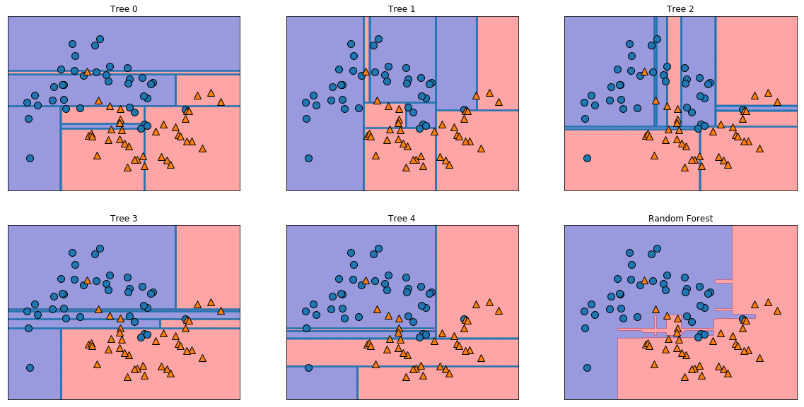
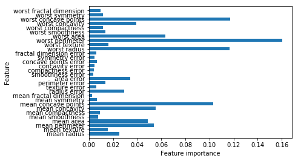
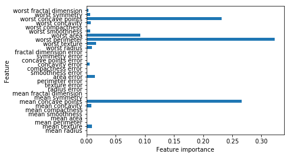

06 決定木のアンサンブル法
=====================

* `アンサンブル法`：複数の機械学習モデルを組み合わせることで、より強力なモデルを構築する手法

    * 機械学習の文献にはこのカテゴリの手法がたくさん存在する

    * 様々なデータセットに対するクラス分類や回帰に関して有効であることがわかっている`アンサンブル法`が2つある

        * `ランダムフォレスト`

        * `勾配ブースティング決定木`

## 1. ランダムフォレスト

* 決定木の最大の問題点は、訓練データに対して過剰適合してしまうことにある

    * `ランダムフォレスト`は、この問題に対応する方法の1つである

* `ランダムフォレスト`：少しずつ異なる決定木をたくさん集めたもの

    * 個々の決定木は比較的うまく予測できているが、一部のデータに対して過剰適合してしまっているという考え方に基づいている

    * それぞれ異なった方向に過剰適合した決定木をたくさん作れば、その結果の平均を取ることで過剰適合の度合いを減らすことができる

    * 決定木の予測性能を維持したまま、過剰適合が解決できることは厳密な数学で示すことができる

* この戦略を実装するには、たくさんの決定木を作らなければならない

    * それぞれの決定木は、ある程度ターゲット値を予測できていて、さらにお互い違っていなければならない

    * `ランダムフォレスト`という名前は、個々の決定木が互いに異なるように、決定木の構築過程で乱数を導入していることから付いている

    * ランダムフォレストに乱数を導入する方法は2つある

        * 決定木を作るためのデータポイントを選択する方法

        * 分岐テストに用いる特徴を選択する方法

### ランダムフォレストの構築

* `ランダムフォレスト`モデルを構築するには、構築する決定木の数を決めなければならない(`RandomForestRegressor`、`RandomForestClassifier`の`n_estimators`パラメータ)

    * 10個の決定木を作る(これらの木は互いに完全に独立に構築される)

    * これらの決定木がそれぞれ異なる木になるように、アルゴリズムはそれぞれに対して異なる乱数選択を行う

    * 決定木を作るには、まずデータから`ブートストラップサンプリング`と呼ばれるものを用いる

        * これは、`n_samples`個のデータポイントから、交換ありでデータポイントをランダムに`n_samples`回選び出す手法(復元抽出)

        * これによって、元のデータセットと同じ大きさだが、データの一部(およそ3分の1)が欠け、一部が何度か現れているデータセットが得られる

* 例えば、リスト`['a', 'b', 'c', 'd']`から`ブートストラップサンプリング`してみる

    * この場合、`['b', 'd', 'd', 'c']`や`['d', 'a', 'd', 'a']`が得られる

* 次に、この新しいデータセットを用いて決定木を作る

    * ただし、決定木を作るアルゴリズムを少しだけ変更する

    * 個々のノードで最適なテストを選ぶのではなく、特徴量のサブセットをランダムに選び、その特徴量を使うものの中から最適なテストを選ぶ

    * 特徴量サブセットの大きさは、個々のノードで独立に繰り返し行われる

    * これによって、決定木の個々のノードが異なる特徴量のサブセットを使って決定を行うようになる

* `ブートストラップサンプリング`によって、`ランダムフォレスト`の中の個々の決定木が少しずつ違うデータセットに対して構築されることになる

    * さらに、個々のノードのでの特徴量の選択によって、それぞれの決定木は異なる特徴量のサブセットに対して分割を行うことになる

    * これによって、決定木の個々のノードが異なる特徴量のサブセットを使って決定を行うようになる

* この過程で重要なパラメータが`max_features`である

    * `max_features`を`n_features`に設定すると、それぞれの分岐でデータセット中の全ての特徴量を見ることになる

    * これは、ランダムに選ばれたある特徴量選択時の乱数性はなくなる(`ブートストラップサンプリング`による乱数性は残る)

    * `max_features`を1にすると、分岐時に使う特徴量選択には全く選択肢がないことになる

    * そのため、ランダムに選ばれたある特徴量に対してスレッショルドを探すだけになる

* `max_features`を大きくすると、

    * ランダムフォレスト中の決定木が似たようなものになり、最も識別性の高い特徴量を使うので、 訓練データに容易に適合できる

* `max_features`を小さくすると、

    * ランダムフォレスト中の決定木は相互に大幅に異なるものとなるが、それぞれの決定木をかなり深く作らないと、データに適合できない

* `ランダムフォレスト`を用いて予測を行う際には、まず全ての決定木に対して予測を行う

    * 回帰の場合には、これらの結果の平均値を最終的な予測として用いる

    * クラス分類の場合には、「ソフト投票」戦略が用いられる

    * これは、それぞれの決定木が「ソフト」な予想を行い、個々の出力ラベルに対して確率を出力する

    * 全ての決定木による確率統計を平均し、最も確率が高いラベルが予測値となる

### ランダムフォレストの解析

* `ランダムフォレスト`を、`two_moons`データセットに適用する


```python
from sklearn.ensemble import RandomForestClassifier
from sklearn.datasets import make_moons
from sklearn.model_selection import train_test_split

X, y = make_moons(n_samples=100, noise=0.25, random_state=3)
X_train, X_test, y_train, y_test = train_test_split(X, y, stratify=y,
                                                    random_state=42)

forest = RandomForestClassifier(n_estimators=5, random_state=2)
forest.fit(X_train, y_train)
```


    RandomForestClassifier(bootstrap=True, class_weight=None, criterion='gini',
                max_depth=None, max_features='auto', max_leaf_nodes=None,
                min_impurity_decrease=0.0, min_impurity_split=None,
                min_samples_leaf=1, min_samples_split=2,
                min_weight_fraction_leaf=0.0, n_estimators=5, n_jobs=None,
                oob_score=False, random_state=2, verbose=0, warm_start=False)


* `ランダムフォレスト`の一部として構築された決定木は、`estimator_`属性に格納されている

    * それぞれの決定木で学習された決定境界と、`ランダムフォレスト`によって行われる酒豪的なう予測を可視化する


```python
import mglearn
import matplotlib.pyplot as plt

fig, axes = plt.subplots(2, 3, figsize=(20, 10))
for i, (ax, tree) in enumerate(zip(axes.ravel(), forest.estimators_)):
    ax.set_title("Tree {}".format(i))
    mglearn.plots.plot_tree_partition(X_train, y_train, tree, ax=ax)

mglearn.plots.plot_2d_separator(forest, X_train, fill=True, ax=axes[-1, -1], alpha=.4)
axes[-1, -1].set_title("Random Forest")
mglearn.discrete_scatter(X_train[:, 0], X_train[:, 1], y_train)
```


    [<matplotlib.lines.Line2D at 0x11fd2e668>,
     <matplotlib.lines.Line2D at 0x11ca92588>]





* 5つの決定木が学習した決定境界は明らかに相互に異なることがわかる

    * それぞれの決定木は、一部の点について分類に失敗している

    * これは、ブートストラップサンプリングの結果、ここに表示されている訓練セットのデータポイントの一部が、それぞれの決定木が学習した際の訓練セットに含まれていなかったため

* `ランダムフォレスト`は、個々のどの決定木よりも過剰適合が少なく、直感に合成した決定境界を描いている

    * 実際のアプリケーションでは、もっと多くの決定木を使うので、決定境界はなめらかになる

* もう1つの例として、cancerデータセットに対して100個の決定木を用いた`ランダムフォレスト`を適用する


```python
from sklearn.datasets import load_breast_cancer
cancer = load_breast_cancer()

X_train, X_test, y_train, y_test = train_test_split(cancer.data, cancer.target, random_state=0)
forest = RandomForestClassifier(n_estimators=100, random_state=0)
forest.fit(X_train, y_train)

print("Accuracy on training set: {:.3f}".format(forest.score(X_train, y_train)))
print("Accuracy on test set: {:.3f}".format(forest.score(X_test, y_test)))
```

    Accuracy on training set: 1.000
    Accuracy on test set: 0.972


* この`ランダムフォレスト`は、パラメータを全く調整していないのにも関わらず、97%の精度を示している

    * これは、線形モデルや個別の決定木よりも高い

    * `max_features`パラメータや、個々の決定木に対して事前枝刈りを行うことでさらにチューニングすることもできる

    * しかし、多くの場合、`ランダムフォレスト`はデフォルトのパラメータで、十分よく機能する

* 決定木と同様に、`ランダムフォレスト`でも特徴量の重要度を見ることができる

    * これは、個々の決定木の特徴量の重要度を平均したものである

    * 多くの場合、ランダムフォレストによる特徴量の重要度は、個々の決定木のそれよりも信頼できる


```python
import numpy as np

def plot_feature_importances_cancer(model):
    n_features = cancer.data.shape[1]
    plt.barh(np.arange(n_features), model.feature_importances_, align='center')
    plt.yticks(np.arange(n_features), cancer.feature_names)
    plt.xlabel("Feature importance")
    plt.ylabel("Feature")
    plt.ylim(-1, n_features)

plot_feature_importances_cancer(forest)
```





* `ランダムフォレスト`では、決定木の場合よりもはるかに多くの特徴量に対して0以上の重要度を与えている

    * 1つの決定木の場合と同じように、「`worst radius`」特徴量に高い重要度を与えているが、全体としては「`worst perimeter`」特徴量が最も重要となっている

    * `ランダムフォレスト`を構築する際の乱数性によって、アルゴリズムは多くの可能な説明を考慮するようになっている

    * `ランダムフォレスト`の結果は、個々の決定木の結果よりも広い視野で見た全体像を捉えることができる

### 長所、短所、パラメータ

* 回帰でもクラス分類でも、`ランダムフォレスト`が現在最も広く使われている機械学習手法である

    * 非常に強力である上、多くの場合それほどパラメータチューニングをせずに使え、データのスケール変換をする必要もない

* 本質的に、`ランダムフォレスト`は決定木の利点の多くを残したまま、決定木の欠点の一部を補っている

    * それでも決定木を使う理由があるとしたら、決定プロセスの簡潔な表現が欲しい場合くらい

    * 何十、何百もの決定木を詳細に解釈することは不可能である

    * `ランダムフォレスト`中の決定木は、単独の場合よりも深い傾向にある(特徴量のサブセットを使うため)

* 大きいデータセットに対して`ランダムフォレスト`を作るのには時間がかかるが、計算機上の複数のCPUコアを使って簡単に並列化できる

    * もし計算機にCPUコアがあるなら、`n_jobs`パラメータを使って使用するコア数を指定できる

    * CPUコア数を増やすと線形に速度が向上するが、コア数以上に`n_jobs`を設定しても意味はない(2コアを使うと訓練時間が2分の1になる)

    * `n_jobs=-1`とすると、計算機上の全てのコアを使うようになる

* `ランダムフォレスト`は本質的にランダムであり、乱数のシード(`ramdom_state`)を変更すると構築するモデルが大きく変わる可能性がある

    * `ランダムフォレスト`中の決定木の数が増えると、乱数シードの選択の影響を受けにくくなる

    * 結果を再現可能にしたいのであれば、`random_state`を固定する必要がある

* `ランダムフォレスト`は、テキストデータなどの、非常に高次元で疎なデータに対してはうまく機能しない傾向にある

    * このようなデータに対しては、線形モデルの方が適している

    * 一般に`ランダムフォレスト`は、非常に大きいデータセットに対しても機能するし、強力な計算機では複数のCPUを用いて簡単に並列化できる

    * しかし、`ランダムフォレスト`は線形モデルよりも、多くのメモリを消費するし、訓練も予測も遅い

    * 実行時間やメモリが重要なアプリケーションでは、線形モデルを使った方が良い

* 調整すべき重要なパラメータは、`n_estimators`、`max_features`と、`max_depth`などの事前枝切りパラメータ

    * `n_estimators`は大きければ大きい方が良い

    * より多くの決定木の平均を取ると、過剰適合が軽減されアンサンブルが眼瞼になるため

    * しかし、増やすことによる利益は徐々に減っていくし、メモリの量も訓練にかかる量も増大する

    * 簡単なルールとしては、「時間とメモリのある限り大きくする」ことである

* `max_features`は個々の決定木の乱数性を決定するとともに、`max_features`が小さくなると過剰適合が低減する

    * 一般に、デフォルト値を使うと良い

* クラス分類については、`max_features=sqrt(n_features)`となっている

* 回帰については、`max_features=n_features`となっている

* `max_features`や`max_leaf_nodes`を追加すると性能が上がることがある

    * また、訓練や予測にかかる時間を大幅に縮めることもできる

## 2. 勾配ブースティング回帰木(勾配ブースティングマシン)

* `勾配ブースティング回帰木`：複数の決定木を組み合わせてより強力なモデルを構築するもう1つのアンサンブル手法

    * このモデルは回帰にもクラス分類にも利用できる

    * `ランダムフォレスト`と対称的に、`勾配ブースティング`では、1つ前の決定木の誤りを次の決定木が修正するようにして、決定木を順番に作っていく

    * デフォルトでは、`勾配ブースティング回帰木`には乱数性はない

    * その代わりに、強力な事前枝刈りが用いられる

    * 深さが1から5くらいの非常に浅い決定木が用いられる

    * これによって、モデルの占めるメモリが小さくなり、予測も速くなる

    * `勾配ブースティング`のポイントは、浅い決定木のような、簡単なモデル(このコンテクストでは**弱学習機**)を多数組み合わせることにある

    * それぞれの決定木はデータの一部に対してしか良い予測を行えないので、決定木を繰り返し追加していくことで、性能を向上させる

* `勾配ブースティング回帰木`は、`ランダムフォレスト`に比べるとパラメータ設定の影響を受けやすいが、パラメータさえ正しく設定されていれば、こちらの方が性能が良い

* `勾配ブースティング回帰木`には、以下のパラメータがある

    * 事前枝刈りとアンサンブルに用いる決定木の数を設定するパラメータ

    * `learning_rate`(学習率)というパラメータ：個々の決定木がそれまでの決定木の過ちをどれくらい強く補正しようとするかを制御するパラメータ

    * 学習率を大きくすると、個々の決定木が強く補正を行おうとし、モデルは複雑になる

    * `n_estimators`を増やすことで、アンサンブル中の決定木の数を増やすと、訓練セットに対する過ちを補正する機会が増えるので、モデルは複雑になる


* `GradientBoostingClassifier`をcancerデータセットに適用する

    * デフォルトでは深さ3の決定木が100個作られ、学習率は0.1となる


```python
from sklearn.ensemble import GradientBoostingClassifier

X_train, X_test, y_train, y_test = train_test_split(cancer.data, cancer.target, random_state=0)

gbrt = GradientBoostingClassifier(random_state=0)
gbrt.fit(X_train, y_train)

print("Accuracy on training set: {:.3f}".format(gbrt.score(X_train, y_train)))
print("Accuracy on test set: {:.3f}".format(gbrt.score(X_test, y_test)))
```

    Accuracy on training set: 1.000
    Accuracy on test set: 0.958


* 訓練セットに対する精度が100%になっているので、おそらく過剰適合している

    * 過剰適合を提言するには、深さの最大値を制限してより強力な事前枝刈りを行うか、学習率を下げれば良い


```python
gbrt = GradientBoostingClassifier(random_state=0, max_depth=1)
gbrt.fit(X_train, y_train)

print("Accuracy on training set: {:.3f}".format(gbrt.score(X_train, y_train)))
print("Accuracy on test set: {:.3f}".format(gbrt.score(X_test, y_test)))
```

    Accuracy on training set: 0.991
    Accuracy on test set: 0.972


```python
gbrt = GradientBoostingClassifier(random_state=0, learning_rate=0.01)
gbrt.fit(X_train, y_train)

print("Accuracy on training set: {:.3f}".format(gbrt.score(X_train, y_train)))
print("Accuracy on test set: {:.3f}".format(gbrt.score(X_test, y_test)))
```

    Accuracy on training set: 0.988
    Accuracy on test set: 0.965


* モデルの複雑さを低減するどちらの手法でも、訓練セットに対する精度は下がっている

    * この場合、決定木の最大深さを制限した方が、モデル性能は大きく向上している

    * 学習率低減の方では、汎化性能はわずかに向上しただけである

* 他の決定木ベースのモデルと同様に、特徴量の重要度を可視化してモデルの詳細を見ることができる

    * 100個の木を使っているので、仮に全てが深さ1だったとしても、全てを見るのは現実的ではない


```python
gbrt = GradientBoostingClassifier(random_state=0, max_depth=1)
gbrt.fit(X_train, y_train)

plot_feature_importances_cancer(gbrt)
```





* `勾配ブースティング回帰木`の特徴量重要度は、`ランダムフォレスト`の特徴量重要度に似ている

* `勾配ブースティング`の方では、いくつかの特徴量が完全に無視されている

* `勾配ブースティング`と`ランダムフォレスト`は、同じようなデータを得意とするので、一般には、`ランダムフォレスト`を先に試した方が良い

    * `ランダムフォレスト`は、頑健である

    * `ランダムフォレスト`がうまく行ったとしても、予測時間が非常に重要な場合や、機械学習モデルから最後の1%まで性能を絞り出したい場合、

        * `勾配ブースティング`を試すのが良い

* `勾配ブースティング`を大きい問題に適用したい場合には、`xgboost`パッケージと、そのPythonインターフェイスを見てみると良い

    * こちらの方がscikit-learnの勾配ブースティングよりも高速で、多くの場合チューニングも容易である(現時点)

### 長所、短所、パラメータ

* `勾配ブースティング回帰木`は、教師あり学習の中でも最も強力で、広く使われているモデルである

    * 主な短所は、パラメータのチューニングに細心の注意が必要であることと、訓練にかかる時間が長いこと

    * 他の決定木ベースのモデルと同じように、特徴量のスケール変換をする必要はなく、2値特徴量と連続値特徴量が混在していてもうまく機能する

    * また、高次元の疎なデータに対してはあまりうまく機能しない

* `勾配ブースティング回帰木`の主要なパラメータは、以下のパラメータである

    * 決定木の数を指定する`n_estimators`

        * `n_estimators`を大きくすると、複雑なモデルを許容することになり、過剰学習を招く

    * 個々の決定木がそれまでの決定木の誤りを補正する度合いを制御する`learning_rate`

        * `learning_rate`を小さくすると、同じ複雑さのモデルを作るにはよりたくさんの決定木が必要になるので、これらのパラメータは強く相関している

* `n_estimators`を時間とメモリ量で決めておいて、`learning_rate`に対して探索を行う方法がよく用いられる

* もう1つの重要なパラメータは、個々の決定木の複雑さを減らす`max_depth`(もしくは`max_leaf_nodes`)である

    * 一般に`勾配ブースティング`では、`max_depth`は非常に小さく設定される

    * 深さが5以上になることはあまりない

|  版  |    年/月/日    |
|-----|------------------|
|初版|2019/03/03|
