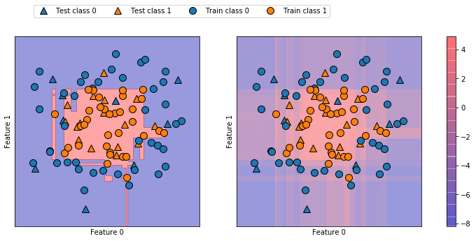
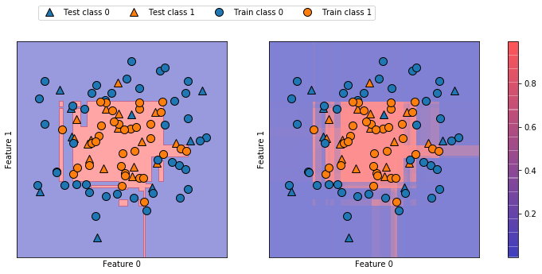

04 クラス分類器の不確実性推定
========================

* scikit-learnインターフェースの有用な機能として、クラス分類器の予測に対する不確実性推定機能がある

    * あるテストポイントに対して、クラス分類器が出力する予測クラスだけでなく、その予測がどのくらい確かなのかを知りたい

    * 例)ガンかどうかを調べる際に、間違いの種類によって結果が大きく異なる

* scikit-learnには、クラス分類器の不確実推定に利用できる関数が2種類ある

    * `decision_function`と`predict_proba`が挙げられる

    * scikit-learnのクラス分類器のほとんどは、少なくともどちらかを実装しており、多くは両方を実装している

    * 合成2次元データセットを、`GradientBoostingClassifier`で分類した際のこれらの関数の動作を見ていく

    * `GradientBoostingClassifier`は、`decision_function`と`predict_proba`の両方を実装している


```python
from sklearn.ensemble import GradientBoostingClassifier
from sklearn.datasets import make_circles
import numpy as np
from sklearn.model_selection import train_test_split

X, y = make_circles(noise=0.25, factor=0.5, random_state=1)

# わかりやすいようにクラスを"blue"と"red"にする
y_named = np.array(["blue", "red"])[y]

# train_test_splitは任意の数の配列に適用できる
# 全ての配列は整合するように分割される
X_train, X_test, y_train_named, y_test_named, y_train, y_test = train_test_split(X, y_named, y, random_state=0)

# 勾配ブースティングモデルを構築
gbrt = GradientBoostingClassifier(random_state=0)
gbrt.fit(X_train, y_train_named)
```


    GradientBoostingClassifier(criterion='friedman_mse', init=None,
                  learning_rate=0.1, loss='deviance', max_depth=3,
                  max_features=None, max_leaf_nodes=None,
                  min_impurity_decrease=0.0, min_impurity_split=None,
                  min_samples_leaf=1, min_samples_split=2,
                  min_weight_fraction_leaf=0.0, n_estimators=100,
                  n_iter_no_change=None, presort='auto', random_state=0,
                  subsample=1.0, tol=0.0001, validation_fraction=0.1,
                  verbose=0, warm_start=False)


## 1. 決定関数(Decision Function)

* 2クラス分類の場合、`decision_function`の結果の配列は`(n_samples,)`の形になり、サンプルごとに1つの浮動小数点数が返される


```python
print("X_test.shape: {}".format(X_test.shape))
print("Decision function shape: {}".format(gbrt.decision_function(X_test).shape))
```

    X_test.shape: (25, 2)
    Decision function shape: (25,)


* この値には、あるデータポイントが「陽性」(クラス1)であると、モデルが信じている度合いがエンコードされている

    * 正であれば陽性クラスを、負であれば「陰性」(陽性以外)クラスを意味する


```python
# decision_functionの最初のいくつかを表示
print("Decision function:\n{}".format(gbrt.decision_function(X_test)[:6]))
```

    Decision function:
    [ 4.13592629 -1.7016989  -3.95106099 -3.62599351  4.28986668  3.66166106]


* 決定関数の符号だけ見れば、予測クラスがわかる


```python
print("Thresholded decision function:\n{}".format(gbrt.decision_function(X_test) > 0))
print("Predictions:\n{}".format(gbrt.predict(X_test)))
```

    Thresholded decision function:
    [ True False False False  True  True False  True  True  True False  True
      True False  True False False False  True  True  True  True  True False
     False]
    Predictions:
    ['red' 'blue' 'blue' 'blue' 'red' 'red' 'blue' 'red' 'red' 'red' 'blue'
     'red' 'red' 'blue' 'red' 'blue' 'blue' 'blue' 'red' 'red' 'red' 'red'
     'red' 'blue' 'blue']


* 2クラス分類では、「陰性」クラスが`classes_`属性の第1エントリに、「陽性」クラスが第2エントリになる

* 完全に`predict`と同じ結果を再現したければ、`classes_`属性を使えば良い


```python
# True/Falseを0/1に
greater_zero = (gbrt.decision_function(X_test) > 0).astype(int)

# 0/1をclasses_のインデックスに使う
pred = gbrt.classes_[greater_zero]

# predはgbrt.predictの出力と同じになる
print("pred is equal to predictions: {}".format(np.all(pred == gbrt.predict(X_test))))
```

    pred is equal to predictions: True


* `decision_function`のレンジは決まっておらず、データとモデルパラメータに依存する


```python
decision_function = gbrt.decision_function(X_test)
print("Decision function minimum: {:.2f} maximum: {:.2f}".format(np.min(decision_function), np.max(decision_function)))
```

    Decision function minimum: -7.69 maximum: 4.29


* このように、`decision_function`の結果は、どのようなスケールで表示されるかわからないので、解釈が難しい

* 以下の図のプロットは、決定境界と、2次元平面上の全ての点に対する`decision_function`の値で色をつけた図を並べたもの

    * 訓練データポイントは円で、テストデータポイントは三角で表している


```python
import matplotlib.pyplot as plt
import mglearn
%matplotlib inline

fig, axes = plt.subplots(1, 2, figsize=(13, 5))
mglearn.tools.plot_2d_separator(gbrt, X, ax=axes[0], alpha=.4, fill=True, cm=mglearn.cm2)
scores_image = mglearn.tools.plot_2d_scores(gbrt, X, ax=axes[1], alpha=.4, cm=mglearn.ReBl)

for ax in axes:
    # 訓練データポイントとテストデータポイントをプロット
    mglearn.discrete_scatter(X_test[:, 0], X_test[:, 1], y_test, markers='^', ax=ax)
    mglearn.discrete_scatter(X_train[:, 0], X_train[:, 1], y_train, markers='o', ax=ax)
    ax.set_xlabel("Feature 0")
    ax.set_ylabel("Feature 1")

cbar = plt.colorbar(scores_image, ax=axes.tolist())
axes[0].legend(["Test class 0", "Test class 1", "Train class 0", "Train class 1"], ncol=4, loc=(.1, 1.1))
```


    <matplotlib.legend.Legend at 0x1174ae518>





* 予測された結果だけではなく、確信度についても表現されている

* しかし、このようにし可視化しても2つのクラスの境界はわかりにくい

## 2. 確率の予測

* `predict_proba`の出力は、それぞれのクラスに属する確率で、`decision_function`の出力よりも理解しやすい

* 出力配列の形は、2クラス分類問題では、常に`(n_samples, 2)`になる


```python
print("Shape of probabilities: {}".format(gbrt.predict_proba(X_test).shape))
```

    Shape of probabilities: (25, 2)


* 各行の第1エントリは第1クラスの予測確率で、第2エントリは第2クラスの予測確率である

* 確率なので、`predict_proba`の出力は常に0から1であり、双方の和は常に1になっている


```python
# predict_probaの出力の最初の数行を見る
print("Predicted probabilities:\n{}".format(gbrt.predict_proba(X_test[:6])))
```

    Predicted probabilities:
    [[0.01573626 0.98426374]
     [0.84575649 0.15424351]
     [0.98112869 0.01887131]
     [0.97406775 0.02593225]
     [0.01352142 0.98647858]
     [0.02504637 0.97495363]]


* 2つのクラスの確率の和が1なので、どちらかが50%以上の確率(確信度)になっており、そのクラスが予測クラスとなる

* 上の出力では、このクラス分類器は多くの点について比較的確信度が高いことがわかる

    * 出力される確信度が、実際のデータポイントに対する正答率を反映しているかは、モデルやパラメータに依存する

    * 過剰適合したモデルは、間違っている場合でさえ、高い確信度で予測する傾向にある

    * 複雑さが低いモデルの予測は確信度が低い

    * あるモデルが報告する確信度が、実際の正答率と一致している場合、**較正されている**という

    * 例：70%のデータポイントに対して、70%の確率で正答できる場合に、そのモデルは較正されている

* 以下の図に、データセットの決定境界線とクラス1になる確率を示す


```python
fig, axes = plt.subplots(1, 2, figsize=(13, 5))

mglearn.tools.plot_2d_separator(gbrt, X, ax=axes[0], alpha=.4, fill=True, cm=mglearn.cm2)
scores_image = mglearn.tools.plot_2d_scores(gbrt, X, ax=axes[1], alpha=.5, cm=mglearn.ReBl, function='predict_proba')

for ax in axes:
    # 訓練データポイントとテストデータポイントをプロット
    # plot training and test points
    mglearn.discrete_scatter(X_test[:, 0], X_test[:, 1], y_test, markers='^', ax=ax)
    mglearn.discrete_scatter(X_train[:, 0], X_train[:, 1], y_train, markers='o', ax=ax)
    ax.set_xlabel("Feature 0")
    ax.set_ylabel("Feature 1")

cbar = plt.colorbar(scores_image, ax=axes.tolist())
axes[0].legend(["Test class 0", "Test class 1", "Train class 0", "Train class 1"], ncol=4, loc=(.1, 1.1))
```


    <matplotlib.legend.Legend at 0x115c79860>





* この図では境界がはっきりしており、わずかに存在する確信度が低い領域もはっきりわかる

* scikit-learnのWebサイトでは、様々なモデルによる不確実性推定の結果が比較されている

## 3. 多クラス分類の不確実性

* `decision_function`メソッドと`predict_proba`メソッドは、多クラス分類に対しても利用できる

* 3クラス分類問題であるirisデータセットに対しても適用してみる


```python
from sklearn.datasets import load_iris

iris = load_iris()
X_train, X_test, y_train, y_test = train_test_split(iris.data, iris.target, random_state=42)

gbrt = GradientBoostingClassifier(learning_rate=0.01, random_state=0)
gbrt.fit(X_train, y_train)
```


    GradientBoostingClassifier(criterion='friedman_mse', init=None,
                  learning_rate=0.01, loss='deviance', max_depth=3,
                  max_features=None, max_leaf_nodes=None,
                  min_impurity_decrease=0.0, min_impurity_split=None,
                  min_samples_leaf=1, min_samples_split=2,
                  min_weight_fraction_leaf=0.0, n_estimators=100,
                  n_iter_no_change=None, presort='auto', random_state=0,
                  subsample=1.0, tol=0.0001, validation_fraction=0.1,
                  verbose=0, warm_start=False)


```python
print("Decision function shape: {}".format(gbrt.decision_function(X_test).shape))
# 決定関数の最初のいくつかを表示
print("Decision function:\n{}".format(gbrt.decision_function(X_test)[:6, :]))
```

    Decision function shape: (38, 3)
    Decision function:
    [[-0.52931069  1.46560359 -0.50448467]
     [ 1.51154215 -0.49561142 -0.50310736]
     [-0.52379401 -0.4676268   1.51953786]
     [-0.52931069  1.46560359 -0.50448467]
     [-0.53107259  1.28190451  0.21510024]
     [ 1.51154215 -0.49561142 -0.50310736]]


* 多クラス問題の場合には、`decision_function`の結果は、`(n_samples, n_classes)`の形の配列になる

    * 各列は個々のクラスに対する「確信度スコア」で、大きいとそのクラスである可能性が高く、小さくなると可能性が低くなる

    * 各データポイントに対して、確信度スコアが最大になるクラスを選ぶことで予測クラスが得られる


```python
print("Argmax of decision function:\n{}".format(np.argmax(gbrt.decision_function(X_test), axis=1)))
print("Predictions:\n{}".format(gbrt.predict(X_test)))
```

    Argmax of decision function:
    [1 0 2 1 1 0 1 2 1 1 2 0 0 0 0 1 2 1 1 2 0 2 0 2 2 2 2 2 0 0 0 0 1 0 0 2 1
     0]
    Predictions:
    [1 0 2 1 1 0 1 2 1 1 2 0 0 0 0 1 2 1 1 2 0 2 0 2 2 2 2 2 0 0 0 0 1 0 0 2 1
     0]


* `predict_proba`の出力も、同じ`(n_samples, n_classes)`の形の配列となる

    * 各クラスになる確率の和は1となる


```python
# predict_probaの結果の最初の数行を表示
print("Predicted probabilities:\n{}".format(gbrt.predict_proba(X_test)[:6]))

# 各行の和がゼロになることを確認
print("Sums: {}".format(gbrt.predict_proba(X_test)[:6].sum(axis=1)))
```

    Predicted probabilities:
    [[0.10664722 0.7840248  0.10932798]
     [0.78880668 0.10599243 0.10520089]
     [0.10231173 0.10822274 0.78946553]
     [0.10664722 0.7840248  0.10932798]
     [0.10825347 0.66344934 0.22829719]
     [0.78880668 0.10599243 0.10520089]]
    Sums: [1. 1. 1. 1. 1. 1.]


* `predict_proba`の`argmax`を取ることで、予測クラスを再現してみる


```python
print("Argmax of predicted probabilities:\n{}".format(np.argmax(gbrt.predict_proba(X_test), axis=1)))
print("Predictions:\n{}".format(gbrt.predict(X_test)))
```

    Argmax of predicted probabilities:
    [1 0 2 1 1 0 1 2 1 1 2 0 0 0 0 1 2 1 1 2 0 2 0 2 2 2 2 2 0 0 0 0 1 0 0 2 1
     0]
    Predictions:
    [1 0 2 1 1 0 1 2 1 1 2 0 0 0 0 1 2 1 1 2 0 2 0 2 2 2 2 2 0 0 0 0 1 0 0 2 1
     0]


* `predict_proba`と`decision_function`の結果は`(n_samples, n_classes)`の形の配列になるが、2クラス分類の場合の`decision_function`だけが例外

    * 2クラス分類の場合の`decision_function`には「陽性」クラスである`classes_[1]`に対応する1列しかない

    * これは、歴史的な経緯によるものである

* クラスの数だけ列がある場合には、列に対して`argmax`を計算すれば、予測を再現できる

    * ただし、クラスが文字列だったり、0から始まる整数で表現されていない場合には注意が必要

    * `predict`で得られた結果を、`decision_functino`や`predict_proba`で得られた結果と比較する際には、クラス分類器の`classes_`属性を使って、実際のクラス名を使うようにする必要がある


```python
from sklearn.linear_model import LogisticRegression

logreg = LogisticRegression()

# irisデータセットのクラス名で表示する
named_target = iris.target_names[y_train]
logreg.fit(X_train, named_target)
print("unique classes in training data: {}".format(logreg.classes_))
print("predictions: {}".format(logreg.predict(X_test)[:10]))
argmax_dec_func = np.argmax(logreg.decision_function(X_test), axis=1)
print("argmax of decision function: {}".format(argmax_dec_func[:10]))
print("argmax combined with classes_: {}".format(logreg.classes_[argmax_dec_func][:10]))
```

    unique classes in training data: ['setosa' 'versicolor' 'virginica']
    predictions: ['versicolor' 'setosa' 'virginica' 'versicolor' 'versicolor' 'setosa'
     'versicolor' 'virginica' 'versicolor' 'versicolor']
    argmax of decision function: [1 0 2 1 1 0 1 2 1 1]
    argmax combined with classes_: ['versicolor' 'setosa' 'virginica' 'versicolor' 'versicolor' 'setosa'
     'versicolor' 'virginica' 'versicolor' 'versicolor']


    /Users/MacUser/anaconda2/envs/tf140/lib/python3.6/site-packages/sklearn/linear_model/logistic.py:433: FutureWarning: Default solver will be changed to 'lbfgs' in 0.22. Specify a solver to silence this warning.
      FutureWarning)
    /Users/MacUser/anaconda2/envs/tf140/lib/python3.6/site-packages/sklearn/linear_model/logistic.py:460: FutureWarning: Default multi_class will be changed to 'auto' in 0.22. Specify the multi_class option to silence this warning.
      "this warning.", FutureWarning)


|  版  |   年/月/日   |
|-----|-----------------|
|初版|2019/03/11|
|第二版|2019/05/05|
