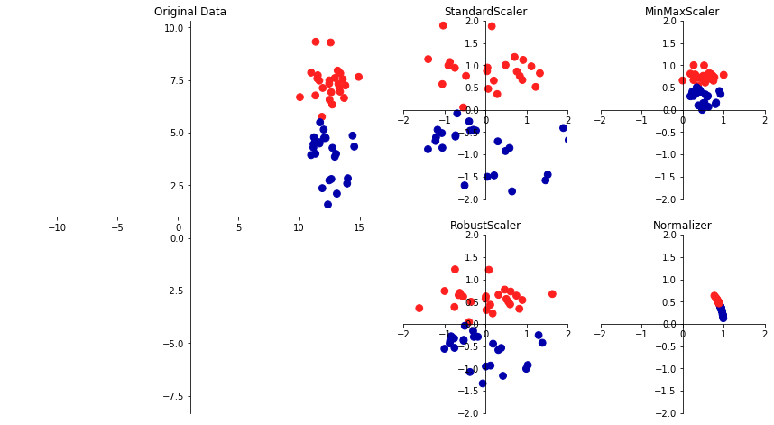

03 前処理とスケール変換
=================

* `ニューラルネットワーク`や`SVM`などのアルゴリズムは、データのスケール変換に非常に敏感であることを見た

    * したがって、これらのアルゴリズムに適したデータ表現に変換することが広く行われている

    * よく使われるのは、特徴量ごとにスケールを変更してずらす方法である


```python
%matplotlib inline
import mglearn

mglearn.plots.plot_scaling()
```





## 1. さまざまな前処理

* 上の図のプロットは、2特徴量2クラス分類合成データセットである

    * 第1の特徴量($x$軸)は、10から15の間に、第2の特徴量($y$軸)は1から9の間にある

* その隣の4つのプロットは、データを標準的なレンジに変換する4つの方法を示している

    * scikit-learnの`StandartScaler`は、個々の特徴量の平均が0で分散が1になるように変換し、全ての特徴量の大きさを揃えてくれる

    * しかし、この方法は特徴量の最大値や最小値がある範囲に入ることを保証するものではない

    * `RobustScaler`の動作は、個々の特徴量が一定の範囲に入るように変換するという意味では、`StandartScaler`に近い

    * しかし、`RobustScaler`は、平均値の分散の代わりに、中央値と四分位数を用いる

    * そのため、`RobustScaler`は、極端に他の値と異なるような値(測定エラーなど)を無視する

    * この点は**外れ値**と呼ばれ、他のスケール変換方法では問題になる

* これに対して、`MinMaxScaler`は、データがちょうど0から1の間に入るように変換する

    * 2次元データセットで考えると、$x$軸が0から1、$y$軸が0から1の正方形に全てのデータが入るように変換することになる

* 最後の`Normalizer`の変換は、他のものとはかなり異なる

    * このクラスは、個々のデータポイントを、特徴量ベクトルがユークリッド長1になるように変換する

    * 言い換えると、データポイントを、半径1の円(より高次元なら超球面)に投射する

    * したがって、全てのデータポイントに対してそれぞれ異なるスケール変換が行われる(元のユークリッド長の逆数をかける)

    * この変換は、特徴ベクトルの長さではなく、方向(もしくは角度)だけが問題になる場合に用いられる

## 2. データ変換の適用

* `cancer`データセットを用いて、スケール変換器などの前処理手法を用いる(教師あり学習アルゴリズムを適用する前に用いる)

    * 例として、カーネル法を用いたSVM(SVC)を`cancer`データセットに適用し、`MinMaxScaler`を前処理に用いるとする

    * まず、データセットをロードして訓練セットとテストセットに分割する(前処理した後に構築する教師ありモデルを評価するために、分けておく)


```python
from sklearn.datasets import load_breast_cancer
from sklearn.model_selection import train_test_split
cancer = load_breast_cancer()

X_train, X_test, y_train, y_test = train_test_split(cancer.data, cancer.target, random_state=1)

print(X_train.shape)
print(X_test.shape)
```

    (426, 30)
    (143, 30)


* このデータセットには30の測定結果を表す569のデータポイントがある

    * これを、訓練セット426サンプルと、テストセット143サンプルに分割した

* 教師ありモデルを作った際と同じように、まず前処理を実装したクラスをインポートし、インスタンスを生成する


```python
from sklearn.preprocessing import MinMaxScaler

scaler = MinMaxScaler()
```

* 次に、`fit`メソッドを訓練データに対して適用して、スケール変換器を適合させる

    * `MinMaxScaler`の場合は、`fit`メソッドは訓練データ中の各特徴量の最小値と最大値を計算する

    * 今日りあり学習で見たクラス分類器や回帰と異なり、スケール変換器の`fit`メソッドにはデータ(`X_train`)のみを与え、`y_train`は用いない


```python
scaler.fit(X_train)
```


    MinMaxScaler(copy=True, feature_range=(0, 1))


* 学習した変換を適用する(実際に訓練データを**スケール変換**)するには、スケール変換器の`transform`メソッドを用いる

    * scikit-learnでは、モデルが新しいデータ表現を返す際には常に`transform`メソッドが用いられる


```python
# データを変換
X_train_scaled = scaler.transform(X_train)

# スケール変換の前後のデータ特性をプリント
print("transformed shape: {}".format(X_train_scaled.shape))
print("per-feature minimum before scaling:\n {}".format(X_train.min(axis=0)))
print("per-feature maximum before scaling:\n {}".format(X_train.max(axis=0)))
print("per-feature minimum after scaling:\n {}".format(X_train_scaled.min(axis=0)))
print("per-feature maximum after scaling:\n {}".format(X_train_scaled.max(axis=0)))
```

    transformed shape: (426, 30)
    per-feature minimum before scaling:
     [6.981e+00 9.710e+00 4.379e+01 1.435e+02 5.263e-02 1.938e-02 0.000e+00
     0.000e+00 1.060e-01 5.024e-02 1.153e-01 3.602e-01 7.570e-01 6.802e+00
     1.713e-03 2.252e-03 0.000e+00 0.000e+00 9.539e-03 8.948e-04 7.930e+00
     1.202e+01 5.041e+01 1.852e+02 7.117e-02 2.729e-02 0.000e+00 0.000e+00
     1.566e-01 5.521e-02]
    per-feature maximum before scaling:
     [2.811e+01 3.928e+01 1.885e+02 2.501e+03 1.634e-01 2.867e-01 4.268e-01
     2.012e-01 3.040e-01 9.575e-02 2.873e+00 4.885e+00 2.198e+01 5.422e+02
     3.113e-02 1.354e-01 3.960e-01 5.279e-02 6.146e-02 2.984e-02 3.604e+01
     4.954e+01 2.512e+02 4.254e+03 2.226e-01 9.379e-01 1.170e+00 2.910e-01
     5.774e-01 1.486e-01]
    per-feature minimum after scaling:
     [0. 0. 0. 0. 0. 0. 0. 0. 0. 0. 0. 0. 0. 0. 0. 0. 0. 0. 0. 0. 0. 0. 0. 0.
     0. 0. 0. 0. 0. 0.]
    per-feature maximum after scaling:
     [1. 1. 1. 1. 1. 1. 1. 1. 1. 1. 1. 1. 1. 1. 1. 1. 1. 1. 1. 1. 1. 1. 1. 1.
     1. 1. 1. 1. 1. 1.]


* 変換されたデータの配列は、元のデータのものと同じ形をしている

    * 特徴量がシフトされ、スケール変換されているだけ

    * 全ての特徴量が、望んだ通り0と1になっている

* SVMをスケール変換されたデータに適用するには、テストセットの方も変換する必要がある

    * ここでも、`transform`メソッドを用いるが、今度は`X_test`に適用する


```python
# テストデータを変換
X_test_scaled = scaler.transform(X_test)

# スケール変換の前後のデータ特性をプリント
print("per-feature minimum after scaling:\n{}".format(X_test_scaled.min(axis=0)))
print("per-feature maximum after scaling:\n{}".format(X_test_scaled.max(axis=0)))
```

    per-feature minimum after scaling:
    [ 0.0336031   0.0226581   0.03144219  0.01141039  0.14128374  0.04406704
      0.          0.          0.1540404  -0.00615249 -0.00137796  0.00594501
      0.00430665  0.00079567  0.03919502  0.0112206   0.          0.
     -0.03191387  0.00664013  0.02660975  0.05810235  0.02031974  0.00943767
      0.1094235   0.02637792  0.          0.         -0.00023764 -0.00182032]
    per-feature maximum after scaling:
    [0.9578778  0.81501522 0.95577362 0.89353128 0.81132075 1.21958701
     0.87956888 0.9333996  0.93232323 1.0371347  0.42669616 0.49765736
     0.44117231 0.28371044 0.48703131 0.73863671 0.76717172 0.62928585
     1.33685792 0.39057253 0.89612238 0.79317697 0.84859804 0.74488793
     0.9154725  1.13188961 1.07008547 0.92371134 1.20532319 1.63068851]


* テストセットの場合には、スケール変換後の最小値と最大値が0と1になっていない

    * 特徴量によっては、0と1の範囲から出てしまている

    * これは、`MinMaxScaler`が常に訓練データとテストデータに、全く同じ変換を施すため

    * `transform`メソッドは、常に訓練データの最小値を引き、訓練データのレンジで割る

    * これらの値は、テストセットの最小値やレンジとは違う場合もある

## 3. 訓練データとテストデータを同じように変換する

* 教師ありモデルをテストセットに対して適用する際に、テストセットと訓練セットと全く同じように変換することは重要である

* 下の例では、テストセットの最小値とレンジを使うと何が起こるかを示している


```python
from sklearn.datasets import make_blobs
import matplotlib.pyplot as plt

# 合成データを作成
X, _ = make_blobs(n_samples=50, centers=5, random_state=4, cluster_std=2)
# 訓練セットとデータセットに分割
X_train, X_test = train_test_split(X, random_state=5, test_size=.1)

# 訓練セットとテストセットをプロット
fig, axes = plt.subplots(1, 3, figsize=(13, 4))
axes[0].scatter(X_train[:, 0], X_train[:, 1], c=mglearn.cm2(0), label="Training set", s=60)
axes[0].scatter(X_test[:, 0], X_test[:, 1], marker='^', c=mglearn.cm2(1), label="Test set", s=60)
axes[0].legend(loc='upper left')
axes[0].set_title("Original Data")

# MinMaxScalerでデータをスケール変換
scaler = MinMaxScaler()
scaler.fit(X_train)
X_train_scaled = scaler.transform(X_train)
X_test_scaled = scaler.transform(X_test)

# スケール変換されたデータの特性を可視化
axes[1].scatter(X_train_scaled[:, 0], X_train_scaled[:, 1], c=mglearn.cm2(0), label="Training set", s=60)
axes[1].scatter(X_test_scaled[:, 0], X_test_scaled[:, 1], marker='^', c=mglearn.cm2(1), label="Test set", s=60)
axes[1].set_title("Scaled Data")

# テストセットを訓練セットとは別にスケール変換
# 最小値と最大値が0,1になる。ここでは説明のためにわざとやっている
# *実際にはやってはいけない*
test_scaler = MinMaxScaler()
test_scaler.fit(X_test)
X_test_scaled_badly = test_scaler.transform(X_test)

# 間違ってスケール変換されたデータを可視化
axes[2].scatter(X_train_scaled[:, 0], X_train_scaled[:, 1], c=mglearn.cm2(0), label="training set", s=60)
axes[2].scatter(X_test_scaled_badly[:, 0], X_test_scaled_badly[:, 1], marker='^', c=mglearn.cm2(1), label="test set", s=60)
axes[2].set_title("Improperly Scaled Data")

for ax in axes:
    ax.set_xlabel("Feature 0")
    ax.set_ylabel("Feature 1")
```

    'c' argument looks like a single numeric RGB or RGBA sequence, which should be avoided as value-mapping will have precedence in case its length matches with 'x' & 'y'.  Please use a 2-D array with a single row if you really want to specify the same RGB or RGBA value for all points.
    'c' argument looks like a single numeric RGB or RGBA sequence, which should be avoided as value-mapping will have precedence in case its length matches with 'x' & 'y'.  Please use a 2-D array with a single row if you really want to specify the same RGB or RGBA value for all points.
    'c' argument looks like a single numeric RGB or RGBA sequence, which should be avoided as value-mapping will have precedence in case its length matches with 'x' & 'y'.  Please use a 2-D array with a single row if you really want to specify the same RGB or RGBA value for all points.
    'c' argument looks like a single numeric RGB or RGBA sequence, which should be avoided as value-mapping will have precedence in case its length matches with 'x' & 'y'.  Please use a 2-D array with a single row if you really want to specify the same RGB or RGBA value for all points.
    'c' argument looks like a single numeric RGB or RGBA sequence, which should be avoided as value-mapping will have precedence in case its length matches with 'x' & 'y'.  Please use a 2-D array with a single row if you really want to specify the same RGB or RGBA value for all points.
    'c' argument looks like a single numeric RGB or RGBA sequence, which should be avoided as value-mapping will have precedence in case its length matches with 'x' & 'y'.  Please use a 2-D array with a single row if you really want to specify the same RGB or RGBA value for all points.


* 最初のパネルは、変換されていない2次元のデータセットである

    * 訓練セットは丸で、テストセットは三角で表されている

* 2つ目のパネルは同じデータを`MinMaxScaler`で変換したものである

    * ここでは、訓練セットに対して`fit`したものを使って、訓練セットとテストセットを`transform`している

    * 2つ目のパネルのデータセットは、グラフ軸の目盛りが変わっただけで、最初のものと全く同じに見える

    * 全ての特徴量が0と1の間にあるわけではない

* 3つ目のパネルは、訓練セットとテストセットを別々に変換した場合を示している

    * この場合、特徴量の最小値と最大値は、テストデータポイントと訓練データポイントが別々に変換されている

    * そのため、お互いに対して動いてしまっている(データを勝手に動かしてしまった)

* テストセットが1点しかなかったら、`MinMaxScaler`の最大値最小値に対する要求を満たすように、1点をスケール変換する方法はない

    * しかし、テストセットの大きさによって前処理の方法を変更するのはおかしい

## 4. 教師あり学習における前処理の効果

* `cancer`データセットに戻って、SVCの学習に対する`MinMaxScaler`の効果を見てみる

    * まず、比較のために、元のデータに対して再びSVCを訓練する


```python
from sklearn.svm import SVC

X_train, X_test, y_train, y_test = train_test_split(cancer.data, cancer.target, random_state=0)

svm = SVC(C=100)
svm.fit(X_train, y_train)
print("Test set accuracy: {:.2f}".format(svm.score(X_test, y_test)))
```

    Test set accuracy: 0.63


    /Users/MacUser/anaconda2/envs/tf140/lib/python3.6/site-packages/sklearn/svm/base.py:196: FutureWarning: The default value of gamma will change from 'auto' to 'scale' in version 0.22 to account better for unscaled features. Set gamma explicitly to 'auto' or 'scale' to avoid this warning.
      "avoid this warning.", FutureWarning)


* さて、今度はSVCに掛ける前に、`MinMaxScaler`を使ってスケール変換をする


```python
# 0~1スケール変換で前処理
scaler = MinMaxScaler()
scaler.fit(X_train)
X_train_scaled = scaler.transform(X_train)
X_test_scaled = scaler.transform(X_test)

# 変換された訓練データで学習
svm.fit(X_train_scaled, y_train)

# 変換されたテストセットでスコア計算
print("Scaled test set accuracy: {:.2f}".format(svm.score(X_test_scaled, y_test)))
```

    Scaled test set accuracy: 0.97


    /Users/MacUser/anaconda2/envs/tf140/lib/python3.6/site-packages/sklearn/svm/base.py:196: FutureWarning: The default value of gamma will change from 'auto' to 'scale' in version 0.22 to account better for unscaled features. Set gamma explicitly to 'auto' or 'scale' to avoid this warning.
      "avoid this warning.", FutureWarning)


* ここで示したように、データに対するスケール変換の影響は非常に大きい

    * スケール変換には複雑な数学は使われていないが、自分で再実装するよりは、scikit-learnが用意しているスケール変換機構を使った方が良い

* さらに、前処理のアルゴリズムを置き換えるのも、利用するクラスを変えるだけでできる。

    * 前処理のクラスはどれも、`fit`メソッドと`transform`メソッドの同じインターフェースを持つため


```python
# 平均を0に、分散を1に前処理
from sklearn.preprocessing import StandardScaler
scaler = StandardScaler()
scaler.fit(X_train)
X_train_scaled = scaler.transform(X_train)
X_test_scaled = scaler.transform(X_test)

# 変換された訓練データで学習
svm.fit(X_train_scaled, y_train)

# 変換されたテストセットでスコア計算
print("SVM test accuracy: {:.2f}".format(svm.score(X_test_scaled, y_test)))
```

    SVM test accuracy: 0.96


* ここまでは、前処理のためのデータ変換が簡単に使えることがわかった

* 次は、教師なし学習を持ちたもっと面白いデータ変換を見ていく


| 版     | 年/月/日   |
| ------ | ---------- |
| 初版   | 2019/03/11 |
| 第二版 | 2019/05/05 |
