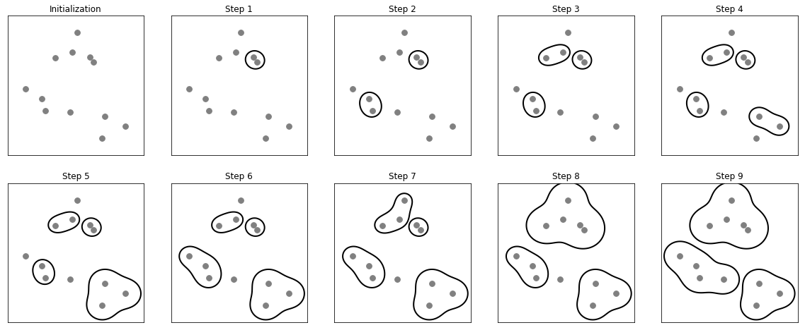
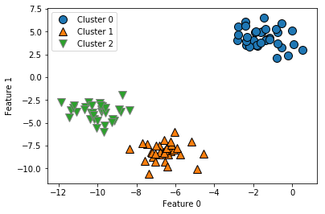
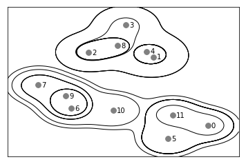
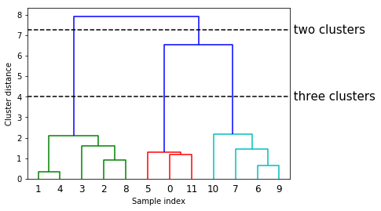

02 凝集型クラスタリング
====================

* `凝集型クラスタリング`：ある原則に基づく一連のクラスタリングアルゴリズムである

    * これらのアルゴリズムは、個々のデータポイントをそれぞれ個別のクラスタとして開始し、最も類似した2つのクラスタを併合していく

    * これを何らかの終了条件が満たされるまで繰り返す

    * scikit-learnに実装されている終了条件はクラスタの数

    * つまり、指定した数のクラスタだけが残るまで、似たクラスタを併合し続ける

    * 「最も類似したクラスタ」を決定する**連結**度には様々なものがある

    * この連結度は常に、2つの既存クラスタ間に定義される

scikit-learnには、次の3つが実装されている

* `ward`：デフォルト。

    * `ward`は、併合した際にクラスタ内の分散の増分が最小になるように2つのクラスタを選択する

    * 多くの場合比較的同じサイズのクラスタとなる

* `average`：

    * `average`連結度を用いると、クラスタ間の全てのポイント間の距離の平均値が最小の2つのクラスタを併合する

* `complete`：

    * `complete連結度`(最大連結度)は、2つのクラスタの点間の距離の最大値が最小となるものを併合する

* `ward`はほどんどどのデータセットでうまくいくので、以下の例では`ward`を用いる

    * クラスタによってデータポイントの数が極端に違う場合(例：1つだけ他のものよりもずっと大きいような場合)、他の種類がうまくいく可能性がある

* 以下の図に示すデータプロットは、2次元データセットに対して、凝集型クラスタリングで3つのクラスタを探す進行過程を示したもの


```python
%matplotlib inline
import mglearn
mglearn.plots.plot_agglomerative_algorithm()
```





* 最初は各ポイントがそれぞれクラスタになっている

* ステップごとに、最も近い2つのクラスタが併合される

    * 最初の4ステップでは、2つの1点クラスタが選ばれて、2点クラスタに併合される

    * 第5ステップでは、2点クラスタの1つに3つ目の点が併合されている

    * 第9ステップの段階で3つのクラスタしか残っていない

    * 最初に3クラスタを指定したので、アルゴリズムはここで停止する

* これまで使ってきた簡単な3クラスタデータに対して、凝集型クラスタリングがどのように機能するかを見てみる

    * アルゴリズムの動作の関係上、凝集型クラスタリングは新しいデータに対して予測をすることができない

    * このため、`AgglomerativeClustering`には`predict`メソッドがない

    * モデルを作って、訓練セットに対する所属クラスタを得るには、`fit_predict`を用いる

    * 結果を以下の図にしめす


```python
import matplotlib.pyplot as plt
from sklearn.datasets import make_blobs
from sklearn.cluster import AgglomerativeClustering
X, y = make_blobs(random_state=1)

agg = AgglomerativeClustering(n_clusters=3)
assignment = agg.fit_predict(X)

mglearn.discrete_scatter(X[:, 0], X[:, 1], assignment)
plt.legend(["Cluster 0", "Cluster 1", "Cluster 2"], loc="best")
plt.xlabel("Feature 0")
plt.ylabel("Feature 1")
```


    Text(0, 0.5, 'Feature 1')





* 予測される通り、クラスタは完全に再現されている

*　scikit-learnの凝集型クラスタリング実装では、クラスタ数を指定しなければならない

* 凝集型クラスタリングメソッドは、正しいクラスタ数を選択する手助けをしてくれる

## 1. 階層型クラスタリングとデンドログラム

* 凝集型クラスタリングを行うと、いわゆる`階層型クラスタリング`が行われる

    * このクラスタリングは同じ手続きを繰り返すことで行われる

    * 全ての点は、1点しか含まれていないクラスタから最後のクラスタのいずれかへと向かっていく

    * 繰り返しの各ステップ終了時のクラスタ数はそれぞれ異なる

    * 全ての可能なクラスタリングを合わせて表示すると役に立つ場合がある

* 以下の図は、すべてのクラスタリングを重ねて表示したもの

    * これを見ると、それぞれのクラスタがより小さいクラスタに分割されていることがわかる


```python
mglearn.plots.plot_agglomerative()
```





* この可視化によって階層化の詳細を理解することができる

    * しかし、データが2次元であるということに依存しているので、より多くの特徴量を持つデータセットではこの方法は利用できない

    * 一方、階層型クラスタリングを可視化するには、**デンドログラム** と呼ばれるもう一つの方法がある

    * この方法は多次元のデータセットを扱うことができる

* 残念なことに、scikit-learnは今のところデンドログラムの描画をサポートしていない

    * しかし、SciPyを使えば簡単にできる

    * SciPyのクラスタリングアルゴリズムのインターフェースは、scikit-learnのクラスタリングアルゴリズムとは若干異なる

* SciPyは、データ配列Xを取り、**連結性配列** を計算する関数を提供する

    * **連結性配列** には、階層的なクラスタの類似度がエンコードされている

    * この連結性配列をSciPyの`dendrogram`関数に与えると、デンドログラムが描写される


```python
# SciPyからデンドログラム関数とwardクラスタリング関数をインポート
from scipy.cluster.hierarchy import dendrogram, ward

X, y = make_blobs(random_state=0, n_samples=12)

# wardクラスタリングをデータ配列Xに適用
# SciPyのward関数は、凝集型クラスタリングを行った際のブリッジ距離を示す配列を返す
linkage_array = ward(X)

# このlinkage_arrayに書かれたクラスタ間距離をデンドログラムとしてプロットする
dendrogram(linkage_array)

# 2クラスタと3クラスタの部分での切断を表示
ax = plt.gca()
bounds = ax.get_xbound()
ax.plot(bounds, [7.25, 7.25], '--', c='k')
ax.plot(bounds, [4, 4], '--', c='k')

ax.text(bounds[1], 7.25, ' two clusters', va='center', fontdict={'size': 15})
ax.text(bounds[1], 4, ' three clusters', va='center', fontdict={'size': 15})
plt.xlabel("Sample index")
plt.ylabel("Cluster distance")
```


    Text(0, 0.5, 'Cluster distance')





* デンドログラムは、データポイントを一番下の点として表す(0から11までの番号が振られている)

    * 次に、これらのポイント(1点クラスタを示している)を葉として、2つのクラスタが結合されたものを新しいノードとして木構造をプロットする

* 下から上へと見ていくと、データポイント1と4がまず結合されている

    * 次に、データポイント6と9が結合され、というように続いていく

    * 一番上には2つの枝があり、一方の枝には11、0、5、10、7、6、9が、もう一方の枝には1、4、3、2、8が含まれている

    * これらは一番大きい2つのクラスタに対応する

* デンドログラムの $`y`$ 軸は凝集型クラスタリングアルゴリズムが、いつ2つのクラスタを併合したかを示しているだけではない

    * 枝の長さが、2つのクラスタがどれだけ離れていたかを示している

    * このデンドログラムで最も枝が長いのが、「three clusters」とラベルを付けた点線が交わっている3本の線

    * これらが最も長いということは、3クラスタから2クラスタに併合する際にはかなり離れた点を併合したということを意味する

    * この図の一番上で2つのクラスタを1つにまとめているが、この時にも比較的遠く離れたものを併合していることがわかる

* 残念ながら、凝集型クラスタリングでもtwo_moonsのような複雑な形状はうまく取り扱うことができない

| 版 | 年/月/日 |
|----|----------|
|初版|2019/03/17|
|第二版|2019/05/05|
