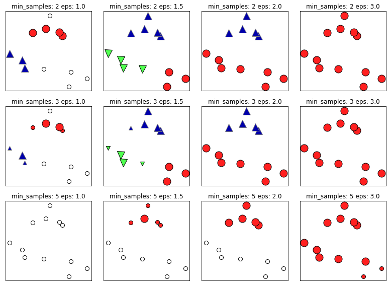
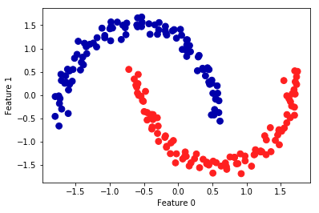

03 DBSCAN
==========

* `DBSCAN`：密度に基づくノイズあり空間クラスタリング

    * ユーザーがクラスタ数を**先験的**に与える必要がない

    * どのクラスタに属さない点を判別できること

    * 凝集型クラスタリングよりもk-meansよりも遅いが、比較的大きいデータセットにも適用できる

* `DBSCAN`は、特徴空間において、多くの点が近接しているような「混んでいる」領域に属する点を見つける

    * このような領域は特徴空間の**高密度**領域と呼ばれる

    * `DBSCAN`は、クラスタはデータ中で高密度領域を構成していて、比較的空虚な領域で区切られているという考え方に基づく

* 高密度領域の中にあるデータポイントは**コアサンプル**(コアポイント)と呼ばれ、以下のように定義される

    * `DBSCAN`には`min_samples`と`eps`という2つのパラメータがある

    * あるデータポイントから距離`eps`以内に`min_samples`以上のデータポイントがある場合に、そのデータポイントはコアサンプルとなる

    * `DBSCAN`では、`eps`以内にあるコアサンプルは同じクラスタに割り当てられる

* アルゴリズムは、まず適当に1つのデータポイントを選ぶことから始まる

    * そのデータポイントから距離`eps`以内にある全てのデータポイントを見つける

    * その数が`min_samples`以下であれば、その点はコアサンプルとなり、新しいクラスタレベルが割り当てられる

* 次に、`eps`以内にある全ての近傍点をテストする

    * それらの点がまだクラスタに割り当てられていなければ、今作ったばかりの新しいクラスタラベルを割り当てる

    * 近傍点がコアサンプルであれば、その近傍をさらにテストする

    * クラスタは、クラスタから`eps`以内にコアサンプルが存在しなくなるまで成長を続ける

    * これが終わると、まだ調べていない点を選んで、同じ手続きを繰り返す

* 最終的には3種類のデータポイントができる

    * コアポイント、コアポイントから距離`eps`以内にあるデータポイント(**境界ポイント**)と、ノイズである

* `DBSCAN`アルゴリズムをあるデータセットに対して何度か実行すると、コアポイントのクラスタリングとノイズになるデータポイントは、常に同じになる

    * しかし、境界ポイントは、複数のクラスタに属するコアサンプルの近傍点である場合がある

    * したがって、境界ポイントがどのクラスタに属するかは、テストされるデータポイントの順番によって変わる

    * 多くの場合、境界ポイントはごくわずかなので、この順番に対する依存性はそれほど問題にならない

* `DBSCAN`を凝集型クラスタリングで用いた合成データセットに適用してみる

    * 凝集型クラスタリングと同様に、`DBSCAN`でも新しいテストデータに対する予測を行うことはできない

    * 従って、`fit_predict`メソッドを使って、クラスタンリングとクラスタレベルの取得を一度に行う


```python
from sklearn.datasets import make_blobs
from sklearn.cluster import DBSCAN
X, y = make_blobs(random_state=0, n_samples=12)

dbscan = DBSCAN()
clusters = dbscan.fit_predict(X)
print("Cluster memberships:\n{}".format(clusters))
```

    Cluster memberships:
    [-1 -1 -1 -1 -1 -1 -1 -1 -1 -1 -1 -1]


* 結果を見ると、全てのデータポイントがノイズを表すラベル`-1`になっている

    * これは、`eps`と`min_samples`のデフォルト設定が、小さいトイデータセットに適していないからである

    * `min_samples`と`eps`を様々な値に設定してクラスタリングした結果を以下の図に示す


```python
%matplotlib inline
import mglearn
mglearn.plots.plot_dbscan()
```

    min_samples: 2 eps: 1.000000  cluster: [-1  0  0 -1  0 -1  1  1  0  1 -1 -1]
    min_samples: 2 eps: 1.500000  cluster: [0 1 1 1 1 0 2 2 1 2 2 0]
    min_samples: 2 eps: 2.000000  cluster: [0 1 1 1 1 0 0 0 1 0 0 0]
    min_samples: 2 eps: 3.000000  cluster: [0 0 0 0 0 0 0 0 0 0 0 0]
    min_samples: 3 eps: 1.000000  cluster: [-1  0  0 -1  0 -1  1  1  0  1 -1 -1]
    min_samples: 3 eps: 1.500000  cluster: [0 1 1 1 1 0 2 2 1 2 2 0]
    min_samples: 3 eps: 2.000000  cluster: [0 1 1 1 1 0 0 0 1 0 0 0]
    min_samples: 3 eps: 3.000000  cluster: [0 0 0 0 0 0 0 0 0 0 0 0]
    min_samples: 5 eps: 1.000000  cluster: [-1 -1 -1 -1 -1 -1 -1 -1 -1 -1 -1 -1]
    min_samples: 5 eps: 1.500000  cluster: [-1  0  0  0  0 -1 -1 -1  0 -1 -1 -1]
    min_samples: 5 eps: 2.000000  cluster: [-1  0  0  0  0 -1 -1 -1  0 -1 -1 -1]
    min_samples: 5 eps: 3.000000  cluster: [0 0 0 0 0 0 0 0 0 0 0 0]





* このプロットでは、クラスタに属するデータポイントには色を付けてあり、ノイズは白で表している

    * コアサンプルは大きいマーカで、境界点は小さいマーカでプロットしている

    * `eps`を増やす(図中で左から右へ)と、より多くの点がクラスタに含まれるようになる

    * こうするとクラスタが大きくなるが、複数のクラスタが併合されることになる

    * `min_samples`を増やす(図中で上から下へ)と、コアポイントになるデータポイントが少なくなり、より多くのデータポイントがノイズとなる


* どちらかといえば、`eps`のほうが重要である

    * このパラメータがデータポイントが「近い」ことの意味を決める

    * `eps`を極端に小さくすると、コアサンプルになるデータポイントがなくなり、すべてのデータポイントがノイズになる

    * 逆に`eps`を極端に大きくすると、すべてのデータポイントが1つのクラスタになってしまう

* `min_samples`の設定は、密度が低い領域にあるデータポイントが、外れ値(ノイズ)となるか、独自のクラスタになるかに影響する

    * `min_samples`を大きくすると、`min_samples`以下のデータポイントしか持たないクラスタは全て、ノイズとなってしまう

    * 従って、`min_samples`は最小のクラスタのサイズを決定することになる

* 上の図の`eps=1.5`で、`min_samples=3`から`min_samples=5`にした場合を見ると、よくわかる

    * `min_samples=3`：それぞれ4点、5点、3点を持つ3つのクラスタがある

    * `min_samples=3`：2つの小さなクラスタ(3点と4点)はノイズとなり、5点のクラスタだけが残っている

* `DBSCAN`ではクラスタの数を明示的に設定する必要はないが、`eps`の設定で暗黙にクラスタ数を制御することになる

    * 良い`eps`の値を見つけるには、`StandardScaler`や`MinMaxScaler`でスケール変換してからのほうが容易なことが多い

    * これらのスケール変換を行うと、すべての特徴量が同じ範囲になることが保証される

* 以下の図に、`DBSCAN`をtwo_moonsデータセットに適用した結果を示す

    * `DBSCAN`は2つの半円をデフォルトのパラメータ設定で見つけている


```python
from sklearn.datasets import make_moons
from sklearn.preprocessing import StandardScaler
import matplotlib.pyplot as plt
%matplotlib inline

X, y = make_moons(n_samples=200, noise=0.05, random_state=0)

# データを平均0、分散1にスケール変換
scaler = StandardScaler()
scaler.fit(X)
X_scaled = scaler.transform(X)

dbscan = DBSCAN()
clusters = dbscan.fit_predict(X_scaled)

# クラスタリング結果をプロット
plt.scatter(X_scaled[:, 0], X_scaled[:, 1], c=clusters, cmap=mglearn.cm2, s=60)
plt.xlabel("Feature 0")
plt.ylabel("Feature 1")
```


    Text(0, 0.5, 'Feature 1')





* 望ましいクラスタ数(2)を見つけているので、このパラメータ設定はうまくいっているように見える

    * `eps`をデフォルトの`0.5`から`0.2`に減らすと、8つのクラスタができてしまう

    * これは明らかに多すぎる(`eps`を`0.7`にするとクラスタは1つになる)

* `DBSCAN`を使う際には、得られたクラスタリング結果の取り扱いに注意が必要である

    * クラスタリング結果を別の配列のインデックスに不用意に使うと、ノイズを表す`-1`が予期しない影響をもたらす場合がある


| 版     | 年/月/日   |
| ------ | ---------- |
| 初版   | 2019/03/17 |
| 第二版 | 2019/05/05 |
