04 クラスタリングアルゴリズムの比較と評価
===================================

* `クラスタリングアルゴリズム`を利用する際に問題になることの1つに、

    * アルゴリズムがどの程度うまく機能したのかを判断し、各アルゴリズムの結果を比較することが難しいことが挙げられる

* これまでに`k-means`、`凝集型クラスタリング`、`DBSCAN`の背後にあるアルゴリズムを説明したので、実世界データセットを用いて比較する

## 1. 正解データを用いたクラスタリングの評価

* クラスタリングアルゴリズムの出力を、正解データクラスタリングと比較して評価するために用いられる指標がいくつかある

* 最も重要なものは、以下の2つ

    * `調整ランド指数`(ARI)

    * `正規化相互情報量`(NMI)

    * ただし、これらはいずれも定量的な指標で、最良の場合に1、関係ないクラスタリングの場合に0を取る(ただし、`ARI`は負の値になる)

* ここでは、`k-means`、`凝集型クラスタリング`、`DBSCAN`を`ARI`で比較してみる

* 比較のため、ランダムに2つのクラスタにデータポイントを割り当てた結果も含める


```python
from sklearn.metrics.cluster import adjusted_rand_score
from sklearn.datasets import make_moons
X, y = make_moons(n_samples=200, noise=0.05, random_state=0)

# データを平均0、分散を1にスケール変換する
from sklearn.preprocessing import StandardScaler
import matplotlib.pyplot as plt
%matplotlib inline

scaler = StandardScaler()
scaler.fit(X)
X_scaled = scaler.transform(X)

fig, axes = plt.subplots(1, 4, figsize=(15, 3),
                         subplot_kw={'xticks': (), 'yticks': ()})

# 利用するアルゴリズムのリストを作る
from sklearn.cluster import KMeans
from sklearn.cluster import AgglomerativeClustering
from sklearn.cluster import DBSCAN

algorithms = [KMeans(n_clusters=2), AgglomerativeClustering(n_clusters=2),
              DBSCAN()]

# 参照のためにランダムなクラスタ割り当てを作る
import numpy as np
random_state = np.random.RandomState(seed=0)
random_clusters = random_state.randint(low=0, high=2, size=len(X))

# ランダムな割り当てをプロット
import mglearn
axes[0].scatter(X_scaled[:, 0], X_scaled[:, 1], c=random_clusters,
                cmap=mglearn.cm3, s=60)
axes[0].set_title("Random assignment - ARI: {:.2f}".format(
        adjusted_rand_score(y, random_clusters)))

for ax, algorithm in zip(axes[1:], algorithms):
    # クラスタ割り当てとクラスタセンタをプロット
    clusters = algorithm.fit_predict(X_scaled)
    ax.scatter(X_scaled[:, 0], X_scaled[:, 1], c=clusters,
               cmap=mglearn.cm3, s=60)
    ax.set_title("{} - ARI: {:.2f}".format(algorithm.__class__.__name__,
                                           adjusted_rand_score(y, clusters)))
```


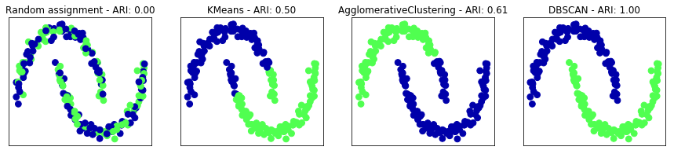


* `ARI`の結果は直感的に理解しやすい

    * ランダムクラスタ割り当てはスコア0で(望ましいクラスタリングを完全に再現した)`DBSCAN`は1になっている

* クラスタリングを評価する上でよくある間違いは、`adjusted_rand_score`や`normalized_mutual_info_score`ではなく、`accuracy_score`を使うこと

    * `accuracy_score`を用いると、割り当てられたクラスタラベルが正解データに完全に一致していることが要求される

    * しかし、クラスタラベル自身には意味がない

    * あるクラスタにどのデータポイントが含まれているかだけが問題


```python
from sklearn.metrics import accuracy_score

# この2つのラベルは、同じクラスタリングを表している
clusters1 = [0, 0, 1, 1, 0]
clusters2 = [1, 1, 0, 0, 1]

# 精度はゼロになる。ラベルはまったく一致していないからだ
print("Accuracy: {:.2f}".format(accuracy_score(clusters1, clusters2)))

# ARIスコアは1になる。クラスタリングは同じであるから
print("ARI: {:.2f}".format(adjusted_rand_score(clusters1, clusters2)))
```

    Accuracy: 0.00
    ARI: 1.00


## 2. 正解データを用いないクラスタリングの評価

* 実際には`ARI`のような指標を用いるには大きな問題がある

    * クラスタリングアルゴリズムを用いる際、実際には結果と比較するための正解データがない場合が多い

    * 正しいデータのクラスタリングが分かっているならば、それを使って、クラス分類器のような教師ありモデルを作ればよい

    * 従って、`ARI`や`NMI`のような指標はアルゴリズムの開発過程でしか利用できず、アプリケーションがうまくいっているかどうかの指標にならない

* 正解データを必要としないクラスタリング指標もある

    * `シルエット係数`もあるが、これらの指標は実際にはあまりうまくいかない

    * シルエットスコアは、クラスタのコンパクトさを計算する

    * 大きいほうが良く、完全な場合で1になる

    * クラスタがコンパクトなのは良いことだが、複雑の形状のクラスタはコンパクトにならない

* two-moonsデータセットに対する`k-means`、`凝集型クラスタリング`、`DBSCAN`の結果をシルエットスコアで比較してみる


```python
from sklearn.metrics.cluster import silhouette_score

X, y = make_moons(n_samples=200, noise=0.05, random_state=0)

# データを平均0、分散1にスケール変換する
scaler = StandardScaler()
scaler.fit(X)
X_scaled = scaler.transform(X)

fig, axes = plt.subplots(1, 4, figsize=(15, 3),
                         subplot_kw={'xticks': (), 'yticks': ()})

# 参照のためにランダムなクラスタ割り当てを作る
random_state = np.random.RandomState(seed=0)
random_clusters = random_state.randint(low=0, high=2, size=len(X))

# ランダムな割り当てをプロット
axes[0].scatter(X_scaled[:, 0], X_scaled[:, 1], c=random_clusters,
                cmap=mglearn.cm3, s=60)
axes[0].set_title("Random assignment: {:.2f}".format(
    silhouette_score(X_scaled, random_clusters)))

algorithms = [KMeans(n_clusters=2), AgglomerativeClustering(n_clusters=2),
              DBSCAN()]

for ax, algorithm in zip(axes[1:], algorithms):
    clusters = algorithm.fit_predict(X_scaled)
    # クラスタ割り当てとクラスタセンタをプロット
    ax.scatter(X_scaled[:, 0], X_scaled[:, 1], c=clusters, cmap=mglearn.cm3,
               s=60)
    ax.set_title("{} : {:.2f}".format(algorithm.__class__.__name__,
                                      silhouette_score(X_scaled, clusters)))
```


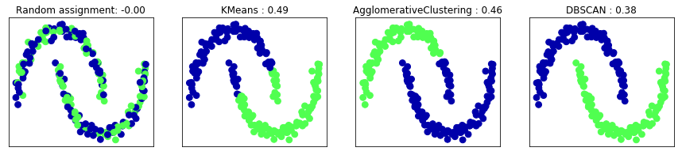


* `DBSCAN`の結果のほうがよさそうに見えるが、`k-means`のほうがシルエットスコアが高い

* もう少し良い評価方法として、**頑健性を用いた**クラスタリング評価指標がある

    * これらの指標では、ノイズをデータに加えたり、パラメータを変更したりしてアルゴリズムを実行し、結果を比較する

    * さまざまなパラメータや、ノイズのある入力に対しても同じ結果が帰ってくるならば、結果の信頼性が高いだろう、という発想である

    * 残念ながらこの手法は、scikit-learnにはふくまれていない

* もし非常に頑健なクラスタリングが得られたとしても、またシルエットスコアが非常に高いクラスタリングが得られたとしても、

    * そのクラスタに何らかの意味があるのか

    * ユーザが興味を持つようなデータの側面を反映していたクラスタリングになっているのかどうかは分からない

* 顔画像の例に戻ってみる

    * ユーザが欲しいのは、類似した顔画像のグループ

    * 例)男性と女性、老人と若者、あごひげのある人とない人、など

    * データを2つにクラスタリングしたとして、すべてのアルゴリズムが、そのクラスタリングに合意したとする

    * それでも、それらのクラスタが、ユーザが興味を持つような特性に対応するかどうかはわからない

* クラスタリングが興味のあるものになっているかは、クラスタを目で見て解析してみるしかない

## 3. 顔画像データセットを用いたアルゴリズムの比較

* `k-means`、`DBSCAN`、`凝集型クラスタリング`を、`Labeled in the Wild`データセットに適用して、何らかの興味深い構造を見つけられるかを試す

* ここでは、`PCA(whiten=True)`で生成された100成分の固有顔表現を用いる


```python
from sklearn.datasets import fetch_lfw_people
from sklearn.model_selection import train_test_split
import matplotlib.pyplot as plt

people = fetch_lfw_people(min_faces_per_person=20, resize=0.7)

image_shape = people.images[0].shape
mask = np.zeros(people.target.shape, dtype=np.bool)
for target in np.unique(people.target):
    mask[np.where(people.target == target)[0][:50]] = 1

X_people = people.data[mask]
y_people = people.target[mask]
X_people = X_people / 255.


# lfwデータから固有顔を抽出し、変換する
from sklearn.decomposition import PCA
pca = PCA(n_components=100, whiten=True, random_state=0)
X_pca = pca.fit_transform(X_people)
```

* この表現は生のピクセルよりも意味的な表現になっている

    * また、計算も速くなる


### 顔画像データセットのDBSCANによる解析


```python
# デフォルト設定でDBSCANを適用する
from sklearn.cluster import DBSCAN
dbscan = DBSCAN()
labels = dbscan.fit_predict(X_pca)
print("Unique labels: {}".format(np.unique(labels)))
```

    Unique labels: [-1]


* 全てのラベルが`-1`になっている

    * つまり、すべてのデータポイントが「ノイズ」だと判断された

    * これを解決するには、2つの方法がある

    * `eps`を大きくして個々の点の近傍を拡大するか、`min_samples`を小さくして小さいグループをクラスタとして識別させるか

* まずは、`min_samples`の方を試してみる


```python
import numpy as np
dbscan = DBSCAN(min_samples=3)
labels = dbscan.fit_predict(X_pca)
print("Unique labels: {}".format(np.unique(labels)))
```

    Unique labels: [-1]


* 3点のグループをクラスタとしても、すべてノイズになってしまった

* `eps`を増やす必要がある


```python
dbscan = DBSCAN(min_samples=3, eps=15)
labels = dbscan.fit_predict(X_pca)
print("Unique labels: {}".format(np.unique(labels)))
```

    Unique labels: [-1  0]


* `eps`を`15`とずいぶん大きくしたところ、1つのクラスタとノイズだけになった

* この結果を使って、「ノイズ」がその他のデータに比べてどう違うかを見てみることもできる

    * 何が起こっているのかをより正確に理解するために、いくつかのデータポイントがノイズで、いくつがクラスタ内なのかを見てみる


```python
# クラスタとノイズのデータポイント数を数える
# bincountは、負の数を許さないので、すべてに1を加える
# 結果の最初の数がノイズのデータポイント数に対応する
print("Number of points per cluster: {}".format(np.bincount(labels + 1)))
```

    Number of points per cluster: [  25 1219]


* ノイズはわずか27点しかないので、全部見ることができる


```python
noise = X_people[labels==-1]

fig, axes = plt.subplots(3, 9, subplot_kw={'xticks': (), 'yticks': ()},
                         figsize=(12, 4))
for image, ax in zip(noise, axes.ravel()):
    ax.imshow(image.reshape(image_shape), vmin=0, vmax=1)
```


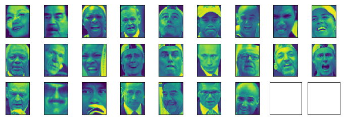


* これらの画像は、ノイズになっている理由が推測することができる

    * 最初の行の5つ目の画像は、グラスから飲み物を飲んでいる

    * 帽子をかぶっている画像もある

    * 最後の画像は顔の前に手が映り込んでいる

    * その他の画像は、角度がおかしかったり、切り取り方がおかしくて画角が狭すぎたり広すぎたりしている

* このように、何かおかしなものを見つける解析を、`外れ値検出`と呼ぶ

    * これが本当のアプリケーションであれば、画像の切り取り方にはもう少し気を付けて、より均質なデータになるようにする

    * データの中にアルゴリズムが扱わなければならないこのような問題があることを知っておくべき

* 1つの大きいクラスタではなく、もっと興味深いクラスタを見つけたいなら、`eps`を小さくして、`15`と`0.5`(デフォルト値)のどこかにする

* 様々な`eps`に対する結果を見てみる


```python
for eps in [1, 3, 5, 7, 9, 11, 13]:
    print("\neps={}".format(eps))
    dbscan = DBSCAN(eps=eps, min_samples=3)
    labels = dbscan.fit_predict(X_pca)
    print("Number of clusters: {}".format(len(np.unique(labels))))
    print("Cluster sizes: {}".format(np.bincount(labels + 1)))
```


    eps=1
    Number of clusters: 1
    Cluster sizes: [1244]

    eps=3
    Number of clusters: 1
    Cluster sizes: [1244]

    eps=5
    Number of clusters: 1
    Cluster sizes: [1244]

    eps=7
    Number of clusters: 9
    Cluster sizes: [1198   13   13    3    5    3    3    3    3]

    eps=9
    Number of clusters: 3
    Cluster sizes: [804 437   3]

    eps=11
    Number of clusters: 2
    Cluster sizes: [281 963]

    eps=13
    Number of clusters: 2
    Cluster sizes: [  84 1160]


* `eps`が小さいと、すべてのデータポイントがノイズになる

    * `eps=7`では、大量のノイズと多数の小さいクラスタが得られる

    * `eps=9`でも大量のノイズがあるが、今度は大きいクラスタが1つといくつかの小さいクラスタが得られる

    * `eps=11`以降は、大きいクラスタ1つとノイズになる

* 興味深い点としては、大きいクラスタが1つ以上得られることはないこと

    * 一番良い場合でも、大きいクラスタにはほとんどのデータポイントが属しており、他に小さいクラスタがいくつかあるだけ

    * これは、データセットの中には、2種類や3種類の明らかに異なるようなグループがなく、すべての顔画像が同じように似ている(似ていない)

* この中では、いくつもの小さいクラスタを持つ`eps=7`の結果が最も面白そうである

    * 13個の小さいクラスタに属するデータポイントを可視化して詳しく見てみる


```python
dbscan = DBSCAN(min_samples=3, eps=7)
labels = dbscan.fit_predict(X_pca)

for cluster in range(max(labels) + 1):
    mask = labels == cluster
    n_images =  np.sum(mask)
    fig, axes = plt.subplots(1, n_images, figsize=(n_images * 1.5, 4),
                             subplot_kw={'xticks': (), 'yticks': ()})
    for image, label, ax in zip(X_people[mask], y_people[mask], axes):

        ax.imshow(image.reshape(image_shape), vmin=0, vmax=1)
        ax.set_title(people.target_names[label].split()[-1])
```


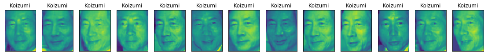


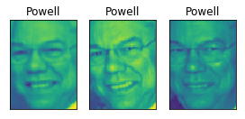


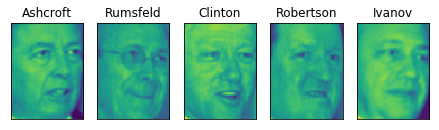


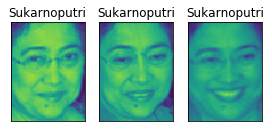


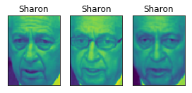


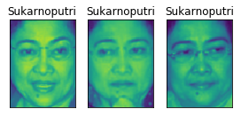


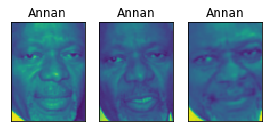


* クラスタのうちいくつかは、データセット中の特定の顔に対応している

    * SharonやKoizumiがそうである

    * 個々のクラスタ内では、顔の向きや位置、表情が一定している

    * いくつかのクラスタには複数の人物が含まれているが、顔の向きや表情は類似している

* `DBSCAN`アルゴリズムを顔画像データセットに適用した結果の解析はこれで終わり

* ここでは、手作業で解析を行った

* 教師あり学習で用いた$R^2$スコアや精度などの、はるかに自動的な解析手法とは異なる

### 顔画像データセットのk-meansによる解析

* `DBSCAN`では、大きいクラスタ1つしか作れないことが分かった

* `凝集型クラスタリング`や`k-means`なら同じようなサイズのクラスタができる可能性が高いが、この場合はクラスタの数を指定しなければならない

* クラスタ数をデータセットの中の人物の数に合わせることもできるが、教師なしクラスタリングアルゴリズムで、人物ごとのクラスタができるとは思えない


* ここでは、解析しやすいように、10くらいの少ないクラスタ数から始めてみる


```python
# k-meansでクラスタを抽出
km = KMeans(n_clusters=10, random_state=0)
labels_km = km.fit_predict(X_pca)
print("Cluster sizes k-means: {}".format(np.bincount(labels_km)))
```

    Cluster sizes k-means: [ 80 141  59  92 211 204 150  70 158  79]


* 結果からわかるように、`k-means`クラスタリングでは、64から386と、比較的同じようなサイズのクラスタに分割している

    * これは`DBSCAN`の結果と大きく異なる

* `k-means`の結果を、クラスタセンタを可視化することでさらに解析することができる

    * `PCA`で作った表現をクラスタリングしたので、クラスタセンタを元の空間で可視化するには、`pca.inverse_transform`を使って、逆に変換する


```python
fig, axes = plt.subplots(2, 5, subplot_kw={'xticks': (), 'yticks': ()},
                         figsize=(12, 4))
for center, ax in zip(km.cluster_centers_, axes.ravel()):
    ax.imshow(pca.inverse_transform(center).reshape(image_shape),
              vmin=0, vmax=1)
```


* `k-means`で見つかったクラスタセンタは、非常に平滑化された顔画像となっている

    * それぞれが、64から386枚の顔画像の平均値なので、これは驚くべきことではない

    * 次元削減された`PCA`表現で処理していることも、平滑化に貢献している

    * このクラスタリングでは、顔の向き、表情(3つ目のクラスタセンタは笑っている)、シャツの襟(最後から2番目のクラスタセンタ)が抽出できている

* より詳しく見るために、以下の画像を示す

    * それぞれのクラスタセンタに対してそのクラスタ内の典型的な5枚の画像(クラスタセンタから最も近い画像)

    * そのクラスタ内で最も典型的でない画像(クラスタセンタから最も離れている画像)


```python
mglearn.plots.plot_kmeans_faces(km, pca, X_pca, X_people,
                                y_people, people.target_names)
```


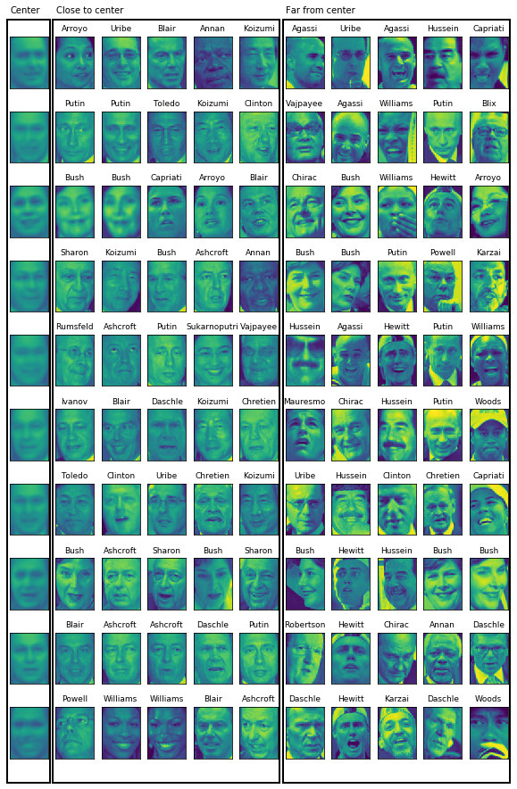


* 図から、3番目のクラスタが笑っている顔を示していて、他のクラスタが顔の向きを重視しているという直感は正しかった

* 「典型的でない」画像は、クラスタセンタとあまり似ておらず、そのクラスタに分類されているのはたまたまであるように見える

* これは、`k-means`には、`DBSCAN`のような「ノイズ」の概念がなく、全てのデータポイントをどこかのクラスタに分割してしまうから

* クラスタ数を増やせば、より細かい相違を見つけられるだろうが、目で見て確認するのはさらに大変である

### 凝集型クラスタリングによる顔画像データセットの解析


```python
# ward凝集型クラスタリングでクラスタを抽出
agglomerative = AgglomerativeClustering(n_clusters=10)
labels_agg = agglomerative.fit_predict(X_pca)
print("cluster sizes agglomerative clustering: {}".format(
       np.bincount(labels_agg)))
```

    cluster sizes agglomerative clustering: [106 577 103 115 129  55  90  45   5  19]


* `凝集型クラスタリング`も、最小で5画像、最大で577画像と、比較的同じサイズのクラスタを作る

    * `k-means`に比べれば大きさの偏りは大きいが、`DBSCAN`よりもはるかに均等になっている

* `凝集型クラスタリング`と`k-means`の結果の分割が似ているかどうかを`ARI`を用いて測ることができる


```python
print("ARI: {:.2f}".format(adjusted_rand_score(labels_agg, labels_km)))
```

    ARI: 0.05


* `ARI`はわずか`0.05`である

    * これは、2つのクラスタリング`labels_agg`と`labels_km`にほとんど共通点がないことを意味する

    * `k-means`で、クラスタセンタから遠い画像がクラスタセンタとあまり似ていなかったことを考えれば、驚くことではない

* 次にデンドログラムを描写してみる

    * ここでは描画する深さを制限している


```python
from scipy.cluster.hierarchy import dendrogram, ward

linkage_array = ward(X_pca)
# このlinkage_arrayに書かれたクラスタ間距離をデンドログラムとしてプロットする
plt.figure(figsize=(20, 5))
dendrogram(linkage_array, p=7, truncate_mode='level', no_labels=True)
plt.xlabel("Sample index")
plt.ylabel("Cluster distance")
```


    Text(0, 0.5, 'Cluster distance')


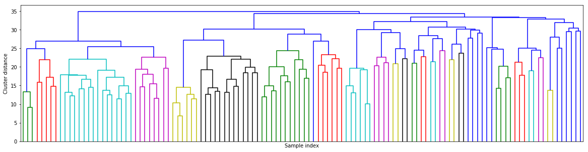


* 10クラスタを作るには、この木構造のかなり上の方、10本の垂直線しかないところで切り取る事になる

    * トイデータのデンドログラムでは、2クラスタか3クラスタでデータの性質をおおよそ捉えることができる(枝の長さより)

    * この顔画像のデータセットでは、そのような自然な切断線があるようには見れない

    * いくつもの枝が、比較的異なるグループを表していることはわかるが、あるクラスタ数が、他のクラスタ数よりも自然に見えるような場所はない

    * `DBSCAN`の結果がひとまとまりのクラスタになってしまったことを考えれば、これは驚くべきことではない

* `k-means`で行ったように、10クラスタを可視化してみる

    * `凝集型クラスタリング`には、クラスタセンタに相当するものはないので、ここでは簡単にそれぞれのクラスタの最初の数点を示す

    * 最初の画像の左側に、そのクラスタにあるデータポイントの数を示している


```python
n_clusters = 10
for cluster in range(n_clusters):
    mask = labels_agg == cluster
    fig, axes = plt.subplots(1, 10, subplot_kw={'xticks': (), 'yticks': ()},
                             figsize=(15, 8))
    axes[0].set_ylabel(np.sum(mask))
    for image, label, asdf, ax in zip(X_people[mask], y_people[mask],
                                      labels_agg[mask], axes):
        ax.imshow(image.reshape(image_shape), vmin=0, vmax=1)
        ax.set_title(people.target_names[label].split()[-1],
                     fontdict={'fontsize': 9})
```


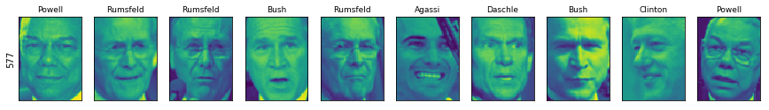


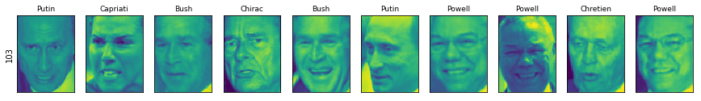


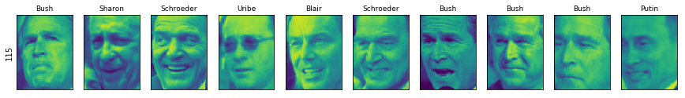


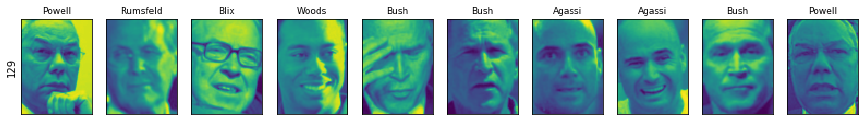


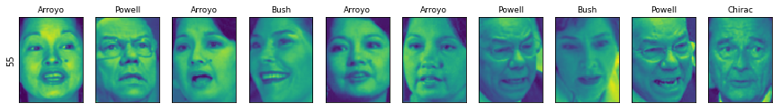


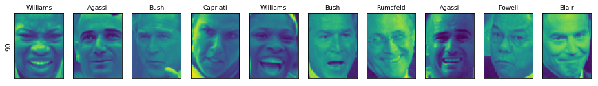


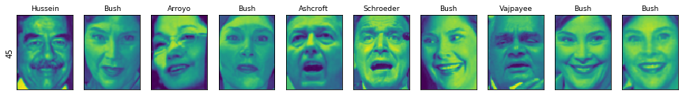


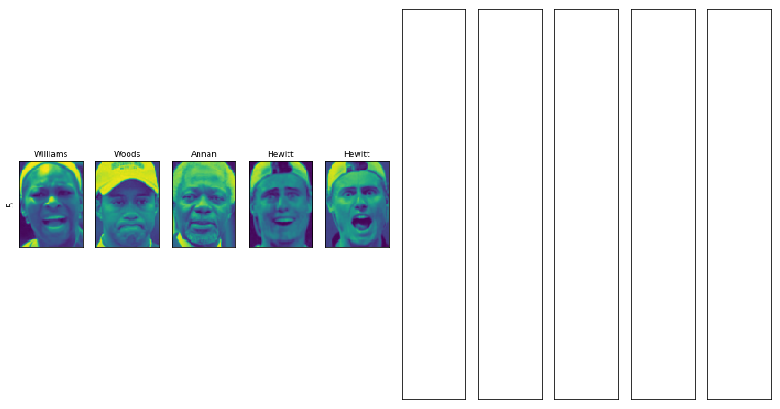


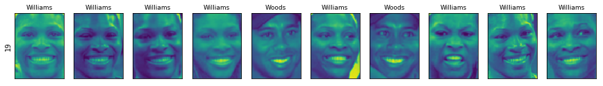


* いくつかのクラスタには何らかの意味がありそうだが、ほとんどのクラスタは実際に均質であるには大きすぎる

* より均質なクラスタを得るために、アルゴリズムを再度実行して40クラスタにしてみる


```python
# ward凝集型クラスタリングでクラスタを抽出
agglomerative = AgglomerativeClustering(n_clusters=40)
labels_agg = agglomerative.fit_predict(X_pca)
print("cluster sizes agglomerative clustering: {}".format(np.bincount(labels_agg)))

n_clusters = 40
for cluster in [10, 13, 19, 22, 36]: # 「面白そうな」クラスタを選んだ
    mask = labels_agg == cluster
    fig, axes = plt.subplots(1, 15, subplot_kw={'xticks': (), 'yticks': ()},
                             figsize=(15, 8))
    cluster_size = np.sum(mask)
    axes[0].set_ylabel("#{}: {}".format(cluster, cluster_size))
    for image, label, asdf, ax in zip(X_people[mask], y_people[mask],
                                      labels_agg[mask], axes):
        ax.imshow(image.reshape(image_shape), vmin=0, vmax=1)
        ax.set_title(people.target_names[label].split()[-1],
                     fontdict={'fontsize': 9})
    for i in range(cluster_size, 15):
        axes[i].set_visible(False)
```

    cluster sizes agglomerative clustering: [ 55  96  78  18  18  45   8  71  22  62  40  36 123  41   4  27  30  23
      14   8  76   2   2  54  15   7  13   6  20   2   1  10  41  28  18  29
      10   1  89   1]


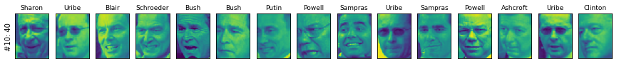


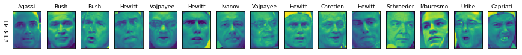


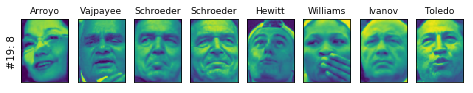


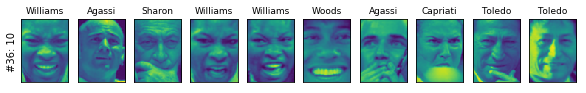


* このようにして見ると、これらのクラスタはそれぞれの特徴を拾っているように見える

* より詳細に解析すれば、これらの高度に類似したクラスタをデンドログラムから見つけられる

| 版 | 年/月/日 |
|----|----------|
|初版|2019/03/18|
|第二版|2019/05/05|
