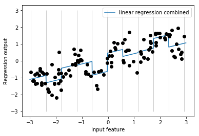
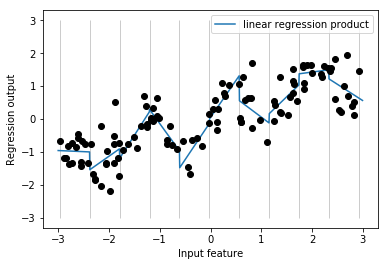
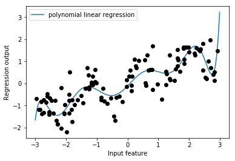
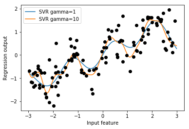

03 交互作用と多項式
================

* 特徴量表現をより豊かにするもう1つの方法として、特に線形モデルで有効なのが、

    * 元のデータの`交互作用特徴量`と`多項式特徴量`を加える方法

    * このような特徴量エンジニアリングは、統計モデルでよく用いられるが、多くの実用的な機械学習アプリケーションでも一般的に用いられている

* 線形モデルは、waveデータセットの個々のビンに対して定数を学習する

    * しかし、線形モデルはオフセットだけでなく傾きも学習できる

    * ビニングされたデータに対する線形モデルに傾きを加える1つの方法は、元の特徴量(グラフの $`x`$ 軸)を加え直すこと

    * このようにすることで、以下の図に示す11次元のデータセットとなる


```python
from sklearn.linear_model import LinearRegression
from sklearn.tree import DecisionTreeRegressor
import mglearn
import numpy as np
import matplotlib.pyplot as plt

X, y = mglearn.datasets.make_wave(n_samples=120)
line = np.linspace(-3, 3, 1000, endpoint=False).reshape(-1, 1)
reg = DecisionTreeRegressor(min_samples_leaf=3).fit(X, y)
reg = LinearRegression().fit(X, y)
bins = np.linspace(-3, 3, 11)
ch_bin = np.digitize(X, bins=bins)
from sklearn.preprocessing import OneHotEncoder
# OneHotEncoderで変換する
encoder = OneHotEncoder(sparse=False)
which_bin = np.digitize(X, bins=bins)
# encoder.fitでwhich_binに現れる整数値のバリエーションを確認
encoder.fit(which_bin)
# transformでワンホットエンコーディングを行う
X_binned = encoder.transform(which_bin)

from sklearn.preprocessing import KBinsDiscretizer
kb = KBinsDiscretizer(n_bins=10, strategy='uniform', encode='onehot-dense')
kb.fit(X)
X_binned = kb.transform(X)
line_binned = kb.transform(line)
reg = LinearRegression().fit(X_binned, y)
reg = DecisionTreeRegressor(min_samples_split=3).fit(X_binned, y)
```

    /Users/MacUser/anaconda2/envs/tf140/lib/python3.6/site-packages/sklearn/preprocessing/_encoders.py:368: FutureWarning: The handling of integer data will change in version 0.22. Currently, the categories are determined based on the range [0, max(values)], while in the future they will be determined based on the unique values.
    If you want the future behaviour and silence this warning, you can specify "categories='auto'".
    In case you used a LabelEncoder before this OneHotEncoder to convert the categories to integers, then you can now use the OneHotEncoder directly.
      warnings.warn(msg, FutureWarning)


```python
X_combined = np.hstack([X, X_binned])
print(X_combined.shape)
```

    (120, 11)


```python
reg = LinearRegression().fit(X_combined, y)

line_combined = np.hstack([line, line_binned])
plt.plot(line, reg.predict(line_combined), label='linear regression combined')

plt.vlines(kb.bin_edges_[0], -3, 3, linewidth=1, alpha=.2)
plt.legend(loc="best")
plt.ylabel("Regression output")
plt.xlabel("Input feature")
plt.plot(X[:, 0], y, 'o', c='k')
```


    [<matplotlib.lines.Line2D at 0x11357c390>]





* この例では、モデルは個々のビンに対して`オフセット`と`傾き`を学習する

    * `傾き`は下向きで、全てのビンで共有されている

    *  $`x`$ 軸は1つしかなく、従って傾きは1つしかない

    * `傾き`が全てのビンで共有されているので、あまり役に立たない

    * それぞれのビンごとに傾きがあれば良い

* これを実現するには、データポイントがどのビンに入っているかを示す特徴量と、 $`x`$ 軸のどこにあるかを示す特徴量の交互作用もしくは積を、特徴量として加えれば良い

    * この特徴量はビンの指示子と、もとの特徴量の積となる


```python
X_product = np.hstack([X_binned, X * X_binned])
print(X_product.shape)
```

    (120, 20)


* これでデータセットの特徴量は20となった

    * どのビンにデータポイントが入っているかを示すビン番号特徴量と、元の特徴量とビン番号の積である

    * 積の特徴量を、個々のビンに $`x`$ 軸の特徴量をそれぞれコピーしたものと考えることもできる

    * ビンの部分に元の特徴量に、それ以外の部分は0になる

* 以下の図に、この新しいデータ表現に対する線形モデルの結果を示す


```python
reg = LinearRegression().fit(X_product, y)

line_product = np.hstack([line_binned, line * line_binned])
plt.plot(line, reg.predict(line_product), label='linear regression product')

plt.vlines(kb.bin_edges_[0], -3, 3, linewidth=1, alpha=.2)

plt.plot(X[:, 0], y, 'o', c='k')
plt.ylabel("Regression output")
plt.xlabel("Input feature")
plt.legend(loc="best")
```


    <matplotlib.legend.Legend at 0x1135f5978>





* 図からわかるように、個々のビンがそれぞれ`オフセット`と`傾き`を持つようになった

* `ビニング`は、連続値特徴量を拡張する方法の1つである

    * もう一つの方法としては、元の特徴量の`多項式`を使うこと

    * これは、ある特徴量`x`に対して、`x ** 2`、`x ** 3`、`x ** 4`を考える

    * これは、`preprocessing`モジュールの`PolynomialFeatures`に実装されている


```python
from sklearn.preprocessing import PolynomialFeatures

# x ** 10までの多項式を加える
# デフォルトの"include_bias=True"だと、常に1となる特徴量を加える
poly = PolynomialFeatures(degree=10, include_bias=False)
poly.fit(X)
X_poly = poly.transform(X)
```

* 10次を指定すると、10の特徴量ができる


```python
print("X_poly.shape: {}".format(X_poly.shape))
```

    X_poly.shape: (120, 10)


* `X_poly`の内容を`X`と比較してみる


```python
print("Entries of X:\n{}".format(X[:5]))
print("Entries of X_poly:\n{}".format(X_poly[:5]))
```

    Entries of X:
    [[-0.75275929]
     [ 2.70428584]
     [ 1.39196365]
     [ 0.59195091]
     [-2.06388816]]
    Entries of X_poly:
    [[-7.52759287e-01  5.66646544e-01 -4.26548448e-01  3.21088306e-01
      -2.41702204e-01  1.81943579e-01 -1.36959719e-01  1.03097700e-01
      -7.76077513e-02  5.84199555e-02]
     [ 2.70428584e+00  7.31316190e+00  1.97768801e+01  5.34823369e+01
       1.44631526e+02  3.91124988e+02  1.05771377e+03  2.86036036e+03
       7.73523202e+03  2.09182784e+04]
     [ 1.39196365e+00  1.93756281e+00  2.69701700e+00  3.75414962e+00
       5.22563982e+00  7.27390068e+00  1.01250053e+01  1.40936394e+01
       1.96178338e+01  2.73073115e+01]
     [ 5.91950905e-01  3.50405874e-01  2.07423074e-01  1.22784277e-01
       7.26822637e-02  4.30243318e-02  2.54682921e-02  1.50759786e-02
       8.92423917e-03  5.28271146e-03]
     [-2.06388816e+00  4.25963433e+00 -8.79140884e+00  1.81444846e+01
      -3.74481869e+01  7.72888694e+01 -1.59515582e+02  3.29222321e+02
      -6.79478050e+02  1.40236670e+03]]


* 個々の特徴量の意味は`get_feature_names`メソッドで知ることができる

    * このメソッドは、個々の特徴量の説明を表示する


```python
print("Polynomial feature names:\n{}".format(poly.get_feature_names()))
```

    Polynomial feature names:
    ['x0', 'x0^2', 'x0^3', 'x0^4', 'x0^5', 'x0^6', 'x0^7', 'x0^8', 'x0^9', 'x0^10']


* これからわかるように、`X_poly`の最初の要素は`X`と同じで、その他の要素は、最初の要素の冪乗となっている

    * 値が簡単に大きくなるのが興味深い

    * 2つ目の要素には20,000を超えるものがある

* 多項式特徴量を線形回帰モデルと組み合わせると、古典的な`多項式回帰`モデルとなる


```python
reg = LinearRegression().fit(X_poly, y)

line_poly = poly.transform(line)
plt.plot(line, reg.predict(line_poly), label='polynomial linear regression')
plt.plot(X[:, 0], y, 'o', c='k')
plt.ylabel("Regression output")
plt.xlabel("Input feature")
plt.legend(loc="best")
```


    <matplotlib.legend.Legend at 0x11372e4a8>





* 多項式特徴量はこの1次元データに対して非常にスムーズに適合する

    * しかし、高次の多項式は、境界近辺やデータが少ない領域で極端な振る舞いを示す傾向にある

* 比較としてカーネル法を用いたSVMモデルを、変換していないオリジナルデータに適用してみる


```python
from sklearn.svm import SVR

for gamma in [1, 10]:
    svr = SVR(gamma=gamma).fit(X, y)
    plt.plot(line, svr.predict(line), label='SVR gamma={}'.format(gamma))

plt.plot(X[:, 0], y, 'o', c='k')
plt.ylabel("Regression output")
plt.xlabel("Input feature")
plt.legend(loc="best")
```


    <matplotlib.legend.Legend at 0x11375f390>





* このように、より複雑なモデル(カーネル法を用いたSVM)を用いると、特徴量に対して明示的な変換を行わなくても、多項式線形回帰と同じように複雑な予測をすることができる

* `交互作用特徴量`と`多項式特徴量`を、より現実的なboston_housingデータセットに適用する

    * このモデルに対しては、既に多項式特徴量を導入している

    * どのようにこの特徴量が構築されているか、どのくらい多項式特徴量が貢献しているかを見てみる

* まず、データをロードして`MinMaxScaler`を用いて0から1の間になるようにスケール変換する


```python
from sklearn.datasets import load_boston
from sklearn.model_selection import train_test_split
from sklearn.preprocessing import MinMaxScaler

boston = load_boston()
X_train, X_test, y_train, y_test = train_test_split(
    boston.data, boston.target, random_state=0)

# rescale data
scaler = MinMaxScaler()
X_train_scaled = scaler.fit_transform(X_train)
X_test_scaled = scaler.transform(X_test)
```

* 2次までの多項式特徴量と交互作用を抽出する


```python
poly = PolynomialFeatures(degree=2).fit(X_train_scaled)
X_train_poly = poly.transform(X_train_scaled)
X_test_poly = poly.transform(X_test_scaled)
print("X_train.shape: {}".format(X_train.shape))
print("X_train_poly.shape: {}".format(X_train_poly.shape))
```

    X_train.shape: (379, 13)
    X_train_poly.shape: (379, 105)


* 元のデータには13しか特徴量がなかったが、これを105の交互作用特徴量まで拡張した

    * これらの新しい特徴量は、元の特徴量から2つの特徴量の全ての組み合わせと、元の特徴量の2乗である

    * ここで`degree=2`と指定しているのは、元の特徴量2つの積までを考慮する意味である

    * 入力特徴量と出力特徴量の正確な関係は、`get_feature_names`メソッドでわかる


```python
print("Polynomial feature names:\n{}".format(poly.get_feature_names()))
```

    Polynomial feature names:
    ['1', 'x0', 'x1', 'x2', 'x3', 'x4', 'x5', 'x6', 'x7', 'x8', 'x9', 'x10', 'x11', 'x12', 'x0^2', 'x0 x1', 'x0 x2', 'x0 x3', 'x0 x4', 'x0 x5', 'x0 x6', 'x0 x7', 'x0 x8', 'x0 x9', 'x0 x10', 'x0 x11', 'x0 x12', 'x1^2', 'x1 x2', 'x1 x3', 'x1 x4', 'x1 x5', 'x1 x6', 'x1 x7', 'x1 x8', 'x1 x9', 'x1 x10', 'x1 x11', 'x1 x12', 'x2^2', 'x2 x3', 'x2 x4', 'x2 x5', 'x2 x6', 'x2 x7', 'x2 x8', 'x2 x9', 'x2 x10', 'x2 x11', 'x2 x12', 'x3^2', 'x3 x4', 'x3 x5', 'x3 x6', 'x3 x7', 'x3 x8', 'x3 x9', 'x3 x10', 'x3 x11', 'x3 x12', 'x4^2', 'x4 x5', 'x4 x6', 'x4 x7', 'x4 x8', 'x4 x9', 'x4 x10', 'x4 x11', 'x4 x12', 'x5^2', 'x5 x6', 'x5 x7', 'x5 x8', 'x5 x9', 'x5 x10', 'x5 x11', 'x5 x12', 'x6^2', 'x6 x7', 'x6 x8', 'x6 x9', 'x6 x10', 'x6 x11', 'x6 x12', 'x7^2', 'x7 x8', 'x7 x9', 'x7 x10', 'x7 x11', 'x7 x12', 'x8^2', 'x8 x9', 'x8 x10', 'x8 x11', 'x8 x12', 'x9^2', 'x9 x10', 'x9 x11', 'x9 x12', 'x10^2', 'x10 x11', 'x10 x12', 'x11^2', 'x11 x12', 'x12^2']


* 最初の特徴量は定数特徴量で、ここでは"1"と呼ばれている

    * 次の13の特徴量は元の特徴量("x0"から"x12"まで)

    * その次は、最初の特徴量の2乗("x0^2")で、その後には最初の特徴量とその他の特徴量の組み合わせが続く

* `Ridge`を使って、`交互作用特徴量`を入れた場合と入れない場合を比較してみる


```python
from sklearn.linear_model import Ridge
ridge = Ridge().fit(X_train_scaled, y_train)
print("Score without interactions: {:.3f}".format(
    ridge.score(X_test_scaled, y_test)))
ridge = Ridge().fit(X_train_poly, y_train)
print("Score with interactions: {:.3f}".format(
    ridge.score(X_test_poly, y_test)))
```

    Score without interactions: 0.621
    Score with interactions: 0.753


* `交互作用特徴量`と`多項式特徴量`は`Ridge`の性能を明らかに押し上げていることがわかる

    * しかし、`ランダムフォレスト`のような複雑なモデルを使う場合には、話が変わってくる


```python
from sklearn.ensemble import RandomForestRegressor
rf = RandomForestRegressor(n_estimators=100).fit(X_train_scaled, y_train)
print("Score without interactions: {:.3f}".format(
    rf.score(X_test_scaled, y_test)))
rf = RandomForestRegressor(n_estimators=100).fit(X_train_poly, y_train)
print("Score with interactions: {:.3f}".format(rf.score(X_test_poly, y_test)))
```

    Score without interactions: 0.799
    Score with interactions: 0.762


* 追加の特徴量がなくても`ランダムフォレスト`の性能は`Ridge`を上回る

    * `交互作用特徴量`と`多項式特徴量`を入れると、わずかに性能が下がっている


| 版     | 年/月/日   |
| ------ | ---------- |
| 初版   | 2019/03/20 |
| 第二版 | 2019/05/05 |
