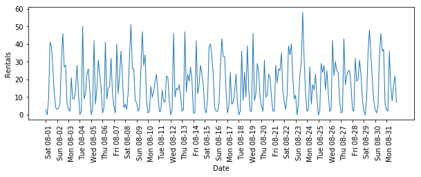
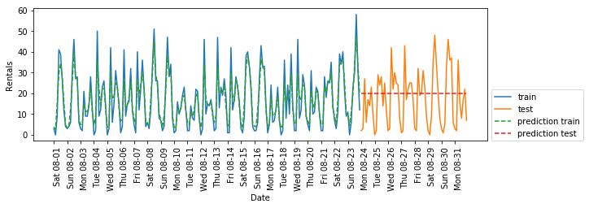
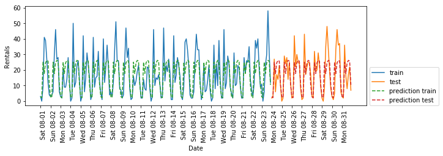
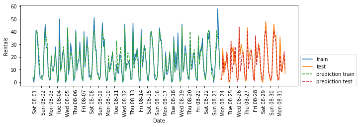
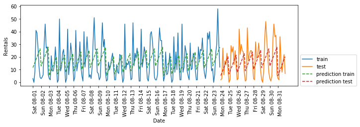
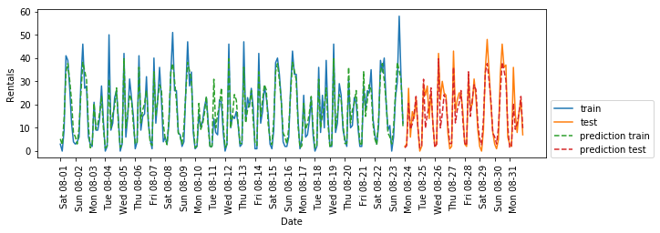
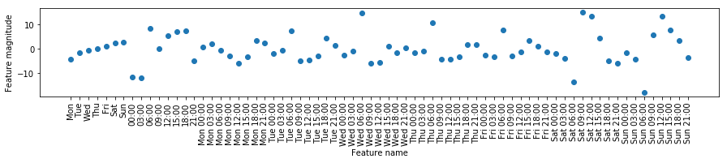

06 専門家知識の利用
================

* 特徴量エンジニアリングでは、特定のアプリケーションに関する`専門家知識`を利用することができる

    * 多くの場合、機械学習の目的は専門家がルールを設計しなくても済むようにすること

    * しかし、特定のアプリケーションやドメインに関する事前知識を捨てるべきではない

    * 例)ドメインの専門家が、最初に得られるデータ表現よりもはるかに情報量の多い有用な特徴量を特定する手助けをしてくれることは多い

    * 例)旅行代理店に勤めているとして、航空運賃の値段を予測したいとき、イベントによって予約の状況が変化したりする

    * このように専門家がいることで、タスクの性質に関する事前知識を特徴量にエンコードし、機械学習アルゴリズムを助けることができる

    * 特徴量を追加することは、それを利用することを強制することにはならない


* 専門家の知識を利用するケースを見てみる

    * タスクは、ある人の家の前にあるレンタル自転車の件数を予測すること

    * ある特定の日時に、どのくらいの人がある人の家の前にあるステーションで自転車をレンタルするかを予測すること

    * これがわかれば、ある人が自転車をレンタルできるかを予測できる

* まず、2015年8月のこの特定のステーションのデータをpandasの`DataFrame`としてロードする

    * データを3時間ごとの間隔にサンプルし直して、日毎の傾向を見てみる


```python
import mglearn
citibike = mglearn.datasets.load_citibike()
```


```python
print("Citi Bike data:\n{}".format(citibike.head()))
```

    Citi Bike data:
    starttime
    2015-08-01 00:00:00     3
    2015-08-01 03:00:00     0
    2015-08-01 06:00:00     9
    2015-08-01 09:00:00    41
    2015-08-01 12:00:00    39
    Freq: 3H, Name: one, dtype: int64


* 以下の図に、レンタル頻度を可視化したものを示す


```python
import pandas as pd
import matplotlib.pyplot as plt
%matplotlib inline
plt.figure(figsize=(10, 3))
xticks = pd.date_range(start=citibike.index.min(), end=citibike.index.max(),
                       freq='D')
plt.xticks(xticks, xticks.strftime("%a %m-%d"), rotation=90, ha="left")
plt.plot(citibike, linewidth=1)
plt.xlabel("Date")
plt.ylabel("Rentals")
```

```python
    /Users/MacUser/anaconda2/envs/tf140/lib/python3.6/site-packages/pandas/plotting/_converter.py:129: FutureWarning: Using an implicitly registered datetime converter for a matplotlib plotting method. The converter was registered by pandas on import. Future versions of pandas will require you to explicitly register matplotlib converters.

    To register the converters:
    	>>> from pandas.plotting import register_matplotlib_converters
    	>>> register_matplotlib_converters()
      warnings.warn(msg, FutureWarning)


    Text(0, 0.5, 'Rentals')
```





* データから、24時間単位の昼間と夜間の区別が明確に見て取れる

* また、週末と平日のパターンも明確に異なる

    * このような時系列に対する予測タスクでは、`過去から学習`と`未来を予測する`アプローチを取る

    * つまり、訓練セットとテストセットを分割する際に、ある特定の日までの全てのデータを訓練セットとし、それ以降をテストセットとする

    * これは実際に時系列を予測する際に行うのと同じ手法である

    * 過去のレンタル履歴だけがわかっている状況で、明日何が起こるかを考える

    * ここでは、最初の23日分に相当する184データポイントを訓練セットとし、残りの8日分に相当する64データポイントをテストセットとした

* この予測タスクにおいて利用する特徴量は、特定数のレンタルが発生した際の日時だけ

    * つまり、入力特徴量は日時で、出力はその後3時間のレンタル数となる

* 計算機で日時を格納するにはPOSIX時刻がよく用いられている

    * これは1970年の1月1日0時からの秒数で、Unix時刻とも呼ばれる

    * まずは、この1つの整数特徴量をデータ表現に使ってみる


```python
# ターゲット値(レンタル数)を抽出
y = citibike.values
# 時刻を"%s"でPOSIX時刻に変換
X = citibike.index.astype("int64").values.reshape(-1, 1) // 10**9
```

* データを訓練セットとテストセットに分割する関数を定義し、モデルを構築し、結果を可視化する


```python
# 最初の184データポイントを訓練に、残りをテストに使う
n_train = 184

# 与えられた特徴量セットで、回帰器を評価し、プロットする関数
def eval_on_features(features, target, regressor):
    # 与えられた特徴量を訓練セットとテストセットに分割
    X_train, X_test = features[:n_train], features[n_train:]
    # ターゲットの配列も分離する
    y_train, y_test = target[:n_train], target[n_train:]
    regressor.fit(X_train, y_train)
    print("Test-set R^2: {:.2f}".format(regressor.score(X_test, y_test)))
    y_pred = regressor.predict(X_test)
    y_pred_train = regressor.predict(X_train)
    plt.figure(figsize=(10, 3))

    plt.xticks(range(0, len(X), 8), xticks.strftime("%a %m-%d"), rotation=90,
               ha="left")

    plt.plot(range(n_train), y_train, label="train")
    plt.plot(range(n_train, len(y_test) + n_train), y_test, '-', label="test")
    plt.plot(range(n_train), y_pred_train, '--', label="prediction train")

    plt.plot(range(n_train, len(y_test) + n_train), y_pred, '--',
             label="prediction test")
    plt.legend(loc=(1.01, 0))
    plt.xlabel("Date")
    plt.ylabel("Rentals")
```


```python
from sklearn.ensemble import RandomForestRegressor
regressor = RandomForestRegressor(n_estimators=100, random_state=0)
eval_on_features(X, y, regressor)
```

    Test-set R^2: -0.04





* ランダムフォレストではいつものことだが、訓練セットに対する予測は非常に良い

    * しかし、テストセットに対しては定数の線が予測されてしまっている

    *  $`R^2`$ は`-0.04`となっているが、これは何も学習できていないことを意味している

* 問題は、特徴量とランダムフォレストの組み合わせにある

    * テストセットのPOSIX時刻特徴量の値は、訓練セットの特徴量値のレンジを外れている

    * テストセットのデータポイントのタイムスタンプは、訓練セットの全てのデータポイントよりも後のため

    * 決定木は訓練セットのレンジの外にまで`外挿`することはできない

    * この結果はモデルが、訓練セットの中で最も近い点、つまり最後に観測した点のターゲット値を予測値として出しているために生じる

* ここで、「専門家の知識」を活用する

    * 訓練データのレンタル履歴を見ると、2つの要素がとても重要であることがわかる

    * 1日の中の時間帯と曜日である

    * したがって、これらの特徴量を加えてみる

    * POSIX時刻を見ても何もわからないので、この特徴量を落とす

    * まず1日の中の時刻だけを入れてみる

    * 以下の図では、予測は曜日に関わらず同じパターンを描いていることがわかる


```python
X_hour = citibike.index.hour.values.reshape(-1, 1)
eval_on_features(X_hour, y, regressor)
```

    Test-set R^2: 0.60





* $`R^2`$ スコアははるかに良くなっているが、この予測は明らかに1週間周期のパターンを見落としている

    * そこで、曜日情報を加えてみる


```python
import numpy as np

X_hour_week = np.hstack([citibike.index.dayofweek.values.reshape(-1, 1),
                         citibike.index.hour.values.reshape(-1, 1)])
eval_on_features(X_hour_week, y, regressor)
```

    Test-set R^2: 0.84





* 曜日と時刻を考慮に入れた周期的な挙動を捉えたモデルができた

    * $`R^2`$ スコアは`0.84`と予測性能も高くなっている

    * このモデルが学習するのは、8月の最初の23日の曜日と時刻の組み合わせに対する平均レンタル数である

    * これにはランダムフォレストのような複雑なモデルは必要ないはずである

    * もっと簡単な`LinearRegression`で試してみる


```python
from sklearn.linear_model import LinearRegression
eval_on_features(X_hour_week, y, LinearRegression())
```

    /Users/MacUser/anaconda2/envs/tf140/lib/python3.6/site-packages/sklearn/linear_model/base.py:485: RuntimeWarning: internal gelsd driver lwork query error, required iwork dimension not returned. This is likely the result of LAPACK bug 0038, fixed in LAPACK 3.2.2 (released July 21, 2010). Falling back to 'gelss' driver.
      linalg.lstsq(X, y)


    Test-set R^2: 0.13





* `LinearRegression`の性能はずっと悪いし、周期パターンも妙である

    * これは曜日や時刻が整数でエンコードされていて、連続値として解釈されているため

    * 線形モデルは時刻に対する線形関数としてしか学習ができないので、時刻が遅いほどレンタル数が大きくなると学習してしまっている

    * しかし、実際のパターンははるかに複雑なので、整数を`OneHotEncoder`を用いて変換することで、カテゴリ変数として解釈すれば、パターンを捉えることができる


```python
from sklearn.preprocessing import OneHotEncoder
enc = OneHotEncoder()
X_hour_week_onehot = enc.fit_transform(X_hour_week).toarray()
```

    /Users/MacUser/anaconda2/envs/tf140/lib/python3.6/site-packages/sklearn/preprocessing/_encoders.py:368: FutureWarning: The handling of integer data will change in version 0.22. Currently, the categories are determined based on the range [0, max(values)], while in the future they will be determined based on the unique values.
    If you want the future behaviour and silence this warning, you can specify "categories='auto'".
    In case you used a LabelEncoder before this OneHotEncoder to convert the categories to integers, then you can now use the OneHotEncoder directly.
      warnings.warn(msg, FutureWarning)


```python
from sklearn.linear_model import Ridge
eval_on_features(X_hour_week_onehot, y, Ridge())
```

    Test-set R^2: 0.62


* 特徴量を連続値とした時よりも、はるかに良い結果が得られている

    * ここでは、線形モデルは曜日と時刻に対してそれぞれ係数を学習する

    * つまり、時刻に対するパターンは全ての曜日に対して同じになる

* ここで、交互作用特徴量を用いれば、曜日と時刻の組み合わせに対して係数を学習させることができる


```python
from sklearn.preprocessing import PolynomialFeatures

poly_transformer = PolynomialFeatures(degree=2, interaction_only=True,
                                      include_bias=False)
X_hour_week_onehot_poly = poly_transformer.fit_transform(X_hour_week_onehot)
lr = Ridge()
eval_on_features(X_hour_week_onehot_poly, y, lr)
```

    Test-set R^2: 0.85





* この変換によって、ようやくランダムフォレストと同等の性能になった

* このモデルの長所は、何を学習したかが非常に明確であることである

    * 曜日と時刻の組み合わせに対して係数が1つずつだからである

    * このモデルで学習した係数をプロットしてみることができる

* まず、時刻と曜日の特徴量に名前をつける


```python
hour = ["%02d:00" % i for i in range(0, 24, 3)]
day = ["Mon", "Tue", "Wed", "Thu", "Fri", "Sat", "Sun"]
features =  day + hour
```

* `PolynimialFeatures`で抽出した交互作用特徴量に対して名前をつける

    * これには`get_feature_names`メソッドを用いる

    * さらに、係数が非ゼロの特徴量だけを残す


```python
features_poly = poly_transformer.get_feature_names(features)
features_nonzero = np.array(features_poly)[lr.coef_ != 0]
coef_nonzero = lr.coef_[lr.coef_ != 0]
```

* 線形モデルで学習された係数を可視化したものを以下の図に示す


```python
plt.figure(figsize=(15, 2))
plt.plot(coef_nonzero, 'o')
plt.xticks(np.arange(len(coef_nonzero)), features_nonzero, rotation=90)
plt.xlabel("Feature name")
plt.ylabel("Feature magnitude")
```


    Text(0, 0.5, 'Feature magnitude')





| 版     | 年/月/日   |
| ------ | ---------- |
| 初版   | 2019/03/21 |
| 第二版 | 2019/05/05 |
