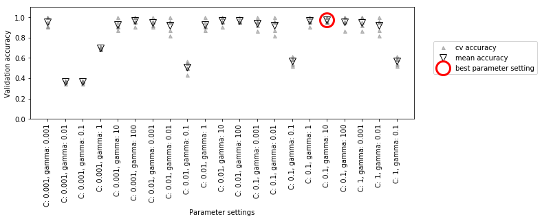
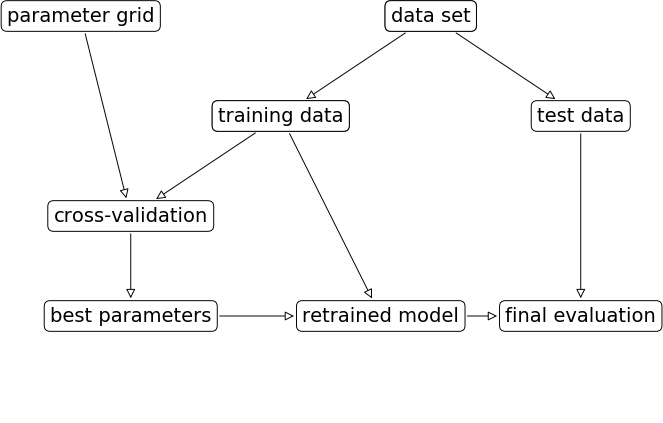
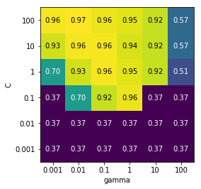
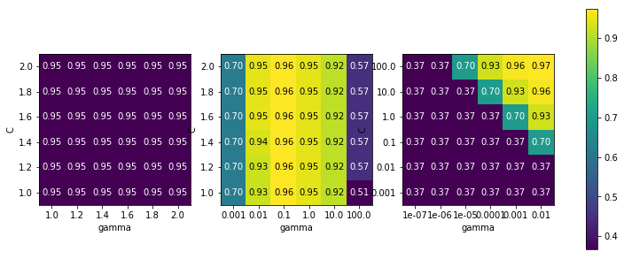

03 交差検証を用いたグリッドサーチ
===========================

* データを訓練セットと検証セットとテストセットに分割する方法は有用で、比較的一般に用いられているが、データの実際の分割され方によって性能が大きく異なる

    * 02の例でも、`GridSearchSV`は`'C': 10`、`'gamma': 0.001`を最良のパラメータとして選択した

    * しかし、5-01のコードでは、`'C': 100`、`'gamma': 0.001`が最良となっていた

    * 汎化性能をより良く見積もるためには、訓練セットと検証セットの分割を1度行うのではなく、それぞれのパラメータの組み合わせに対して交差検証を行う

    * この方法は、以下のコードで実装できる


```python
from sklearn.svm import SVC
from sklearn.model_selection import cross_val_score
from sklearn.model_selection import train_test_split
import numpy as np
from sklearn.datasets import load_iris

iris = load_iris()

best_score = 0

# データを訓練+検証セットとテストセットに分割する
X_trainval, X_test, y_trainval, y_test = train_test_split(
    iris.data, iris.target, random_state=0)

for gamma in [0.001, 0.01, 0.1, 1, 10, 100]:
    for C in [0.001, 0.01, 0.1, 1, 10, 100]:
        # それぞれのパラメータの組み合わせに対して、SVCを訓練する
        svm = SVC(gamma=gamma, C=C)
        # perform cross-validation
        scores = cross_val_score(svm, X_trainval, y_trainval, cv=5)
        # compute mean cross-validation accuracy
        score = np.mean(scores)
        # if we got a better score, store the score and parameters
        if score > best_score:
            best_score = score
            best_parameters = {'C': C, 'gamma': gamma}
# rebuild a model on the combined training and validation set
svm = SVC(**best_parameters)
svm.fit(X_trainval, y_trainval)
```


    SVC(C=100, cache_size=200, class_weight=None, coef0=0.0,
      decision_function_shape='ovr', degree=3, gamma=0.01, kernel='rbf',
      max_iter=-1, probability=False, random_state=None, shrinking=True,
      tol=0.001, verbose=False)


* `C`と`gamma`の特定の組み合わせに対して、5分割交差検証を行って`SVM`の精度を評価するには、$36 \times 5　= 180$通りのモデルを訓練する必要がある

    * これらのモデルを全て訓練するためには、非常に長い時間がかかる

    * これは交差検証を用いる方法の最大の問題点である

* 以下の図は、上に示したコードで最良のパラメータ設定が選択される様子である


```python
%matplotlib inline
import mglearn
mglearn.plots.plot_cross_val_selection()
```

    /Users/MacUser/anaconda2/envs/tf140/lib/python3.6/site-packages/sklearn/model_selection/_search.py:841: DeprecationWarning: The default of the `iid` parameter will change from True to False in version 0.22 and will be removed in 0.24. This will change numeric results when test-set sizes are unequal.
      DeprecationWarning)





* 個々のパラメータ設定に対して(一部しか表示していない)交差検証の5つの分割に対して5つの精度値が計算される

    * 次に個々のパラメータ設定に対して検証精度の平均値を計算する

    * この中から検証精度の平均値が最も大きいパラメータセット(丸でマークされている)を選択する

> 交差検証は所与のアルゴリズムを特定のデータセットに対して評価を行う方法である
>
> しかし、交差検証はグリッドサーチのようなパラメータ検索方法とともに使われることが多い
>
> このため、多くの人が交差検証を用いたグリッドサーチを指して`交差検証`という言葉を使っている

* 以下の図に、データを分割し、グリッドサーチを行い、最後のパラメータを評価する過程を示す


```python
mglearn.plots.plot_grid_search_overview()
```





* 交差検証を用いたグリッドサーチは、非常に一般的にパラメータチューニングに使われるので、scikit-learnはEstimatorの形でこの手法を実装した`GridSearchCV`クラスを提供している

    * `GridSearchCV`クラスを使うには、まずディクショナリを用いて探索したいパラメータを指定する

    * `GridSearchCV`は必要に応じて全てのモデルを学習していく

    * ディクショナリのキーはチューニングしたパラメータ名で、キーに対応する値には試したい値を与える

    * `C`と`gamma`に`0.001`、`0.01`、`0.1`、`1`、`10`、`100`を与えるには、次のようにディクショナリを作る


```python
param_grid = {'C': [0.001, 0.01, 0.1, 1, 10, 100],
              'gamma': [0.001, 0.01, 0.1, 1, 10, 100]}
print("Parameter grid:\n{}".format(param_grid))
```

    Parameter grid:
    {'C': [0.001, 0.01, 0.1, 1, 10, 100], 'gamma': [0.001, 0.01, 0.1, 1, 10, 100]}


* 次に、`GridSearchCV`クラスをモデル(`SVC`)、サーチすべきパラメータのグリッド(`param_grid`)、使用したい交差検証戦略を指定してインスタンスを作る


```python
from sklearn.model_selection import GridSearchCV
from sklearn.svm import SVC
grid_search = GridSearchCV(SVC(), param_grid, cv=5,
                          return_train_score=True)
```

* 訓練セットと検証セットを分割する代わりに、交差検証を行う

    * しかし、パラメータの過剰適合を防ぐためには、さらに訓練セットとテストセットを分割しておく


```python
X_train, X_test, y_train, y_test = train_test_split(
    iris.data, iris.target, random_state=0)
```

* 上で作った`grid_search`オブジェクトは、通常のクラス分類器と同じように振る舞う

    * 標準の`fit`メソッドや`predict`メソッド、`score`メソッドを呼ぶことができる

    * ただし実際には、`fit`メソッドを呼ぶだけで、`param_grid`で指定したパラメータの組み合わせに対して交差検証が実行される


```python
grid_search.fit(X_train, y_train)
```

    /Users/MacUser/anaconda2/envs/tf140/lib/python3.6/site-packages/sklearn/model_selection/_search.py:841: DeprecationWarning: The default of the `iid` parameter will change from True to False in version 0.22 and will be removed in 0.24. This will change numeric results when test-set sizes are unequal.
      DeprecationWarning)


    GridSearchCV(cv=5, error_score='raise-deprecating',
           estimator=SVC(C=1.0, cache_size=200, class_weight=None, coef0=0.0,
      decision_function_shape='ovr', degree=3, gamma='auto_deprecated',
      kernel='rbf', max_iter=-1, probability=False, random_state=None,
      shrinking=True, tol=0.001, verbose=False),
           fit_params=None, iid='warn', n_jobs=None,
           param_grid={'C': [0.001, 0.01, 0.1, 1, 10, 100], 'gamma': [0.001, 0.01, 0.1, 1, 10, 100]},
           pre_dispatch='2*n_jobs', refit=True, return_train_score=True,
           scoring=None, verbose=0)


* `GridSerachCV`オブジェクトの`fit`メソッドを呼び出すと、最適なパラメータ設定をサーチするだけでなく、

    * 交差検証で最も良いスコアだったパラメータを用いて、自動的に訓練セット全体に対して新しいモデルを学習してくれる

    * したがって、`fit`を呼び出した結果は本節の最初に示した`best parameter setting`と同じになる

    * `GridSearchCV`クラスで得られたモデルに対しては、`predict`メソッドと`score`メソッドで簡単にアクセスできる

    * 最適なパラメータの汎化性能を知りたければ、`score`メソッドをテストセットに対して呼び出せば良い


```python
print("Test set score: {:.2f}".format(grid_search.score(X_test, y_test)))
```

    Test set score: 0.97


* 交差検証でパラメータを選択した場合、テストセットに対して実際に97%の精度を示すモデルを見つけることができた

    * ここで重要なのは、このパラメータを選ぶのに**テストセットを用いなかった**こと

    * 見つけたパラメータは`best_parames_`属性に、交差検証精度(そのパラメータ設定の様々な分割に対する平均精度)は`best_score_`属性に格納されている


```python
print("Best parameters: {}".format(grid_search.best_params_))
print("Best cross-validation score: {:.2f}".format(grid_search.best_score_))
```

    Best parameters: {'C': 100, 'gamma': 0.01}
    Best cross-validation score: 0.97


> `best_score_`と、`score`メソッドをテストセットに対して呼び出して得られたモデルの汎化性能との違いに注意する
>
> `score`メソッドの結果(もしくは`predict`メソッドの出力を評価した結果)は、訓練セット全体を用いて訓練したモデルを用いた結果
>
> これに対して、`best_score_`属性に格納されている値は、**訓練セットに対する交差検証**の平均交差検証精度

* 見つけた実際のモデルにアクセスすることに意味がある場合がある

    * 例えば、係数あるいは特徴量の重要性を見たい場合など

    * 最良のパラメータを用いて訓練セット全体を用いて訓練したモデルには、`best_estimator_`属性を用いてアクセスすることができる


```python
print("Best estimator:\n{}".format(grid_search.best_estimator_))
```

    Best estimator:
    SVC(C=100, cache_size=200, class_weight=None, coef0=0.0,
      decision_function_shape='ovr', degree=3, gamma=0.01, kernel='rbf',
      max_iter=-1, probability=False, random_state=None, shrinking=True,
      tol=0.001, verbose=False)


* `grid_search`そのものには、`predict`メソッドや`score`メソッドが実装されているので、

    * 予測を行ったり評価を行ったりするために、`best_estimator_`属性を用いる必要はない

## 1. 交差検証の結果の解析

* 交差検証の結果を可視化すると、モデルの汎化性能がサーチパラメータに依存する様子を理解するのに役立つ

    * グリッドサーチは計算的に高価なので、比較的粗く小さいグリッドから始める方が良い

    * 粗く小さいグリッドの交差検証付きグリッドサーチの結果を見て、さらにサーチを進める

    * グリッドサーチの結果は`cv_results_`属性に格納されている

    * これはディクショナリでサーチに関する様々な情報が格納されている

    * 下に示すように大量で詳細な情報が格納されているので、pandasの`DataFrame`に変換してから見る


```python
import pandas as pd
# DataFrameに変換
results = pd.DataFrame(grid_search.cv_results_)
# 最初の5行を表示
display(results.head())
```


<div>
<style scoped>
    .dataframe tbody tr th:only-of-type {
        vertical-align: middle;
    }

    .dataframe tbody tr th {
        vertical-align: top;
    }

    .dataframe thead th {
        text-align: right;
    }
</style>
<table border="1" class="dataframe">
  <thead>
    <tr style="text-align: right;">
      <th></th>
      <th>mean_fit_time</th>
      <th>std_fit_time</th>
      <th>mean_score_time</th>
      <th>std_score_time</th>
      <th>param_C</th>
      <th>param_gamma</th>
      <th>params</th>
      <th>split0_test_score</th>
      <th>split1_test_score</th>
      <th>split2_test_score</th>
      <th>...</th>
      <th>mean_test_score</th>
      <th>std_test_score</th>
      <th>rank_test_score</th>
      <th>split0_train_score</th>
      <th>split1_train_score</th>
      <th>split2_train_score</th>
      <th>split3_train_score</th>
      <th>split4_train_score</th>
      <th>mean_train_score</th>
      <th>std_train_score</th>
    </tr>
  </thead>
  <tbody>
    <tr>
      <th>0</th>
      <td>0.001275</td>
      <td>0.000108</td>
      <td>0.000645</td>
      <td>0.000095</td>
      <td>0.001</td>
      <td>0.001</td>
      <td>{'C': 0.001, 'gamma': 0.001}</td>
      <td>0.375</td>
      <td>0.347826</td>
      <td>0.363636</td>
      <td>...</td>
      <td>0.366071</td>
      <td>0.011371</td>
      <td>22</td>
      <td>0.363636</td>
      <td>0.370787</td>
      <td>0.366667</td>
      <td>0.366667</td>
      <td>0.362637</td>
      <td>0.366079</td>
      <td>0.002852</td>
    </tr>
    <tr>
      <th>1</th>
      <td>0.001017</td>
      <td>0.000250</td>
      <td>0.000531</td>
      <td>0.000118</td>
      <td>0.001</td>
      <td>0.01</td>
      <td>{'C': 0.001, 'gamma': 0.01}</td>
      <td>0.375</td>
      <td>0.347826</td>
      <td>0.363636</td>
      <td>...</td>
      <td>0.366071</td>
      <td>0.011371</td>
      <td>22</td>
      <td>0.363636</td>
      <td>0.370787</td>
      <td>0.366667</td>
      <td>0.366667</td>
      <td>0.362637</td>
      <td>0.366079</td>
      <td>0.002852</td>
    </tr>
    <tr>
      <th>2</th>
      <td>0.001405</td>
      <td>0.000341</td>
      <td>0.000787</td>
      <td>0.000137</td>
      <td>0.001</td>
      <td>0.1</td>
      <td>{'C': 0.001, 'gamma': 0.1}</td>
      <td>0.375</td>
      <td>0.347826</td>
      <td>0.363636</td>
      <td>...</td>
      <td>0.366071</td>
      <td>0.011371</td>
      <td>22</td>
      <td>0.363636</td>
      <td>0.370787</td>
      <td>0.366667</td>
      <td>0.366667</td>
      <td>0.362637</td>
      <td>0.366079</td>
      <td>0.002852</td>
    </tr>
    <tr>
      <th>3</th>
      <td>0.001330</td>
      <td>0.000102</td>
      <td>0.001353</td>
      <td>0.001023</td>
      <td>0.001</td>
      <td>1</td>
      <td>{'C': 0.001, 'gamma': 1}</td>
      <td>0.375</td>
      <td>0.347826</td>
      <td>0.363636</td>
      <td>...</td>
      <td>0.366071</td>
      <td>0.011371</td>
      <td>22</td>
      <td>0.363636</td>
      <td>0.370787</td>
      <td>0.366667</td>
      <td>0.366667</td>
      <td>0.362637</td>
      <td>0.366079</td>
      <td>0.002852</td>
    </tr>
    <tr>
      <th>4</th>
      <td>0.001828</td>
      <td>0.000743</td>
      <td>0.000761</td>
      <td>0.000302</td>
      <td>0.001</td>
      <td>10</td>
      <td>{'C': 0.001, 'gamma': 10}</td>
      <td>0.375</td>
      <td>0.347826</td>
      <td>0.363636</td>
      <td>...</td>
      <td>0.366071</td>
      <td>0.011371</td>
      <td>22</td>
      <td>0.363636</td>
      <td>0.370787</td>
      <td>0.366667</td>
      <td>0.366667</td>
      <td>0.362637</td>
      <td>0.366079</td>
      <td>0.002852</td>
    </tr>
  </tbody>
</table>
<p>5 rows × 22 columns</p>
</div>


* `results`の各行は、特定のパラメータの組み合わせに相当する

    * それぞれの組み合わせに対して、全ての交差検証での分割が記録され、さらに全ての平均と標準偏差も記録されている

    * 2次元(`C`と`gamma`)のパラメータグリッドを探索しているので、ヒートマップで可視化するのが良い

    * まず、平均検証スコアを抽出し、軸が`C`と`gamma`になるように変形する


```python
scores = np.array(results.mean_test_score).reshape(6, 6)

# 平均交差検証スコアのプロット
mglearn.tools.heatmap(scores, xlabel='gamma', xticklabels=param_grid['gamma'],
                      ylabel='C', yticklabels=param_grid['C'], cmap="viridis")
```


    <matplotlib.collections.PolyCollection at 0x11d5ab8d0>





* ヒートマップの各点は、特定のパラメータ設定に対する一回の交差検証実行結果に対応する

    * 色は、交差検証精度を表し、明るい色が高精度を、暗い色が低精度を意味する

    * この結果から`SVC`は非常にパラメータの設定に敏感であることがわかる

    * 多くの設定では精度は40%程度と非常に悪いが、96%になる部分もある

* このプロットからいくつかのことがわかる

    * 1つは、良い性能を得るためにはパラメータの設定が**非常に重要**だということ

        * `C`と`gamma`の双方のパラメータが重要で、これらの設定によって結果は40%から96%まで大きく変動する

        * さらに、ここで設定したパラメータのレンジはちょうどよく、結果に関して大きな変動を見ることができた

    * もう1つは、パラメータのレンジは十分大きくしなければならないこと

        * それぞれのパラメータの最良値がプロットの端に無いようにするべき

* 次に、サーチレンジが適切で無いため、あまり理想的でなくなってしまったプロットを見てみる


```python
import matplotlib.pyplot as plt
fig, axes = plt.subplots(1, 3, figsize=(13, 5))

param_grid_linear = {'C': np.linspace(1, 2, 6),
                     'gamma':  np.linspace(1, 2, 6)}

param_grid_one_log = {'C': np.linspace(1, 2, 6),
                      'gamma':  np.logspace(-3, 2, 6)}

param_grid_range = {'C': np.logspace(-3, 2, 6),
                    'gamma':  np.logspace(-7, -2, 6)}

for param_grid, ax in zip([param_grid_linear, param_grid_one_log,
                           param_grid_range], axes):
    grid_search = GridSearchCV(SVC(), param_grid, cv=5)
    grid_search.fit(X_train, y_train)
    scores = grid_search.cv_results_['mean_test_score'].reshape(6, 6)

    # 平均交差検証精度をプロット
    scores_image = mglearn.tools.heatmap(
        scores, xlabel='gamma', ylabel='C', xticklabels=param_grid['gamma'],
        yticklabels=param_grid['C'], cmap="viridis", ax=ax)

plt.colorbar(scores_image, ax=axes.tolist())
```

    /Users/MacUser/anaconda2/envs/tf140/lib/python3.6/site-packages/sklearn/model_selection/_search.py:841: DeprecationWarning: The default of the `iid` parameter will change from True to False in version 0.22 and will be removed in 0.24. This will change numeric results when test-set sizes are unequal.
      DeprecationWarning)
    /Users/MacUser/anaconda2/envs/tf140/lib/python3.6/site-packages/sklearn/model_selection/_search.py:841: DeprecationWarning: The default of the `iid` parameter will change from True to False in version 0.22 and will be removed in 0.24. This will change numeric results when test-set sizes are unequal.
      DeprecationWarning)
    /Users/MacUser/anaconda2/envs/tf140/lib/python3.6/site-packages/sklearn/model_selection/_search.py:841: DeprecationWarning: The default of the `iid` parameter will change from True to False in version 0.22 and will be removed in 0.24. This will change numeric results when test-set sizes are unequal.
      DeprecationWarning)


    <matplotlib.colorbar.Colorbar at 0x11b04d8d0>





* 最初のパネルには全く変化がない

    * 全てのパラメータグリッドに対して同じ色になっている

    * こうなってしまったのは、この場合は、パラメータ`C`と`gamma`の大きさとレンジが不適切なせいである

    * しかし、同じようにパラメータ設定によって精度に変化がない場合、そのパラメータが本当に重要でない、ということもある

    * 最初にパラメータを極端な値に設定してみて、精度が変わるかどうか試してみると良い

* 2番目のパネルには垂直のストライプパターンが見える

    * これは、`gamma`パラメータだけが精度に影響していることを意味する

    * この場合は、`gamma`パラメータだけが適切な値をサーチしており、`C`パラメータはそうではない

    * `C`パラメータが重要でない、ということもあり得る

* 3番目のパネルは`C`にも`gamma`にも反応して変化しているが、左下のあたりでは何も面白いことは起こっていない

    * ということは、左下に当たる小さい値をサーチ対象から外しても良いということになる

    * また、最良のパラメータ設定は右上の境界上にある

    * これは、境界の向こうにさらに良い値があるかもしれない、ということ

    * したがって、サーチレンジを変更してより多くの範囲を含むようにするべき

* パラメータグリッドを交差検証スコアを用いてチューニングすることには何の問題もない

    * 様々なパラメータについて重要な値を探索するのに良い方法である

    * しかし、最後のテストセットを使ってパラメータレンジを探索してはいけない

    * 前述の通り、テストセットを使った評価は、一度だけ、どのモデルを使うかを決めてから行うべき

## 2. グリッドでないサーチ空間

* `GridSearchCV`は、通常全てのパラメータの全ての組み合わせに対して試行を行うが、これが適さない場合もある

    * 例)`SVC`には`kernel`というパラメータがあり、このパラメータで選択されるカーネルに応じて他のパラメータが定まる

    * 例)`kernel='linear'`であれば、モデルは線形になり、パラメータ`C`のみが使われる

    * 例)`kernel='rbf'`の場合には、パラメータ`C`と`gamma`が使われる(他の`degree`パラメータは使われない)

    * このような場合、`C`と`gamma`と`kernel`の全ての組み合わせに対してサーチしても意味がない

    * `kernel='linear'`の場合、`gamma`は使われないので、`gamma`を変化させて試行することは時間の無駄である

* このような「条件付き」パラメータを扱うために、`GridSearchCV`は、`param_grid`として**ディクショナリのリスト**を受け付けるように作られている

    * リスト中の個々のディクショナリが独立したグリッドに展開される

    * カーネルとパラメータの組み合わせに対するグリッドサーチは以下のようにかける


```python
param_grid = [{'kernel': ['rbf'],
               'C': [0.001, 0.01, 0.1, 1, 10, 100],
               'gamma': [0.001, 0.01, 0.1, 1, 10, 100]},
              {'kernel': ['linear'],
               'C': [0.001, 0.01, 0.1, 1, 10, 100]}]
print("List of grids:\n{}".format(param_grid))
```

    List of grids:
    [{'kernel': ['rbf'], 'C': [0.001, 0.01, 0.1, 1, 10, 100], 'gamma': [0.001, 0.01, 0.1, 1, 10, 100]}, {'kernel': ['linear'], 'C': [0.001, 0.01, 0.1, 1, 10, 100]}]


* 最初のグリッドでは、パラメータ`kernel`は常に'rbf'となり(`kernel`のエントリが長さ1のリストになっていることに注意)、パラメータ`C`と`gamma`の双方を変化させる

* 2番目のグリッドでは、パラメータ`kernel`は常に'linear'となり、パラメータ`C`だけを変化させる

    * この複雑なパラメータサーチを適用してみる


```python
grid_search = GridSearchCV(SVC(), param_grid, cv=5,
                          return_train_score=True)
grid_search.fit(X_train, y_train)
print("Best parameters: {}".format(grid_search.best_params_))
print("Best cross-validation score: {:.2f}".format(grid_search.best_score_))
```

    Best parameters: {'C': 100, 'gamma': 0.01, 'kernel': 'rbf'}
    Best cross-validation score: 0.97


    /Users/MacUser/anaconda2/envs/tf140/lib/python3.6/site-packages/sklearn/model_selection/_search.py:841: DeprecationWarning: The default of the `iid` parameter will change from True to False in version 0.22 and will be removed in 0.24. This will change numeric results when test-set sizes are unequal.
      DeprecationWarning)


* `cv_results_`をみてみる

    * 指定した通り、`kernel`は'linear'で、`C`だけが変化している


```python
results = pd.DataFrame(grid_search.cv_results_)
# 表示の都合上テーブルを転置している
display(results.T)
```


<div>
<style scoped>
    .dataframe tbody tr th:only-of-type {
        vertical-align: middle;
    }

    .dataframe tbody tr th {
        vertical-align: top;
    }

    .dataframe thead th {
        text-align: right;
    }
</style>
<table border="1" class="dataframe">
  <thead>
    <tr style="text-align: right;">
      <th></th>
      <th>0</th>
      <th>1</th>
      <th>2</th>
      <th>3</th>
      <th>4</th>
      <th>5</th>
      <th>6</th>
      <th>7</th>
      <th>8</th>
      <th>9</th>
      <th>...</th>
      <th>32</th>
      <th>33</th>
      <th>34</th>
      <th>35</th>
      <th>36</th>
      <th>37</th>
      <th>38</th>
      <th>39</th>
      <th>40</th>
      <th>41</th>
    </tr>
  </thead>
  <tbody>
    <tr>
      <th>mean_fit_time</th>
      <td>0.00117097</td>
      <td>0.00121298</td>
      <td>0.00175195</td>
      <td>0.00130329</td>
      <td>0.00143576</td>
      <td>0.0013278</td>
      <td>0.00162239</td>
      <td>0.00115318</td>
      <td>0.00297503</td>
      <td>0.00140486</td>
      <td>...</td>
      <td>0.00085597</td>
      <td>0.00260477</td>
      <td>0.00390601</td>
      <td>0.00487347</td>
      <td>0.0018919</td>
      <td>0.000932598</td>
      <td>0.000867701</td>
      <td>0.000989008</td>
      <td>0.0010056</td>
      <td>0.000873518</td>
    </tr>
    <tr>
      <th>std_fit_time</th>
      <td>0.000215073</td>
      <td>0.000169648</td>
      <td>0.000605425</td>
      <td>0.000187223</td>
      <td>0.000177962</td>
      <td>0.000150288</td>
      <td>0.000799645</td>
      <td>0.000222047</td>
      <td>0.0029064</td>
      <td>0.000188461</td>
      <td>...</td>
      <td>0.000190536</td>
      <td>0.00247677</td>
      <td>0.00176206</td>
      <td>0.00524919</td>
      <td>0.00153973</td>
      <td>0.000106932</td>
      <td>0.000127473</td>
      <td>0.000158341</td>
      <td>0.000293124</td>
      <td>6.4677e-05</td>
    </tr>
    <tr>
      <th>mean_score_time</th>
      <td>0.000599575</td>
      <td>0.000778246</td>
      <td>0.000648546</td>
      <td>0.000807953</td>
      <td>0.000692225</td>
      <td>0.00060153</td>
      <td>0.000971985</td>
      <td>0.000889587</td>
      <td>0.000655413</td>
      <td>0.000725555</td>
      <td>...</td>
      <td>0.000670147</td>
      <td>0.00066824</td>
      <td>0.00106697</td>
      <td>0.00665269</td>
      <td>0.000891829</td>
      <td>0.000695133</td>
      <td>0.000421762</td>
      <td>0.00068655</td>
      <td>0.000458956</td>
      <td>0.000473833</td>
    </tr>
    <tr>
      <th>std_score_time</th>
      <td>0.000113091</td>
      <td>0.000455869</td>
      <td>7.15035e-05</td>
      <td>0.000296398</td>
      <td>5.90496e-05</td>
      <td>3.81184e-05</td>
      <td>0.000312926</td>
      <td>0.000422211</td>
      <td>9.78042e-05</td>
      <td>0.000222706</td>
      <td>...</td>
      <td>0.000301169</td>
      <td>0.000172555</td>
      <td>0.000471579</td>
      <td>0.0112673</td>
      <td>0.000351523</td>
      <td>0.000311278</td>
      <td>3.15938e-05</td>
      <td>0.000379254</td>
      <td>3.51397e-05</td>
      <td>5.99004e-05</td>
    </tr>
    <tr>
      <th>param_C</th>
      <td>0.001</td>
      <td>0.001</td>
      <td>0.001</td>
      <td>0.001</td>
      <td>0.001</td>
      <td>0.001</td>
      <td>0.01</td>
      <td>0.01</td>
      <td>0.01</td>
      <td>0.01</td>
      <td>...</td>
      <td>100</td>
      <td>100</td>
      <td>100</td>
      <td>100</td>
      <td>0.001</td>
      <td>0.01</td>
      <td>0.1</td>
      <td>1</td>
      <td>10</td>
      <td>100</td>
    </tr>
    <tr>
      <th>param_gamma</th>
      <td>0.001</td>
      <td>0.01</td>
      <td>0.1</td>
      <td>1</td>
      <td>10</td>
      <td>100</td>
      <td>0.001</td>
      <td>0.01</td>
      <td>0.1</td>
      <td>1</td>
      <td>...</td>
      <td>0.1</td>
      <td>1</td>
      <td>10</td>
      <td>100</td>
      <td>NaN</td>
      <td>NaN</td>
      <td>NaN</td>
      <td>NaN</td>
      <td>NaN</td>
      <td>NaN</td>
    </tr>
    <tr>
      <th>param_kernel</th>
      <td>rbf</td>
      <td>rbf</td>
      <td>rbf</td>
      <td>rbf</td>
      <td>rbf</td>
      <td>rbf</td>
      <td>rbf</td>
      <td>rbf</td>
      <td>rbf</td>
      <td>rbf</td>
      <td>...</td>
      <td>rbf</td>
      <td>rbf</td>
      <td>rbf</td>
      <td>rbf</td>
      <td>linear</td>
      <td>linear</td>
      <td>linear</td>
      <td>linear</td>
      <td>linear</td>
      <td>linear</td>
    </tr>
    <tr>
      <th>params</th>
      <td>{'C': 0.001, 'gamma': 0.001, 'kernel': 'rbf'}</td>
      <td>{'C': 0.001, 'gamma': 0.01, 'kernel': 'rbf'}</td>
      <td>{'C': 0.001, 'gamma': 0.1, 'kernel': 'rbf'}</td>
      <td>{'C': 0.001, 'gamma': 1, 'kernel': 'rbf'}</td>
      <td>{'C': 0.001, 'gamma': 10, 'kernel': 'rbf'}</td>
      <td>{'C': 0.001, 'gamma': 100, 'kernel': 'rbf'}</td>
      <td>{'C': 0.01, 'gamma': 0.001, 'kernel': 'rbf'}</td>
      <td>{'C': 0.01, 'gamma': 0.01, 'kernel': 'rbf'}</td>
      <td>{'C': 0.01, 'gamma': 0.1, 'kernel': 'rbf'}</td>
      <td>{'C': 0.01, 'gamma': 1, 'kernel': 'rbf'}</td>
      <td>...</td>
      <td>{'C': 100, 'gamma': 0.1, 'kernel': 'rbf'}</td>
      <td>{'C': 100, 'gamma': 1, 'kernel': 'rbf'}</td>
      <td>{'C': 100, 'gamma': 10, 'kernel': 'rbf'}</td>
      <td>{'C': 100, 'gamma': 100, 'kernel': 'rbf'}</td>
      <td>{'C': 0.001, 'kernel': 'linear'}</td>
      <td>{'C': 0.01, 'kernel': 'linear'}</td>
      <td>{'C': 0.1, 'kernel': 'linear'}</td>
      <td>{'C': 1, 'kernel': 'linear'}</td>
      <td>{'C': 10, 'kernel': 'linear'}</td>
      <td>{'C': 100, 'kernel': 'linear'}</td>
    </tr>
    <tr>
      <th>split0_test_score</th>
      <td>0.375</td>
      <td>0.375</td>
      <td>0.375</td>
      <td>0.375</td>
      <td>0.375</td>
      <td>0.375</td>
      <td>0.375</td>
      <td>0.375</td>
      <td>0.375</td>
      <td>0.375</td>
      <td>...</td>
      <td>0.958333</td>
      <td>0.916667</td>
      <td>0.875</td>
      <td>0.541667</td>
      <td>0.375</td>
      <td>0.916667</td>
      <td>0.958333</td>
      <td>1</td>
      <td>0.958333</td>
      <td>0.958333</td>
    </tr>
    <tr>
      <th>split1_test_score</th>
      <td>0.347826</td>
      <td>0.347826</td>
      <td>0.347826</td>
      <td>0.347826</td>
      <td>0.347826</td>
      <td>0.347826</td>
      <td>0.347826</td>
      <td>0.347826</td>
      <td>0.347826</td>
      <td>0.347826</td>
      <td>...</td>
      <td>1</td>
      <td>1</td>
      <td>0.956522</td>
      <td>0.521739</td>
      <td>0.347826</td>
      <td>0.826087</td>
      <td>0.913043</td>
      <td>0.956522</td>
      <td>1</td>
      <td>1</td>
    </tr>
    <tr>
      <th>split2_test_score</th>
      <td>0.363636</td>
      <td>0.363636</td>
      <td>0.363636</td>
      <td>0.363636</td>
      <td>0.363636</td>
      <td>0.363636</td>
      <td>0.363636</td>
      <td>0.363636</td>
      <td>0.363636</td>
      <td>0.363636</td>
      <td>...</td>
      <td>1</td>
      <td>1</td>
      <td>1</td>
      <td>0.590909</td>
      <td>0.363636</td>
      <td>0.818182</td>
      <td>1</td>
      <td>1</td>
      <td>1</td>
      <td>1</td>
    </tr>
    <tr>
      <th>split3_test_score</th>
      <td>0.363636</td>
      <td>0.363636</td>
      <td>0.363636</td>
      <td>0.363636</td>
      <td>0.363636</td>
      <td>0.363636</td>
      <td>0.363636</td>
      <td>0.363636</td>
      <td>0.363636</td>
      <td>0.363636</td>
      <td>...</td>
      <td>0.863636</td>
      <td>0.863636</td>
      <td>0.818182</td>
      <td>0.590909</td>
      <td>0.363636</td>
      <td>0.772727</td>
      <td>0.909091</td>
      <td>0.954545</td>
      <td>0.909091</td>
      <td>0.909091</td>
    </tr>
    <tr>
      <th>split4_test_score</th>
      <td>0.380952</td>
      <td>0.380952</td>
      <td>0.380952</td>
      <td>0.380952</td>
      <td>0.380952</td>
      <td>0.380952</td>
      <td>0.380952</td>
      <td>0.380952</td>
      <td>0.380952</td>
      <td>0.380952</td>
      <td>...</td>
      <td>0.952381</td>
      <td>0.952381</td>
      <td>0.952381</td>
      <td>0.619048</td>
      <td>0.380952</td>
      <td>0.904762</td>
      <td>0.952381</td>
      <td>0.952381</td>
      <td>0.952381</td>
      <td>0.952381</td>
    </tr>
    <tr>
      <th>mean_test_score</th>
      <td>0.366071</td>
      <td>0.366071</td>
      <td>0.366071</td>
      <td>0.366071</td>
      <td>0.366071</td>
      <td>0.366071</td>
      <td>0.366071</td>
      <td>0.366071</td>
      <td>0.366071</td>
      <td>0.366071</td>
      <td>...</td>
      <td>0.955357</td>
      <td>0.946429</td>
      <td>0.919643</td>
      <td>0.571429</td>
      <td>0.366071</td>
      <td>0.848214</td>
      <td>0.946429</td>
      <td>0.973214</td>
      <td>0.964286</td>
      <td>0.964286</td>
    </tr>
    <tr>
      <th>std_test_score</th>
      <td>0.0113708</td>
      <td>0.0113708</td>
      <td>0.0113708</td>
      <td>0.0113708</td>
      <td>0.0113708</td>
      <td>0.0113708</td>
      <td>0.0113708</td>
      <td>0.0113708</td>
      <td>0.0113708</td>
      <td>0.0113708</td>
      <td>...</td>
      <td>0.0495662</td>
      <td>0.0519227</td>
      <td>0.0647906</td>
      <td>0.0356525</td>
      <td>0.0113708</td>
      <td>0.0547783</td>
      <td>0.0332185</td>
      <td>0.0223995</td>
      <td>0.0338387</td>
      <td>0.0338387</td>
    </tr>
    <tr>
      <th>rank_test_score</th>
      <td>27</td>
      <td>27</td>
      <td>27</td>
      <td>27</td>
      <td>27</td>
      <td>27</td>
      <td>27</td>
      <td>27</td>
      <td>27</td>
      <td>27</td>
      <td>...</td>
      <td>9</td>
      <td>11</td>
      <td>17</td>
      <td>24</td>
      <td>27</td>
      <td>21</td>
      <td>11</td>
      <td>1</td>
      <td>3</td>
      <td>3</td>
    </tr>
    <tr>
      <th>split0_train_score</th>
      <td>0.363636</td>
      <td>0.363636</td>
      <td>0.363636</td>
      <td>0.363636</td>
      <td>0.363636</td>
      <td>0.363636</td>
      <td>0.363636</td>
      <td>0.363636</td>
      <td>0.363636</td>
      <td>0.363636</td>
      <td>...</td>
      <td>0.988636</td>
      <td>1</td>
      <td>1</td>
      <td>1</td>
      <td>0.363636</td>
      <td>0.886364</td>
      <td>0.965909</td>
      <td>0.988636</td>
      <td>0.988636</td>
      <td>0.988636</td>
    </tr>
    <tr>
      <th>split1_train_score</th>
      <td>0.370787</td>
      <td>0.370787</td>
      <td>0.370787</td>
      <td>0.370787</td>
      <td>0.370787</td>
      <td>0.370787</td>
      <td>0.370787</td>
      <td>0.370787</td>
      <td>0.370787</td>
      <td>0.370787</td>
      <td>...</td>
      <td>0.977528</td>
      <td>1</td>
      <td>1</td>
      <td>1</td>
      <td>0.370787</td>
      <td>0.88764</td>
      <td>0.977528</td>
      <td>0.977528</td>
      <td>0.988764</td>
      <td>0.988764</td>
    </tr>
    <tr>
      <th>split2_train_score</th>
      <td>0.366667</td>
      <td>0.366667</td>
      <td>0.366667</td>
      <td>0.366667</td>
      <td>0.366667</td>
      <td>0.366667</td>
      <td>0.366667</td>
      <td>0.366667</td>
      <td>0.366667</td>
      <td>0.366667</td>
      <td>...</td>
      <td>0.977778</td>
      <td>1</td>
      <td>1</td>
      <td>1</td>
      <td>0.366667</td>
      <td>0.866667</td>
      <td>0.944444</td>
      <td>0.977778</td>
      <td>0.977778</td>
      <td>0.988889</td>
    </tr>
    <tr>
      <th>split3_train_score</th>
      <td>0.366667</td>
      <td>0.366667</td>
      <td>0.366667</td>
      <td>0.366667</td>
      <td>0.366667</td>
      <td>0.366667</td>
      <td>0.366667</td>
      <td>0.366667</td>
      <td>0.366667</td>
      <td>0.366667</td>
      <td>...</td>
      <td>1</td>
      <td>1</td>
      <td>1</td>
      <td>1</td>
      <td>0.366667</td>
      <td>0.755556</td>
      <td>0.977778</td>
      <td>0.988889</td>
      <td>0.988889</td>
      <td>1</td>
    </tr>
    <tr>
      <th>split4_train_score</th>
      <td>0.362637</td>
      <td>0.362637</td>
      <td>0.362637</td>
      <td>0.362637</td>
      <td>0.362637</td>
      <td>0.362637</td>
      <td>0.362637</td>
      <td>0.362637</td>
      <td>0.362637</td>
      <td>0.362637</td>
      <td>...</td>
      <td>1</td>
      <td>1</td>
      <td>1</td>
      <td>1</td>
      <td>0.362637</td>
      <td>0.879121</td>
      <td>0.967033</td>
      <td>0.989011</td>
      <td>1</td>
      <td>1</td>
    </tr>
    <tr>
      <th>mean_train_score</th>
      <td>0.366079</td>
      <td>0.366079</td>
      <td>0.366079</td>
      <td>0.366079</td>
      <td>0.366079</td>
      <td>0.366079</td>
      <td>0.366079</td>
      <td>0.366079</td>
      <td>0.366079</td>
      <td>0.366079</td>
      <td>...</td>
      <td>0.988788</td>
      <td>1</td>
      <td>1</td>
      <td>1</td>
      <td>0.366079</td>
      <td>0.855069</td>
      <td>0.966538</td>
      <td>0.984368</td>
      <td>0.988813</td>
      <td>0.993258</td>
    </tr>
    <tr>
      <th>std_train_score</th>
      <td>0.00285176</td>
      <td>0.00285176</td>
      <td>0.00285176</td>
      <td>0.00285176</td>
      <td>0.00285176</td>
      <td>0.00285176</td>
      <td>0.00285176</td>
      <td>0.00285176</td>
      <td>0.00285176</td>
      <td>0.00285176</td>
      <td>...</td>
      <td>0.00999451</td>
      <td>0</td>
      <td>0</td>
      <td>0</td>
      <td>0.00285176</td>
      <td>0.0503114</td>
      <td>0.0121316</td>
      <td>0.00548507</td>
      <td>0.00702801</td>
      <td>0.00550551</td>
    </tr>
  </tbody>
</table>
<p>23 rows × 42 columns</p>
</div>


## 3. 異なる交差検証手法を用いたグリッドサーチ

* `GridSearchCV`は、`cross_val_score`と同様に、デフォルトではクラス分類には`層化k分割交差検証`を、回帰には`k分割交差検証`を用いる

    * しかし、交差検証の分割器を`cv`パラメータとして残すことができる

    * 特に、訓練セットと検証セットへの分割を一度だけにするには、`ShuffleSplit`もしくは`StratifiedShuffleSplit`を用いて`n_iter=1`とすると良い

    * この方法は、データセットが非常に大きい場合や、モデルの計算に非常に時間がかかる場合に有用である

## 4. ネストした交差検証

* 先に示した例では、データを訓練セット、検証セット、テストセットに分割するところから始めて、データを訓練セットとテストセットに分割して訓練セット上で交差検証を行うところまで試してみた

    * しかし、上で見た`GridSearchCV`を用いる例では、データを訓練セットとテストセットに一度だけ分けている

    * これでは、データの一度だけの分割に結果が依存してしまい、不安定になる可能性がある

    * ここで、手法を一歩進めて、元のデータを訓練セットとテストセットに一度だけ分けるのではなく、交差検証で何度も分割することを考える

        * この手法を、**ネストした交差検証**と呼ぶ

        * ネストした交差検証では、外側にループを設け、そこでデータを訓練セットとテストセットに分割する

        * それぞれの分割に対してグリッドサーチを実行する(外側ループのそれぞれの分割に対して最良のパラメータの組み合わせは異なるかもしれない)

        * それぞれの分割に対して、最良のセッティングでテストセットを評価した結果が報告される

* この手続きの結果はスコアのリストであって、モデルではないし、パラメータの設定でもない

    * スコアのリストからわかるのは、このモデルのグリッドから見つけた最適なパラメータによる汎化性能である

    * 新しいデータに対して利用できるモデルを与える訳ではないので、ネストした交差検証は、未来のデータに適用するための予測モデルを探すために用いられることはない

    * しかし、この手法は、あるモデルのあるデータセットに対する性能の評価には有用である

* ネストした交差検証をscikit-learnで実行するのは簡単である

    * `cross_val_score`を`GridSearchCV`のインスタンスをモデルとして呼び出せば良い


```python
scores = cross_val_score(GridSearchCV(SVC(), param_grid, cv=5),
                         iris.data, iris.target, cv=5)
print("Cross-validation scores: ", scores)
print("Mean cross-validation score: ", scores.mean())
```

    Cross-validation scores:  [0.96666667 1.         0.9        0.96666667 1.        ]
    Mean cross-validation score:  0.9666666666666668


* このネストした交差検証の結果は、「`SVC`はirisデータセットに対して交差検証精度の平均で98%を達成することができる」

* ここでは、内側のループと外側のループの双方に、`層化5分割交差検証`を用いた

    * `param_grid`には36通りのパラメータの組み合わせがあるので、全体では$36 \times 5 \times 5 = 900$通りのモデルが構築されることになる

    * 従って、ネストした交差検証は計算量的に非常に高価である

    * ここでは、内側のループと外側のループの双方に同じ交差検証分割方法を用いているが、それは必須ではない

    * 内側と外側のループに対して任意の交差検証手法の組み合わせを用いることができる

    * 上のコードでは1行で書けてしまったので、下のように`for`ループとして記述したものを見ればわかりやすい


```python
def nested_cv(X, y, inner_cv, outer_cv, Classifier, parameter_grid):
    outer_scores = []
    # 外側の交差検証による個々の分割に対するループ
    # (splitメソッドはインデックスを返す)
    for training_samples, test_samples in outer_cv.split(X, y):
        # 内側の交差検証を用いて最良のパラメータ設定を見つける
        best_parms = {}
        best_score = -np.inf
        # 個々のパラメータ設定に対してループ
        for parameters in parameter_grid:
            # 内側の分割に対するスコアを格納
            cv_scores = []
            # 内側の交差検証のループ
            for inner_train, inner_test in inner_cv.split(
                    X[training_samples], y[training_samples]):
                # 与えられたパラメータと訓練セットでクラス分類器を訓練
                clf = Classifier(**parameters)
                clf.fit(X[inner_train], y[inner_train])
                # 内側のテストセットを評価
                score = clf.score(X[inner_test], y[inner_test])
                cv_scores.append(score)
            # 内部の分割に対するスコアの平均を算出
            mean_score = np.mean(cv_scores)
            if mean_score > best_score:
                # これまでのものよりもよければ、パラメータを記録
                best_score = mean_score
                best_params = parameters
        # 最良のパラメータセットと外側の訓練セットを用いてクラス分類器を構築
        clf = Classifier(**best_params)
        clf.fit(X[training_samples], y[training_samples])
        # 評価する
        outer_scores.append(clf.score(X[test_samples], y[test_samples]))
    return np.array(outer_scores)
```

* この関数をirisデータセットに対して実行してみる


```python
from sklearn.model_selection import ParameterGrid, StratifiedKFold
scores = nested_cv(iris.data, iris.target, StratifiedKFold(5),
                   StratifiedKFold(5), SVC, ParameterGrid(param_grid))
print("Cross-validation scores: {}".format(scores))
```

    Cross-validation scores: [0.96666667 1.         0.96666667 0.96666667 1.        ]


## 5.交差検証とグリッドサーチの並列化

* たくさんのパラメータの組み合わせに対して大規模データセットを用いてグリッドサーチを行うには膨大な計算量が必要になる

    * その一方で、この操作は**単純並列**でもある

    * つまり、特定の交差検証分割に対する特定のパラメータ設定でのモデル構築は、他のパラメータ設定や分割に対して完全に独立に実行できる

    * 従って、グリッドサーチや交差検証は複数のCPUコアやクラスタを用いて並列化するのに理想的

    * `GridSearchCV`と`cross_val_score`では、パラメータ`n_jobs`に利用したいコア数を設定することで、複数のコアを利用することができる

    * `n_jobs=-1`を設定すると利用できる全てのコアを利用する

* scikit-learnでは、**ネストした並列実行はサポートされていない**

    * 従って、モデル(例：ランダムフォレスト)で`n_jobs`オプションを使っていたら、`GridSearchCV`では使うことができない

    * データセットやモデルが非常に大きい場合、たくさんのコアを使おうとするとメモリを使いすぎる場合がある

    * 大規模なモデルを並列に構築する場合にはメモリ使用量を監視する必要がある

* グリッドサーチと交差検証をクラスタの複数マシンを用いて並列化することも可能だが、現時点ではscikit-learnには実装されていない

    * しかし、IPythonの並列化フレームワークを使って並列グリッドサーチを実装することはできる

    * そのためには、パラメータセットに対して`for`ループを書く必要がある


| 版     | 年/月/日   |
| ------ | ---------- |
| 初版   | 2019/03/24 |
| 第二版 | 2019/05/05 |
