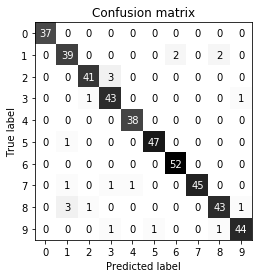

03 多クラス分類の基準
=================

* 基本的に、多クラス分類の基準は全て2クラス分類の基準から導出されたもので、全てのクラスに対して平均を取ったものである

    * 2クラス分類の場合と同様に、他クラス分類の精度は正確にクラス分類されたサンプルの割合

    * これはクラス分布が偏ったデータセットの場合には、やはり適切な評価基準ではない

    * 一般に、多クラス分類の問題の結果は、2クラス分類の結果よりも理解するのが難しい

* 精度以外の一般的なツールには、混同行列とクラス分類レポートがある

    * これらの詳細な評価手法をdigitsデータセットの数字をそれぞれ個々に識別する10クラス分類タスクに適用してみる


```python
from sklearn.model_selection import train_test_split
from sklearn.datasets import load_digits
from sklearn.linear_model import LogisticRegression
from sklearn.metrics import confusion_matrix

digits = load_digits()

from sklearn.metrics import accuracy_score
X_train, X_test, y_train, y_test = train_test_split(
    digits.data, digits.target, random_state=0)
lr = LogisticRegression().fit(X_train, y_train)
pred = lr.predict(X_test)
print("Accuracy: {:.3f}".format(accuracy_score(y_test, pred)))
print("Confusion matrix:\n{}".format(confusion_matrix(y_test, pred)))
```

    Accuracy: 0.953
    Confusion matrix:
    [[37  0  0  0  0  0  0  0  0  0]
     [ 0 39  0  0  0  0  2  0  2  0]
     [ 0  0 41  3  0  0  0  0  0  0]
     [ 0  0  1 43  0  0  0  0  0  1]
     [ 0  0  0  0 38  0  0  0  0  0]
     [ 0  1  0  0  0 47  0  0  0  0]
     [ 0  0  0  0  0  0 52  0  0  0]
     [ 0  1  0  1  1  0  0 45  0  0]
     [ 0  3  1  0  0  0  0  0 43  1]
     [ 0  0  0  1  0  1  0  0  1 44]]


    /Users/MacUser/anaconda2/envs/tf140/lib/python3.6/site-packages/sklearn/linear_model/logistic.py:433: FutureWarning: Default solver will be changed to 'lbfgs' in 0.22. Specify a solver to silence this warning.
      FutureWarning)
    /Users/MacUser/anaconda2/envs/tf140/lib/python3.6/site-packages/sklearn/linear_model/logistic.py:460: FutureWarning: Default multi_class will be changed to 'auto' in 0.22. Specify the multi_class option to silence this warning.
      "this warning.", FutureWarning)


* モデルの精度は95.3%である

    * これだけでもモデルがかなりうまく機能していることがわかる

    * 混同行列からはさらに詳細な情報が得られる

* 2クラス分類のときと同様に、行は実際のラベルを、列が対応する予測ラベルを示す


```python
import mglearn
import matplotlib.pyplot as plt
%matplotlib inline

scores_image = mglearn.tools.heatmap(
    confusion_matrix(y_test, pred), xlabel='Predicted label',
    ylabel='True label', xticklabels=digits.target_names,
    yticklabels=digits.target_names, cmap=plt.cm.gray_r, fmt="%d")
plt.title("Confusion matrix")
plt.gca().invert_yaxis()
```





* 最初のクラス(数字0)については、37個のサンプルがあり、全てがクラス0に分類されている(偽善性はなかった)

    * これは、混同行列の最初の行の他のエントリが全て0であることからわかる

    * また、他の数字が誤って0と分類されたこともないことがわかる(クラス0の偽陽性もなかった)

        * これは、混同行列の最初の列の他のエントリが全て0であることからわかる

    * しかし、数字によっては他の数字と混同されている

        * 例)数字2(3行目)を見ると、3つが数字3(4列目)にクラス分類されている

        * 例)数字3の1つが2と分類されている(3列目4行目)

        * 例)数字8の1つが2と分類されている(3列目9行目)

* `classification_report`関数を用いて、`適合率`、`再現率`、`f-値`を、それぞれのクラスに対して計算することができる


```python
from sklearn.metrics import classification_report
print(classification_report(y_test, pred))
```

                  precision    recall  f1-score   support

               0       1.00      1.00      1.00        37
               1       0.89      0.91      0.90        43
               2       0.95      0.93      0.94        44
               3       0.90      0.96      0.92        45
               4       0.97      1.00      0.99        38
               5       0.98      0.98      0.98        48
               6       0.96      1.00      0.98        52
               7       1.00      0.94      0.97        48
               8       0.93      0.90      0.91        48
               9       0.96      0.94      0.95        47

       micro avg       0.95      0.95      0.95       450
       macro avg       0.95      0.95      0.95       450
    weighted avg       0.95      0.95      0.95       450


* クラス0に対しては全く混同が無かったので、1となっている

* 一方、クラス7については他のクラスのものが間違って7と判断されることはなかったので、適合率は1となっている

* クラス6については偽陰性が無かったので、再現率が1となっている

    * この結果から、このモデルは8と3を苦手としていることがわかる

* 偏ったデータセットに対する多クラス分類問題で最もよく使われている基準は、多クラス版の`f-値`である

    * まず、個々のクラスに対してそのクラスを陽性、他のクラスを陰性として2クラス`f-値`を計算する

    * 次に、このクラスごとの値を、次のようにして平均する

* `macro`平均は、重みをつけずにクラスごとの`f-値`を平均する

    * クラスのサイズを考慮せずに、全てのクラスに同じ重みを与える

* `weighted`平均は、各クラスの支持度に応じて重みを付けて、クラスごとの`f-値`を平均する

    * クラス分類レポートで表示されるのはこの値

* `micro`平均は、全てのクラスの`偽陽性`、`偽陰性`、`真陽性`の総数を計算し、その値を用いて`適合率`、`再現率`、`f-値`を計算する

* 個々のサンプルを同じように重視するのであれば、`micro`平均の$f_1$-値を使う

    * 個々のクラスを同じように重視するのであれば、`macro`平均の$f_1$値を使う


```python
from sklearn.metrics import f1_score
print("Micro average f1 score: {:.3f}".format(
    f1_score(y_test, pred, average="micro")))
print("Macro average f1 score: {:.3f}".format(
    f1_score(y_test, pred, average="macro")))
```

    Micro average f1 score: 0.953
    Macro average f1 score: 0.954


| 版     | 年/月/日   |
| ------ | ---------- |
| 初版   | 2019/03/30 |
| 第二版 | 2019/05/05 |
