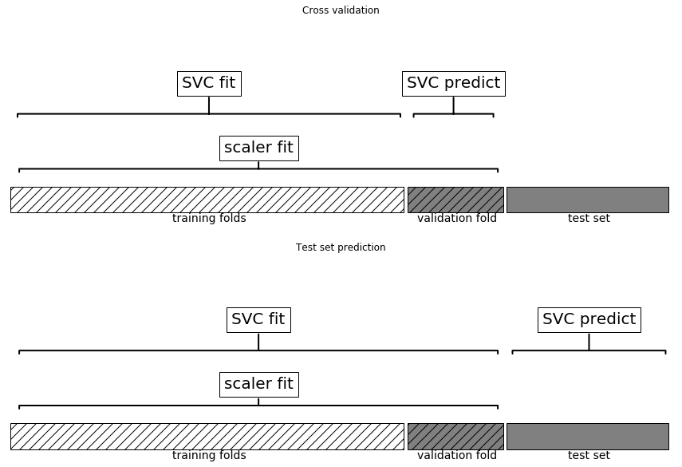
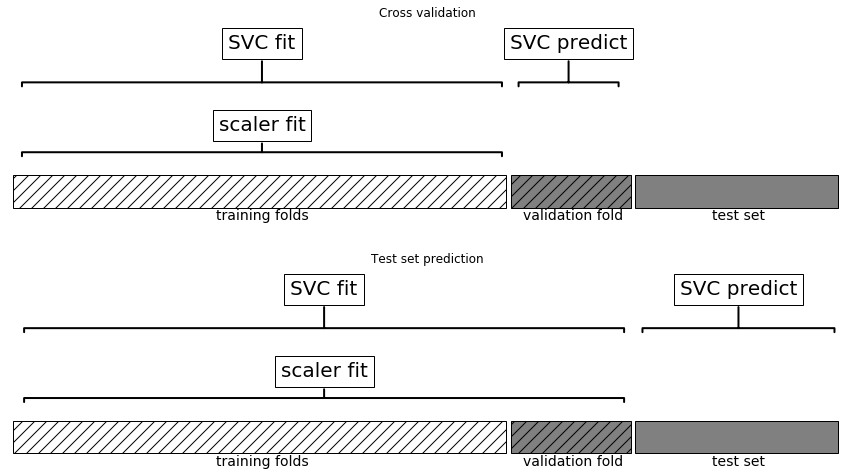
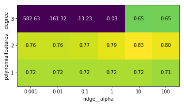

06 アルゴリズムチェーンとパイプライン
===============================

* 多くの機械学習アルゴリズムにおいて、データの表現は非常に重要である

    * データの表現は、データのスケール変換から、手で特徴量を組み合わせたり、教師なし学習で特徴量を学習することまで、多岐に渡る

    * したがって、多くの機械学習アプリケーションでは、1つのアルゴリズムを実行するだけでなく、様々な処理と複数の機械学習アルゴリズムを連鎖的に実行する必要がある

    * 本章では`Pipeline`クラスを用いて、データ変換とモデル実行のチェーンの構築を簡単に行う方法を述べる

    * 特に、`Pipeline`と、`GridSearchCV`を用いて全ての処理ステップを一度に行う方法を見ていく

* モデルチェーンの重要性を示す例として、cancerデータセットを見る

    * このデータセットでは、前処理に`MinMaxScaler`を使うことで、カーネル法を用いたSVMの性能を著しく向上することができた

    * 下に、データを分割して最大値と最小値を求め、データのスケール変換を行い、SVMを訓練するコードを示す


```python
%matplotlib inline
from sklearn.svm import SVC
from sklearn.datasets import load_breast_cancer
from sklearn.model_selection import train_test_split
from sklearn.preprocessing import MinMaxScaler

# データをロードして分割
cancer = load_breast_cancer()
X_train, X_test, y_train, y_test = train_test_split(
    cancer.data, cancer.target, random_state=0)

# 訓練データの最大値と最小値を計算
scaler = MinMaxScaler().fit(X_train)
```


```python
# 訓練データをスケール変換
X_train_scaled = scaler.transform(X_train)

svm = SVC()
# SVMをスケール変換したデータで訓練
svm.fit(X_train_scaled, y_train)
# テストデータをスケール変換して、それを用いて評価
X_test_scaled = scaler.transform(X_test)
print("Test score: {:.2f}".format(svm.score(X_test_scaled, y_test)))
```

    Test score: 0.95


    /Users/MacUser/anaconda2/envs/tf140/lib/python3.6/site-packages/sklearn/svm/base.py:196: FutureWarning: The default value of gamma will change from 'auto' to 'scale' in version 0.22 to account better for unscaled features. Set gamma explicitly to 'auto' or 'scale' to avoid this warning.
      "avoid this warning.", FutureWarning)


## 1. 前処理を行う際のパラメータ選択

* `GridSearchCV`を用いてSVCのより良いパラメータを求めることを考えてみる

    * 単純に考えると、以下のようになる


```python
from sklearn.model_selection import GridSearchCV
# 説明のためのコード。このように記述してはいけない
param_grid = {'C': [0.001, 0.01, 0.1, 1, 10, 100],
              'gamma': [0.001, 0.01, 0.1, 1, 10, 100]}
grid = GridSearchCV(SVC(), param_grid=param_grid, cv=5)
grid.fit(X_train_scaled, y_train)
print("Best cross-validation accuracy: {:.2f}".format(grid.best_score_))
print("Best parameters: ", grid.best_params_)
print("Test set accuracy: {:.2f}".format(grid.score(X_test_scaled, y_test)))
```

    Best cross-validation accuracy: 0.98
    Best parameters:  {'C': 1, 'gamma': 1}
    Test set accuracy: 0.97


* ここでは、SVCのパラメータに対してスケール変換されたデータを用いてグリッドサーチを行っている

    * しかし、ここえはデータをスケール変換する際に、**訓練セットの全てのデータ**を用いている

    * その**スケール変換された訓練データ**を用いて交差検証をし、グリッドサーチを行っている

    * 交差検証の過程では分割されたデータの一部が訓練データとなり、残りがテストデータとなる

    * テストデータとなった部分は、訓練データとなった部分を用いて訓練されたモデルの、新しいデータに対する性能を評価するために用いられる

    * しかし、実は既にスケール変換する際に、テストデータとなった部分に含まれている情報を使ってしまっている

        * 交差検証で用いるテストデータとして使う部分は、訓練データセットの一部であり、データの正しいスケールを決めるために、訓練データセット全体の情報を使っている

        * このようなデータは、モデルに対して全く新しいデータとは本質的に異なる

    * 全く新しいデータを観測した場合、そのデータは訓練セットをスケール変換するのには用いられておらず、従って訓練データとは異なる最小値と最大値を持つかもしれない

    * 以下の図に、交差検証の際と最終的な評価の際のデータ処理の違いを示す


```python
import mglearn
mglearn.plots.plot_improper_processing()
```





* つまり、モデル構築過程において、テストデータは全く新しいデータでなければならないのに、この場合には交差検証のテストデータがその要件を満たしていない

    * テストデータになるべき部分の情報がモデル構築過程にリークしてしまっている

    * この結果、交差検証で過度に楽観的な結果が得られてしまったり、最良でないパラメータが選択されてしまう可能性がある

* この問題を回避するには、**前処理をする前に**交差検証のためのデータ分割を行う必要がある

    * データセットから何らかの知識を抽出する過程は、交差検証のループの内側で、データセットの訓練データとなる部分に対してのみ行うようにする

* これを実現するために、scikit-learnでは`cross_val_score`関数と`GridSearchCV`関数に`Pipeline`クラスを使うことができる

    * `Pipeline`クラスを用いると、複数の処理のステップを「糊付け」し、1つのscikit-learnのEStimatorにすることができる

    * `Pipeline`クラスには、`fit`、`predict`、`score`メソッドがあり、scikit-learnの他のモデルと同様に振る舞う

    * `Pipeline`クラスは、前処理ステップ(データのスケール変換など)と、クラス分類器などの教師あり学習モデルを組み合わせるために最もよく使う

## 2. パイプラインの構築

* `Pipeline`クラスを用いて、`MinMaxScaler`によるスケール変換を行ってからSVMを訓練するワークフローを表現する方法を見てみる(グリッドサーチは行わない)

* まず、各ステップをリストと指定して`Pipeline`オブジェクトを作る

    * 個々のステップは、名前(任意の文字列)と、Estimatorのインスタンスのタプルで表す


```python
from sklearn.pipeline import Pipeline
pipe = Pipeline([("scaler", MinMaxScaler()), ("svm", SVC())])
```

* ここでは2つのステップを作っている

    1. `scaler`という名前で、`MinMaxScaler`のインスタンス

    1. `svm`という名前で`SVC`のインスタンス

* 次に、scikit-learnの他のEstimatorと同じように、パイプラインに対して`fit`メソッドを呼び出す


```python
pipe.fit(X_train, y_train)
```

    /Users/MacUser/anaconda2/envs/tf140/lib/python3.6/site-packages/sklearn/svm/base.py:196: FutureWarning: The default value of gamma will change from 'auto' to 'scale' in version 0.22 to account better for unscaled features. Set gamma explicitly to 'auto' or 'scale' to avoid this warning.
      "avoid this warning.", FutureWarning)


    Pipeline(memory=None,
         steps=[('scaler', MinMaxScaler(copy=True, feature_range=(0, 1))), ('svm', SVC(C=1.0, cache_size=200, class_weight=None, coef0=0.0,
      decision_function_shape='ovr', degree=3, gamma='auto_deprecated',
      kernel='rbf', max_iter=-1, probability=False, random_state=None,
      shrinking=True, tol=0.001, verbose=False))])


* ここで、`pipe.fit`はまず

    1. 第1ステップ(scaler)の`fit`を呼び出して訓練データを`scaler`を変換

    1. SVMを、変換されたデータを用いて`fit`する

* テストデータを用いて評価するには、`pipe.score`を用いる


```python
print("Test score: {:.2f}".format(pipe.score(X_test, y_test)))
```

    Test score: 0.95


* パイプラインの`score`メソッドを呼ぶと、まずテストデータを`scaler`で変換し、SVMの`score`メソッドを変換されたデータで呼び出す

    * 出力からわかるように、結果は変換を手動で行った場合と全く同じ

* パイプラインを用いると、「前処理+クラス分類」プロセスに必要なコード量を減らすことができる

    * しかし、パイプラインの真価は、`cross_val_score`や`GridSearchCV`において、パイプラインを単独のEstimatorとして用いることができる点にある

## 3. パイプラインを用いたグリッドサーチ

* パイプラインをグリッドサーチで用いるには、他のEstimatorを用いる場合と同じようにすれば良い

    * サーチするパラメータグリッドを定義し、パイプラインとパラメータグリッドを用いて`GridSearchCV`を作る

    * ただし、パラメータグリッドを定義する部分には少しだけ変更が必要

    * 個々のパラメータに対して、パイプラインのどのステップに属するかを指定する必要がある

    * ここでは、`C`も`gamma`も2つ目のステップであるSVCのパラメータである

        * このステップには`svm`という名前を付けてある

    * パイプラインに対してパラメータグリッドを定義する文法は、個々のパラメータを、ステップの名前に__(連続したアンダースコア)を続け、

        * その後ろにパラメータ名を書いて指定する

    * SVCのCパラメータに対してサーチを行うには、`svm_C`をパラメータグリッドディクショナリのキーとする(`gamma`も同様)


```python
param_grid = {'svm__C': [0.001, 0.01, 0.1, 1, 10, 100],
              'svm__gamma': [0.001, 0.01, 0.1, 1, 10, 100]}
```

* このパラメータグリッドを使って、`GridSearchCV`をいつものように使う


```python
grid = GridSearchCV(pipe, param_grid=param_grid, cv=5)
grid.fit(X_train, y_train)
print("Best cross-validation accuracy: {:.2f}".format(grid.best_score_))
print("Test set score: {:.2f}".format(grid.score(X_test, y_test)))
print("Best parameters: {}".format(grid.best_params_))
```

    Best cross-validation accuracy: 0.98
    Test set score: 0.97
    Best parameters: {'svm__C': 1, 'svm__gamma': 1}


* 以前に行ったグリッドサーチと異なり、交差検証の個々の分割に対して、訓練用のパートのみを対象として`MinMaxScaler`を`fit`しなおす

    * テスト用のパートから情報がパラメータサーチに漏れることはない


```python
mglearn.plots.plot_proper_processing()
```





* 交差検証で情報がリークすることの影響は、前処理ステップの性質に依存する

* データ変換のスケールをテストデータを用いて推定してもそれほど大きな影響はない

    * しかし、特徴量抽出や特徴量選択をテストデータで行うと、結果にかなりの影響が出る

### 情報リークの影響

* 10,000の特徴量を持つ100サンプルの合成回帰タスクを考える

    * 全てのデータを独立にガウス分布からサンプリングする

    * レスポンスもガウス分布からサンプリングする


```python
import numpy as np
rnd = np.random.RandomState(seed=0)
X = rnd.normal(size=(100, 10000))
y = rnd.normal(size=(100,))
```

* データセットの作り方から言って、データ`X`とターゲット`y`の間には何の関係もない(相互に独立)

    * このデータセットから学習できることはないはず

* このデータに対して次のような学習を行う

* まず、`SelectPercentile`特徴量抽出を行なって、10個の最も情報の多い特徴量を抽出し、交差検証を用いてRidge回帰を評価する


```python
from sklearn.feature_selection import SelectPercentile, f_regression

select = SelectPercentile(score_func=f_regression, percentile=5).fit(X, y)
X_selected = select.transform(X)
print("X_selected.shape: {}".format(X_selected.shape))
```

    X_selected.shape: (100, 500)


```python
from sklearn.model_selection import cross_val_score
from sklearn.linear_model import Ridge
print("Cross-validation accuracy (cv only on ridge): {:.2f}".format(
      np.mean(cross_val_score(Ridge(), X_selected, y, cv=5))))
```

    Cross-validation accuracy (cv only on ridge): 0.91


* 交差検証で得られた平均$R^2$は0.91で、かなり良いモデルを表す

    * データは完全にランダムなので、これは明らかに正しくない

* この理由としては、特徴量抽出によって、10,000個のランダムな特徴量の中から、たまたまターゲットに相関のある特徴量が選ばれた

    * ここでは、交差検証の**外で**特徴量抽出を行なったので、訓練セットでもテストセットでもターゲットに相関のある特徴量が得られた

* `パイプライン`を使って適切な交差検証を行なった場合と比較する


```python
pipe = Pipeline([("select", SelectPercentile(score_func=f_regression,
                                             percentile=5)),
                 ("ridge", Ridge())])
print("Cross-validation accuracy (pipeline): {:.2f}".format(
      np.mean(cross_val_score(pipe, X, y, cv=5))))
```

    Cross-validation accuracy (pipeline): -0.25


* 今度は、$R^2$スコアが負値となり、良くないモデルであることが示されている

    * `パイプライン`を使うことで、特徴量抽出が交差検証ループの**内側**で行われている

    * このため、特徴量抽出は、テスト用の部分は用いず、訓練用の部分に対して行われるようになった

* 特徴量抽出によって、訓練セットのターゲットと相関のある特徴量が選択されるが、データは完全にランダムなので、選択された特徴量は、テストセットのターゲットとは相関がない

    * この例では、特徴量選択過程でのデータのリークを修正することで、非常に良いとされたモデルが、実は全く良くないモデルだと判明したことになる

## 4. 汎用パイプラインインターフェイス

* `Pipeline`クラスが適用できるのは、前処理とクラス分類に限られている訳ではない

    * 任意個数のEstimatorを連結できる

    * 例)特徴量抽出、特徴量選択、スケール変換、クラス分離と4ステップのパイプライン

     * 最後の部分は、クラス分類ではなく、回帰やクラスタリングにすることもできる

* パイプラインに並べるEstimatorに関する制約は、最後以外のステップには次のステップで使うデータの新しい表現を生成するために、

    * `transform`メソッドが定義されている必要がある

* 内部的には、`Pipeline.fit`が呼び出されると、各ステップに対して前段のステップの`transform`メソッドの出力を入力として、

    * `fit`を呼び出してから`transform`を呼び出す

* パイプラインの最後のステップでは、`fit`だけが呼ばれる

* 詳細を省くと、次のように実装されていると思えば良い

    * `pipeline.steps`はタプルのリストなので、`pipeline.steps[0][1]`が最初のEstimator

    * `pipeline.steps[1][1]`が2番目のEstimatorというようになっている


```python
def fit(self, X, y):
    X_transformed = X
    for name, estimator in self.steps[:-1]:
        # 最後のステップ以外で、fitとtransformを順に実行
        X_transformed = estimator.fit_transform(X_transformed, y)
    # 最後のステップでfit
    self.steps[-1][1].fit(X_transformed, y)
    return self
```

* `Pipeline`を用いて予測を行う際には、同様に最後のステップ以外でデータに対して`transform`を行い、最後のステップでは`predict`を呼び出す


```python
def predict(self, X):
    X_transformed = X
    for step in self.steps[:-1]:
        # 最後のステップ以外で、transformを順に実行
        X_transformed = step[1].transform(X_transformed)
    # 最後のステップではpredict
    return self.steps[-1][1].predict(X_transformed)
```

* 2つのデータ変換`T1`、`T2`とクラス分類器`Classifier`に対する過程を、以下の図に示す


* パイプラインは、さらに汎用なツールである

* パイプラインの最後に`predict`メソッドがなくても構わない

    * 例)スケール変換機とPCAだけを持つようなパイプラインを作る

    * この場合、最後のステップ(PCA)に`transform`メソッドがあるので、パイプラインに対して`transform`メソッドを呼び出して、

    * スケール変換されたデータに対して`PCA.transform`を行なった結果を得ることができる

    * パイプラインの最後のステップに対する要求は、`fit`メソッドを持つこと

### 4.1 make_pipelineによる簡便なパイプライン生成

* 上で述べたパイプライン生成の分布は場合によっては面倒である

* 各ステップに対してユーザが名前を与える必要がない場合も多い

* これを簡便にする関数`make_pipeline`が用意されている

    * この関数はクラス名に基づいて個々のステップに自動的に名前を付けてくれる

    * `make_pipeline`の文法は次のようになる


```python
from sklearn.pipeline import make_pipeline
# 標準の文法
pipe_long = Pipeline([("scaler", MinMaxScaler()), ("svm", SVC(C=100))])
# 短縮文法
pipe_short = make_pipeline(MinMaxScaler(), SVC(C=100))
```

* パイプラインオブジェクト`pipe_long`と`pipe_short`は全く同じように動作するが、`pipe_short`の各ステップは自動的に生成された名前が付いている

    * `steps`属性を見ると各ステップの名前がわかる


```python
print("Pipeline steps:\n{}".format(pipe_short.steps))
```

    Pipeline steps:
    [('minmaxscaler', MinMaxScaler(copy=True, feature_range=(0, 1))), ('svc', SVC(C=100, cache_size=200, class_weight=None, coef0=0.0,
      decision_function_shape='ovr', degree=3, gamma='auto_deprecated',
      kernel='rbf', max_iter=-1, probability=False, random_state=None,
      shrinking=True, tol=0.001, verbose=False))]


* ステップの名前は`minmaxscaler`、`svc`となっている

    * 一般にステップの名前は、クラス名を小文字にしただけのものが使われる

    * もし同じクラスのステップが複数あった場合は、番号が追加される


```python
from sklearn.preprocessing import StandardScaler
from sklearn.decomposition import PCA

pipe = make_pipeline(StandardScaler(), PCA(n_components=2), StandardScaler())
print("Pipeline steps:\n{}".format(pipe.steps))
```

    Pipeline steps:
    [('standardscaler-1', StandardScaler(copy=True, with_mean=True, with_std=True)), ('pca', PCA(copy=True, iterated_power='auto', n_components=2, random_state=None,
      svd_solver='auto', tol=0.0, whiten=False)), ('standardscaler-2', StandardScaler(copy=True, with_mean=True, with_std=True))]


* これを見ればわかるように、1つ目の`StandardScaler`ステップは`standardscaler-1`、2つ目は`standardscaler-2`となっている

* しかし、このような場合には明示的に、意味のある名前を各ステップに与えた方が良い

### 4.2 ステップ属性へのアクセス

* パイプラインに含まれる各ステップの属性を見たい場合がある

    * 例)線形モデルの係数やPCAで抽出された成分

    * パイプラインの各ステップにアクセスする最も簡単な方法は、`named_steps`属性を使う方法

    * これは、ステップ名とEstimatorのディクショナリである


```python
# cancerデータセットを用いて、定義しておいたパイプラインを訓練
pipe.fit(cancer.data)
# "pca"ステップ2主成分を取り出す
components = pipe.named_steps["pca"].components_
print("components.shape: {}".format(components.shape))
```

    components.shape: (2, 30)


### 4.3 GridSearchCV内のパイプラインの属性へのアクセス

* パイプラインを使う目的の1つは、グリッドサーチ

* グリッドサーチ中のパイプラインのいずれかのステップにアクセスしたいことはよくある

* cancerデータセットに対して`LogisticRegression`クラス分類器を用いてグリッドサーチをしてみる

    * この際、`Pipeline`を用いて`LogisticRegression`にデータを渡す前に、`StandardScaler`によるスケール変換を行う

    * まず、`make_pipeline`関数でパイプラインを作る


```python
from sklearn.linear_model import LogisticRegression

pipe = make_pipeline(StandardScaler(), LogisticRegression())
```

* 次に、パラメータグリッドを作る

    * `LogisticRegression`の正則化パラメータは`C`である

    * このパラメータには対数グリッドを用いて、0.01から100までをサーチする

    * ここでは`make_pipeline`関数を用いたので、パイプラインの中の`LogisticRegression`ステップの名前はクラス名の小文字の`logisticregression`

    * したがって、パラメータ`C`をチューニングするには、パラメータグリッドで`logisticregression__C`を指定する


```python
param_grid = {'logisticregression__C': [0.01, 0.1, 1, 10, 100]}
```

* cancerデータセットを訓練セットとテストセットに分割し、グリッドサーチを行う


```python
X_train, X_test, y_train, y_test = train_test_split(
    cancer.data, cancer.target, random_state=4)
grid = GridSearchCV(pipe, param_grid, cv=5)
grid.fit(X_train, y_train)
```

    /Users/MacUser/anaconda2/envs/tf140/lib/python3.6/site-packages/sklearn/linear_model/logistic.py:433: FutureWarning: Default solver will be changed to 'lbfgs' in 0.22. Specify a solver to silence this warning.
      FutureWarning)
    /Users/MacUser/anaconda2/envs/tf140/lib/python3.6/site-packages/sklearn/linear_model/logistic.py:433: FutureWarning: Default solver will be changed to 'lbfgs' in 0.22. Specify a solver to silence this warning.
      FutureWarning)
    /Users/MacUser/anaconda2/envs/tf140/lib/python3.6/site-packages/sklearn/linear_model/logistic.py:433: FutureWarning: Default solver will be changed to 'lbfgs' in 0.22. Specify a solver to silence this warning.
      FutureWarning)
    /Users/MacUser/anaconda2/envs/tf140/lib/python3.6/site-packages/sklearn/linear_model/logistic.py:433: FutureWarning: Default solver will be changed to 'lbfgs' in 0.22. Specify a solver to silence this warning.
      FutureWarning)
    /Users/MacUser/anaconda2/envs/tf140/lib/python3.6/site-packages/sklearn/linear_model/logistic.py:433: FutureWarning: Default solver will be changed to 'lbfgs' in 0.22. Specify a solver to silence this warning.
      FutureWarning)
    /Users/MacUser/anaconda2/envs/tf140/lib/python3.6/site-packages/sklearn/linear_model/logistic.py:433: FutureWarning: Default solver will be changed to 'lbfgs' in 0.22. Specify a solver to silence this warning.
      FutureWarning)
    /Users/MacUser/anaconda2/envs/tf140/lib/python3.6/site-packages/sklearn/linear_model/logistic.py:433: FutureWarning: Default solver will be changed to 'lbfgs' in 0.22. Specify a solver to silence this warning.
      FutureWarning)
    /Users/MacUser/anaconda2/envs/tf140/lib/python3.6/site-packages/sklearn/linear_model/logistic.py:433: FutureWarning: Default solver will be changed to 'lbfgs' in 0.22. Specify a solver to silence this warning.
      FutureWarning)
    /Users/MacUser/anaconda2/envs/tf140/lib/python3.6/site-packages/sklearn/linear_model/logistic.py:433: FutureWarning: Default solver will be changed to 'lbfgs' in 0.22. Specify a solver to silence this warning.
      FutureWarning)
    /Users/MacUser/anaconda2/envs/tf140/lib/python3.6/site-packages/sklearn/linear_model/logistic.py:433: FutureWarning: Default solver will be changed to 'lbfgs' in 0.22. Specify a solver to silence this warning.
      FutureWarning)
    /Users/MacUser/anaconda2/envs/tf140/lib/python3.6/site-packages/sklearn/linear_model/logistic.py:433: FutureWarning: Default solver will be changed to 'lbfgs' in 0.22. Specify a solver to silence this warning.
      FutureWarning)
    /Users/MacUser/anaconda2/envs/tf140/lib/python3.6/site-packages/sklearn/linear_model/logistic.py:433: FutureWarning: Default solver will be changed to 'lbfgs' in 0.22. Specify a solver to silence this warning.
      FutureWarning)
    /Users/MacUser/anaconda2/envs/tf140/lib/python3.6/site-packages/sklearn/linear_model/logistic.py:433: FutureWarning: Default solver will be changed to 'lbfgs' in 0.22. Specify a solver to silence this warning.
      FutureWarning)
    /Users/MacUser/anaconda2/envs/tf140/lib/python3.6/site-packages/sklearn/linear_model/logistic.py:433: FutureWarning: Default solver will be changed to 'lbfgs' in 0.22. Specify a solver to silence this warning.
      FutureWarning)
    /Users/MacUser/anaconda2/envs/tf140/lib/python3.6/site-packages/sklearn/linear_model/logistic.py:433: FutureWarning: Default solver will be changed to 'lbfgs' in 0.22. Specify a solver to silence this warning.
      FutureWarning)
    /Users/MacUser/anaconda2/envs/tf140/lib/python3.6/site-packages/sklearn/linear_model/logistic.py:433: FutureWarning: Default solver will be changed to 'lbfgs' in 0.22. Specify a solver to silence this warning.
      FutureWarning)
    /Users/MacUser/anaconda2/envs/tf140/lib/python3.6/site-packages/sklearn/linear_model/logistic.py:433: FutureWarning: Default solver will be changed to 'lbfgs' in 0.22. Specify a solver to silence this warning.
      FutureWarning)
    /Users/MacUser/anaconda2/envs/tf140/lib/python3.6/site-packages/sklearn/linear_model/logistic.py:433: FutureWarning: Default solver will be changed to 'lbfgs' in 0.22. Specify a solver to silence this warning.
      FutureWarning)
    /Users/MacUser/anaconda2/envs/tf140/lib/python3.6/site-packages/sklearn/linear_model/logistic.py:433: FutureWarning: Default solver will be changed to 'lbfgs' in 0.22. Specify a solver to silence this warning.
      FutureWarning)
    /Users/MacUser/anaconda2/envs/tf140/lib/python3.6/site-packages/sklearn/linear_model/logistic.py:433: FutureWarning: Default solver will be changed to 'lbfgs' in 0.22. Specify a solver to silence this warning.
      FutureWarning)
    /Users/MacUser/anaconda2/envs/tf140/lib/python3.6/site-packages/sklearn/linear_model/logistic.py:433: FutureWarning: Default solver will be changed to 'lbfgs' in 0.22. Specify a solver to silence this warning.
      FutureWarning)
    /Users/MacUser/anaconda2/envs/tf140/lib/python3.6/site-packages/sklearn/linear_model/logistic.py:433: FutureWarning: Default solver will be changed to 'lbfgs' in 0.22. Specify a solver to silence this warning.
      FutureWarning)
    /Users/MacUser/anaconda2/envs/tf140/lib/python3.6/site-packages/sklearn/linear_model/logistic.py:433: FutureWarning: Default solver will be changed to 'lbfgs' in 0.22. Specify a solver to silence this warning.
      FutureWarning)
    /Users/MacUser/anaconda2/envs/tf140/lib/python3.6/site-packages/sklearn/linear_model/logistic.py:433: FutureWarning: Default solver will be changed to 'lbfgs' in 0.22. Specify a solver to silence this warning.
      FutureWarning)
    /Users/MacUser/anaconda2/envs/tf140/lib/python3.6/site-packages/sklearn/linear_model/logistic.py:433: FutureWarning: Default solver will be changed to 'lbfgs' in 0.22. Specify a solver to silence this warning.
      FutureWarning)
    /Users/MacUser/anaconda2/envs/tf140/lib/python3.6/site-packages/sklearn/linear_model/logistic.py:433: FutureWarning: Default solver will be changed to 'lbfgs' in 0.22. Specify a solver to silence this warning.
      FutureWarning)


    GridSearchCV(cv=5, error_score='raise-deprecating',
           estimator=Pipeline(memory=None,
         steps=[('standardscaler', StandardScaler(copy=True, with_mean=True, with_std=True)), ('logisticregression', LogisticRegression(C=1.0, class_weight=None, dual=False, fit_intercept=True,
              intercept_scaling=1, max_iter=100, multi_class='warn',
              n_jobs=None, penalty='l2', random_state=None, solver='warn',
              tol=0.0001, verbose=0, warm_start=False))]),
           fit_params=None, iid='warn', n_jobs=None,
           param_grid={'logisticregression__C': [0.01, 0.1, 1, 10, 100]},
           pre_dispatch='2*n_jobs', refit=True, return_train_score='warn',
           scoring=None, verbose=0)


* `GridSearchCV`が全ての訓練データに対して訓練を行なって見つけた最良のモデルは、`grid.best_estimator_`に格納されている


```python
print("Best estimator:\n{}".format(grid.best_estimator_))
```

    Best estimator:
    Pipeline(memory=None,
         steps=[('standardscaler', StandardScaler(copy=True, with_mean=True, with_std=True)), ('logisticregression', LogisticRegression(C=0.1, class_weight=None, dual=False, fit_intercept=True,
              intercept_scaling=1, max_iter=100, multi_class='warn',
              n_jobs=None, penalty='l2', random_state=None, solver='warn',
              tol=0.0001, verbose=0, warm_start=False))])


* この場合、`best_estimator_`には、`standardscaler`と`logitsicregression`の2ステップからなるパイプラインが格納されている

    * `logisticregression`にアクセスするには、上で説明したようにパイプラインの`named_steps`属性を用いる


```python
print("Logistic regression step:\n{}".format(
      grid.best_estimator_.named_steps["logisticregression"]))
```

    Logistic regression step:
    LogisticRegression(C=0.1, class_weight=None, dual=False, fit_intercept=True,
              intercept_scaling=1, max_iter=100, multi_class='warn',
              n_jobs=None, penalty='l2', random_state=None, solver='warn',
              tol=0.0001, verbose=0, warm_start=False)


* 訓練した`LogisticRegression`インスタンスが入手できたので、個々の入力特徴量に対応する係数(重み)にアクセスできる


```python
print("Logistic regression coefficients:\n{}".format(
      grid.best_estimator_.named_steps["logisticregression"].coef_))
```

    Logistic regression coefficients:
    [[-0.38856355 -0.37529972 -0.37624793 -0.39649439 -0.11519359  0.01709608
      -0.3550729  -0.38995414 -0.05780518  0.20879795 -0.49487753 -0.0036321
      -0.37122718 -0.38337777 -0.04488715  0.19752816  0.00424822 -0.04857196
       0.21023226  0.22444999 -0.54669761 -0.52542026 -0.49881157 -0.51451071
      -0.39256847 -0.12293451 -0.38827425 -0.4169485  -0.32533663 -0.13926972]]


## 5. 前処理ステップとモデルパラメータに対するグリッドサーチ

* パイプラインを使うと、機械学習ワークフローの全てのステップを1つのscikit-learn Estimatorにカプセル化することができる

    * このことのメリットの1つが、回帰やクラス分類などの教師あり学習タスクの結果を使って、**前処理のパラメータの調整**を行うことができる

    * これまで、boston_housingデータセットに対して、リッジ回帰を適用する前に多項式特徴量を用いる例を見た

    * これをパイプラインでモデル化してみる

* パイプラインには、3つのステップが含まれることになる

    * データのスケール変換

    * 多項式特徴量の計算

    * リッジ回帰


```python
from sklearn.datasets import load_boston
boston = load_boston()
X_train, X_test, y_train, y_test = train_test_split(boston.data, boston.target,
                                                    random_state=0)

from sklearn.preprocessing import PolynomialFeatures
pipe = make_pipeline(
    StandardScaler(),
    PolynomialFeatures(),
    Ridge())
```

* 多項式の次数を選択するには、クラス分類の結果を見て`degree`パラメータを選択できれば理想的

* パイプラインを用いると、Ridgeの`alpha`パラメータと同時に`degree`パラメータをサーチすることができる

    * これを行うには、`param_grid`に、これら双方を指定すれば良い

    * もちろんステップの名前をパラメータ名の前に付ける必要がある


```python
param_grid = {'polynomialfeatures__degree': [1, 2, 3],
              'ridge__alpha': [0.001, 0.01, 0.1, 1, 10, 100]}
```

* これでグリッドサーチを再度実行する


```python
grid = GridSearchCV(pipe, param_grid=param_grid, cv=5, n_jobs=-1)
grid.fit(X_train, y_train)
```

    /Users/MacUser/anaconda2/envs/tf140/lib/python3.6/site-packages/sklearn/model_selection/_search.py:841: DeprecationWarning: The default of the `iid` parameter will change from True to False in version 0.22 and will be removed in 0.24. This will change numeric results when test-set sizes are unequal.
      DeprecationWarning)


    GridSearchCV(cv=5, error_score='raise-deprecating',
           estimator=Pipeline(memory=None,
         steps=[('standardscaler', StandardScaler(copy=True, with_mean=True, with_std=True)), ('polynomialfeatures', PolynomialFeatures(degree=2, include_bias=True, interaction_only=False)), ('ridge', Ridge(alpha=1.0, copy_X=True, fit_intercept=True, max_iter=None,
       normalize=False, random_state=None, solver='auto', tol=0.001))]),
           fit_params=None, iid='warn', n_jobs=-1,
           param_grid={'polynomialfeatures__degree': [1, 2, 3], 'ridge__alpha': [0.001, 0.01, 0.1, 1, 10, 100]},
           pre_dispatch='2*n_jobs', refit=True, return_train_score='warn',
           scoring=None, verbose=0)


* 交差検証の結果をヒートマップで可視化することができる


```python
mglearn.tools.heatmap(grid.cv_results_['mean_test_score'].reshape(3, -1),
                      xlabel="ridge__alpha", ylabel="polynomialfeatures__degree",
                      xticklabels=param_grid['ridge__alpha'],
                      yticklabels=param_grid['polynomialfeatures__degree'], vmin=0)
```


    <matplotlib.collections.PolyCollection at 0x11eb5e4e0>





* 交差検証で生成した結果を見ると、2次の多項式は効果があるが、3次の多項式は1次よりも2次よりも結果が悪い

* これは最良のパラメータとして得られた結果にも反映されている


```python
print("Best parameters: {}".format(grid.best_params_))
```

    Best parameters: {'polynomialfeatures__degree': 2, 'ridge__alpha': 10}


* このパラメータを用いるとスコアはこのようになる


```python
print("Test-set score: {:.2f}".format(grid.score(X_test, y_test)))
```

    Test-set score: 0.77


* 比較のために、多項式特徴量を使わずにグリッドサーチを行なってみる


```python
param_grid = {'ridge__alpha': [0.001, 0.01, 0.1, 1, 10, 100]}
pipe = make_pipeline(StandardScaler(), Ridge())
grid = GridSearchCV(pipe, param_grid, cv=5)
grid.fit(X_train, y_train)
print("Score without poly features: {:.2f}".format(grid.score(X_test, y_test)))
```

    Score without poly features: 0.63


    /Users/MacUser/anaconda2/envs/tf140/lib/python3.6/site-packages/sklearn/model_selection/_search.py:841: DeprecationWarning: The default of the `iid` parameter will change from True to False in version 0.22 and will be removed in 0.24. This will change numeric results when test-set sizes are unequal.
      DeprecationWarning)


* グリッドサーチの結果からも予測されるように、多項式特徴量を用いないと、明らかに結果は悪くなる

* 前処理のパラメータをモデルのパラメータと同時にサーチする方法は非常に強力な戦略である

    * ただし、`GridSearchCV`は、**全てのパラメータの組み合わせ**を探索することに注意する

    * グリッドにパラメータを追加すればするほど、構築されるモデルの数は指数関数的に増大する

## 6. グリッドサーチによるモデルの選択

* `GridSearchCV`と`Pipeline`の組み合わせにはさらなる用途がある

    * パイプラインで実際に行われるステップに対してもサーチすることが可能

    * 例)`StandardScaler`と`MinMaxScaler`のどちらを用いるかをサーチの対象にすることができる

    * ただし、探索空間はさらに大きくなるので、よく考える必要がある

    * 組み合わせ可能な方法を全て試してみるのは、機械学習の戦略として現実的ではない

* 例)irisデータセットに対して`RandomForestClassifier`と`SVC`を比較する

    * `SVC`はデータをスケール変換する必要があるので、`StandardScaler`を行うか、何も処理をしないかに付いても探索する必要がある

    * `RandomForestClassifier`には前処理が必要ないことが知られている

* まず、パイプラインを定義する

    * ここではステップの名前を明示的に指定している

    * 前処理`preprocessing`とクラス分類器`classifier`の2つのステップが必要

    * ここではそれぞれ`SVC`と`StandardScaler`を用いる


```python
pipe = Pipeline([('preprocessing', StandardScaler()), ('classifier', SVC())])
```

* 次に探索する範囲を`parameter_grid`として定義する

    * `classifier`は`RandomForestClassifier`と`SVC`である

    * これらのチューニングパラメータは異なるし、必要な前処理も異なるので、サーチグリッドのリストを使う

    * Estimatorをステップに割り当てるにはステップの名前をパラメータ名に用いる

    * パイプラインの中のステップを飛ばしたい場合には、そのステップを`None`にすれば良い(RandomForestなど)


```python
from sklearn.ensemble import RandomForestClassifier

param_grid = [
    {'classifier': [SVC()], 'preprocessing': [StandardScaler(), None],
     'classifier__gamma': [0.001, 0.01, 0.1, 1, 10, 100],
     'classifier__C': [0.001, 0.01, 0.1, 1, 10, 100]},
    {'classifier': [RandomForestClassifier(n_estimators=100)],
     'preprocessing': [None], 'classifier__max_features': [1, 2, 3]}]
```


```python
X_train, X_test, y_train, y_test = train_test_split(
    cancer.data, cancer.target, random_state=0)

grid = GridSearchCV(pipe, param_grid, cv=5)
grid.fit(X_train, y_train)

print("Best params:\n{}\n".format(grid.best_params_))
print("Best cross-validation score: {:.2f}".format(grid.best_score_))
print("Test-set score: {:.2f}".format(grid.score(X_test, y_test)))
```

    Best params:
    {'classifier': SVC(C=10, cache_size=200, class_weight=None, coef0=0.0,
      decision_function_shape='ovr', degree=3, gamma=0.01, kernel='rbf',
      max_iter=-1, probability=False, random_state=None, shrinking=True,
      tol=0.001, verbose=False), 'classifier__C': 10, 'classifier__gamma': 0.01, 'preprocessing': StandardScaler(copy=True, with_mean=True, with_std=True)}

    Best cross-validation score: 0.99
    Test-set score: 0.98


* このグリッドサーチの結果から、`StandardScaler`で前処理した`SVC`で、`C=10`、`gamma=0.01`が最良の結果を返すことがわかる

## 7. まとめと展望

* 本章では、機械学習ワークフローの複数の処理ステップを1つなぎにまとめる汎用のツール、`Pipeline`クラスを導入した

* 実世界のアプリケーションでは、独立したモデルを単独で使うことはほとんどなく、大半が一連の処理ステップの列となる

* パイプラインを使うと、複数の処理のステップを、使い慣れたscikit-learnの標準インターフェースである`fit`、`predict`、`transform`を持つ1つのPythonオブジェクトにまとめることができる

    * 特に、交差検証でモデルを評価する場合や、グリッドサーチでパラメータを選択する場合に、`Pipeline`クラスを用いて全ての処理をまとめておくには、適切な評価のためには非常に重要である

    * `Pipeline`クラスを使わずに処理の連鎖を記述すると、テストセットに全ての変換を適用するのを忘れるとか順番を間違えるミスを起こしがち

    * しかし、`Pipeline`クラスを用いると、コードが簡潔になりミスが少なくなる

    * 特徴量抽出、前処理、モデルの正しい組み合わせを選ぶのはある種の技芸で、多くの場合、試行錯誤が必要になる

    * パイプラインを用いると、この様々な処理ステップを試すのが非常に簡単になる

    * 実験をする際には、処理が複雑過ぎないように注意する必要がある

    * モデルに不要な要素が含まれていないか常に評価する


|  版  |   年/月/日   |
|-----|-----------------|
|初版|2019/04/04|
|第二版|2019/05/05|
