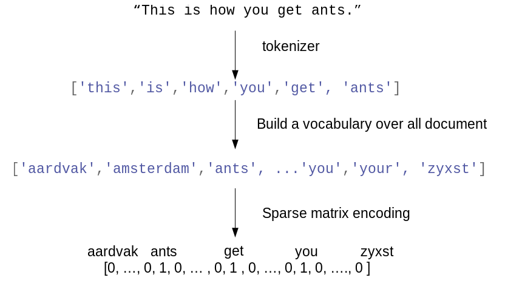

03 Bag of Wordsによるテキスト表現
============================

* `BoW`：最も単純で効率が良く、機械学習で広く用いられているテキストデータ表現

    * この表現では、章立て、パラグラフ、文章、フォーマットなどの入力テキストの持つ構造のほとんど全てが失われる

    * `コーパス`に現れた単語がテキストに現れる回数だけが数えられる

    * 構造を捨て単語の現れる回数だけを数えるので、テキストを単語を入れる「袋」と考える事になる

文章の集合であるコーパスに対してBow表現を計算するには次の3ステップが必要になる

1. `トークン分類`：個々の文章を単語(トークンと呼ぶ)に分割する

    * 例)ホワイトスペースや句読点で区切る

1. `ボキャブラリ構築`：全ての文書に現れる全ての単語をボキャブラリとして集め、番号を付ける

    * 例)アルファベット順

1. `エンコード`：個々の文書に対して、ボキャブラリの単語が現れる回数を数える

* ステップ1・2には難しい部分があるので、のちに述べる

* ここでは、scikit-learnでBow処理を行う方法を見てみる

    * "This is how you get ants."という文字列を処理する様子を示す



* 出力は、1つの文書に対して、1つの単語数ベクトルになる

    * つまり、個々の単語に対して1つの特徴量を割り当てた数値表現になったということ

    * 元の文字列で単語の順番はBoW特徴量表現には全く反映されないことに注意する

## 1. トイデータセットに対するBoW

* `BoW表現`は、変換器として`CountVectorizer`に実装されている

    * まず2つのサンプルデータからなるトイデータセットを試してみる


```python
from sklearn.datasets import load_files

reviews_train = load_files("/Users/MacUser/data/aclImdb/train/")
text_train, y_train = reviews_train.data, reviews_train.target
text_train = [doc.replace(b"<br />", b" ") for doc in text_train]
reviews_test = load_files("/Users/MacUser/data/aclImdb/test/")
text_test, y_test = reviews_test.data, reviews_test.target
text_test = [doc.replace(b"<br />", b" ") for doc in text_test]
```


```python
bards_words =["The fool doth think he is wise,",
              "but the wise man knows himself to be a fool"]
```

* `CountVectorizer`をインポートして、インスタンスを生成してから、トイデータセットに対して`fit`を呼び出す


```python
from sklearn.feature_extraction.text import CountVectorizer
vect = CountVectorizer()
vect.fit(bards_words)
```


    CountVectorizer(analyzer='word', binary=False, decode_error='strict',
            dtype=<class 'numpy.int64'>, encoding='utf-8', input='content',
            lowercase=True, max_df=1.0, max_features=None, min_df=1,
            ngram_range=(1, 1), preprocessor=None, stop_words=None,
            strip_accents=None, token_pattern='(?u)\\b\\w\\w+\\b',
            tokenizer=None, vocabulary=None)


* `CountVectorizer`の`fit`では、訓練データのトークン分割とボキャブラリの構築が行われる

    * ボキャブラリは`vocabulary_`属性で確認できる


```python
print("Vocabulary size: {}".format(len(vect.vocabulary_)))
print("Vocabulary content:\n {}".format(vect.vocabulary_))
```

    Vocabulary size: 13
    Vocabulary content:
     {'the': 9, 'fool': 3, 'doth': 2, 'think': 10, 'he': 4, 'is': 6, 'wise': 12, 'but': 1, 'man': 8, 'knows': 7, 'himself': 5, 'to': 11, 'be': 0}


* ボキャブラリには、"be"から"wise"までの13個の単語が含まれている

* 訓練データに対するBoW表現を作るには、`transform`メソッドを呼び出す


```python
bag_of_words = vect.transform(bards_words)
print("bag_of_words: {}".format(repr(bag_of_words)))
```

    bag_of_words: <2x13 sparse matrix of type '<class 'numpy.int64'>'
    	with 16 stored elements in Compressed Sparse Row format>


* `BoW表現`は、SciPyの疎行列として格納されている

    * このデータ構造は、非ゼロの要素しか格納しない

    * この行列は$2 \times 13$で、2つのデータポイントに対してそれぞれ行が割り当てられ、ボキャブラリ中の単語に対してそれぞれ特徴量が割り当てられている

    * 疎行列が用いられているのは、ほとんどの文書にはボキャブラリ中の単語のごく一部しか現れず、特徴量に対する要素のほとんどが0になるため

    * 1つの映画レビューに現れる単語数が、英語の全ての単語数(これがボキャブラリがモデル化しているもの)と比べると、どのくらい少ないかがわかる

    * 全ての0をそのまま格納するのはメモリの無駄である

    * 疎行列の内容を見るためには、`toarray`メソッドを用いて「密な」NumPy行列(こちらは0をそのまま格納する)に変換する


```python
print("Dense representation of bag_of_words:\n{}".format(
    bag_of_words.toarray()))
```

    Dense representation of bag_of_words:
    [[0 0 1 1 1 0 1 0 0 1 1 0 1]
     [1 1 0 1 0 1 0 1 1 1 0 1 1]]


* 各単語に対する出現回数が0か1であることがわかる

    * どちらの文字列も同じ単語が2度は出現していないため

* この特徴量ベクトルを読むには、

    * 最初の文字列("The fool doth think he is wise, ")が最初の行として表現されている

    * ボキャブラリの最初の単語"be"は0回、2つ目の単語"but"は0回、...というようになっている

    * 両方の行を見ると、4番目の単語"fool"...などが両方の文字列に出現していることがわかる

## 2. 映画レビューのBoW

* BoWの処理を詳しく見たので、映画レビューのセンチメント分析タスクに適用してみる

    * 既にIMDbレビューから得た訓練データとテストデータを文字列のリストとしてロードしてあるので(`text_train`と`text_test`)、これを処理する


```python
vect = CountVectorizer().fit(text_train)
X_train = vect.transform(text_train)
print("X_train:\n{}".format(repr(X_train)))
```

    X_train:
    <25000x74849 sparse matrix of type '<class 'numpy.int64'>'
    	with 3431196 stored elements in Compressed Sparse Row format>


* 訓練データのBoW表現である`X_train`の行列サイズは$ 25,000 \times 74,849$である

    * つまり、ボキャブラリは74,849の単語で構成されている

    * ここでもデータはSciPyの疎行列として格納されている

* ボキャブラリにアクセスするもう1つの方法が、`CountVectorizer`の`get_feature_name`である

    * このメソッドは個々の特徴量に対応するエントリのリストを返す


```python
feature_names = vect.get_feature_names()
print("Number of features: {}".format(len(feature_names)))
print("First 20 features:\n{}".format(feature_names[:20]))
print("Features 20010 to 20030:\n{}".format(feature_names[20010:20030]))
print("Every 2000th feature:\n{}".format(feature_names[::2000]))
```

    Number of features: 74849
    First 20 features:
    ['00', '000', '0000000000001', '00001', '00015', '000s', '001', '003830', '006', '007', '0079', '0080', '0083', '0093638', '00am', '00pm', '00s', '01', '01pm', '02']
    Features 20010 to 20030:
    ['dratted', 'draub', 'draught', 'draughts', 'draughtswoman', 'draw', 'drawback', 'drawbacks', 'drawer', 'drawers', 'drawing', 'drawings', 'drawl', 'drawled', 'drawling', 'drawn', 'draws', 'draza', 'dre', 'drea']
    Every 2000th feature:
    ['00', 'aesir', 'aquarian', 'barking', 'blustering', 'bête', 'chicanery', 'condensing', 'cunning', 'detox', 'draper', 'enshrined', 'favorit', 'freezer', 'goldman', 'hasan', 'huitieme', 'intelligible', 'kantrowitz', 'lawful', 'maars', 'megalunged', 'mostey', 'norrland', 'padilla', 'pincher', 'promisingly', 'receptionist', 'rivals', 'schnaas', 'shunning', 'sparse', 'subset', 'temptations', 'treatises', 'unproven', 'walkman', 'xylophonist']


* これを見ると、ボキャブラリの最初の10エントリは全て数字である

    * これらの数字はレビューのどこかに現れたので、単語として抽出されている

    * これらの数字のほとんどにはあまり意味はない

    * ただし、"007"は映画を指している可能性がある

    * また、"dra"で始まる英単語は単数形と複数形の形で別の単語としてボキャブラリに含まれていることがわかる

        * これは別の特徴量にするのは理想的ではない

* 特徴量抽出を改良する前に、クラス分類器を実際に構築して、性能の定量的な指標を得ておく

    * 訓練ラベルは`y_train`に格納されており、訓練データのBoW表現は`X_train`に格納さているので、クラス分類器を訓練することができる

    * このような高次元の疎なデータに対しては、`LogisticRegression`のような線形モデルが有効

* まずは交差検証を用いて、`LogisticRegression`を評価してみる


```python
import numpy as np
from sklearn.model_selection import cross_val_score
from sklearn.linear_model import LogisticRegression
scores = cross_val_score(LogisticRegression(), X_train, y_train, cv=5)
print("Mean cross-validation accuracy: {:.2f}".format(np.mean(scores)))
```

    /Users/MacUser/anaconda2/envs/tf140/lib/python3.6/site-packages/sklearn/linear_model/logistic.py:433: FutureWarning: Default solver will be changed to 'lbfgs' in 0.22. Specify a solver to silence this warning.
      FutureWarning)


    Mean cross-validation accuracy: 0.88


* 平均交差検証スコアは88%隣、偏りのない2クラス分類タスクとしては通常の性能となっている

    * `LogisticRegression`には正則化パラメータ`C`があり、交差検証でチューニングすることができる


```python
from sklearn.model_selection import GridSearchCV
param_grid = {'C': [0.001, 0.01, 0.1, 1, 10]}
grid = GridSearchCV(LogisticRegression(), param_grid, cv=5)
grid.fit(X_train, y_train)
print("Best cross-validation score: {:.2f}".format(grid.best_score_))
print("Best parameters: ", grid.best_params_)
```

    /Users/MacUser/anaconda2/envs/tf140/lib/python3.6/site-packages/sklearn/linear_model/logistic.py:433: FutureWarning: Default solver will be changed to 'lbfgs' in 0.22. Specify a solver to silence this warning.
      FutureWarning)


    Best cross-validation score: 0.89
    Best parameters:  {'C': 0.1}


* `C=0.1`での交差検証スコアは89%が得られた。

    * このパラメータを用いて、テストセットから汎化性能を見てみる


```python
X_test = vect.transform(text_test)
print("Test score: {:.2f}".format(grid.score(X_test, y_test)))
```

    Test score: 0.88


* ここで、単語の抽出を改善できるかを見てみる

    * `CountVectorizer`はトークンを正規表現(`\b\w\w+\b`)を用いて抽出する

    * 次に`CountVectirizer`は全ての単語を小文字にする

    * 数字のような特徴量のない特徴量がたくさん得られてしまう

* これを解決する方法の1つは、2つ以上の文書に登場しているトークンだけを用いる

    * 1つの文書にしか現れないトークンは、テストセットにも現れないため、役に立たない

    * トークンとして採用されるために現れるべき単語数を`min_df`パラメータで設定することができる


```python
vect = CountVectorizer(min_df=5).fit(text_train)
X_train = vect.transform(text_train)
print("X_train with min_df: {}".format(repr(X_train)))
```

    X_train with min_df: <25000x27271 sparse matrix of type '<class 'numpy.int64'>'
    	with 3354014 stored elements in Compressed Sparse Row format>


* 上の結果からわかるように、5つ以上の文書に現れたものだけをトークンとすることで、特徴量の数は27,271までに減った

    * 元の特徴量の1/3である

    * トークンをもう一度見てみる


```python
feature_names = vect.get_feature_names()

print("First 50 features:\n{}".format(feature_names[:50]))
print("Features 20010 to 20030:\n{}".format(feature_names[20010:20030]))
print("Every 700th feature:\n{}".format(feature_names[::700]))
```

    First 50 features:
    ['00', '000', '007', '00s', '01', '02', '03', '04', '05', '06', '07', '08', '09', '10', '100', '1000', '100th', '101', '102', '103', '104', '105', '107', '108', '10s', '10th', '11', '110', '112', '116', '117', '11th', '12', '120', '12th', '13', '135', '13th', '14', '140', '14th', '15', '150', '15th', '16', '160', '1600', '16mm', '16s', '16th']
    Features 20010 to 20030:
    ['repentance', 'repercussions', 'repertoire', 'repetition', 'repetitions', 'repetitious', 'repetitive', 'rephrase', 'replace', 'replaced', 'replacement', 'replaces', 'replacing', 'replay', 'replayable', 'replayed', 'replaying', 'replays', 'replete', 'replica']
    Every 700th feature:
    ['00', 'affections', 'appropriately', 'barbra', 'blurbs', 'butchered', 'cheese', 'commitment', 'courts', 'deconstructed', 'disgraceful', 'dvds', 'eschews', 'fell', 'freezer', 'goriest', 'hauser', 'hungary', 'insinuate', 'juggle', 'leering', 'maelstrom', 'messiah', 'music', 'occasional', 'parking', 'pleasantville', 'pronunciation', 'recipient', 'reviews', 'sas', 'shea', 'sneers', 'steiger', 'swastika', 'thrusting', 'tvs', 'vampyre', 'westerns']


* 数字は明らかに減っているし、意味のわからない単語やスペルミスも消えているように見える

* 再びグリッドサーチを用いてモデルの性能を見てみる


```python
grid = GridSearchCV(LogisticRegression(), param_grid, cv=5)
grid.fit(X_train, y_train)
print("Best cross-validation score: {:.2f}".format(grid.best_score_))
```

    /Users/MacUser/anaconda2/envs/tf140/lib/python3.6/site-packages/sklearn/linear_model/logistic.py:433: FutureWarning: Default solver will be changed to 'lbfgs' in 0.22. Specify a solver to silence this warning.
      FutureWarning)


    Best cross-validation score: 0.89


* グリッドサーチでの検証精度は89%で変わっていない

    * モデルは改善できなかったが、特徴量の数が減ることで処理が高速になり、不要な特徴量がなくなることで、モデルをより理解しやすくなる

> 訓練データ中に無い単語を含んだ文書に対して、`CountVectorizer`の`transform`メソッドを呼び出すと、訓練データ中に無い単語はディクショナリに含まれていないので無視される
>
> クラス分類においてはこれは問題にならない
>
> 訓練データに無い単語についてはいずれにしろ何も学習できないため
>
> ただ、例えばSPAM検出のようなアプリケーションにおいては、「ボキャブラリに無い」単語の数を特徴量として加えると良い場合もある
>
> これを行うには`min_df`を設定する必要がある
>
> `min_df`を設定しないとこの特徴量は有効にならない

| 版   | 年/月/日   |
| ---- | ---------- |
| 初版 | 2019/04/06 |
