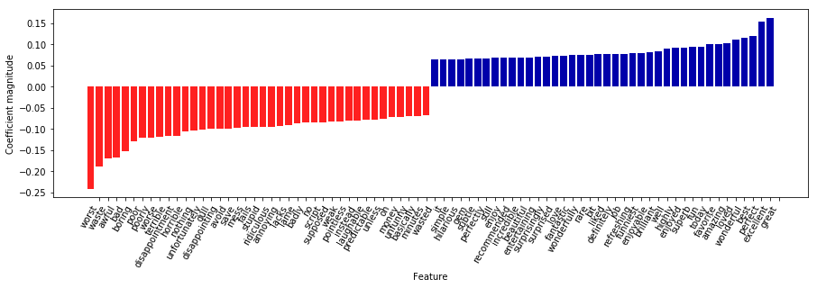

06 モデル係数の調査
================

* 最後に、訓練したロジスティック回帰モデルが実際にデータから学習したのかを確認してみる

    * 出現頻度の低い単語を削除しても27,271個の特徴量があるので、全ての係数を同時にみることはできない

    * しかし、最も大きい係数とそれに対応する単語をみることはできる

    * ここでは、tf-idf特徴量を使って訓練したモデルを用いる

* 以下の図に示す棒グラフに、ロジスティック回帰モデルの係数が最も大きい25個の特徴量と最も小さい25の特徴量を示す

    * サイズは係数の大きさである


```python
from sklearn.datasets import load_files

reviews_train = load_files("/Users/MacUser/data/aclImdb/train/")
text_train, y_train = reviews_train.data, reviews_train.target
text_train = [doc.replace(b"<br />", b" ") for doc in text_train]
reviews_test = load_files("/Users/MacUser/data/aclImdb/test/")
text_test, y_test = reviews_test.data, reviews_test.target
text_test = [doc.replace(b"<br />", b" ") for doc in text_test]

from sklearn.feature_extraction.text import CountVectorizer
vect = CountVectorizer().fit(text_train)
X_train = vect.transform(text_train)

import numpy as np
from sklearn.model_selection import cross_val_score
from sklearn.linear_model import LogisticRegression
scores = cross_val_score(LogisticRegression(), X_train, y_train, cv=5)

from sklearn.model_selection import GridSearchCV
param_grid = {'C': [0.001, 0.01, 0.1, 1, 10]}
grid = GridSearchCV(LogisticRegression(), param_grid, cv=5)
grid.fit(X_train, y_train)

X_test = vect.transform(text_test)

vect = CountVectorizer(min_df=5).fit(text_train)
X_train = vect.transform(text_train)
grid = GridSearchCV(LogisticRegression(), param_grid, cv=5)
grid.fit(X_train, y_train)

from sklearn.feature_extraction.text import TfidfVectorizer
from sklearn.pipeline import make_pipeline
pipe = make_pipeline(TfidfVectorizer(min_df=5, norm=None),
                     LogisticRegression())
param_grid = {'logisticregression__C': [0.001, 0.01, 0.1, 1, 10]}

grid = GridSearchCV(pipe, param_grid, cv=5)
grid.fit(text_train, y_train)

vectorizer = grid.best_estimator_.named_steps["tfidfvectorizer"]
# 訓練データセットを変換
X_train = vectorizer.transform(text_train)
# それぞれの特徴量のデータセット中での最大値を見つける
max_value = X_train.max(axis=0).toarray().ravel()
sorted_by_tfidf = max_value.argsort()
# 特徴量名を取得
feature_names = np.array(vectorizer.get_feature_names())
sorted_by_idf = np.argsort(vectorizer.idf_)
```

    /Users/MacUser/anaconda2/envs/tf140/lib/python3.6/site-packages/sklearn/linear_model/logistic.py:433: FutureWarning: Default solver will be changed to 'lbfgs' in 0.22. Specify a solver to silence this warning.
      FutureWarning)
    /Users/MacUser/anaconda2/envs/tf140/lib/python3.6/site-packages/sklearn/linear_model/logistic.py:433: FutureWarning: Default solver will be changed to 'lbfgs' in 0.22. Specify a solver to silence this warning.
      FutureWarning)
    /Users/MacUser/anaconda2/envs/tf140/lib/python3.6/site-packages/sklearn/linear_model/logistic.py:433: FutureWarning: Default solver will be changed to 'lbfgs' in 0.22. Specify a solver to silence this warning.
      FutureWarning)
    /Users/MacUser/anaconda2/envs/tf140/lib/python3.6/site-packages/sklearn/linear_model/logistic.py:433: FutureWarning: Default solver will be changed to 'lbfgs' in 0.22. Specify a solver to silence this warning.
      FutureWarning)


```python
%matplotlib inline
import mglearn
mglearn.tools.visualize_coefficients(
    grid.best_estimator_.named_steps["logisticregression"].coef_,
    feature_names, n_top_features=40)
```





* 左側の負の係数は、モデルによれば否定的なレビューを示している単語に対応している

    * 例)"worst"、"waste"...

* 右側の正の係数は、モデルによれば肯定的なレビューを示している単語に対応している

    * 例)"excellent"、"wonderful"...

* "bit"、"job"などはフレーズの一部と予測される


| 版     | 年/月/日   |
| ------ | ---------- |
| 初版   | 2019/04/06 |
| 第二版 | 2019/05/05 |
