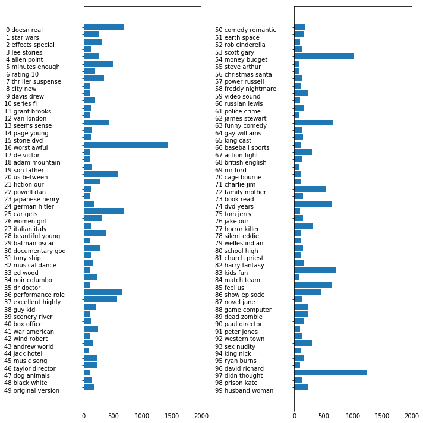

09 トピックモデリングと文書クラスタリング
===================================

* テキストデータによく用いられる技術の1つが、`トピックモデリング`

    * これは通常は教師なし学習で、それぞれの文書に対して1つ以上の`トピック`を割り当てるタスクをまとめて呼ぶ言葉

    * 例)ニュースなど

    * それぞれの文書に1つのトピックが与えられるのであれば、クラスタリングとなる

    * それぞれの文書が複数のトピックを持つことができるのであれば、成分分析となる

    * 学習した個々の成分がトピックとなり、文書表現のそれぞれの成分に対する係数は、その文書が特定のトピックにどの程度関連するかを表現する事になる

* 多くの場合、「トピックモデリング」というと、`LDA`と呼ばれる特定の成分分析手法を指す

## 1. LDA(Latent Dirichlet Allocation)

* `LDA`は、同時に現れる頻度の高い単語の集合(トピック)を指す

    * また、`LDA`はそれぞれの文書が、いくつかのトピックの「混合物」であることを要請する

    * 機械学習モデルでいう所の「トピック」が、日常会話で使う「トピック」とは異なることを理解しておく

* 機械学習モデルのトピックは、`PCA`や`NMF`の成分に近い

* 映画レビューのデータセットに`LDA`を適用して、実際にどのように動くかを見てみる

    * 教師なしのテキスト文書モデルでは、一般的な単語が解析に影響を与え過ぎないように、一般的な単語を取り除いた方が良いとされる

    * ここでは、15%以上の文書に現れる単語を取り除き、それ以外で最もよく現れる10,000単語に限って`BoW`モデルを構築した


```python
from sklearn.datasets import load_files

reviews_train = load_files("/Users/MacUser/data/aclImdb/train/")
text_train, y_train = reviews_train.data, reviews_train.target
text_train = [doc.replace(b"<br />", b" ") for doc in text_train]
reviews_test = load_files("/Users/MacUser/data/aclImdb/test/")
text_test, y_test = reviews_test.data, reviews_test.target
text_test = [doc.replace(b"<br />", b" ") for doc in text_test]

from sklearn.feature_extraction.text import CountVectorizer
vect = CountVectorizer().fit(text_train)
X_train = vect.transform(text_train)

import numpy as np
from sklearn.model_selection import cross_val_score
from sklearn.linear_model import LogisticRegression
scores = cross_val_score(LogisticRegression(), X_train, y_train, cv=5)

from sklearn.model_selection import GridSearchCV
param_grid = {'C': [0.001, 0.01, 0.1, 1, 10]}
grid = GridSearchCV(LogisticRegression(), param_grid, cv=5)
grid.fit(X_train, y_train)

X_test = vect.transform(text_test)

vect = CountVectorizer(min_df=5).fit(text_train)
X_train = vect.transform(text_train)
grid = GridSearchCV(LogisticRegression(), param_grid, cv=5)
grid.fit(X_train, y_train)

from sklearn.feature_extraction.text import TfidfVectorizer
from sklearn.pipeline import make_pipeline
pipe = make_pipeline(TfidfVectorizer(min_df=5, norm=None),
                     LogisticRegression())
param_grid = {'logisticregression__C': [0.001, 0.01, 0.1, 1, 10]}

grid = GridSearchCV(pipe, param_grid, cv=5)
grid.fit(text_train, y_train)

vectorizer = grid.best_estimator_.named_steps["tfidfvectorizer"]
# 訓練データセットを変換
X_train = vectorizer.transform(text_train)
# それぞれの特徴量のデータセット中での最大値を見つける
max_value = X_train.max(axis=0).toarray().ravel()
sorted_by_tfidf = max_value.argsort()
# 特徴量名を取得
feature_names = np.array(vectorizer.get_feature_names())
sorted_by_idf = np.argsort(vectorizer.idf_)
```

    /Users/MacUser/anaconda2/envs/tf140/lib/python3.6/site-packages/sklearn/linear_model/logistic.py:433: FutureWarning: Default solver will be changed to 'lbfgs' in 0.22. Specify a solver to silence this warning.
      FutureWarning)
    /Users/MacUser/anaconda2/envs/tf140/lib/python3.6/site-packages/sklearn/linear_model/logistic.py:433: FutureWarning: Default solver will be changed to 'lbfgs' in 0.22. Specify a solver to silence this warning.
      FutureWarning)
    /Users/MacUser/anaconda2/envs/tf140/lib/python3.6/site-packages/sklearn/linear_model/logistic.py:433: FutureWarning: Default solver will be changed to 'lbfgs' in 0.22. Specify a solver to silence this warning.
      FutureWarning)
    /Users/MacUser/anaconda2/envs/tf140/lib/python3.6/site-packages/sklearn/linear_model/logistic.py:433: FutureWarning: Default solver will be changed to 'lbfgs' in 0.22. Specify a solver to silence this warning.
      FutureWarning)


```python
vect = CountVectorizer(max_features=10000, max_df=.15)
X = vect.fit_transform(text_train)
```

* まずは、10トピックでトピックモデルを作ってみる

    * `NMF`の成分と同様に、トピックには順番がないので、トピックの数を変更すると、全てのトピックが変更されてしまう

    * ここではデフォルトの"online"ではなく、"batch"を用いる(結果がよくなるが、遅い)

    * また、"max_iter"を大きい値に指定している


```python
from sklearn.decomposition import LatentDirichletAllocation
lda = LatentDirichletAllocation(n_topics=10, learning_method="batch",
                                max_iter=25, random_state=0)
# ここではモデルの構築と変換を一度に行う
# 変換には時間がかかるが、同時に行うことで、時間を節約することができる
document_topics = lda.fit_transform(X)
```

    /Users/MacUser/anaconda2/envs/tf140/lib/python3.6/site-packages/sklearn/decomposition/online_lda.py:314: DeprecationWarning: n_topics has been renamed to n_components in version 0.19 and will be removed in 0.21
      DeprecationWarning)


* 成分分析手法と同様に、`LatentDirichletAllocation`には、それぞれの単語のそのトピックに対する重要性を格納した`components_`属性がある

    * `components_`のサイズは、`(n_topics, n_words)`である


```python
print("lda.components_.shape: {}".format(lda.components_.shape))
```

    lda.components_.shape: (10, 10000)


* トピックの意味を理解するために、それぞれのトピックについて最も重要な単語を見てみる

    * `print_topics`関数を使うと、これらの特徴量を綺麗に表示してくれる


```python
# それぞれのトピック(components_の行)に対して、特徴量を昇順でソート
# ソートを降順にするために、[:, ::-1]で行を反転
sorting = np.argsort(lda.components_, axis=1)[:, ::-1]
# vectorizerから特徴量名を取得
feature_names = np.array(vect.get_feature_names())
```


```python
import mglearn
# 最初の10トピックを表示
mglearn.tools.print_topics(topics=range(10), feature_names=feature_names,
                           sorting=sorting, topics_per_chunk=5, n_words=10)
```

    topic 0       topic 1       topic 2       topic 3       topic 4       
    --------      --------      --------      --------      --------      
    between       war           funny         show          didn          
    young         world         worst         series        saw           
    family        us            comedy        episode       am            
    real          our           thing         tv            thought       
    performance   american      guy           episodes      years         
    beautiful     documentary   re            shows         book          
    work          history       stupid        season        watched       
    each          new           actually      new           now           
    both          own           nothing       television    dvd           
    director      point         want          years         got           


    topic 5       topic 6       topic 7       topic 8       topic 9       
    --------      --------      --------      --------      --------      
    horror        kids          cast          performance   house         
    action        action        role          role          woman         
    effects       animation     john          john          gets          
    budget        game          version       actor         killer        
    nothing       fun           novel         oscar         girl          
    original      disney        both          cast          wife          
    director      children      director      plays         horror        
    minutes       10            played        jack          young         
    pretty        kid           performance   joe           goes          
    doesn         old           mr            performances  around        


* 重要な単語から判断すると、トピック1は歴史ものの戦争映画、トピック2はつまらないコメディ、トピック3はTVシリーズなど

* 次に100トピックでモデルを作ってみる

    * トピックが多くなると解析は大変になるが、興味深いデータセットに特化したトピックとなるはず


```python
lda100 = LatentDirichletAllocation(n_topics=100, learning_method="batch",
                                   max_iter=25, random_state=0)
document_topics100 = lda100.fit_transform(X)
```

    /Users/MacUser/anaconda2/envs/tf140/lib/python3.6/site-packages/sklearn/decomposition/online_lda.py:314: DeprecationWarning: n_topics has been renamed to n_components in version 0.19 and will be removed in 0.21
      DeprecationWarning)


* 100トピックを全てみるのは大変なので、面白そうなトピックを選んだ


```python
topics = np.array([7, 16, 24, 25, 28, 36, 37, 41, 45, 51, 53, 54, 63, 89, 97])
```


```python
sorting = np.argsort(lda100.components_, axis=1)[:, ::-1]
feature_names = np.array(vect.get_feature_names())
mglearn.tools.print_topics(topics=topics, feature_names=feature_names,
                           sorting=sorting, topics_per_chunk=5, n_words=20)
```

    topic 7       topic 16      topic 24      topic 25      topic 28      
    --------      --------      --------      --------      --------      
    thriller      worst         german        car           beautiful     
    suspense      awful         hitler        gets          young         
    horror        boring        nazi          guy           old           
    atmosphere    horrible      midnight      around        romantic      
    mystery       stupid        joe           down          between       
    house         thing         germany       kill          romance       
    director      terrible      years         goes          wonderful     
    quite         script        history       killed        heart         
    bit           nothing       new           going         feel          
    de            worse         modesty       house         year          
    performances  waste         cowboy        away          each          
    dark          pretty        jewish        head          french        
    twist         minutes       past          take          sweet         
    hitchcock     didn          kirk          another       boy           
    tension       actors        young         getting       loved         
    interesting   actually      spanish       doesn         girl          
    mysterious    re            enterprise    now           relationship  
    murder        supposed      von           night         saw           
    ending        mean          nazis         right         both          
    creepy        want          spock         woman         simple        


    topic 36      topic 37      topic 41      topic 45      topic 51      
    --------      --------      --------      --------      --------      
    performance   excellent     war           music         earth         
    role          highly        american      song          space         
    actor         amazing       world         songs         planet        
    cast          wonderful     soldiers      rock          superman      
    play          truly         military      band          alien         
    actors        superb        army          soundtrack    world         
    performances  actors        tarzan        singing       evil          
    played        brilliant     soldier       voice         humans        
    supporting    recommend     america       singer        aliens        
    director      quite         country       sing          human         
    oscar         performance   americans     musical       creatures     
    roles         performances  during        roll          miike         
    actress       perfect       men           fan           monsters      
    excellent     drama         us            metal         apes          
    screen        without       government    concert       clark         
    plays         beautiful     jungle        playing       burton        
    award         human         vietnam       hear          tim           
    work          moving        ii            fans          outer         
    playing       world         political     prince        men           
    gives         recommended   against       especially    moon          


    topic 53      topic 54      topic 63      topic 89      topic 97      
    --------      --------      --------      --------      --------      
    scott         money         funny         dead          didn          
    gary          budget        comedy        zombie        thought       
    streisand     actors        laugh         gore          wasn          
    star          low           jokes         zombies       ending        
    hart          worst         humor         blood         minutes       
    lundgren      waste         hilarious     horror        got           
    dolph         10            laughs        flesh         felt          
    career        give          fun           minutes       part          
    sabrina       want          re            body          going         
    role          nothing       funniest      living        seemed        
    temple        terrible      laughing      eating        bit           
    phantom       crap          joke          flick         found         
    judy          must          few           budget        though        
    melissa       reviews       moments       head          nothing       
    zorro         imdb          guy           gory          lot           
    gets          director      unfunny       evil          saw           
    barbra        thing         times         shot          long          
    cast          believe       laughed       low           interesting   
    short         am            comedies      fulci         few           
    serial        actually      isn           re            half          


* 今度のトピックははるかに具体的になっているが、その多くは解釈が難しいものとなっている

    * 例)トピック45は音楽に関連するもの(このトピックに分類されたレビューを見てみる)


```python
# "音楽関連"トピック45に対する重みでソート
music = np.argsort(document_topics100[:, 45])[::-1]
# このトピックを最も重要としている5つの文書を表示
for i in music[:10]:
    # 最初の2文を表示
    print(b".".join(text_train[i].split(b".")[:2]) + b".\n")
```

    b'I love this movie and never get tired of watching. The music in it is great.\n'
    b"I enjoyed Still Crazy more than any film I have seen in years. A successful band from the 70's decide to give it another try.\n"
    b'Hollywood Hotel was the last movie musical that Busby Berkeley directed for Warner Bros. His directing style had changed or evolved to the point that this film does not contain his signature overhead shots or huge production numbers with thousands of extras.\n'
    b"What happens to washed up rock-n-roll stars in the late 1990's? They launch a comeback / reunion tour. At least, that's what the members of Strange Fruit, a (fictional) 70's stadium rock group do.\n"
    b'As a big-time Prince fan of the last three to four years, I really can\'t believe I\'ve only just got round to watching "Purple Rain". The brand new 2-disc anniversary Special Edition led me to buy it.\n'
    b"This film is worth seeing alone for Jared Harris' outstanding portrayal of John Lennon. It doesn't matter that Harris doesn't exactly resemble Lennon; his mannerisms, expressions, posture, accent and attitude are pure Lennon.\n"
    b"The funky, yet strictly second-tier British glam-rock band Strange Fruit breaks up at the end of the wild'n'wacky excess-ridden 70's. The individual band members go their separate ways and uncomfortably settle into lackluster middle age in the dull and uneventful 90's: morose keyboardist Stephen Rea winds up penniless and down on his luck, vain, neurotic, pretentious lead singer Bill Nighy tries (and fails) to pursue a floundering solo career, paranoid drummer Timothy Spall resides in obscurity on a remote farm so he can avoid paying a hefty back taxes debt, and surly bass player Jimmy Nail installs roofs for a living.\n"
    b"I just finished reading a book on Anita Loos' work and the photo in TCM Magazine of MacDonald in her angel costume looked great (impressive wings), so I thought I'd watch this movie. I'd never heard of the film before, so I had no preconceived notions about it whatsoever.\n"
    b'I love this movie!!! Purple Rain came out the year I was born and it has had my heart since I can remember. Prince is so tight in this movie.\n'
    b"This movie is sort of a Carrie meets Heavy Metal. It's about a highschool guy who gets picked on alot and he totally gets revenge with the help of a Heavy Metal ghost.\n"


* この結果から分かるように、このトピックはミュージカルから伝記映画など、様々な音楽を取り上げたレビューをカバーしている

* トピックを調べるもう1つの方法として、それぞれのトピックが全文書に対して得た重みを見てみる

    * それぞれのトピックに、最も一般的な2つの単語で名前をつけている

    * 以下の図に、学習されたトピックの重みを示す


```python
import matplotlib.pyplot as plt

fig, ax = plt.subplots(1, 2, figsize=(10, 10))
topic_names = ["{:>2} ".format(i) + " ".join(words)
               for i, words in enumerate(feature_names[sorting[:, :2]])]
# 2カラムの棒グラフ
for col in [0, 1]:
    start = col * 50
    end = (col + 1) * 50
    ax[col].barh(np.arange(50), np.sum(document_topics100, axis=0)[start:end])
    ax[col].set_yticks(np.arange(50))
    ax[col].set_yticklabels(topic_names[start:end], ha="left", va="top")
    ax[col].invert_yaxis()
    ax[col].set_xlim(0, 2000)
    yax = ax[col].get_yaxis()
    yax.set_tick_params(pad=130)
plt.tight_layout()
```





* 最も重要なトピックは、否定的な評価に対応していると思われる70、ストップワードを含む16、13、58、肯定的な評価に関連する86

    * 86の「10」は10段階評価の10：コメントの中に出てきている

* `LDA`はおおまかに分けて、ジャンルに固有なトピックと、評価に固有なトピック、それ以外の特定しづらいトピックを見つけているようにみえる

    * 多くのレビューは映画固有のコメントと評価を正当化するようなコメントで構成されているので、興味深い

* `LDA`のようなトピックモデルは、ラベルがない大規模なテキストコーパスを理解する興味深い方法である

    * ここで行なったように、ラベルがある場合にも有用

    * ただし、LDAアルゴリズムはランダムなので、`random_state`パラメータを変えると全く違った結果になる場合がある

* トピックを特定することは重要だが、教師なし学習モデルから導かれた結果は全て、まゆに唾を付けて見る必要がある

    * 個々のトピックの文書を実際に見て直感が正しいかを確認することをオススメする

    * `LDA.transform`メソッドで作られたトピック群を教師あり学習のためのコンパクトなデータ表現とみなすこともできる

    * この方法は、ラベルのある訓練データが十分にない場合に、特に有効


| 版     | 年/月/日   |
| ------ | ---------- |
| 初版   | 2019/04/06 |
| 第二版 | 2019/05/05 |
