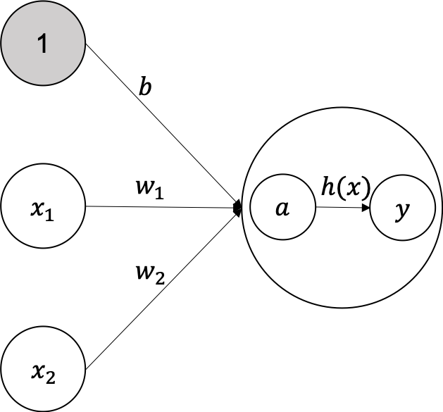

01 パーセプトロンからニューラルネットワークへ
======================================

## 1. ニューラルネットワークの例

* `ニューラルネットワーク`を図で表すと、以下の図のようになる

  * 一番左の列：`入力層`

  * 一番右の列：`出力層`

  * 中間の列：`中間層`(`隠れ層`とも呼ぶことがある)

* ここでは、以下のように定義する

  * 第0層：入力層

  * 第1層：中間層

  * 第2層：出力層

* 上の図をみる限り、パーセプトロンと同じような形をしている

  * ただし、ニューロンの **繋がり方** に関してなので、信号の伝達は別問題

## 2. パーセプトロンの復習

* 以下の図を用いる

* 上の図では、`x_1`と`x_2`の2つの入力信号を受け取り、`y`を出力するパーセプトロン

  * 数式で表すと、以下の式で表される

* ここで、`b`は「バイアス」と呼ばれるパラメータで、ニューロンの発火のしやすさをコントロールする

* `w_1`や`w_2`は各信号の「重み」を表すパラメータで、これらは各信号の重要性をコントロールする

### バイアスを明示的に示した場合のパーセプトロン

* バイアスを明示的に示すと、重みが`b`で入力が`1`の信号が追加されている

* このパーセプトロンの動作は、`x_1`、`x_2`、`1`の3つの信号がニューロンの入力となる

  * それら3つの信号kにそれぞれの重みが乗算され、次のニューロンに送信される

  * 次のニューロンでは、それらの重み付けされた信号の和が計算される

    * その和が`0`を超えたら`1`を出力し、そうでなければ`0`を出力する

    * ただし、バイアスの入力信号は常に`1`であるため、他のニューロンと差別化する

* この図を用いて、式を簡単な形で表現する

  * `0`を超えたら`1`を出力し、そうでなければ`0`を出力するという動作を一つの関数で表現する

  * ここでは、`h(x)`という新しい関数を導入し、書き換える

* 式は、入力信号の総和が`h(x)`という関数によって変換され、その変換された値が出力`y`になる

  * そして、式で表される`h(x)`関数は、入力が`0`を超えたら`1`を返し、そうでなければ`0`を返す

## 3. 活性化関数の登場

* ここで登場した`h(x)`という関数は、`活性化関数`と呼ばれる

  * 入力信号の総和を出力信号に変換する関数

  * この関数は、入力信号の総和がどのように活性化するか(発火するか)ということを決定する役割がある

* ここで、さらに式を書き換えていく

  * 先ほどの式を丁寧に表すと、以下の通りになる

* 上の式では、重み付き入力信号とバイアスの総和を計算し、それを`a`とする

  * そして、`a`が`h(x)`で変換され、`y`が出力される

* 上の式を用いて表すと、以下の図で表される

* これまでのニューロンの○の中に、活性化関数によるプロセスを明示的に示した

  * つまり、重み付き信号の和の結果が`a`というノードになり、そして活性化関数`h(x)`によって`y`というノードに変換される

* 基本的に、ニューラルネットワークの動作が明確化できる場合は、以下のように図示する

| 版   | 年/月/日   |
| ---- | ---------- |
| 初版 | 2019/04/30 |
