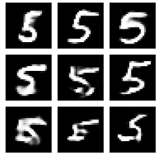
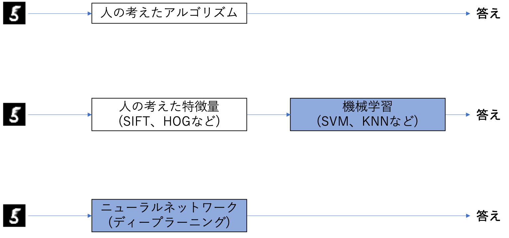

01 データから学習する
==================

* ニューラルネットワークの特徴は、データから学習できる点にある

* データから学習するとは、重みパラメータの値をデータから自動で決定できること

  * もし仮に全てのパラメータを手作業によって決めるとすれば、大変な作業となる

  * 例)パーセプトロンでは、真偽値表を見ながら手作業でパラメータの値を設定していたが、実際のNNでは数万に及ぶ

* この章では、ニューラルネットワークの学習(データからパラメータの値を決める方法)について学習

  * また、PythonによってMNISTデータセットの手書き数字を学習する実装を行う

## 1. データ駆動

* 機械学習はデータから答えを探し出し、データからパターンを見つけ、データからストーリーを語る

  * これが機械学習で行うことであり、データがなければ何も始まらない

  * そのため、機械学習の中心には「データ」が存在する

  * このデータ駆動によるアプローチは、「人」を中心とするアプローチからの脱却とも言える

### 実際の問題

* 通常、何らかの問題を解決しようとする場合(特に何らかのパターンを見つける必要がある場合)、人が考えて答えを出すことが一般的

  * 人の経験や直感を手がかりに試行錯誤を重ねて仕事を進める

* 一方、機械学習による手法では、人の介入を極力避け、集められたデータから答え(パターン)を見つけようと試みる

  * さらに、ニューラルネットワークやディープラーニングは、従来の機械学習で使われた手法以上に、人の介入を遠ざける

### 具体的な問題

* 「5」という数字を認識するプログラムを実装する

* 「5」という数字は、手書きの画像だとして、「5か5以外を見分けるプログラム」を実装することがゴールとする

* 「5」を正しく分類できるプログラムを自分で考えて設計しようとすると、それは難しい

  * 人にとっては簡単に「5」だと認識できるが、どういう規則性で「5」と認識したのかを明確に述べるのは困難

  * 図より、人によって様々な癖があり、「5」であることのルールを見つけるのは時間のかかる作業となる

### 具体的な問題の解決策

* そこで、ゼロから「5」を認識するアルゴリズムを"ひねり出す"代わりに、データを有効に活用して解決することを考える

  * その一つの方法として、画像から`特徴量`を抽出して、その特徴量のパターンを機械学習の技術で学習する方法が考えられる

  * ここでの特徴量は、入力データ(入力画像)から本質的なデータ(重要なデータ)を的確に抽出できるように設計された変換器

* 画像の特徴量は通常、ベクトルとして記述される

  * コンピュータビジョンの分野で有名な特徴量として、SIFT、SURF、HOGなどがあげられる

  * そのような特徴量を使って画像データをベクトルに変換し、その変換されたベクトルに対して、機械学習で使われる識別器(SVM、KNNなど)で学習する

### 具体的な問題への機械学習の適用

* この機械学習によるアプローチでは、集められたデータの中から「機械」が規則性を見つけ出す

  * これは、ゼロからアルゴリズムを考え出す場合に比べると、より効率的に問題を解決でき、「人」への負担が軽減される

* ただし、画像をベクトルに変換する際に使用した特徴量は、「人」が設計したものであることに注意する

  * 理由として、問題に応じて適した特徴量を使わなければ、なかなか良い結果が得られないため

  * 例)犬の顔を見分けるためには、「5」を認識する特徴量とは別の特徴量を人が考える必要があるかもしれないため

* つまり、特徴量と機械学習によるアプローチでも、問題に応じて「人」の手によって適した特徴量を考える必要があるかもしれない

### これまでの機械学習の問題に対するアプローチ

* これまでの機械学習による問題のアプローチを図で表すと、以下の通りに表すことができる

* ニューラルネットワークは、画像を"そのまま"学習する

  * 特徴量と機械学習によるアプローチの例では、人が特徴量を設計した

  * ニューラルネットワークでは、画像に含まれる重要な特徴量までも「機械」が学習する

### ニューラルネットワークについて

* ニューラルネットワークの利点は、全ての問題を同じ流れで解くことができること

  * 例)解くべき問題が「5」を認識する問題なのか、「犬」を認識する問題なのか、詳細とは関係なしに、NNは与えられたデータを学習する

  * 与えられた問題のパターンを発見しようと試みる

* つまり、ニューラルネットワークは、対象とする問題に関係なく、データをそのままの生データとして学習することができる

## 2. 訓練データとテストデータ

* 機械学習の問題では、`訓練データ`と`テストデータ`の2つのデータに分けて、学習や実験などを行う

  * その場合、まずは訓練データだけを使って学習を行い、最適なパラメータを探索する

  * そして、テストデータを使って、その訓練したモデルの実力を評価する

* これは`汎化能力`を測定するため

> すでに機械学習の流れを知っているのでパス

| 版   | 年/月/日   |
| ---- | ---------- |
| 初版 | 2019/05/04 |
