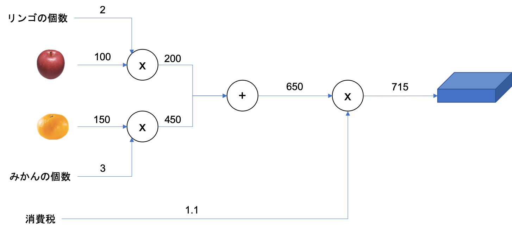
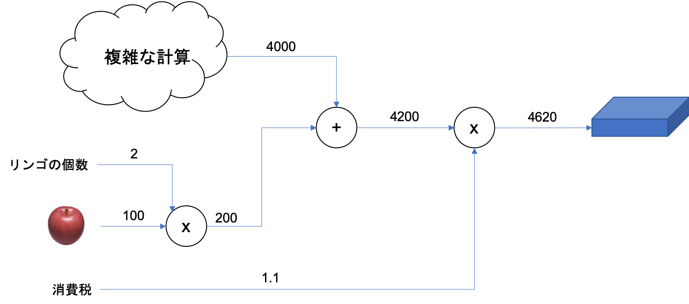
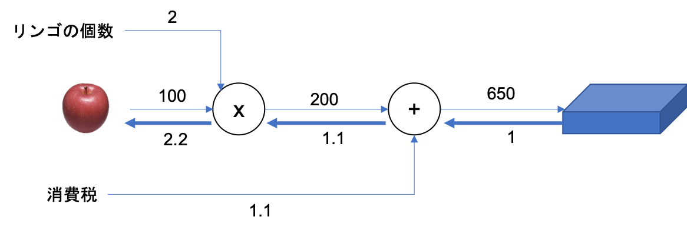

01 計算グラフ
===========

* ここで言うグラフは、「データ構造としてのグラフ」であり、複数の「ノード」と「エッジ」によって表現される

  * 「ノード」を結ぶ直線を、「エッジ」と言う

* 本節では、計算グラフに慣れ親しむため、簡単な問題を解いていく

## 1. 計算グラフで解く

> 問１：太郎くんはスーパーでリンゴを2個、みかんを3個買いました
>
> リンゴは1個100円、みかんは1個150円です
>
> 消費税が10%かかるものとして、支払う金額を答えなさい

* `ノード`を「○」で表記し、中に演算の内容を書く

* 計算の途中結果を矢印の上部に書くことで、ノードごとの計算結果が左から右へ伝わるようにする

### 計算グラフを使って問題を解く

以下の流れで行う

1. 計算グラフを構築する

1. 計算グラフ上で計算を左から右へ進める

  * 「計算を左から右へ進める」：`順伝播`(順方向の伝播)

  * 逆方向の場合：`逆伝播`

## 2. 局所的な計算

* 局所的とは、「自分に関係する小さな範囲」

  * 局所的な計算は、「全体がどのようなところが行われていようとも、自分に関係する情報だけから次の結果を出力する」こと

* 計算グラフでは、局所的な計算に集中することができる

  * 例えどんなに全体の計算が複雑でも、各ステップでやることは、対象とするノードの「局所的な計算」

  * その結果を伝播することで、全体を構成する複雑な計算の結果が得られる

## 3. なぜ計算グラフで解くのか

* 1つの利点は、「局所的な計算」

  * 全体がどれだけ複雑な計算であっても、局所的な計算によって、各ノードでは単純な計算に集中することができ、問題を単純化

* もう1つの利点として、「途中の計算の結果を全て保持することができる」

* ただし、計算グラフを使う最大の理由は、**逆方向の伝播によって「微分」を効率よく計算できる点**

### 例：リンゴの値段が値上がりした場合

* これは、「リンゴの値段に関する支払金額の微分」に相当する

  * この微分の値は、リンゴの値段が"少しだけ"値上がりした場合に、支払金額がどれだけ増加するかを表したもの

  * 計算グラフで逆方向の伝播を行えば求めることができる

* 逆伝播は「局所的な微分」を伝達し、その微分の値は矢印の下側に書かれている

  * この図では、「リンゴの値段に対する支払金額の微分」の値は、`2.2`と言える

  * これは、リンゴが1円値上がりしたら、最終的な支払金額が2.2円増加することを意味する

* 計算グラフの利点は、順伝播と逆伝播によって、各変数の微分の値を効率よく求めることができる点にある

| 版   | 年/月/日   |
| ---- | ---------- |
| 初版 | 2019/05/06 |
