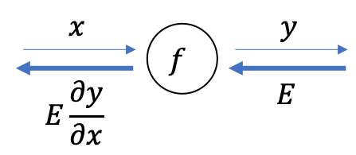
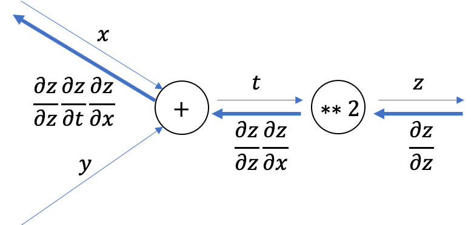

02 連鎖律
========

* これまで行ってきた計算グラフの`順伝播`は、計算の結果を順方向(左から右に)伝達した

* 一方、逆方向の伝播では「局所的な微分」を、順方向とは逆(右から左に)伝達していく

* なお、この「局所的な微分」を伝達する原理は、`連鎖律`と呼ばれるもの

## 1. 計算グラフの逆伝播

* ここでは、`y=f(x)`と言う計算があるとして、以下にこの計算の逆伝播を示す

* 逆伝播の計算手順は、信号`E`に対して、ノードの局所的な微分`(∂y/∂x)`を乗算し、それを次のノードへ伝達する

* ここで言う局所的な微分は、順伝播での`y=f(x)`と言う計算の微分を求めること

  * これは、`x`に対する「`y`の微分`(∂y/∂x)`」を求めること

  * そして、その局所的な微分を上流から伝達された値(`E`)に乗算して、前のノードに渡していく

* これを行うことで、目的とする微分の値を効率よく求めることができる

  * これは、`連鎖律`の原理から求められる

## 2. 連鎖律とは

* `合成関数`：複数の関数によって構成される関数

* `連鎖律`とは、合成関数の微分についての性質であり、以下のように定義される

> ある関数が合成関数で表される場合、その合成関数の微分は、合成関数を構成するそれぞれの関数の微分の値によって表すことができる

### 具体例

* まず、数式を以下のように定義する

* ここで、`連鎖律`を適用すると、以下のように表せる

> `∂z/∂x`(`x`に対する`z`の微分)は、`∂z/∂t`(`t`に対する`z`の微分)と、`∂t/∂x`(`x`に関する`t`の微分)の積によって表せる

* 定義した数式に、`連鎖律`を適用すると、以下の偏微分が導出される

* 最終的に求める値は、以下の通りに表される

## 3. 連鎖律と計算グラフ

* 上の式で行った計算を、以下の図で示す

* 計算グラフの逆伝播は、「右から左へ」と、信号を伝播する

* 逆伝播の計算手順では、ノードの入力信号に対して、ノードの局所的な微分(偏微分)を乗算して、次のノードへと伝達していく

  * 一番左の逆伝播の結果では、連鎖律より、「`x`に関する`z`の微分」に対応する

* 例題の結果は、以下のように表すことができる

| 版   | 年/月/日   |
| ---- | ---------- |
| 初版 | 2019/05/07 |
