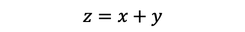
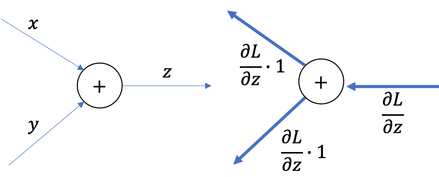
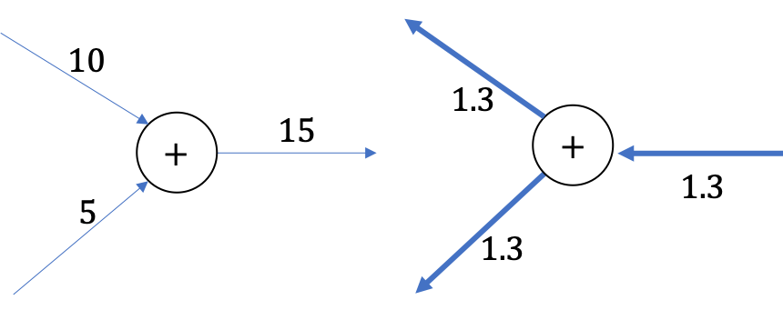
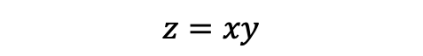
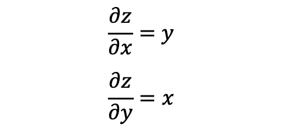
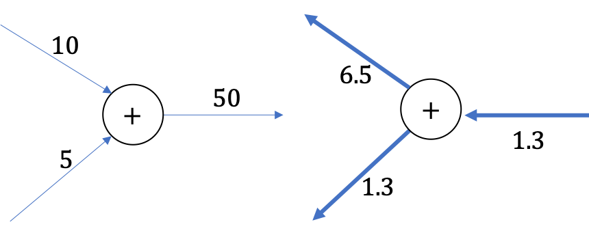
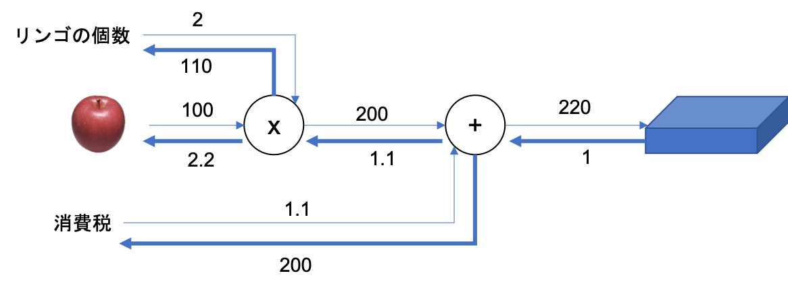

03 逆伝播
========

## 1. 加算ノードの逆伝播

* ここでは、以下の式を用いて考える

* 早速、上の式を微分すると以下の通りに計算できる

* これを図で表すと、以下の通りに表すことができる

  * ただし、最終的に`L`という値を出力する大きな計算グラフを想定している

* `z = x + y`という計算は、その大きな計算グラフのどこかに存在し、上流から`∂L/∂z`の値が伝わることになる

  * そして、下流にはそれぞれ`∂L/∂y`と`∂L/∂x`の値を伝達する

### 具体例

* 「10＋5＝15」という計算があるとして、逆伝播の際には、上流から1.3の値が流れてくるとする

* 加算ノードの逆伝播は入力信号を次のノードへ出力するだけなので、1.3を次のノードへと流す

## 2. 乗算ノードの逆伝播

* 乗算ノードの逆伝播について扱う

  * 以下の式を用いる

* この式の微分は、以下の式で表すことができる

* 乗算の逆伝播の場合は、順伝播の際の入力信号を"ひっくり返した値"を乗算して下流へ流す

  * 例) `x`が`y`に、`y`が`x`に

### 具体例

* 「10×5＝50」と言う計算があり、逆伝播の場合では上流から1.3という値が流れてくるとする

  * 入力信号をひっくり返した値を乗算するので、「1.3×5＝65」、「1.3×10＝13」とそれぞれ計算できる

* 乗算の逆伝播では、順伝播の時の入力信号の値が必要になる

  * そのため、乗算ノードの実装時には、順伝播の入力信号を保持する

## 3. リンゴの例

* 乗算ノードの逆伝播では、入力信号がひっくり返ることに注意すると、以下のように表すことができる

* 最終的に、消費税とリンゴの値段が同じ量だけ増加したら、

  * 消費税は200の大きさ

  * リンゴの値段は2.2の大きさ

  で影響を与える

| 版   | 年/月/日   |
| ---- | ---------- |
| 初版 | 2019/05/07 |
