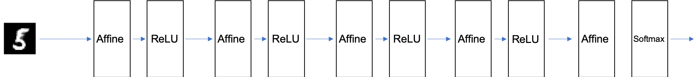
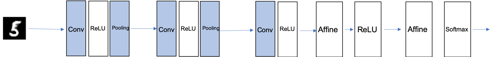

01 全体の構造
============

* `CNN`のネットワーク構造を見ていく

## CNNのネットワーク構造

* `CNN`は、これまでに見てきたニューラルネットワークと同じで、レゴブロックのようにレイヤを組み合わせて作ることができる

* ただし`CNN`の場合、新たに「Convolutionレイヤ(畳み込み層)」と「Poolingレイヤ(プーリング層)」が登場する

## これまでのレイヤ

* これまで見てきたニューラルネットワークは、隣接する層の全てのニューロン間で結合があった

  * これを`全結合`と呼び、この層を`Affine`レイヤという名前で実装した

  * この`Affine`レイヤを使えば、5層の全結合のニューラルネットワークは、以下の行成のネットワークで実現できる

* 全結合のニューラルネットワークは、`Affine`レイヤの後に、活性化関数の`ReLU`レイヤ(もしくは`Sigmoid`レイヤ)が続く

  * ここでは、「Affine-ReLU」の組み合わせを4層重ね、5層目の`Affine`レイヤと続き、最後に`Softmax`レイヤで最終的な確率を出力する

## CNNのレイヤ

* `CNN`のレイヤは、以下の通りになる

* 新しく「Convolutionレイヤ」と「Poolingレイヤ」が加わる

  * `CNN`のレイヤの繋がり順は、「Convolution-ReLU-(Pooling)」という流れ

  * これは、今までの「Affine-ReLU」という繋がりが、「Convolution-ReLU-(Pooling)」に置き換わったと考えられる

* 出力に近い層では、これまでの「Affine-ReLU」という組み合わせが用いられる

* また、最後の出力層においては、これまでの「Affine-Softmax」の組み合わせが用いられる

| 版   | 年/月/日   |
| ---- | ---------- |
| 初版 | 2019/05/13 |
