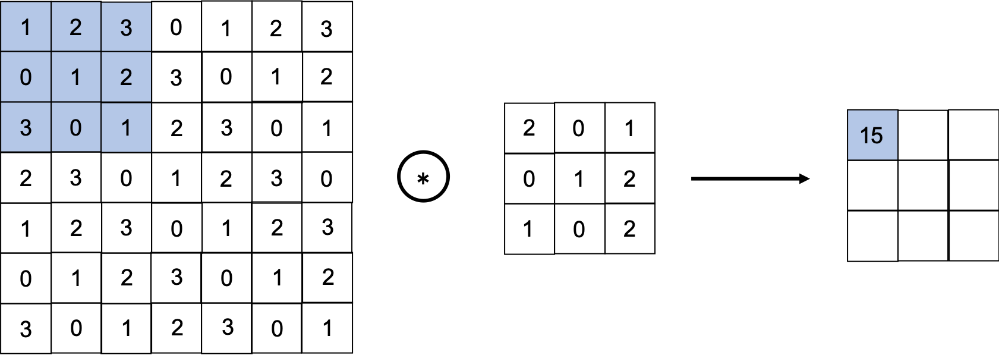
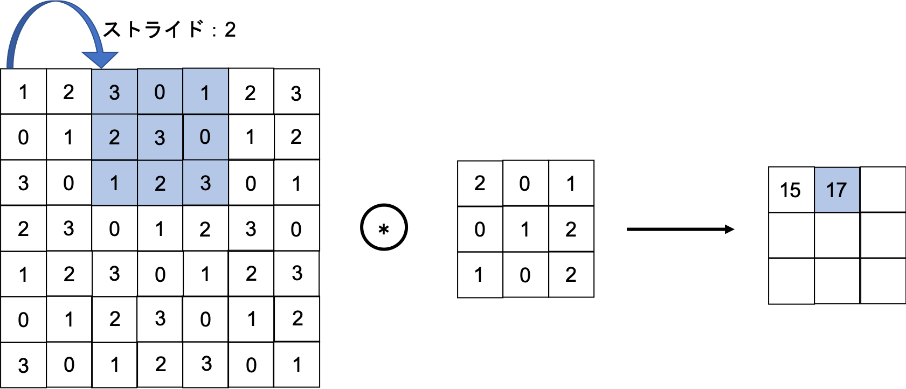
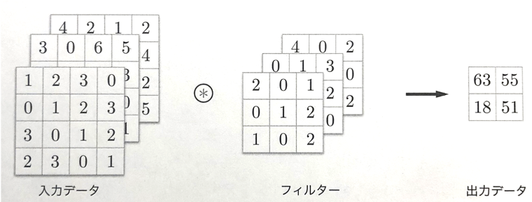
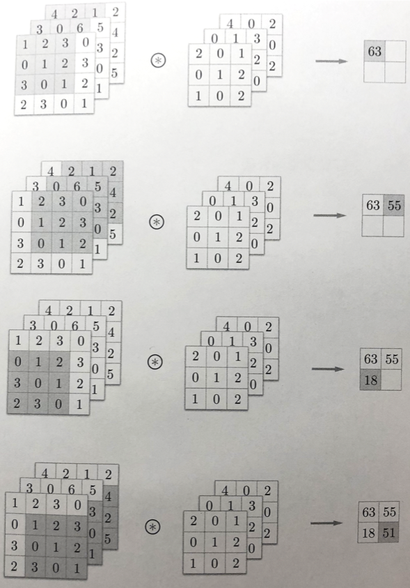
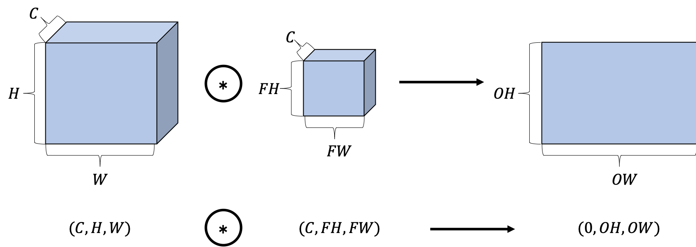
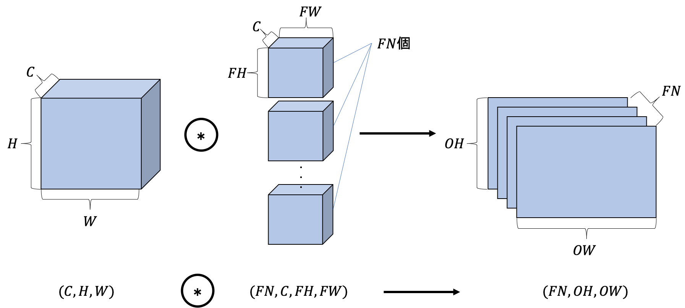
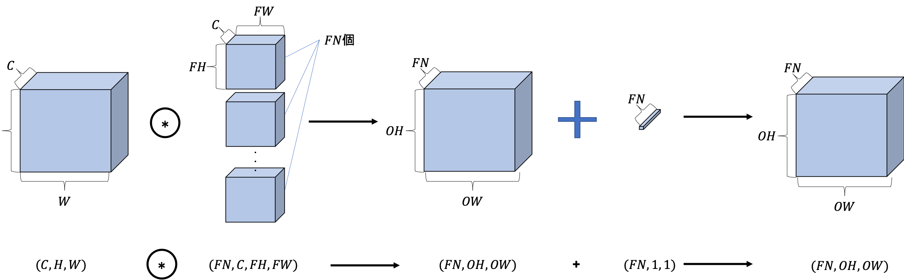
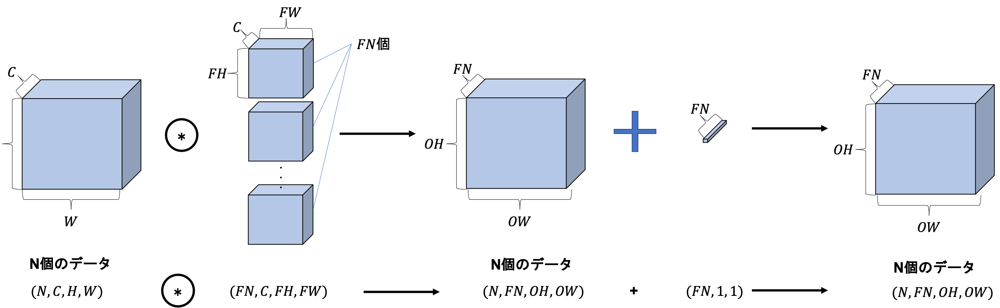

02 畳み込み層
===========

* `CNN`では、パディング、ストライドなどの特有の言語が登場する

* また、各層を流れるデータは形状のあるデータ(3次元など)になり、これまでの全結合のネットワークとは異なる

* ここでは、`CNN`で使われる畳み込み層の仕組みを見ていく

## 1.全結合層の問題点

* これまで見てきた全結合のニューラルネットワークでは、`全結合層`(Affineレイヤ)を用いた

  * `全結合層`では、隣接する層のニューロンが全て連結されており、出力の数は任意に決めることができる

### 全結合層の問題点(概要)

* データの形状が"無視されてしまう"こと

* 例)入力データが画像の場合、通常「縦・横・チャンネル方向」の3次元の形状

  * しかし、全結合層に入力する時には、3次元のデータを平らに(1次元のデータに)する必要がある

* これまでのMNISTデータセットを使った例では、入力画像は`(1,28,28)`(1チャンネル、縦28ピクセル、横28ピクセル)の形状

  * それを1列に並べた784個のデータを最初の`Affine`レイヤへ入力した

### 全結合層の問題点(詳細)

* 画像は3次元の形状であり、この形状には大切な空間的情報が含まれている

  * 例)空間的に近いピクセルは似たような値

  * 例)RBGの各チャンネル間にはそれぞれに密接な関係がある

  * 例)距離の離れたピクセル同士はあまり関わりがない

  > 3次元の形状の中にはくみ取るべき本質的なパターンがあるはず

* しかし、`全結合層`は、形状を無視して、全ての入力データを同等のニューロン(同じ次元のニューロン)として扱うので、形状に関する情報を活かせない

### CNNの場合

* 一方、`畳み込み層`(Convolutionレイヤ)は、形状を維持する

  * 画像の場合、入力データを3次元のデータとして受け取り、同じく3次元のデータとして、次のデータを出力する

  * そのため、画像などの形状を有したデータを正しく理解できる(可能性がある)

### CNNの言葉

* 畳み込み層の入出力データを、`特徴マップ`と言う

* また、畳み込み層の入力データを`入力特徴マップ`、出力データを`出力特徴マップ`と呼ぶ

## 2.畳み込み演算

* `畳み込み層`で行う処理は、「畳み込み演算」

  * これは、画像処理で言うところの「フィルター演算」に相当する

  * 以下に、具体的な例を示す

* 上の図のように、畳み込み演算は、「入力データ」に対して「フィルター」を適用する

  * この例では、「入力データ」は縦・横方向の形状を持つデータ

  * 「フィルター」も同様に、縦・横方向の次元を持つ

* 「データ」と「フィルター」の形状を、`(height, width)`で表記する

  * この例では、「入力サイズ」は`(4,4)`、「フィルターサイズ」は`(3,3)`、「出力サイズ」は`(2,2)`となる

### 畳み込み演算の計算手順

* 畳み込み演算は、「入力データ」に対して、フィルターのウィンドウを一定の間隔でスライドさせながら適用させる

  * ここで言う「ウィンドウ」は、灰色の3×3の部分を指す

* それぞれの場所で、フィルターの要素と入力の対応する要素を乗算し、その和を求める(**積和演算**)

* そして、その結果を出力の対応する場所へ格納していく

* このプロセスを全ての場所で行うことで、畳み込み演算の出力を得ることができる

### 畳み込み演算のバイアス

* 全結合のニューラルネットワークでは、重みパラメータの他にバイアスが存在していた

* `CNN`の場合、フィルタのパラメータが、これまでの「重み」に対応する

  * そして、`CNN`の場合もバイアスが存在する

* 「フィルター」と「バイアス」を含めた畳み込み演算の処理フローは、以下の図となる

* 上の図より、バイアス項の加算は、フィルター適用後のデータに対して行われる

* ここで示すように、常にバイアスは一つ(1×1)だけ存在する

  * この例では、フィルター適用後のデータ4つに対してバイアスは一つ

  * その一つの値が、フィルター適用後の全ての要素に加算される

## 3.パディング

* 畳み込み層の処理を行う前に、入力データの周囲に固定のデータ(例：0など)を埋めることがある

  * これを、`パディング`と呼び、畳み込み演算ではよく用いられる

  * 以下の図では、`(4,4)`のサイズの入力データに対して、幅`1`のパディングを適用している

  > 幅1のパティングとは、周囲を幅1ピクセルの`0`で埋めること

* 上の図に示すように、`(4,4)`のサイズの入力データは「パディング」によって、`(6,6)`の形状になる

  * そして、`(3,3)`のサイズのフィルターをかけると、`(4,4)`のサイズの出力データが生成される

* この例では、「パディング」を`1`に設定したが、任意の整数に設定することができる

  * もし上の例でパディングを`2`に設定すれば、入力データのサイズは`(8,8)`になる

> ### パディングを用いる理由
>
> * 出力サイズを調整するため
>
>   * 例)`(4,4)`のサイズの入力データに`(3,3)`のフィルターを適用する場合、出力サイズは`(2,2)`となる
>
>   * これは、出力サイズは入力サイズから2要素分だけ縮小されることになる
>
>   * ずっと縮小すると、ある時点で出力サイズが1になり、それ以上畳み込み演算ができなくなる
>
> * パディングを利用することで、空間的なサイズを一定にしたまま次の層へデータを渡すことができる

## 4.ストライド

* `ストライド`：フィルターを適用する位置の間隔

  * これまで見てきた例は全てストライドが`1`だった

  * ストライドを`2`にすると、下の図のように、フィルターを適用する窓の間隔が「2要素」ごとになる

* 上の例では、入力サイズが`(7,7)`のデータに対して、ストライドが`2`でフィルターを適用する

  * ストライドを`2`に設定することで、出力サイズは`(3,3)`になる

  * このように、ストライドは、フィルターを適用する間隔を指定する

### ストライドとパディング

* ストライドを大きくすると、出力サイズは小さくなる

* パディングを大きくすると、出力サイズは大きくなる

> このような関係性を定式化すると、どうなるか？
>
> パディングとストライドに対して、出力サイズはどのように計算されるかを見てみる

### 前提

* 入力サイズ：)

* フィルターサイズ：)

* 出力サイズ：)

* パディング：

* ストライド：

* 出力サイズは、以下の式で計算される

### 例1

* 以下の図の例

  * 入力サイズ：`(4,4)`

  * パディング：`1`

  * ストライド：`1`

  * フィルターサイズ：`(3,3)`

### 例2

* 以下の図の例

  * 入力サイズ：`(7,7)`

  * パディング：`0`

  * ストライド：`2`

  * フィルターサイズ：`(3,3)`

### 例3

* 入力サイズ：`(28,31)`

* パディング：`2`

* ストライド：`3`

* フィルターサイズ：`(5,5)`

### まとめ

* これらの例で示したように、`OH`と`OW`に値を代入することで、出力サイズを計算することができる

* 単に代入するだけで出力サイズを求めることはできるが、両方の式ともに割り切れるように、それぞれの値を設定する必要がある

  * 出力サイズが割り切れない場合は、エラーを出力することで対応する必要がある

  * フレームワークによっては、最も近い整数に丸めて先に進むこともある

## 5.3次元データの畳み込み演算

* これまで見てきた畳み込み演算の例は、「縦方向」と「横方向」の2次元の形状を対象としたもの

* しかし、画像の場合、縦・横に加えて「チャンネル方向」も合わせた3次元のデータを扱う必要がある

  * ここでは、先ほどと同じような手順で、チャンネル方向も含めた3次元データに対して畳み込み演算を行う

### 3次元データに対する畳み込み演算の例

* 下の図は、畳み込み演算の例と、畳み込み演算の計算手順

* ここでは、3チャンネルのデータを例に、畳み込み演算の例を示す

  * 2次元の場合と比較すると、奥行き方向(チャンネル方向)に特徴マップが増えていることがわかる

  * チャンネル方向に複数の特徴マップがある場合、

    * チャンネル毎に入力データとフィルターの畳み込み演算を行い、それらの結果を加算して一つの出力を得る

* この例で示すような3次元の畳み込み演算で注意する点は、

  * 入力データとフィルターのチャンネル数は同じ値にすること

* この例の場合、入力データとフィルターのチェンネル数は3で一致している

* 一方、フィルターのサイズは好きな値に設定することができる

  * ただし、チャンネルごとのフィルターのサイズは全て同じ

* この例では、フィルターのサイズは`(3,3)`だが、それは好きな値に設定することができる

## 6.ブロックで考える

* 3次元の畳み込み演算は、データやフィルタを直方体のブロックで考えるとわかりやすい

* `ブロック`：以下の図のような、3次元の直方体

> また、3次元データを多次元配列として表す時は、`(channel, height, width)`の順に並べて書く
>
> * 例)チャンネル数`C`、高さ`H`、横幅`W`の形状は、`(C, H, W)`と書く
>
> * 例)チャンネル数`C`、フィルターの高さ`FH`、横幅`FW`の形状は、`(C, FH, FW)` と書く

* この例では、データ出力は1枚の特徴マップ

  * これは、チャンネル数が1の特徴マップ

* 次に、畳み込み演算の出力を、チャンネル方向にも複数持たせる場合を考える

  * そのためには、複数のフィルター(重み)を用いる

* 上の図に示すように、`FN`個のフィルターを適用することで、出力のマップも`FN`個生成される

  * そして、その`FN`個のマップをまとめると、形状が`(FN,OH,OW)`のブロックが完成する

  * この完成したブロックを、次の層に渡していくというのが、CNNの処理フロー

* 上の図で示したように、畳み込み演算のフィルターに関しては、フィルターの個数も考慮する必要がある

  * そのため、フィルターの重みデータは4次元のデータとして`(output_channel, input_channel, height, width)`の順に書く

  * 例)チャンネル数`3`、サイズ`5×5`のフィルターが20個ある場合は、`(20, 3, 5, 5)`と書く

### バイアスを表現する

* 畳み込み演算では、全結合層と同じく、「バイアス」が存在する

  * バイアスの加算処理も追加すると、以下の図のようになる

* ここで、バイアス項の形状は`(FN,1,1)`であり、フィルターの出力形状は`(FN,OH,OW)`

  * それら2つのブロックの足し算では、フィルターの出力結果の`(FN,OH,OW)`に対して、チャンネルごとに同じバイアスの値が加算される

## 7.バッチ処理

* ニューラルネットワークの処理では、入力データを一束にまとめたバッチ処理を行なった

  * これまでの全結合のニューラルネットワークの実装も、バッチ処理に対応したものであり、

  * これによって、処理の効率化や、学習時のミニバッチへの対応が可能になった

* 畳み込み演算でも同じように、バッチ処理を行う

  * そのために、各層を流れるデータは4次元のデータとして格納する

  * 具体的には、`(batch_num, channel, height, width)`という順にデータを格納する

  * 例)N個のデータに対してバッチ処理を行う場合、データの形状は以下の図のようになる

* 上のバッチ処理版のデータフローでは、各データの先頭にバッチ用の次元が追加されている

* このように、データは4次元の形状として各層を伝わっていく

  * ここでの注意点は、ネットワークには4次元のデータが流れるが、

  * これは、N個のデータに対して畳み込み演算が行われている、ということになる

  * つまり、N回分の処理を1回にまとめている

| 版   | 年/月/日   |
| ---- | ---------- |
| 初版 | 2019/05/14 |
